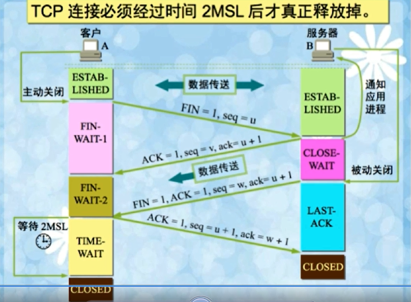

# 首要原因：历史连接

如果只有两次握手。在网络状况复杂或者较差的网络中，如果发送方连续发送多次建立连接的请求。接收方可能会不清楚哪一个链接是由于网络拥堵而早早过期的连接，从而稀里糊涂的接收或拒绝这一次请求。所以连接就稀里糊涂的建立了。。。

所以TCP选择使用三次握手来建立连接并引入了RST这一标志位。接收方收到请求时会将发送方发来的`seq + 1`发送给对方。这时由**发送方**来判断当前连接是否是历史连接（第三次连接）

> 如果当前连接是历史连接，即seq过期（期望的ack错误）或者已超时，那么发送方就会置位RST发送给接收方终止这一次连接
>
> 如果当前连接不是历史连接，那么发送方就会发送ACK控制消息，双方就会成功建立连接

使用这种方式就将连接的最终控制权交给了发送方，发送方可以判断接收方发送的确认号是不是我想要的从而判断当前连接是否错误或过期。

# 初始化序列号

作为一个可靠的传输层协议，TCP需要在不稳定的网络环境中构建一个可靠的传输层，网络的不确定性可能会导致数据包的缺失和顺序颠倒等问题，常见的问题包括：

> 数据包被发送方多次发送造成数据的重复
>
> 数据包在传输过程中被路由或者其他节点丢失
>
> 数据包到达接受方可能无法按照发送顺序

为了解决上述问题，TCP协议要求发送方在数据包中加入序列号字段，有了序列号，我们就可以：

> 接收方可以通过序列号对重复的数据包进行去重
>
> 发送方会在对应数据包未被确认时进行重复发送
>
> 接收方可以根据数据包的序列号对他们进行重新排序

序列号在建立连接时需要被初始化，并且在建立连接时起到了确认消息的作用。对方在收到SYN消息后会发送ACK确认消息和seq+1的确认号。

# SYN超时

- Server收到Client的SYN，回复SYN-ACK的时候未收到ACK确认
- Server不断重试直至超时，Linux默认等待63秒才断开连接

## 直接后果就是：SYN Flood（SYN洪范攻击）

攻击者不断地发送连接请求但是不确认服务器发送回来的确认。

由于服务器在收到连接请求并发送确认时就已经为该链接分配了缓存和变量，所以如果有大量的这种攻击请求就会造成服务器SYN队列满，从而无法接收其他的正常请求。

**防护措施**

- SYN队列满后，通过tcp_syncookies参数回发SYN Cookie（特殊的sequence number）
- 如果是攻击请求，那么这些请求端就不会响应该SYN Cookie，销毁该链接 9 
- 若为正常链接则请求端会回发SYN Cookie，直接建立链接

# 为什么需要四次挥手

因为全双工，发送方和接收方都需要FIN报文和ACK报文。一方发两次结束链接，两方就需要四次- -

# 服务器出现大量CLOSE_WAIT状态的原因

在Client发送FIN请求后，服务器进入CLOSE_WAIT状态

出现大量的CLOSE_WAIT的原因就是：对方关闭socket链接，我方忙于读或写，没有及时响应