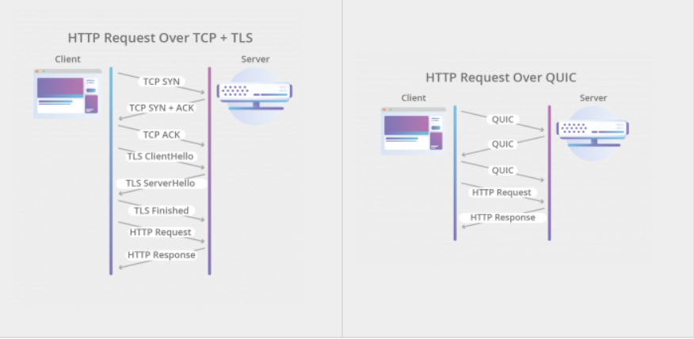
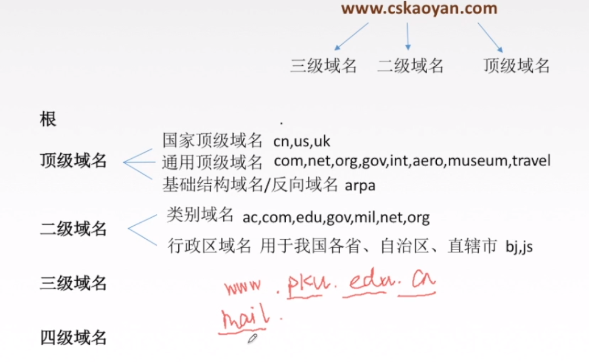
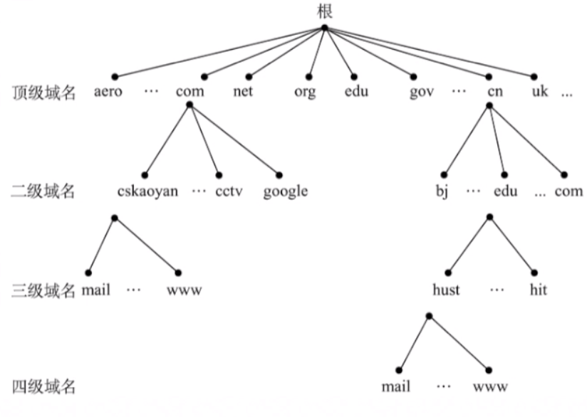
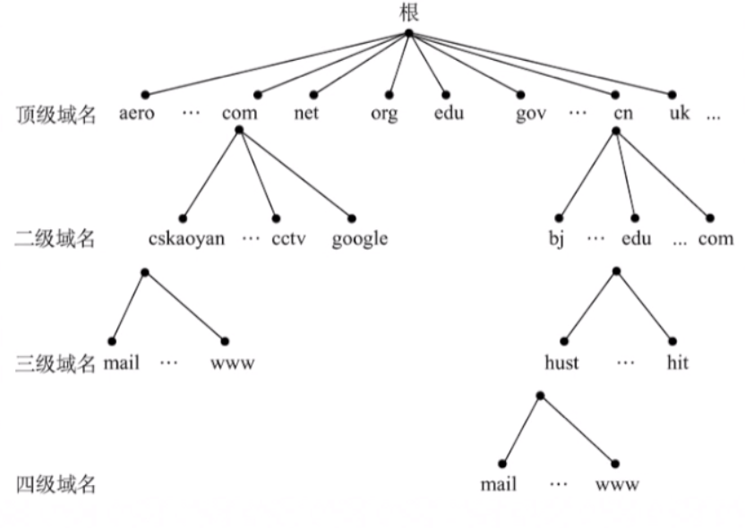
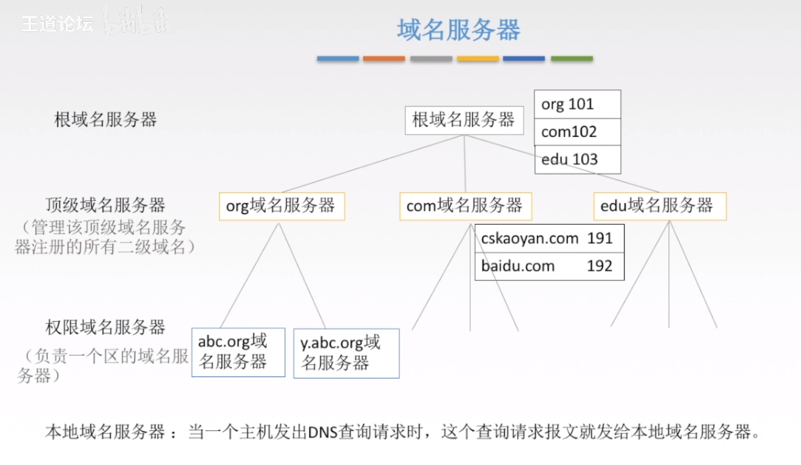
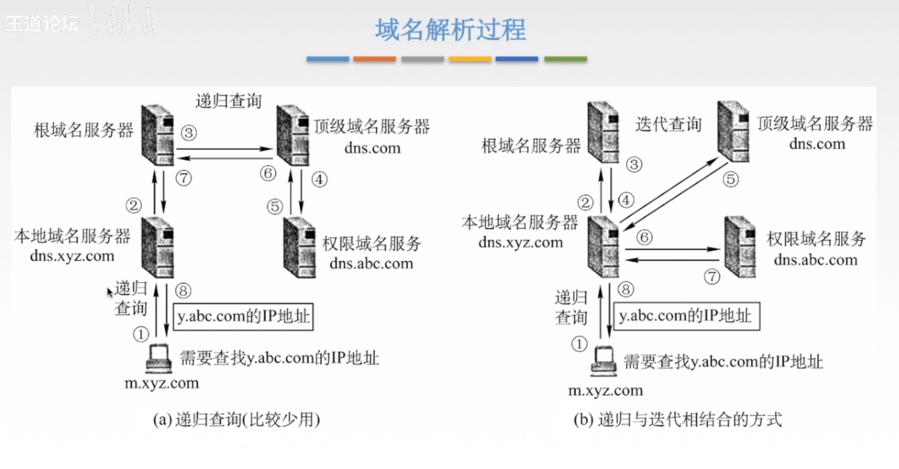
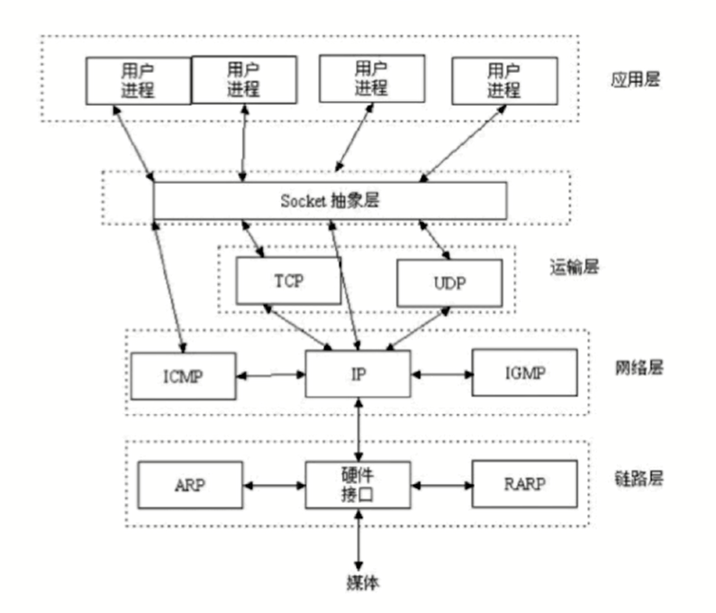

# HTTP

Hypertext transfer protocol：超文本传输协议

**[参考](https://coolshell.cn/articles/19840.html)**

## HTTP/1.1

**HTTP1.1开始，增加了：**

- keepalive选线，可重用TCP连接，否则每次请求都会进行三次握手。这是所谓的“**HTTP 长链接**” 或是 “**请求响应式的HTTP 持久链接(HTTP Persistent connection)**”。
- 有幂等性的请求如Get，支持了pipeline网络传输，第一个请求发出了不必等待响应就可以直接发第二个请求，减少了整体的响应时间。
- 协议头增加了HOST，这样的话，服务器就知道你要请求哪个网站了。因为可以有多个域名解析到同一个IP上，要区分用户是请求的哪个域名，就需要在HTTP的协议中加入域名的信息，而不是被DNS转换过的IP信息。

## HTTP/2

- HTTP/2是一个二进制协议，增加了数据传输的效率，不过对开发人员不太友好
- 可以在一个TCP连接中并发请求多个HTTP请求，移除了HTTP/1.1中的串行请求
- HTTP/2会压缩头，如果你同时发出多个请求，他们的头是一样的或是相似的，那么，协议会帮你消除重复的部分。这就是所谓的HPACK算法
- HTTP/2允许服务端在客户端放cache，又叫服务端push，也就是说，你没有请求的东西，我服务端可以先送给你放在你的本地缓存中。比如，你请求X，我服务端知道X依赖于Y，虽然你没有的请求Y，但我把把Y跟着X的请求一起返回客户端。

## HTTP/3

HTTP/2的最大问题就是[Head-of-Line Blocking](https://en.wikipedia.org/wiki/Head-of-line_blocking)问题，由于一个TCP连接中并发多个HTTP请求。一旦发生丢包，由于TCP的可靠传输机制需要重传丢失的包后才能是一个完整的传输，所以这时候所有HTTP请求需要等待这个丢失的包补上后才能提交给应用程序。这意味着一个图片可能已经成功下载，但是就是迟迟无法显示~

> HTTP/2 is indeed solving the problem at the HTTP level. However, it’s layered on top of the same TCP protocol just like HTTP/1.1, so it cannot solve the TCP HOLB. But are there scenarios where it could worsen the situation? Yes. The reason is that applications using HTTP/2 can send many more requests over a single TCP connection due to the pipelining/multiplexing features. Unexpectedly large variations in latency or a loss affecting the segment at the TCP head of line makes HTTP/2 more likely to hit HOLB, and its impact is larger as well. Basically, the receiver stands idle till the head is recovered, while all the subsequent segments are held by the TCP stack. This means that an image might be downloaded successfully and still not show up due to HOLB.

## QUIC （Quick UDP Internet Connections）

**是的，造成TCP HOLD的根本原因就是HTTP传输使用了TCP协议，解决办法就是更换成UDP。。。**

Google新引入了一个改进版的UDP协议：QUIC

- 由于UDP**不可靠**，所以解决了TCP HOLD问题，QUIC在UDP的基础上新增了丢包重传机制

- TCP有自己的拥塞窗口，所以如果网络出现拥塞，TCP会主动的进入拥塞控制算法中，然后进入**慢启动**或**快恢复**，所以TCP性能迸发性不足。QUIC基于UDP，虽然也有拥塞控制，但更为激进。

- 对于建立一个HTTPS的连接，先是TCP的三次握手，然后是TLS的三次握手，总共就是6次。QUIC直接合并为了三次握手。

  

- 所以，QUIC是一个在UDP之上的伪TCP +TLS +HTTP/2的多路复用的协议

# DNS

## 域名

# Cookie和Session的区别

- Cookie数据存放在客户的浏览器上，每次请求都携带cookie中的数据
- Session数据存放在服务器，通过Cookie或URL回写定位客户端
- Session相对于Cookie更安全
- 使用Cookie可以减轻服务器负担

# HTTP和HTTPS的区别

## HTTPS数据传输流程：

- 浏览器将支持的加密算法信息发送给服务器
- 服务器选择一套浏览器支持的加密算法，已证书的形式回发给浏览器
- 浏览器验证证书合法性，并结合证书公钥加密信息发送给服务器
- 服务器使用私钥解密信息，验证哈希，加密响应消息回发浏览器
- 浏览器解密响应消息，并对消息进行验证，之后进行加密交互数据

## 区别

- HTTPS需要到CA申请证书
- HTTPS是密文传输，HTTP是明文
- HTTPS默认443端口，HTTP默认80端口
- HTTPS = HTTP + 加密 + 认证 + 完整性保护
- 域名前的标识不同

# Socket

Socket是对TCP/IP协议的抽象，是操作系统对外开放的接口

