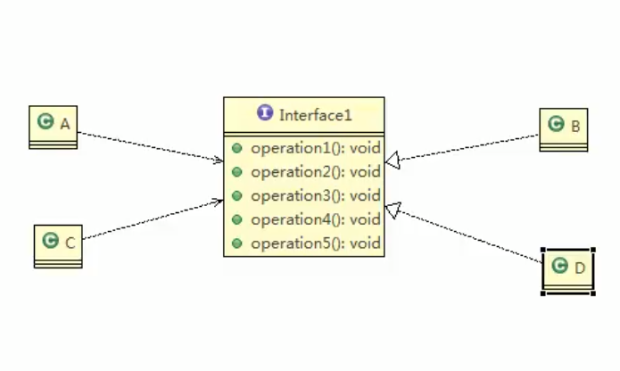
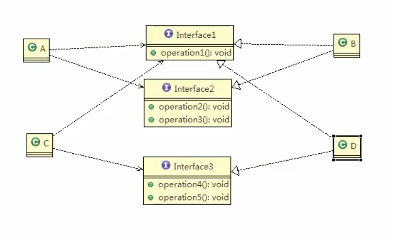

# 设计模式七大原则

### 单一职责原则

- 对类来说，即一个类应该只负责一项职责。

- 如类A负责两个不同的职责：职责1、职责2 。当职责1需求变更而改变A时，可能会影响职责2的执行结果，所以需要将类A的粒度分解为A1、A2两个类来分别负责职责1、职责2
- 方法级别也可。

```java
Class Vehicle{
    public void run(String vehicleName){
        if (vegicleName is roadVehicle){ //伪代码
            print(vehicleName + "在路上跑");
        }else if(vegicleName is airVehicle){ //伪代码
            print(vehicleName + "在天上飞");
        }
    }
}

Class Vehicle{
    public void runRoad(String vehicleName){
       print(vehicleName + "在路上跑");
    }
    
    public void runAir(String vehicleName){
       print(vehicleName + "在天上飞");
    }
}
```

相对于第一个`Vehicle`类的`run`方法将路上和天上的结合在一起，分成下面的两个具体的交通工具方法就明了很多，可读性可维护性就好很多。

### 接口隔离原则

- 客户端不应该依赖它不需要的接口，即一个类对另一个类的依赖应该建立在最小的接口上。
- 类似于对于接口设定的单一职责原则。

**如图：**

- A类需要用到`Interface1`的1、2、3方法，用B类来实现
- C类需要用到`Interface1`的1、4、5方法，用D来实现
- 最大的头疼就是B和D都需要实现接口中他们用不到的方法
- 所以并没有符合最小接口原则



**改进：**

- 将原来的`Interface1`分割为三个接口
- 每个接口各司其职
- 符合接口隔离原则



### 依赖倒转原则

- 相对于细节的多变性，抽象的东西要稳定的多。以抽象为基础搭建的架构比以细节为基础的架构要稳定的多。在Java中，抽象指的是接口或抽象类，细节就是具体的实现类。
- 使用接口或抽象类的目的是制定好规范，而不涉及任何具体的操作，把展现细节的任务交给他们的实现类去完成。
- 高层模块不应该依赖底层模块，二者都应该依赖其抽象（接口或抽象类）。
- 抽象不应该依赖细节，细节应该依赖抽象（实现接口或抽象方法）。
- 依赖倒置的中心思想是**面向接口编程**（尽量使用接口类型的变量或参数）。

```java
interface OpenAndClose{ //万能遥控器
    void ioen(TV tv);
}

interface TV{ //TV的抽象
    void play();
}

Class OpenAndCloseImpl implements OpenAndClose{
    public void open(Tv tv){
        tv.play();
    }
}
```

open方法的参数只是规定了TV类型，具体的各种TV的实现类都可以传入。

不直接依赖于具体的类参数，而是规定一个接口，依赖于接口类型。

### 里氏替换原则

- 如果对每个类型为T1的对象o1，都有类型为T2的对象o2，使得T1定义的所有程序P在所有的对象o1都替换为o2时，程序P的行为木有发生变化，那么类型T2时类型T1的子类型。换句话说，所有引用基类的地方必须能透明的使用其子类的对象。
- 在使用继承时，遵循里式替换原则，在子类中尽量不要重写父类的方法。
- 继承实际上是让类之间的耦合性增强了。可以通过聚合、**组合**、依赖来解决耦合问题。

### 开闭原则

- 一个软件实体如类、模块和函数应该对外扩展开放(对于开发者)，对修改关闭(对于使用者)。用抽象构建框架，用实现扩展细节。
- 当软件需要变化时，尽量通过扩展软件实体的行为来实现变化，而不是通过修改已有的代码来实现变化。
- 编程中遵循其他原则，以及使用设计模式的目的就是为了遵循开闭原则。

### 迪米特法则

- 只与直接的朋友通信
- 直接的朋友：每个对象都会与其他对象有耦合关系，只要两个对象之间有耦合关系，我们就说这两个对象之间是朋友关系。我们称出现在类A的成员变量、方法参数、方法返回值中的类为A的直接的朋友，而出在类A的局部变量中的类不是A的直接的朋友。也就是说，陌生的类最好不要以局部变量的形式出现在类的内部。
- 一个类应该对其他对象保持最少的了解
- 类与类关系越密切，耦合度越大
- 迪米特也叫最少知道原则，即一个类对自己依赖的类知道的越少越好。也就是说，对于被依赖的类不管多么复杂，都尽量将逻辑封装在类的内部，**对外除了提供的`public`方法，不对外泄露任何信息。**

### 合成复用原则

- 尽量使用组合/聚合的方式，而不是使用继承

  **假设B类要用到A类的一个方法：**

- 继承（泛化）：B直接继承A，获得A的所有方法从而可以用到想用的那一个方法

- 依赖：B中只要用到A，那么就构成了依赖关系

- 聚合：将各个模块选择性的聚合进来。B中定义一个A类型的实例变量但不赋值, 通过Setter等方法后赋值。所以聚合关系中的B与A是可分离的（不用时可以选择不setA）

- 组合:   将各个模块直接组合进来。B中定义一个A类型的实例变量并直接new出来A实例, 这样在B初始化时就直接将A也组合进来了。所以组合关系中的B与A是不可分离的（有B就一定有A）

## 总结

- 找出应用中可能需要变化之处, 把它们独立出来, 不要和那些不需要变化的代码混在一起
- 针对接口编程, 而不是针对实现编程
- 为了交互对象之间的松耦合设计而努力

# UML类图

UML (Unified modeling language) : 统一建模语言.，用来描述软件模型中的各个元素和他们之间的关系，如类、接口、实现、泛化、依赖、组合、聚合等。