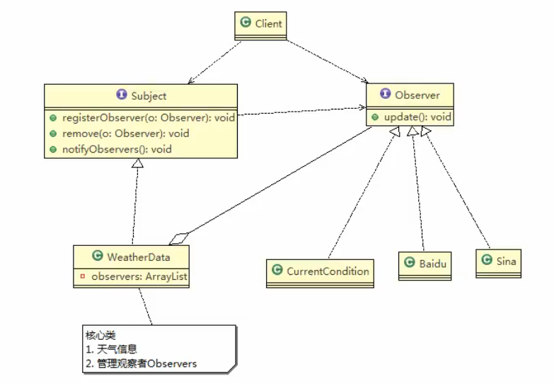

- Client依赖Subject和Observer
- Subject：数据主体，依赖Observer
- Observer：观察者
- WeatherData：实现Subject，并聚合有一个Observer数组
- Baidu、Sina...都是观察者

**WeatherData：**

```java
public class WeatherData implements Subject {
    private float temperature;
    private float pressure;
    private float humidity;
    private List<Observer> observers;

    public WeatherData(){
        observers = new ArrayList<Observer>();
    }

    @Override
    public void addObserver(Observer observer) {
        observers.add(observer);
    }

    @Override
    public void removeObserver(Observer observer) {
        observers.remove(observer);
    }

    public void setData(float temperature, float pressure, float humidity){
        this.humidity = humidity;
        this.pressure = pressure;
        this.temperature = temperature;
        notifyObservers(); //通知所有观察者
    }

    @Override
    public void notifyObservers() {
        for (Observer o: observers){
            o.update(this.temperature, this.pressure, this.humidity);
        }
    }
}
```

**Baidu：**

```java
public class BaiduWeather implements Observer{
    private float temperature;
    private float pressure;
    private float humidity;

    //数据发生更新时将会调用观察者的update方法
    public void update(float temperature, float pressure, float humidity){
        this.humidity = humidity;
        this.pressure = pressure;
        this.temperature = temperature;
        System.out.println(toString());
    }

    @Override
    public String toString() {
        return "Baidu Weather{" +
                "temperature=" + temperature +
                ", pressure=" + pressure +
                ", humidity=" + humidity +
                '}';
    }
}
```

**Client：**

```java
public class Client {
    public static void main(String[] args) {
        WeatherData weatherData = new WeatherData();
        //Creat Observer
        Observer currentConditions = new CurrentConditions();
        Observer baiduWeather = new BaiduWeather();
        //Add observer into weatherData
        weatherData.addObserver(currentConditions);
        weatherData.addObserver(baiduWeather);

        //更新数据，并通知观察者
        weatherData.setData(27, 90, 22);
    }
}
//输出
CurrentConditions{temperature=27.0, pressure=90.0, humidity=22.0}
Baidu Weather{temperature=27.0, pressure=90.0, humidity=22.0}
```


**在JDK中：**

- Observable相当于这里的WeatherData
- Observer相当我这里的Observer
- 继承Observable来实现观察者模式