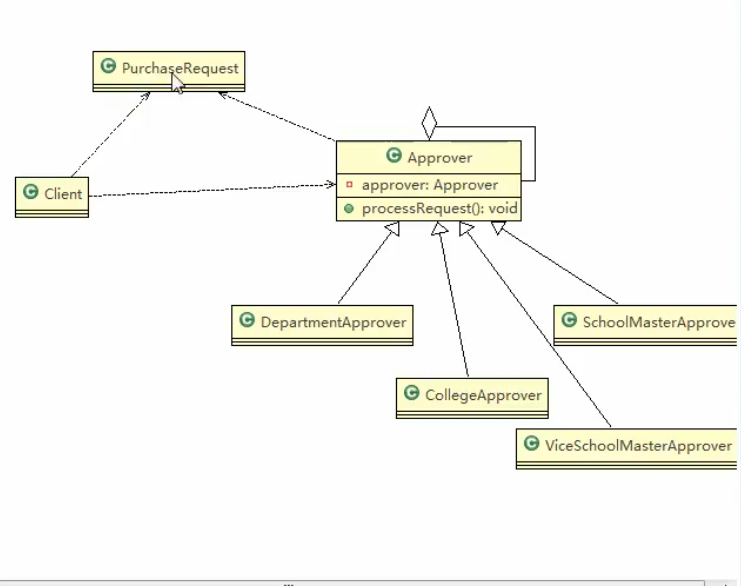

**采购系统需求：**

- x = 需要审批的金额
- 0 <  x  <= 5000，由教学主任审批
- 5000 <  x  <= 10000，由院长审批
- 10000 <  x，由副校长审批

**类图：**



**PurchaseRequest：购买请求**

```java
@Getter
public class PurchaseRequest {
    private int type;
    private float price;
    private int id;

    public PurchaseRequest(int type, float price, int id) {
        this.type = type;
        this.price = price;
        this.id = id;
    }
}
```

**Approve：抽象审批人**

```java
public abstract class Approve {
    Approve approve;
    String name;

    public Approve(String name){
        this.name = name;
    }

    //The next Approve. The key of the chain of responsbility
    public void setApprove(Approve approve){
        this.approve = approve;
    }

    //Need subclass to implement
    public abstract void processRequest(PurchaseRequest request);

}
```

**DepartmentApprove：主任级别**

```java
public class DepartmentApprove extends Approve {
    public DepartmentApprove(String name){
        super(name);
    }

    @Override
    public void processRequest(PurchaseRequest request) {
        if (request.getPrice() <= 5000){
            System.out.println(this.name + " : " + request.getId());
        }else {
            approve.processRequest(request);
        }
    }
}
```

**CollegeApprove：院长级别**

```java
public class CollegeApprove extends Approve {
    public CollegeApprove(String name){
        super(name);
    }

    @Override
    public void processRequest(PurchaseRequest request) {
        if (request.getPrice() <= 10000 && request.getPrice() > 5000){
            System.out.println(this.name + " : " + request.getId());
        }else {
            approve.processRequest(request);
        }
    }
}
```

...还有副校长级别，代码基本一样

**Client：测试类**

```java
public class Client {
    public static void main(String[] args) {
        //设置只有副院长才能审批的金额
        PurchaseRequest request = new PurchaseRequest(1, 63000, 1);

        DepartmentApprove departmentApprove = new DepartmentApprove("Director Yang");
        CollegeApprove collegeApprove = new CollegeApprove("Dean Li");
        ViceMasterApprove viceMasterApprove = new ViceMasterApprove("Master Z");

        //设置下一级的审批人。责任链的核心
        //要构成环状，金额太少就由最高级将购买需求给最低级
        departmentApprove.setApprove(collegeApprove);
        collegeApprove.setApprove(viceMasterApprove);
        viceMasterApprove.setApprove(departmentApprove);

        //将购买需求先交给主任
        departmentApprove.processRequest(request);
    }
}
//输出
> Task :Client.main()
Master Z : 1 //副院长
```

