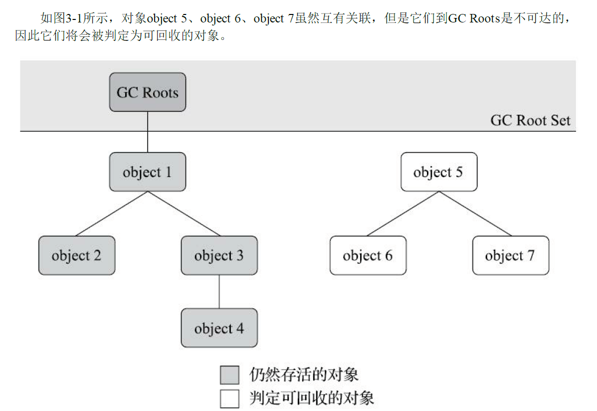
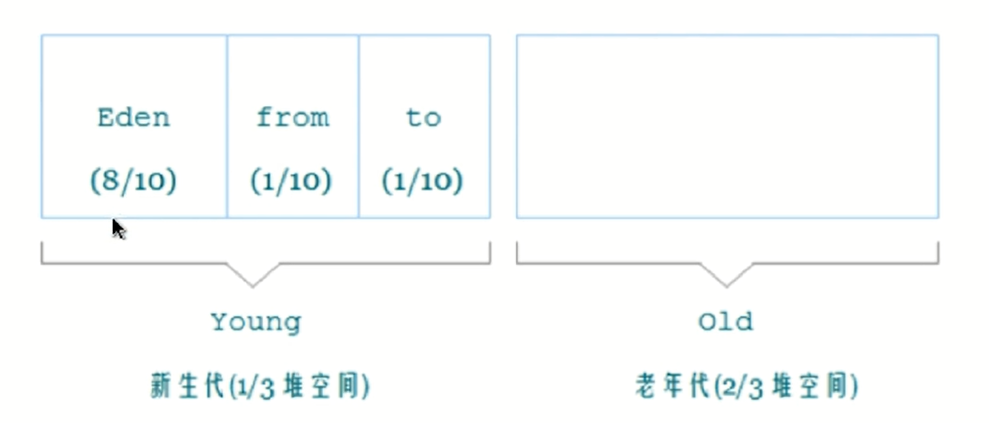
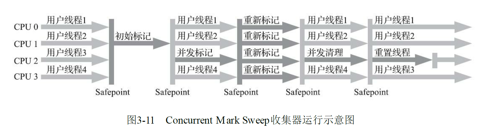
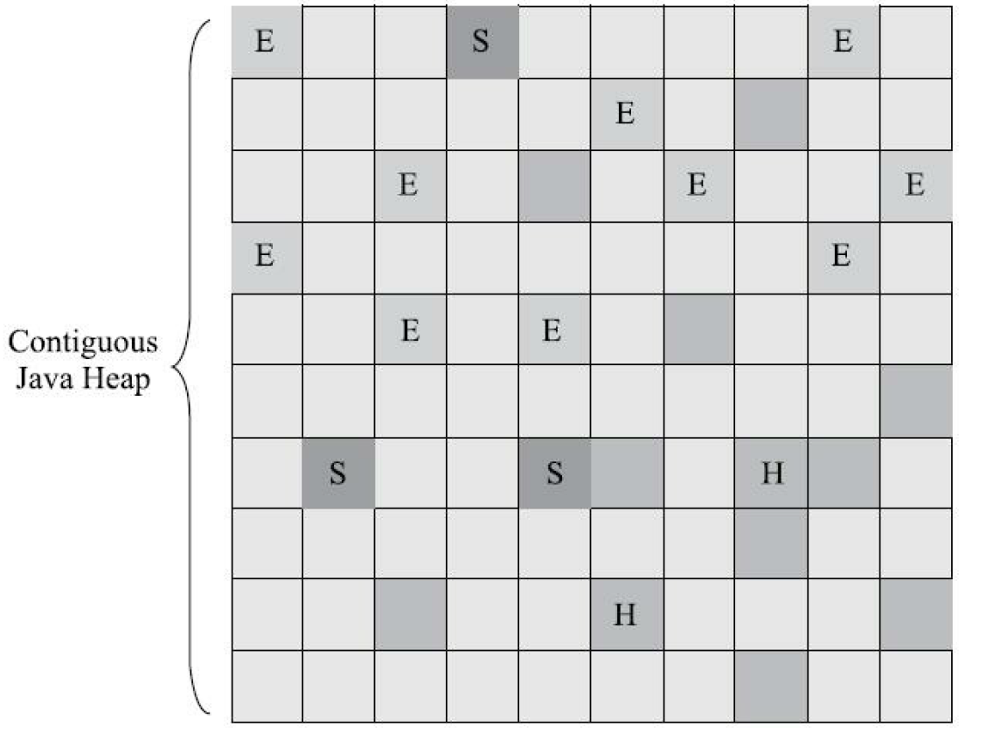
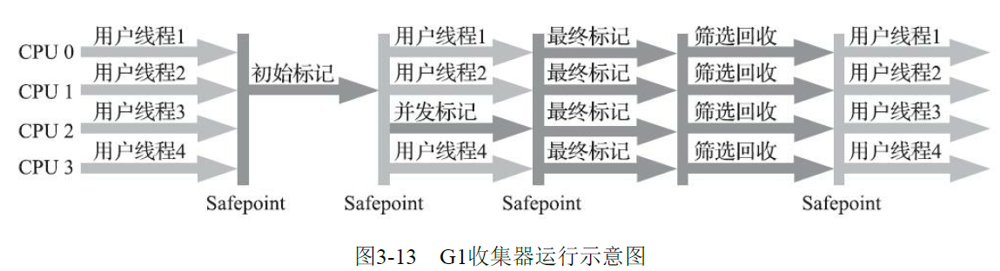

### 对象存活判断算法

#### 引用计数法（不可行）

```java
/**
* testGC()方法执行后，objA和objB会不会被GC呢？
*/
public class ReferenceCountingGC {
	public Object instance = null;
	private static final int _1MB = 1024 * 1024;
	/**
	* 这个成员属性的唯一意义就是占点内存，以便能在GC日志中看清楚是否有回收过
	*/
	private byte[] bigSize = new byte[2 * _1MB];
	public static void testGC() {
		ReferenceCountingGC objA = new ReferenceCountingGC();
		ReferenceCountingGC objB = new ReferenceCountingGC();
		objA.instance = objB;
		objB.instance = objA;
		objA = null;　//引用指向空
		objB = null;
		// 假设在这行发生GC，objA和objB是否能被回收？
		System.gc();
	}
}
```

实际上虽然已经没有引用指向这俩对象了但是它们并没有被GC。

互相引用时引用计数法并不能合理的回收垃圾。

#### 现在主流的方法是可达性分析算法

从roots开始向下搜索，搜索的过程被称为引用链（Reference Chain），如果某个对象到roots之间没有任何引用链相连则该对象到roots被称为不可达，那么该对象可以被看做是不可被使用的



**在Java技术体系里面，固定可作为GC Roots的对象包括以下几种：**

- 在虚拟机栈（栈帧中的本地变量表）中引用的对象，譬如各个线程被调用的方法堆栈中使用到的参数、局部变量、临时变量等。
- 在方法区中类静态属性引用的对象，譬如Java类的引用类型静态变量。
- 在方法区中常量引用的对象，譬如字符串常量池（String Table）里的引用。
- 在本地方法栈中JNI（即通常所说的Native方法）引用的对象。
- Java虚拟机内部的引用，如基本数据类型对应的Class对象，一些常驻的异常对象（比如
  NullPointExcepiton、OutOfMemoryError）等，还有系统类加载器。
- 所有被同步锁（synchronized关键字）持有的对象。
- 反映Java虚拟机内部情况的JMXBean、JVMTI中注册的回调、本地代码缓存等。

### 引用状态

对于垃圾收集，此前对象不就是被引用就是未被引用然后被GC。但是其实需要更多的状态，比如一些**被引用**的对象可能不太会用到所以希望垃圾收集的时候能在恰当的时机（内存不足时）也能给他GC好释放空间。

**所以现在的Java拥有四种引用状态**

- 强引用是最传统的“引用”的定义，是指在程序代码之中普遍存在的引用赋值，即类似`Objectobj=new Object()`这种引用关系。无论任何情况下，只要强引用关系还存在，垃圾收集器就永远不会回收掉被引用的对象。
- 软引用是用来描述一些还有用，但非必须的对象。只被软引用关联着的对象，在系统将要发生内存溢出异常前，会把这些对象列进回收范围之中进行第二次回收，如果这次回收还没有足够的内存，才会抛出内存溢出异常。在JDK 1.2版之后提供了SoftReference类来实现软引用。
- 弱引用也是用来描述那些非必须对象，但是它的强度比软引用更弱一些，被弱引用关联的对象只能生存到下一次垃圾收集发生为止。当垃圾收集器开始工作，无论当前内存是否足够，都会回收掉只被弱引用关联的对象。在JDK 1.2版之后提供了WeakReference类来实现弱引用。
- 虚引用也称为“幽灵引用”或者“幻影引用”，它是最弱的一种引用关系。一个对象是否有虚引用的存在，完全不会对其生存时间构成影响，也无法通过虚引用来取得一个对象实例。为一个对象设置虚引用关联的唯一目的只是为了能在这个对象被收集器回收时收到一个系统通知。在JDK 1.2版之后提供了PhantomReference类来实现虚引用。

### 方法区GC

由于方法区存放的一般都是常量和类信息等, 这些东西本质决定了他们都不太需要被回收. 所以方法区的垃圾回收成果很低

方法区中回收**常量**与堆中回收对象机制差不多: 当系统中已经没有任何一个字符串对象引用该字符串, 那么这个字符串就要被回收

当判断一个类是否要被回收时就要苛刻一点了,毕竟好不容加载好的

> - 该类的所有实例都已经被回收,也就是堆中不存在该类极其任何派生自类的实例
> - 加载该类的类加载器已经被回收
> - 该类对应的`java.lang.Class`对象没有在任何地方被引用 (没有在任何地方通过反射调用该类)


### 分代理论

Java虚拟机应该将Java堆划分为不同的区域，然后将回收对象依据年龄（年龄即对象熬过垃圾收集过程的次数）分配到不同的区域之中存储。显而易见的如果一个区域中大多数对象都是朝升夕灭难以熬过GC的话就要把他们放在一起。剩下的就是一些难以消亡的对象就放到一起。这样就可以根据区域来进行垃圾收集。

Java堆一般划分为新生代（Yong Generation）和老年代（Old Generation）两个区域。在新生代中每次GC存活下来的对象都会放在老年代中。

新生代中的对象是很有可能被老年代所引用，所以需要在新生代上新建一个数据结构（记忆集，Remembered Set），这个结构将老年代划分为若干个小块，标记处老年代的哪一块内存会存在跨代引用。

##### 垃圾收集策略

> 新生代收集策略（Minor GC/Yong GC）：目标只是新生代的垃圾收集策略
>
> 老年代收集（Major GC/Old GC）：指目标只是老年代的垃圾收集。目前只有CMS收集器会有单独收集老年代的行为。
>
> 混合收集（Mixed GC）：指目标是收集整个新生代以及部分老年代的垃圾收集。目前只有G1收集器会有这种行为。
>
> 整堆收集（Full GC）：收集整个Java堆和方法区的垃圾收集。
>
> 发生Full GC的条件：
>
> > > > 老年代空间不足
> > > >
> > > > 调用System.gc()时可能发生，由JVM判断
> > > >
> > > > CMS GC时出现promotion failed,Concurrent mode failure
> > > >
> > > > Minor GC晋升到老年代的平均大小大于老年代的剩余空间

### 清除算法

#### 标记清除算法（用于老年代）

将需要回收的对象先标记，然后统一回收。

这种算法会产生很多内存碎片

#### 标记-复制算法（针对新生代的回收算法）

将可用的内存按容量大小划分为两半，一半存数据一半空闲。

当存数据的那一半空间不足时就开始垃圾清理，将还存活着的对象整体复制到另一半空闲区然后整体清除当前的数据区

此时两个区的身份互换，等到下一次GC身份再次互换

这种算法如果用在老年代，因为每次需要复制的都是存活的，所以可能每次都要复制90%以上的对象，效率太低了。。。

**这种算法被广泛用在新生代的回收上**

> 据统计新生代中的对象有98%都熬不过第一轮收集，所以并不需要按照1：1的比例来划分数据区与空闲区的大小
>
> HotSpot就采用了数据区包含一块Eden和一块Survivor，空闲区只有一块Survivor。比例是`([Eden:Survivor]:Survivor) = 8:1:1`。也就是默认了一次GC只会有少于10%的对象会存活下来。我承认我有赌的成分，不过我有后手。
>
> 
>
> 在1989年，Andrew Appel针对具备“朝生夕灭”特点的对象，提出了一种更优化的半区复制分代策略，现在称为“Appel式回收”。HotSpot虚拟机的Serial、ParNew等新生代收集器均采用了这种策略来设计新生代的内存布局。
>
> Appel式回收的具体做法是把新生代分为一块较大的Eden空间和两块较小的Survivor空间，每次分配内存只使用Eden和其中一块Survivor。发生垃圾搜集时，将Eden和Survivor中仍然存活的对象一次性复制到另外一块Survivor空间上，然后直接清理掉Eden和已用过的那块Survivor空间。
>
> HotSpot虚拟机默认Eden和Survivor的大小比例是8∶1，也即每次新生代中可用内存空间为整个新生代容量的90%（Eden的80%加上一个Survivor的10%），只有一个Survivor空间，即10%的新生代是会被“浪费”的。当然，98%的对象可被回收仅仅是“普通场景”下测得的数据，任何人都没有办法百分百保证每次回收都只有不多于10%的对象存活，因此Appel式回收还有一个充当罕见情况的“逃生门”的安全设计，当Survivor空间不足以容纳一次Minor GC之后存活的对象时，就需要依赖其他内存区域（实际上大多就是老年代）进行**分配担保（Handle Promotion），直接进入老年代**。
>
> 内存的分配担保好比我们去银行借款，如果我们信誉很好，在98%的情况下都能按时偿还，于是银行可能会默认我们下一次也能按时按量地偿还贷款，只需要有一个担保人能保证如果我不能还款时，可以从他的账户扣钱，那银行就认为没有什么风险了。内存的分配担保也一样，如果另外一块Survivor空间没有足够空间存放上一次新生代收集下来的存活对象，这些对象便将通过分配担保机制直接进入老年代，这对虚拟机来说就是安全的。

#### 标记-整理算法（用于老年代）

由于老年代的对象大多数不会被标记，所以整理的也不太算辛苦~

和标记-清除算法一样。不过标记后不马上进行清理，而是先将存活下来的对象都移动到一端然后统一清理被标记的。

这种算法不会产生内存碎片，但是明显的性能会有所影响。而且这种对象移动操作必须全程暂停用户应用程序才能进行。。。

所以有一种混合式的，就是先使用标记-清除算法，当内存碎片过多时再使用标记-整理算法

### 垃圾回收器

#### Serial收集器（新生代）

最基本、单线程

收集垃圾时会暂停一切的用户线程直到垃圾回收结束

迄今为止，他仍然是HotSpot虚拟机运行在客户端模式下的默认收集器

#### ParNew收集器

Serial的多线程版

#### Parallel Scavenge收集器（新生代）

采用标记-复制算法

多线程

该收集器重点关注的是吞吐量：用户代码执行时间 / 用户代码执行时间+运行GC的时间

如用户代码加上GC一共消耗100分钟，其中GC占用1分钟。那么吞吐量就是99%

参数：

> `-XX：MaxGCPauseMillis`：进行一次垃圾收集的时间。单位是毫秒。设置的少了就会频繁的GC，多了就会影响用户体验
>
> `-XX：GCTimeRatio`参数的值则应当是一个大于0小于100的整数，也就是垃圾收集时间占总时间的比率，相当于吞吐量的倒数。譬如把此参数设置为19，那允许的最大垃圾收集时间就占总时间的5%（即1/(1+19)），默认值为99，即允许最大1%（即1/(1+99)）的垃圾收集时间。

#### CMS收集器（老年代）

**初始标记（initial mark）：**仅标记GCROOTS能直接关联到的对象，用图表示也就是Root节点的出边连得所有节点，不再往下深入搜索。

**并发标记（concurrent mark）：**遍历整个对象图，并且与用户线程是并发的运行。耗时较长

**重新标记（remark）：**修正并发标记期间由于程序运行而可能导致的被标记的那些对象状态产生变化的问题。。。怎么也写不通

**并发清除（concurrent sweep）：**与用户线程并发的执行，清除掉那些被标记为死亡的对象



由于并发，带来了性能上的提升。但同时可能也会导致性能下降，并发意味着GC线程会和用户线程"抢"CPU资源。

因为使用了标记-清除算法，所以肯定会产生内存碎片

### G1（Garbage First）算法（新生代/老年代）

美团技术团队整理：[Region](https://tech.meituan.com/2016/09/23/g1.html)

G1主要是面向服务端的一种算法。

开创了收集器面向局部收集的设计思路和基于Region的内存布局形式。

JDK9发布之后，G1宣告取代（Parallel Scavenge加Parallel Old）组合，成为服务端默认的垃圾收集器。而此时的CMS被声明为不推荐使用的收集器。。。

G1的时代已经抛弃了单纯的面向新生代或老年代收集的策略（只是策略不同，分代理论还有），它可以面向堆内存任何部分来组成**回收集**（Collection Set / CSet）进行回收。衡量标准不再是它属于哪个分代，而是哪块内存中存放的垃圾数量最多，回收收益最大，这就是G1收集器的Mixed GC模式~~~

G1将连续的Java堆划分为多个大小相等的区域（Region），每一个Region都可以根据需要扮演新生代的Eden、Survivor空间，或者老年代空间

在划分出的Region中有一类特殊的Humongous区域，专门用来存储大对象。G1认为只要超过了一个Region一半容量大小的对象就可以成为大对象



图中的H（Humongous）就代表存放大对象的Region，S（Survivor）幸存者空间，E（yong Generation）新生代。


#### Pause Prediction Model

G1比较稳定的实现了**预测**模型，当用户设置一个收集时间的期望值时，G1就会计算如何收集才能尽可能的达到这个期望值。

通过`-XX：MaxGCPauseMillis`来设置垃圾收集时间的期望值

期望值设置过低就会导致每次只收集很少一部分，收集速度赶不上分配器分配的速度，从而导致垃圾慢慢堆积。在最终导致Full GC。。。

G1收集器的停顿预测模型是以**衰减均值**（Decaying Average）为理论基础实现的，在垃圾收集的过程中，G1收集器会记录每个Region的回收耗时和记忆集里的脏卡数量等各个可测量的步骤花费的成本，并分析得出平均值、标准偏差、置信度等统计信息。

衰减平均值比普通的平均值更容易受到新数据的影响，衰减平均值能更准确的代表最近的平均状态。也就是Region的统计状态越新越能决定其回收的价值。

然后通过这些信息预测现在开始回收的话，由那些Region组成回收集才可以在不超过期望停顿时间的约束下获得最高的收益。

#### SATB与TAMS

**对象的三种状态（这里被标记的对象会存活下来，有的地方被标记的是要被清除的）**

> 白：对象没有被标记到，标记阶段结束后会被当做垃圾回收掉
>
> 灰：对象被标记了，但是它的field还没有被标记或标记完
>
> 黑：对象被标记了，且它的所有field也被标记完了

**SATB（Snapshot-At-The-Beginning）：**GC开始时或者的对象的一个快照，由Root Tracing得到，作用是维持并发GC的正确性。

**TAMS（Top at Mark Start）：**由于G1的回收过程大部分是并发的，所以回收的这段时间创建的新对象就需要额外的处理。G1为每一个Region设计了两个名为TAMS(Top at Mark Start)的指针，分别为prevTAMS和nextTAMS。把Region中的一部分空间划分出来用于并发回收过程中的新对象分配，并发回收时新分配的对象地址都必须要在这两个指针位置以上。G1默认这个指针以上的对象都是被隐式标记过的，不会被回收。

#### G1收集器的运作过程

**只有并发标记是与用户线程并发执行的。不过也只有这个阶段比较耗时~**


**初始标记（Initial Marking）**

> 仅标记GC ROOTS能直接关联到的对象，并修改TAMS的指针，让下一阶段用户线程并发运行时能在Region中分配对象。这个阶段几乎没有停顿

**并发标记（Concurrent Marking）**

> 从GC ROOT开始对堆中所有对象进行可达到性分析，递归扫描整个堆里的对象图，找出要回收的对象。这个阶段耗时较长，但可以与用户程序并发执行。
>
> 在对象图扫描完后还要重新处理SATB记录下的在并发时有引用变动的对象

**最终标记（Final Marking）**

> 对用户线程做一个短暂的暂停，用于处理并发阶段结束后仍遗留下来的最后那少量的 SATB记录（GC运行期间新加的对象）

**筛选回收（Live Data Counting and Evacuation）**

> 这个阶段的复制操作由于会涉及到存活对象的移动所以会暂停用户线程，由多条收集器线程并行完成
>
> 负责更新Region的统计数据，对各个Region的回收价值和成本进行排序
>
> 根据用户所期望的停顿时间来制定回收计划，可以自由选择任意多个Region来构成回收集（CSet）
>
> 然后把决定回收的那一部分Region的存活对象复制到空的Region中，再清理掉整个旧Region的全部空间。



G1的缺点同样比较明显，无论是G1无论是为了垃圾收集产生的内存占用（Footprint）还是程序运行时的额外执行负载（Overload）都要比CMS要高。

### 分配与回收实战

**以下都是使用Serial加Serial Old客户端默认收集器组合下的内存分配和回收的策略**


1. #### 对象优先在Eden分配

大多数情况下，对象在新生代Eden区中分配。当Eden区没有足够空间进行分配时，虚拟机将发起
一次Minor GC。

HotSpot虚拟机提供了`-XX：+PrintGCDetails`这个收集器日志参数，告诉虚拟机在发生垃圾收集行
为时打印内存回收日志，并且在进程退出的时候输出当前的内存各区域分配情况。在实际的问题排查
中，收集器日志常会打印到文件后通过工具进行分析，不过本节实验的日志并不多，直接阅读就能看
得很清楚。

在代码清单3-7的testAllocation()方法中，尝试分配三个2MB大小和一个4MB大小的对象，在运行
时通过`-Xms20M、-Xmx20M、-Xmn10M`这三个参数限制了Java堆大小为20MB，不可扩展，其中
10MB分配给新生代，剩下的10MB分配给老年代。

`-XX：Survivor-Ratio=8`决定了新生代中Eden区与一个Survivor区的空间比例是8∶1，从输出的结果也清晰地看到`eden space 8192K、from space 1024K、tospace 1024K`的信息，新生代总可用空间为9216KB（Eden区+1个Survivor区的总容量）。

执行testAllocation()中分配allocation4对象的语句时会发生一次Minor GC，这次回收的结果是新生
代6651KB变为148KB，而总内存占用量则几乎没有减少（因为allocation 1、2、3三个对象都是存活
的，虚拟机几乎没有找到可回收的对象）。

产生这次垃圾收集的原因是为allocation4分配内存时，发现Eden已经被占用了6MB，剩余空间已不足以分配allocation4所需的4MB内存，因此发生Minor GC。垃圾收集期间虚拟机又发现已有的三个2MB大小的对象全部无法放入Survivor空间（Survivor空间只有1MB大小），所以只好通过分配担保机制提前转移到老年代去。

这次收集结束后，4MB的allocation4对象顺利分配在Eden中。因此程序执行完的结果是Eden占用4MB（被allocation4占用），Survivor空闲，老年代被占用6MB（被allocation1、2、3占用）。通过GC日志可以证实这一点。

代码清单3-7　新生代Minor GC

```java
private static final int _1MB = 1024 * 1024;
/**

* VM参数：-verbose:gc -Xms20M -Xmx20M -Xmn10M -XX:+PrintGCDetails -XX:SurvivorRatio=8
  */
  public static void testAllocation() {
  byte[] allocation1, allocation2, allocation3, allocation4;
  allocation1 = new byte[2 * _1MB];
  allocation2 = new byte[2 * _1MB];
  allocation3 = new byte[2 * _1MB];
  allocation4 = new byte[4 * _1MB]; // 出现一次Minor GC
  }

  //运行结果：
  [GC [DefNew: 6651K->148K(9216K), 0.0070106 secs] 6651K->6292K(19456K), 0.0070426 secs]    [Times: user=0.00 sys=0.00, Heap
  def new generation total 9216K, used 4326K [0x029d0000, 0x033d0000, 0x033d0000)
  eden space 8192K, 51% used [0x029d0000, 0x02de4828, 0x031d0000) //大对象存放到了Eden
  from space 1024K, 14% used [0x032d0000, 0x032f5370, 0x033d0000)
  to space 1024K, 0% used [0x031d0000, 0x031d0000, 0x032d0000)
  //allocation 1、2、3由于复制不到Survivor中，通过分配担保机制被放到了老年代中
  tenured generation total 10240K, used 6144K [0x033d0000, 0x03dd0000, 0x03dd0000)
  the space 10240K, 60% used [0x033d0000, 0x039d0030, 0x039d0200, 0x03dd0000)
  compacting perm gen total 12288K, used 2114K [0x03dd0000, 0x049d0000, 0x07dd0000)
  the space 12288K, 17% used [0x03dd0000, 0x03fe0998, 0x03fe0a00, 0x049d0000)
  No shared spaces configured.
```

2. #### 大对象直接进入老年代

大对象就是指那些需要大量的连续内存空间的Java对象。最典型的就是很长的字符串或很庞大的数组。

在写程序是应该避免写这种超级大的数组或无限长的字符串

HotSpot虚拟机提供了`-XX：PretenureSizeThreshold`参数，指定大于该设置值的对象直接在老年代分配。由于大对象很容易就占满Eden从而触发GC，这样做的目的就是避免在Eden区及两个Survivor区之间来回复制，产生大量的内存复制操作。

执行代码清单3-8中的testPretenureSizeThreshold()方法后，我们看到Eden空间几乎没有被使用，而老年代的10MB空间被使用了40%，也就是4MB的allocation对象直接就分配在老年代中，这是因为`-XX：PretenureSizeThreshold`被设置为3MB（就是3145728，这个参数不能与-Xmx之类的参数一样直接写3MB），因此超过3MB的对象都会直接在老年代进行分配。

注意`-XX：PretenureSizeThreshold`参数只对Serial和ParNew两款新生代收集器有效，HotSpot的其他新生代收集器，如Parallel Scavenge并不支持这个参数。如果必须使用此参数进行调优，可考虑ParNew加CMS的收集器组合。

代码清单3-8　大对象直接进入老年代

```java
private static final int _1MB = 1024 * 1024;
/**

* VM参数：-verbose:gc -Xms20M -Xmx20M -Xmn10M -XX:+PrintGCDetails -XX:SurvivorRatio=8
* -XX:PretenureSizeThreshold=3145728
  */
  public static void testPretenureSizeThreshold() {
  byte[] allocation;
  allocation = new byte[4 * _1MB]; //直接分配在老年代中
  }

  //运行结果：
  Heap
  def new generation total 9216K, used 671K [0x029d0000, 0x033d0000, 0x033d0000)
  //新生代区并木有东西
  eden space 8192K, 8% used [0x029d0000, 0x02a77e98, 0x031d0000)
  from space 1024K, 0% used [0x031d0000, 0x031d0000, 0x032d0000)
  to space 1024K, 0% used [0x032d0000, 0x032d0000, 0x033d0000)
  //都放到了老年代区中
  tenured generation total 10240K, used 4096K [0x033d0000, 0x03dd0000, 0x03dd0000)
  the space 10240K, 40% used [0x033d0000, 0x037d0010, 0x037d0200, 0x03dd0000)
  compacting perm gen total 12288K, used 2107K [0x03dd0000, 0x049d0000, 0x07dd0000)
  the space 12288K, 17% used [0x03dd0000, 0x03fdefd0, 0x03fdf000, 0x049d0000)
  No shared spaces configured.
```

3. #### 长期存活的对象将进入老年代

除了上一种大对象的情况，对象通常都会在Eden区诞生，如果经过第一次Minor GC 后仍然存活，并被放到了Survivor中的话该对象的年龄就会被设置为1岁。每熬过一次新生代收集（Minor GC）对象的年龄就会加一岁。

当对象的年龄达到一个阈值（默认为15）就会被晋升到老年代中。

可以通过参数`-XX：MaxTenuringThreshold`设置晋升的阈值。

读者可以试试分别以`-XX：MaxTenuringThreshold=1`和`-XX：MaxTenuringThreshold=15`两种设置来执行代码清单3-9中的`testTenuringThreshold()`方法，此方法中allocation1对象需要256KB内存，Survivor空间可以容纳。

当`-XX：MaxTenuringThreshold=1`时，allocation1对象在第二次GC发生时进入老年代，新生代已使用的内存在垃圾收集以后非常干净地变成0KB。而当`-XX：MaxTenuringThreshold=15`时，第二次GC发生后，allocation1对象则还留在新生代Survivor空间，这时候新生代仍然有404KB被占用。

代码清单3-9　长期存活的对象进入老年代

```java
private static final int _1MB = 1024 * 1024;
/**
* VM参数：-verbose:gc -Xms20M -Xmx20M -Xmn10M -XX:+PrintGCDetails -XX:Survivor-
  Ratio=8 -XX:MaxTenuringThreshold=1
* -XX:+PrintTenuringDistribution
  */
  @SuppressWarnings("unused")
  public static void testTenuringThreshold() {
      
  byte[] allocation1, allocation2, allocation3;
      
  // 什么时候进入老年代决定于XX:MaxTenuring-
  allocation1 = new byte[_1MB / 4]; 
  allocation2 = new byte[4 * _1MB];
  allocation3 = new byte[4 * _1MB];
  allocation3 = null;
  allocation3 = new byte[4 * _1MB];
  }

  //以-XX：MaxTenuringThreshold=1参数来运行的结果：
  [GC [DefNew
  Desired Survivor size 524288 bytes, new threshold 1 (max 1)

- age 1: 414664 bytes, 414664 total
  : 4859K->404K(9216K), 0.0065012 secs] 4859K->4500K(19456K), 0.0065283 secs] [Times: user=0.02 sys=0.00, real=0.02 [GC [DefNew
  Desired Survivor size 524288 bytes, new threshold 1 (max 1)
  : 4500K->0K(9216K), 0.0009253 secs] 8596K->4500K(19456K), 0.0009458 secs] [Times: user=0.00 sys=0.00, real=0.00 Heap
  def new generation total 9216K, used 4178K [0x029d0000, 0x033d0000, 0x033d0000)
  eden space 8192K, 51% used [0x029d0000, 0x02de4828, 0x031d0000)
  from space 1024K, 0% used [0x031d0000, 0x031d0000, 0x032d0000)
  to space 1024K, 0% used [0x032d0000, 0x032d0000, 0x033d0000)
  tenured generation total 10240K, used 4500K [0x033d0000, 0x03dd0000, 0x03dd0000)
  the space 10240K, 43% used [0x033d0000, 0x03835348, 0x03835400, 0x03dd0000)
  com\pacting perm gen total 12288K, used 2114K [0x03dd0000, 0x049d0000, 0x07dd0000)
  the space 12288K, 17% used [0x03dd0000, 0x03fe0998, 0x03fe0a00, 0x049d0000)
  No shared spaces configured.
                              
                              
  //以-XX：MaxTenuringThreshold=15参数来运行的结果：
  [GC [DefNew
  Desired Survivor size 524288 bytes, new threshold 15 (max 15)
- age 1: 414664 bytes, 414664 total
  : 4859K->404K(9216K), 0.0049637 secs] 4859K->4500K(19456K), 0.0049932 secs] [Times: user=0.00 sys=0.00, real=0.00 [GC [DefNew
  Desired Survivor size 524288 bytes, new threshold 15 (max 15)
- age 2: 414520 bytes, 414520 total
  : 4500K->404K(9216K), 0.0008091 secs] 8596K->4500K(19456K), 0.0008305 secs] [Times: user=0.00 sys=0.00, real=0.00 Heap
  def new generation total 9216K, used 4582K [0x029d0000, 0x033d0000, 0x033d0000)
  eden space 8192K, 51% used [0x029d0000, 0x02de4828, 0x031d0000)
  from space 1024K, 39% used [0x031d0000, 0x03235338, 0x032d0000)
  to space 1024K, 0% used [0x032d0000, 0x032d0000, 0x033d0000)
  tenured generation total 10240K, used 4096K [0x033d0000, 0x03dd0000, 0x03dd0000)
  the space 10240K, 40% used [0x033d0000, 0x037d0010, 0x037d0200, 0x03dd0000)
  compacting perm gen total 12288K, used 2114K [0x03dd0000, 0x049d0000, 0x07dd0000)
  the space 12288K, 17% used [0x03dd0000, 0x03fe0998, 0x03fe0a00, 0x049d0000)
  No shared spaces configured.
```

#### 对象年龄的判定

为了能更好地适应不同程序的内存状况，HotSpot虚拟机并不是永远要求对象的年龄必须达到`-XX：MaxTenuringThreshold`才能晋升老年代，如果在Survivor空间中相同年龄所有对象大小的总和大于Survivor空间的一半，年龄大于或等于该年龄的对象就可以直接进入老年代，无须等到`-XX：MaxTenuringThreshold`中要求的年龄。

执行代码清单3-10中的testTenuringThreshold2()方法，并将设置`-XX：MaxTenuring-Threshold=15`，发现运行结果中Survivor占用仍然为0%，而老年代比预期增加了6%，也就是说allocation1、allocation2对象都直接进入了老年代，并没有等到15岁的临界年龄。

因为这两个对象加起来已经到达了512KB，并且它们是同年龄的，满足同年对象达到Survivor空间一半的规则。我们只要注释掉其中一个对象的new操作，就会发现另外一个就不会晋升到老年代了。

代码清单3-10　动态对象年龄判定

```java
private static final int _1MB = 1024 * 1024;
/**

* VM参数：-verbose:gc -Xms20M -Xmx20M -Xmn10M -XX:+PrintGCDetails -XX:SurvivorRatio=8
  -XX:MaxTenuringThreshold=15
* -XX:+PrintTenuringDistribution
  */
  @SuppressWarnings("unused")
  public static void testTenuringThreshold2() {
  byte[] allocation1, allocation2, allocation3, allocation4;
  allocation1 = new byte[_1MB / 4]; // allocation1+allocation2大于survivo空间一半
  allocation2 = new byte[_1MB / 4];
  allocation3 = new byte[4 * _1MB];
  allocation4 = new byte[4 * _1MB];
  allocation4 = null;
  allocation4 = new byte[4 * _1MB];
  }
  运行结果：
  [GC [DefNew
  Desired Survivor size 524288 bytes, new threshold 1 (max 15)

- age 1: 676824 bytes, 676824 total
  : 5115K->660K(9216K), 0.0050136 secs] 5115K->4756K(19456K), 0.0050443 secs] [Times: user=0.00 sys=0.01, real=0.01 [GC [DefNew
  Desired Survivor size 524288 bytes, new threshold 15 (max 15)
  : 4756K->0K(9216K), 0.0010571 secs] 8852K->4756K(19456K), 0.0011009 secs] [Times: user=0.00 sys=0.00, real=0.00 Heap
  def new generation total 9216K, used 4178K [0x029d0000, 0x033d0000, 0x033d0000)
  eden space 8192K, 51% used [0x029d0000, 0x02de4828, 0x031d0000)
  from space 1024K, 0% used [0x031d0000, 0x031d0000, 0x032d0000)
  to space 1024K, 0% used [0x032d0000, 0x032d0000, 0x033d0000)
  tenured generation total 10240K, used 4756K [0x033d0000, 0x03dd0000, 0x03dd0000)
  the space 10240K, 46% used [0x033d0000, 0x038753e8, 0x03875400, 0x03dd0000)
  compacting perm gen total 12288K, used 2114K [0x03dd0000, 0x049d0000, 0x07dd0000)
  the space 12288K, 17% used [0x03dd0000, 0x03fe09a0, 0x03fe0a00, 0x049d0000)
  No shared spaces configured.
```