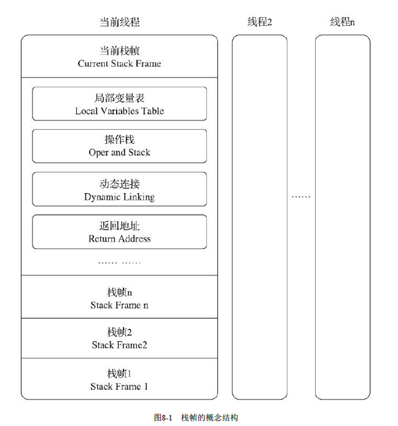

Java虚拟机栈属于线程私有的，是方法执行的最基本的执行单元

栈中保存的是一个个的栈帧（Stack Frame），栈帧是JVM进行方法调用和执行背后的数据结构，栈帧中保存了方法了局部变量表、操作数栈、动态链接和方法返回地址等信息。

每一个方法从调用开始至执行结束的过程，都对应着一个栈帧在虚拟机里面从入栈到出栈的过程。

一个栈帧需要分配多少内存，在编译期就决定了。不会受到运行时变量数据的影响。

只有栈顶的栈帧是出于运行状态的，也称这个栈帧为当前栈帧（Current Stack Frame）

### 栈帧结构



#### 局部变量表

局部变量表（Local Variables Table）是一组变量值的存储空间，用于存放方法参数和方法内部定义的局部变量。

局部变量表的容量以变量槽（Variable Slot）为最小单位

为了尽可能节省栈帧耗用的内存空间，局部变量表中的变量槽是可以重用的，方法体中定义的变量，其作用域并不一定会覆盖整个方法体，如果当前字节码PC计数器的值已经超出了某个变量的作用域，那这个变量对应的变量槽就可以交给其他变量来重用。不过，这样的设计除了节省栈帧空间以外，还会伴随有少量额外的副作用，例如在某些情况下变量槽的复用会直接影响到系统的垃圾收集行为。

```java
//代码清单8-1　局部变量表槽复用对垃圾收集的影响之一
public static void main(String[] args)() {
	byte[] placeholder = new byte[64 * 1024 * 1024];
	System.gc();
}
```


代码清单8-1中的代码很简单，向内存填充了64MB的数据，然后通知虚拟机进行垃圾收集。我们在虚拟机运行参数中加上“-verbose：gc”来看看垃圾收集的过程，发现在System.gc()运行后并没有回收掉这64MB的内存，下面是运行的结果：

```java
[GC 66846K->65824K(125632K), 0.0032678 secs]
[Full GC 65824K->65746K(125632K), 0.0064131 secs]
```

代码清单8-1的代码没有回收掉placeholder所占的内存是能说得过去，因为在执行`System.gc()`时，变量placeholder还处于作用域之内，虚拟机自然不敢回收掉placeholder的内存。那我们把代码修改一下，变成代码清单8-2的样子。

```java
//代码清单8-2　局部变量表Slot复用对垃圾收集的影响之二
public static void main(String[] args)() {
	{
		byte[] placeholder = new byte[64 * 1024 * 1024];
	}
	System.gc();
}
```

加入了花括号之后，placeholder的作用域被限制在花括号以内，从代码逻辑上讲，在执行
`System.gc()`的时候，placeholder已经不可能再被访问了，但执行这段程序，会发现运行结果如下，还是有64MB的内存没有被回收掉，这又是为什么呢？

```java
[GC 66846K->65888K(125632K), 0.0009397 secs]
[Full GC 65888K->65746K(125632K), 0.0051574 secs]
```


在解释为什么之前，我们先对这段代码进行第二次修改，在调用System.gc()之前加入一行`int a=0；`，变成代码清单8-3的样子。

```java
//代码清单8-3　局部变量表Slot复用对垃圾收集的影响之三
public static void main(String[] args)() {
	{
		byte[] placeholder = new byte[64 * 1024 * 1024];
	}
	int a = 0;
	System.gc();
}
```


这个修改看起来很莫名其妙，但运行一下程序，却发现这次内存真的被正确回收了：

```java
[GC 66401K->65778K(125632K), 0.0035471 secs]
[Full GC 65778K->218K(125632K), 0.0140596 secs]
```


代码清单8-1至8-3中，placeholder能否被回收的根本原因就是：局部变量表中的变量槽是否还存有关于placeholder数组对象的引用。

第一次修改中，代码虽然已经离开了placeholder的作用域，但在此之后，再没有发生过任何对局部变量表的读写操作，placeholder原本所占用的变量槽还没有被其他变量所复用，所以作为GC Roots一部分的局部变量表仍然保持着对它的关联。这种关联没有被及时打断，绝大部分情况下影响都很轻微。

但如果遇到一个方法，其后面的代码有一些耗时很长的操作，而前面又定义了占用了大量内存但实际上已经不会再使用的变量，手动将其设置为null值（用来代替那句`int a=0`，把变量对应的局部变量槽清空）便不见得是一个绝对无意义的操作，这种操作可以作为一种在极特殊情形（对象占用内存大、此方法的栈帧长时间不能被回收、方法调用次数达不到即时编译器的编译条件）下的“奇技”来使用。

#### 操作数栈

操作数栈（Operand Stack）也常被称为操作栈，它是一个后入先出（Last In First Out，LIFO）栈。

方法执行过程中，会有各种字节码指令向操作数栈中写入和提取内容，也就是出栈和入栈操作。如`a + b`就会将`a、b`一次压入栈，再调用加法指令来进行操作数相加的操作。

两个操作数的类型一定是相同的并且符合运算指令的，如果两个操作数分别是long和float，那么久不能使用加法指令。

操作数栈只是用来计算，计算后的变量会被放到局部变量表中

#### 动态连接

所有线程共享的方法区中含有一块常量池，包含的内容如下

- 类和接口的全限定名
- 字段名称和描述符
- 方法名称和描述符

每个栈帧都包含一个指向运行时常量池中该栈帧所属方法的引用

也就是在运行期间栈帧可以动态的从常量池中找类方法

#### 方法返回地址

调用当前方法的方法成为调用者或主调方法

一般来说方法有两种方式退出，一种是执行完毕正常退出有返回值，一种是发生异常退出没有返回值。

无论是哪种方法退出，被调用方法退出后都会返回到调用者的位置。

一般来说，方法正常退出时，主调方法的PC计数器的值就可以作为返回地址，栈帧中很可能会保存这个计数器值。而方法异常退出时，返回地址是要通过异常处理器表来确定的，栈帧中就一般不会保存这部分信息。

方法退出的过程实际上等同于把当前栈帧出栈，因此退出时可能执行的操作有：恢复上层方法的局部变量表和操作数栈，把返回值（如果有的话）压入调用者栈帧的操作数栈中，调整PC计数器的值以指向方法调用指令后面的一条指令等。

#### 附加信息

《Java虚拟机规范》允许虚拟机实现增加一些规范里没有描述的信息到栈帧之中，例如与调试、
性能收集相关的信息，这部分信息完全取决于具体的虚拟机实现，这里不再详述。在讨论概念时，一
般会把动态连接、方法返回地址与其他附加信息全部归为一类，称为栈帧信息。

### 方法调用

方法调用并不等同于方法的执行，方法调用的唯一任务就是确定被调用方法的版本

版本指的就是该方法是哪一个类的方法（由于Java的多态和继承的特性，不同的类会针对同一个方法进行重写）。

然后。。调不明白了 - -