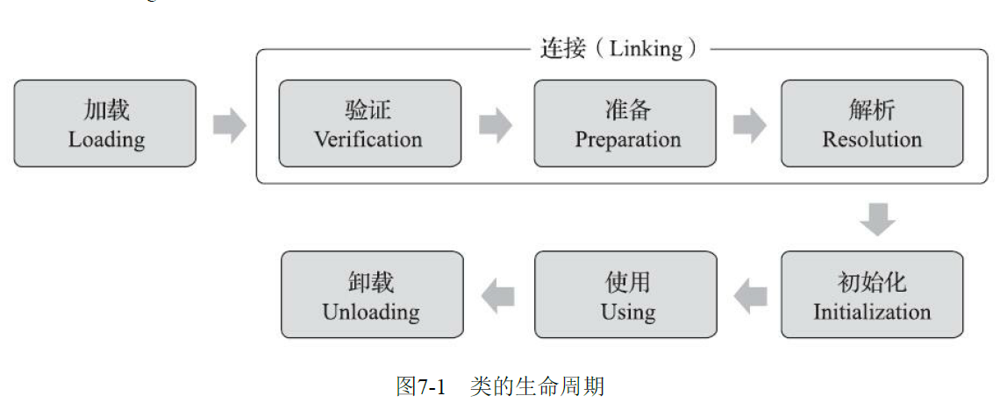
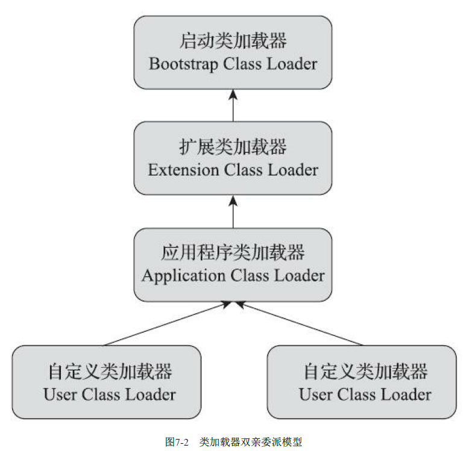

Java虚拟机把描述类的数据从Class文件加载到内存，并对数据进行校验、转换解析和初始化，最终形成可以被虚拟机直接使用的Java类型，这个过程被称作虚拟机的类加载机制。

Java采用运行时加载（懒加载）的方式，所以可以实现程序运行后再从网络上加载类这样的操作~

### 类加载的时机

**note：**类变量(static variable)和static语句块会在类加载阶段就分配内存，和类的元信息一起分配到[方法区](运行时内存区域)上，类变量在初始化阶段才会赋值。

一个类型从被加载到虚拟机内存中开始，到卸载出内存为止，它的整个生命周期将会经历加载（Loading）、验证（Verification）、准备（Preparation）、解析（Resolution）、初始化（Initialization）、使用（Using）和卸载（Unloading）七个阶段，其中验证、准备、解析三个部分统称为连接（Linking）。这七个阶段的发生顺序如图所示。



#### 加载

加载是整个类加载的第一个阶段，JVM会完成以下三件事情

> 1. 通过一个类的全限定类名来获取此类的二进制字节流
>
>    > 可以从任意地方获取，如压缩文件、网络
>
> 2. 将这个字节流所代表的静态存储结构转化为**方法区**的运行时数据结构
>
> 3. 在内存中生成一个代表这个类的`java.lang.Class`对象，作为方法区这个类的各种数据的访问入口
>
>    > HotSpot会将这个Class对象放到方法区中而不是堆上，Java8后存放在堆上

#### 验证

验证是连接阶段的第一步，这一阶段的目的是确保Class文件的字节流中包含的信息符合《Java虚拟机规范》的全部约束要求，保证这些信息被当作代码运行后不会危害虚拟机自身的安全。

#### 准备

准备阶段是正式为类中定义的变量（即静态变量，被static修饰的变量）分配内存并设置类变量**初始值（默认值）**的阶段.

从概念上讲，这些变量所使用的内存都应当在方法区中进行分配，但必须注意到方法区本身是一个逻辑上的区域，在JDK 7及之前，HotSpot使用永久代来实现方法区时，实现是完全符合这种逻辑概念的；而在JDK 8及之后，类变量则会随着Class对象一起存放在Java堆中，这时候“类变量在方法区”就完全是一种对逻辑概念的表述了。

关于准备阶段，还有两个容易产生混淆的概念笔者需要着重强调，首先是这时候进行内存分配的**仅包括类变量(static variable)，而不包括实例变量**，实例变量将会在对象实例化时随着对象一起分配在Java堆中。其次是这里所说的初始值“通常情况”下是数据类型的零值，假设一个类变量的定义为：`public static int value = 123;`

变量value在准备阶段过后的初始值为0而不是123，因为这时尚未开始执行任何Java方法，而把value赋值为123的putstatic指令是程序被编译后，存放于类构造器<clinit>()方法之中，所以把value赋值为123的动作要到类的初始化阶段才会被执行

#### 解析

解析阶段是Java虚拟机将常量池内的符号引用替换为直接引用的过程

- 符号引用（Symbolic References）：符号引用以一组符号来描述所引用的目标，符号可以是任何形式的字面量，只要使用时能无歧义地定位到目标即可。符号引用与虚拟机实现的内存布局无关，引用的目标并不一定是已经加载到虚拟机内存当中的内容。各种虚拟机实现的内存布局可以各不相同，但是它们能接受的符号引用必须都是一致的，因为符号引用的字面量形式明确定义在《Java虚拟机规范》的Class文件格式中。
- 直接引用（Direct References）：直接引用是可以直接指向目标的指针、相对偏移量或者是一个能间接定位到目标的句柄。直接引用是和虚拟机实现的内存布局直接相关的，同一个符号引用在不同虚拟机实例上翻译出来的直接引用一般不会相同。如果有了直接引用，那引用的目标必定已经在虚拟机的内存中存在。

#### 初始化

类的初始化阶段是类加载过程的最后一个步骤，之前介绍的几个类加载的动作里，除了在加载阶段用户应用程序可以通过自定义类加载器的方式局部参与外，其余动作都完全由Java虚拟机来主导控制。直到初始化阶段，Java虚拟机才真正开始执行类中编写的Java程序代码，将主导权移交给应用程序。

进行准备阶段时，变量已经赋过一次系统要求的初始零值，而在初始化阶段，则会根据程序员通过程序编码制定的主观计划去初始化类变量和其他资源。我们也可以从另外一种更直接的形式来表达：初始化阶段就是执行类构造器`<clinit>()`方法的过程。`<clinit>()`并不是程序员在Java代码中直接编写的方法，它是Javac编译器的自动生成物，但我们非常有必要了解这个方法具体是如何产生的，以及`<clinit>()`方法执行过程中各种可能会影响程序运行行为的细节，这部分比起其他类加载过程更贴近于普通的程序开发人员的实际工作。

`<clinit>()`方法是由编译器自动收集类中的所有类变量(static variable)的赋值动作和静态语句块（static{}块）中的语句合并产生的，编译器收集的顺序是由语句在源文件中出现的顺序决定的，静态语句块中只能访问到定义在静态语句块之前的变量，定义在它之后的变量，在前面的静态语句块可以赋值，但是不能访问。

如代码清单7-5所示。

```java
//代码清单7-5　非法前向引用变量
public class Test {
	static {
		i = 0; // 给变量复制可以正常编译通过
		System.out.print(i); // 这句编译器会提示“非法向前引用”
	}
static int i = 1;
}
```

`<clinit>()`方法与类的构造函数（即在虚拟机视角中的实例构造器`<init>()`方法）不同，它不需要显式地调用父类构造器，Java虚拟机会保证在子类的`<clinit>()`方法执行前，父类的`<clinit>()`方法已经执行完毕。

因此在Java虚拟机中第一个被执行的`<clinit>()`方法的类型肯定是`java.lang.Object`。
·由于父类的`<clinit>()`方法先执行，也就意味着父类中定义的静态语句块要优先于子类的变量赋值操作，如代码清单7-6中，字段B的值将会是2而不是1。

```java
//代码清单7-6　<clinit>()方法执行顺序
static class Parent {
	public static int A = 1;
	static {
		A = 2;
	}
}

static class Sub extends Parent {
	public static int B = A;
}

public static void main(String[] args) {
	System.out.println(Sub.B);
}
```


`<clinit>()`方法对于类或接口来说并不是必需的，如果一个类中没有静态语句块，也没有对静态变量的赋值操作，那么编译器可以不为这个类生成`<clinit>()`方法。

接口中不能使用静态语句块，但仍然有变量初始化的赋值操作，因此接口与类一样都会生成`<clinit>()`方法。但接口与类不同的是，执行接口的`<clinit>()`方法不需要先执行父接口的`<clinit>()`方法，因为只有当父接口中定义的变量被使用时，父接口才会被初始化。此外，接口的实现类在初始化时也一样不会执行接口的`<clinit>()`方法。

Java虚拟机必须保证一个类的`<clinit>()`方法在多线程环境中被正确地加锁同步，如果多个线程同时去初始化一个类，那么只会有其中一个线程去执行这个类的`<clinit>()`方法，其他线程都需要阻塞等待，直到活动线程执行完毕`<clinit>()`方法。如果在一个类的`<clinit>()`方法中有耗时很长的操作，那就可能造成多个进程阻塞，在实际应用中这种阻塞往往是很隐蔽的。代码清单7-7演示了这种场景。

```java
//代码清单7-7　字段解析
static class DeadLoopClass {
	static {
// 如果不加上这个if语句，编译器将提示“Initializer does not complete normally”并拒绝编译
		if (true) {
			System.out.println(Thread.currentThread() + "init DeadLoopClass");
			while (true) {
			}
		}
	}
}
public static void main(String[] args) {
	Runnable script = new Runnable() {
		public void run() {
			System.out.println(Thread.currentThread() + "start");
			DeadLoopClass dlc = new DeadLoopClass();
			System.out.println(Thread.currentThread() + " run over");
		}
	};
	Thread thread1 = new Thread(script);
	Thread thread2 = new Thread(script);
	thread1.start();
	thread2.start();
}

//运行结果如下，一条线程在死循环以模拟长时间操作，另外一条线程在阻塞等待：
Thread[Thread-0,5,main]start
Thread[Thread-1,5,main]start
Thread[Thread-0,5,main]init DeadLoopClass
```


对于初始化阶段，《Java虚拟机规范》则是严格规定了有且只有六种情况必须立即对类进行“初始化”（而加载、验证、准备自然需要在此之前开始）：

1. 遇到new、getstatic、putstatic或invokestatic这四条字节码指令时，如果类型没有进行过初始化，则需要先触发其初始化阶段。能够生成这四条指令的典型Java代码场景有：

> - 使用new关键字实例化对象的时候。
> - 读取或设置一个类型的静态字段（被final修饰、已在编译期把结果放入常量池的静态字段除外）的时候。
> - 调用一个类型的静态方法的时候。

2. 使用java.lang.reflect包的方法对类型进行反射调用的时候，如果类型没有进行过初始化，则需要先触发其初始化。

3. 当初始化类的时候，如果发现其父类还没有进行过初始化，则需要先触发其父类的初始化。
4. 当虚拟机启动时，用户需要指定一个要执行的主类（包含main()方法的那个类），虚拟机会先
   初始化这个主类。
5. 当使用JDK 7新加入的动态语言支持时，如果一个java.lang.invoke.MethodHandle实例最后的解析结果为REF_getStatic、REF_putStatic、REF_invokeStatic、REF_newInvokeSpecial四种类型的方法句柄，并且这个方法句柄对应的类没有进行过初始化，则需要先触发其初始化。
6. 当一个接口中定义了JDK 8新加入的默认方法（被default关键字修饰的接口方法）时，如果有这个接口的实现类发生了初始化，那该接口要在其之前被初始化。

##### 不被初始化的例子

- 通过子类引用父类的静态字段，子类不会被初始化
- 通过数组定义来引用类
- 调用另一个类的常量，另一个类不会被初始化

### 类加载器

Java虚拟机设计团队有意把类加载阶段中的“通过一个类的全限定名来获取描述该类的二进制字节流”这个动作放到Java虚拟机外部去实现，以便让应用程序自己决定如何去获取所需的类。实现这个动作的代码被称为“类加载器”（Class Loader）。

#### JVM默认采用双亲委派模型来调用加载器

站在Java虚拟机的角度来看，只存在两种不同的类加载器：一种是启动类加载器（Bootstrap ClassLoader），这个类加载器使用C++语言实现，是虚拟机自身的一部分；另外一种就是其他所有的类加载器，这些类加载器都由Java语言实现，独立存在于虚拟机外部，并且全都继承自抽象类`java.lang.ClassLoader`。

##### 三种类加载器

1. 启动类加载器（Bootstrap Class Loader）

   > 负责加载存放在`<JAVA_HOME>/lib`目录并且能被JVM识别的类库。将他们都加载到JVM的内存中

2. 扩展类加载器（Extension Class Loader）

   > 这个类加载器是在类`sun.misc.Launcher$ExtClassLoader`中以Java代码的形式实现的。它负责加载`<JAVA_HOME>\lib\ext`目录中，或者被`java.ext.dirs`系统变量所指定的路径中所有的类库。根据“扩展类加载器”这个名称，就可以推断出这是一种Java系统类库的扩展机制，JDK的开发团队允许用户将具有通用性的类库放置在ext目录里以扩展Java SE的功能，在JDK9之后，这种扩展机制被模块化带来的天然的扩展能力所取代。由于扩展类加载器是由Java代码实现的，开发者可以直接在程序中使用扩展类加载器来加载Class文件。

3. 应用程序加载器（Application Class Loader）

   > 这个类加载器由`sun.misc.Launcher$AppClassLoader`来实现。由于应用程序类加载器是`ClassLoader`类中的`getSystem-ClassLoader()`方法的返回值，所以有些场合中也称它为“系统类加载器”。它负责加载用户类路径（ClassPath）上所有的类库，开发者同样可以直接在代码中使用这个类加载器。如果应用程序中没有自定义过自己的类加载器，一般情况下这个就是程序中默认的类加载器。



如果一个类加载器收到了类加载的请求，它首先不会自己去尝试加载这个类，而是把这个请求委派给父类的加载器完成，每个层次都是如此。当加载请求传送到顶层时还无法加载时就在向下传递，然后下面的加载器才开始一次尝试加载。

也就是递归的加载，递归出口就是无法加载，从里面一层一层的向外尝试加载。

使用双亲委派模型来组织类加载器之间的关系，一个显而易见的好处就是Java中的类随着它的类加载器一起具备了一种带有优先级的层次关系。

例如类`java.lang.Object`，它存放在`rt.jar`之中，无论哪一个类加载器要加载这个类，最终都是委派给处于模型最顶端的启动类加载器进行加载，因此Object类在程序的各种类加载器环境中都能够保证是同一个类。

反之，如果没有使用双亲委派模型，都由各个类加载器自行去加载的话，如果用户自己也编写了一个名为`java.lang.Object`的类，并放在程序的ClassPath中，那系统中就会出现多个不同的Object类，Java类型体系中最基础的行为也就无从保证，应用程序将会变得一片混乱。如果读者有兴趣的话，可以尝试去写一个与rt.jar类库中已有类重名的Java类，将会发现它可以正常编译，但永远无法被加载运行。