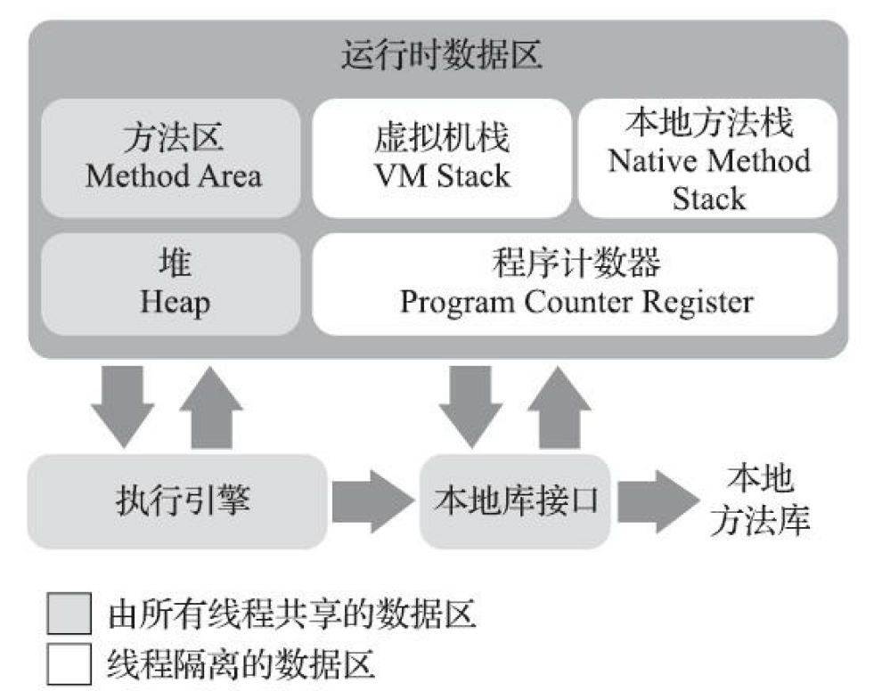
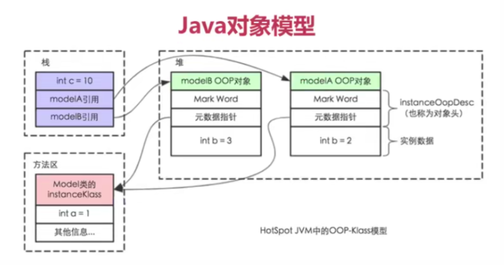
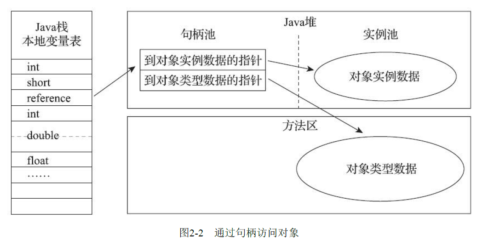
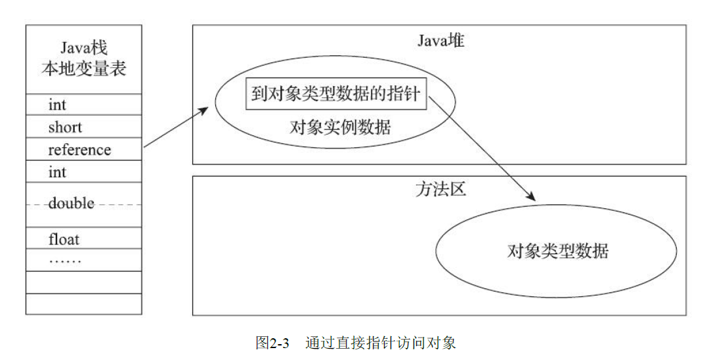

## JVM内存模型

### 程序计数器（线程私有）

当前线程所执行的字节码的行号指示器

拥有了这个指针，那么在线程切换时就能知道上次执行到哪里了

如果执行的是一个native方法，那么这个计数器的值应该为空

### Java虚拟机栈（线程私有）

[详细描述](栈帧结构.md)

虚拟机栈描述的是java方法执行的线程内存模型。每个方法被执行的时候JVM都会创建一个栈帧（Stack Frame）来存储局部变量表、操作数栈、动态连接、方法出口等信息。

每一个方法被调用直至执行完毕的过程，就对应着一个栈帧在虚拟机栈中从入栈到出栈的过程。

### 本地方法栈（线程私有）

与虚拟机栈唯一的区别就是虚拟机栈执行java方法，本地方法栈执行native方法

### Java堆（线程共享）

堆存在的唯一意义就是存放实例对象。

堆是垃圾收集的主要区域，因此称堆为“GC堆”（Garbage Collected Heap）。

所有线程共享的堆中可以划分出多个线程私有的分配缓冲区（Thread Local Allocation Buffer, TLAB）。这是为了防止在使用指针碰撞的方式分配堆内存时多个线程同时申请了同一块区域。有了缓冲区，其他线程是看不到另一个线程的这个区域的（虽然这个缓冲区也算是共享的），所以不会分配成同一块空间。

### 方法区（线程共享）

存储已经被虚拟机加载的类信息、常量、静态变量、类方法等数据。

方法区包含有运行时常量池

> Class文件中除了有类的版本、字段、方法、接口等描述信息外，还有一项信息是常量池表（Constant Pool Table），用于存放编译期生成的各种字面量与符号引用，这部分内容将在类加载后存放到方法区的运行时常量池中。

### 直接内存

在JDK 1.4中新加入了NIO（New Input/Output）类，引入了一种基于通道（Channel）与缓冲区（Buffer）的I/O方式，它可以使用Native函数库直接分配堆外内存，然后通过一个存储在Java堆里面的DirectByteBuffer对象作为这块内存的引用进行操作。这样能在一些场景中显著提高性能，因为避免了在Java堆和Native堆中来回复制数据。

显然，本机直接内存的分配不会受到Java堆大小的限制，但是，既然是内存，则肯定还是会受到本机总内存（包括物理内存、SWAP分区或者分页文件）大小以及处理器寻址空间的限制，一般服务器管理员配置虚拟机参数时，会根据实际内存去设置-Xmx等参数信息，但经常忽略掉直接内存，使得各个内存区域总和大于物理内存限制（包括物理的和操作系统级的限制），从而导致动态扩展时出现OutOfMemoryError异常。

## Java对象模型

### 对象的创建

当Java虚拟机遇到一条字节码new指令时，首先将去检查这个指令的参数是否能在常量池中定位到一个类的符号引用，并且检查这个符号引用代表的类是否已被加载、解析和初始化过。如果没有，那必须先执行相应的类加载。

#### 类加载会经历以下阶段

> 1. 加载二进制流，将字节流转换为方法区的运行时数据结构，生成`java.lang.Class`对象
>
> 2. 验证Class文件是否符合Java虚拟机规范，防止恶意代码
>
> 3. 为类中定义的静态变量分配内存并设置初始值（初始值由JVM决定，这里还没有到运行用户代码的阶段）
>
> 4. 将方法区内常量池内的符号引用替换为直接引用
>
>    > 直接引用是实实在在的指向，此时引用的目标已经存在在内存中
>    >
>    > 直接引用包括直接指向目标的指针或通过句柄间接指向目标
>
> 5. 这时虚拟机开始执行用户所编写的java代码。初始化用户定义的变量值。调用类构造器`<clinit>`方法。
>
>    > `<clinit>()`方法并不是用户编写的，它是由虚拟机生成的。该方法内包含了用户定义的所有类变量的**赋值动作和静态代码块**
>    >
>    > 虚拟机可以保证，在子类的`<clinit>()`方法执行前，它父类的`<clinit>()`方法一定已经执行完毕。而我们编写的程序构造函数都显示的使用了`super()`
>    >
>    > 由于父类的`<clinit>`方法最先调用，所以子类可以直接使用父类的静态变量或静态代码块中的变量

类加载完成后虚拟机将会为新实例对象分配堆内存（一般的会分配到Eden区，大对象可能会直接到老年代中）

接下来，JVM还要对对象进行必要的设置。例如这个对象是哪个类的实例、如何才能找到
类的元数据信息、对象的哈希码（实际上对象的哈希码会延后到真正调用Object::hashCode()方法时才计算）、对象的GC分代年龄等信息。这些信息存放在对象的对象头（Object Header）之中。

接下来就会执行用户所编写的构造方法了~

自此，一个完整的新实例对象就被创建出来了

### 对象的访问定位

我们栈中的方法访问引用对象时是怎么定位到对上的具体实例的呢

栈帧中的本地变量表中存放的都是方法的参数和方法内定义的局部变量

局部变量如果是引用类型的话就需要进行对象的定位~

**有两种方式**

1. 使用句柄间接的访问

   > java堆中将会会分出一块内存来作为句柄池
   >
   > 引用变量的指针指向句柄池的地址；句柄池中包含有实例的地址和存放于方法区中的类信息的地址
   >
   > 

2. 直接指针访问

   > 直接指向实例对象的地址
   >
   > 但是这种方式应该在实例对象头中保存一个指向方法区中该实例所属类的元数据指针
   >
   > 

HotSpot就是采用了直接指针的方式~