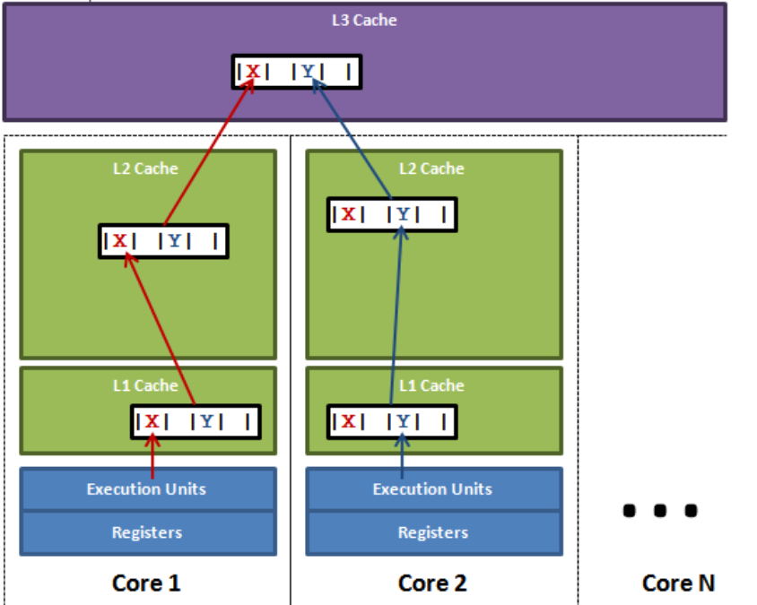

**伪共享的非标准定义为：缓存系统中是以缓存行（cache line）为单位存储的，当多线程修改互相独立的变量时，如果这些变量共享同一个缓存行，就会无意中影响彼此的性能，这就是伪共享。**

# Cache line

- 缓存系统中是以缓存行（Cache line）为单位存储的，lineSize通常是64字节，从主存向Cache复制数据都是以lineSize为单位传输的。并且它有效地引用主内存中的一块地址（一般是组相联）
- 一个Java的Long类型是8字节，因此在一个缓存行中可以存放8个long类型的变量（lineSize为64Byte）。所以，如果你访问一个long数组，当数组中的一个值被加载到缓存中，它会额外加载另外 7 个，以致你能非常快地遍历这个数组。事实上，你可以非常快速的遍历在连续的内存块中分配的任意数据结构。而如果你在数据结构中的项在内存中不是彼此相邻的（如链表），你将得不到免费缓存加载所带来的优势，并且在这些数据结构中的每一个项都可能会出现缓存未命中。

# MESI协议

当一个核心去读取另一个核心的数据时，需要通过一种状态判断该cache line是否是脏行--`M`状态

*[MESI动画](https://www.scss.tcd.ie/Jeremy.Jones/VivioJS/caches/MESI.htm)**

**MESI四个状态，对于数据的访问是以缓存行为单位的：**

- M（修改，Modified）：本地处理器已经修改缓存行，即是脏行，它的内容与内存中的内容不一样，并且此 cache 只有本地一个拷贝(专有)
- E（专有，Exclusive）：缓存行内容和内存中的一样，而且其它处理器都没有这行数据或者无效
- S（共享，Shared）：缓存行内容和内存中的一样, 有可能其它处理器也存在此缓存行的拷贝
- I（无效，Invalid）：缓存行失效, 不能使用

**状态转换过程（处理器C1、C2）：**

- 初始时，由于没有加载任何数据所有缓存行都为 `I`

- **Local Write：**`C2`核心没加载该缓存行，那么如果`C1`写数据至处于`I`状态的缓存行，则缓存行的状态变为`M`。此时该行的内容只在`C1`更改，并不会更新到内存，即脏行。

- **Local Read：**如果`C1`读处于`M`状态的缓存行，那么直接读就好；

  如果`c1`读处于`I`状态的缓存行，分两种情况：

  - `c2`此行也为`I`，也就是没该行数据，那么`c1`直接从内存读并将该行标记为`E`，表示独有该行
  - `c2`此时为`E`，那么将两个处理器该行都标记为`S`。特别的如果`c2`是`M`那么也会将数据更新到内存，此操作对应于Remote Read。

- **Remote Read：**对应于Local Read的`c2`为`M`的情况，懒得重复写了。特别的将数据更新回内存后`c1`再从内存读数据太慢了。所以有了MOESI协议~，可以允许CPU cache间直接同步数据。

- **Remote Write：**

  - `c1`读取的缓存行在`c2`中是非`I`状态，也就是`c2`已经拥有该行
  - 此时`c1`将发出一个RFO（Request For Owner）请求，请求后`c1`将独占该行 (`E`)，此时`c2`中的该行状态为`I`。
  - 这保证了数据的安全，同时处理 RFO 请求以及设置I的过程将给写操作带来很大的性能消耗。

**程序运行时发送RFO请求的情况：**

- 线程的工作从一个处理器移到另一个处理器，此时另一个处理器操作这些缓存行都会触发RFO请求将该处理器的缓存行都置为`I`
- 两个不同的处理器都需要操作相同的缓存行

# False Sharing



Core1想要操作X，Core2想要操作Y，但是这两个操作的变量都在同一个cache line中。两个线程改一次变量的值就会发送一次RFO，占用此缓存行的拥有权。

表面上 X 和 Y 都是被独立线程操作的，而且两操作之间也没有任何关系。只不过它们共享了一个缓存行，但所有竞争冲突都是来源于共享。

# 局部性

举个栗子（二维数组求和）：

```c
int sum_array_rows(int a[M][N]){
    int i, j, sum = 0;
    
    for (i = 0; i < M; i++){
        for (j = 0; j < N; J++){
            sum += a[i][j];
        }
    }
```

- 由于二维数组在内存中是以行优先的形式存储的，所以一行一行读取可以保证空间局部性（在内存中是连续的）。
- 反过来`sum = a[j][i]`就会慢很多（跳着读）
- sum一个变量反复使用，满足时间局部性

# 主存与Cache的映射方案

Cache块 = Cache line，这里是为了容易看懂说成了Cache块，也就是：下面说的2路组相联（2-way set associative）每组有两块的意思是每组有两行（Cache line）

## 直接映射

- 主存的一个块只能映射到Cache的某一个特定块中。如：映射函数为`c = m % 6`

- 那么第0块和第6块都只能映射到Cache中的第0块上
- 此时如果一个程序需要反复用到主存的第0块和第6块，那么这两个块就会在Cache中反复被对方覆盖，尽管Cache中其他地方仍是空着的。大大降低了缓存命中率

## 全相联映射

- 主存中任意一块都可以映射到Cache中的任何一块位置上

- Cache利用率高、块冲突率低，只要淘汰Cache中某一块就能调入内存中的任一块
- 但于Cache比较电路的设计和实现比较困难，这种方式只适合于**小容量**Cache采用
- 当寻找一个地址是否已经被cache时，需要遍历每一个cache line来寻找，代价很高

## 组相联映射

- 主存和Cache都分组
- 主存中的各块与Cache的组号之间有固定的映射关系（全相联），但可以自由映射到Cache组中的任意一块
- 为了使主存中每组内的块数与Cache的组数相对应，如采用2路组相联：
  - 假如主存容量为1MB，每块大小是2^9B，被分为了2048块。Cache容量是8KB，每块容量也是2^9B，被分为了16块
  - 2路组相联意味着Cache每组有2块，也就是被分为了8组
  - 那么主存的每组内的块数就是8块
  - 那么主存被分为了2048/8=256组
  - 
  - 主存中以8块为一组，每一块都直接映射到Cache中的每一组
  - 此时如主存中的第0组的第0块和第1组的第8块都会被直接映射到Cache中的第0组，Cache的组内采用全相联映射-可随意映射到Cache第0组的第0块或者第1块

