**内存模型的意义：**如果没有内存模型那么在不同处理器上运行同一段程序的结果会是不一样的，这样就算程序中做了并发安全措施也无法保证所有类型处理器都能并发安全。所以我们需要一个标准来让多线程运行的结果可预期。


**从Java代码到运行：**javac编译a.java = 》 a.class字节码文件。JVM会将字节码文件翻译成机器码。

#### 三兄弟

> ##### JVM内存结构
>
> > 和Java虚拟机的运行时区域有关
> >
> > 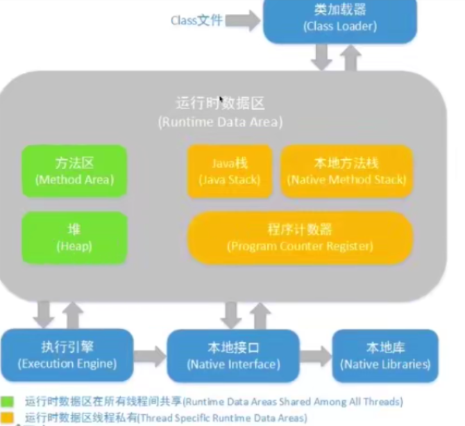
> >
> > **堆：**通过new或其他方法创建的实例对象。运行时动态分配。也被称为GC堆
> >
> > **java栈/虚拟机栈（VM stack）：**栈中是以栈帧为单位存储的。每一个栈帧对应一个未运行完的函数，栈帧中还会有记录函数信息的区域。
> >
> > > 一个函数调用另一个函数就会产生一个对应的栈帧，所以递归很容易栈溢出。
> > >
> > > 另外栈帧中存放有一个局部变量表，表中存有方法参数和局部变量。如果定义的局部变量过多也会导致帧过大然后导致栈溢出
> >
> > **方法区：**存储的是类方法、static变量、类信息、常量信息。
> >
> > > 运行时常量池：是方法区的一部分，Class文件中除了有类的版本、字段、方法、接口等描述信息外，还有一项信息就是常量池表（Constant Pool Table），用于存放编译器生成的各种字面量（字符串）与符号引用，这部分内容将在类加载后放到方法区的运行时常量池中。
> >
> > **本地方法栈：**保存native相关方法栈。
> >
> > **程序计数器：**保存当前线程执行到的字节码行号
>
> ##### Java内存模型（JMM）
>
> > 和Java并发编程有关
> >
> > C语言不存在内存模型的概念，所以C语言依赖于处理器，不同处理器运行结果不同
> >
> > Java拥有内存模型所以在不同处理器上运行结果都相同
> >
> > 所以JMM是一种规范，需要各个JVM的实现来遵守JMM规范，以便开发者可以更方便的开发多线程程序
> >
> > JMM还是工具类和关键字（volatile、synnchronized、Lock）的底层实现原理和保障
> >
> > **JMM最重要的三点内容：具体内容见下方**
> >
> > > 重排序
> > >
> > > 可见性
> > >
> > > 原子性
>
> ##### Java对象模型
>
> > 和Java对象在虚拟机中的表现形式有关
> >
> > 栈中保存变量和引用，堆中保存对象
> >
> > 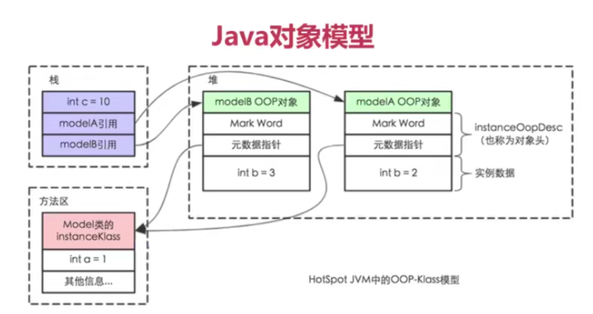
> >
> > JVM会给这个类创建一个instanceKlass，保存在方法区，用来在JVM层表示该类
> >
> > 当我们在Java代码中使用new创建一个对象的时候，JVM会创建一个instanceOopDesc对象，这个对象中包含了对象头以及实例数据
> >
> > **Header（对象头）**
> >
> > > 自身运行时数据（Mark Word）
> > >
> > > > 实例的哈希值、GC分代年龄（新生代、老年代）、线程持有的锁
> >
> > 类型指针：标明该实例属于哪个类
> >
> > **InstanceData：**实例属性
> > **Padding：**填充，一般的都将对象大小填充为8的整数倍

## 重排序

**重排序：**在某线程内部的两行代码执行顺序并不是严格按照从上至下顺序执行时就发生了重排序

```java
package jmm;

import java.util.concurrent.CountDownLatch;

public class OutOfOrderExecution {
    private static int x = 0, y = 0;
    private static int a = 0, b = 0;

    public static void main(String[] args) throws InterruptedException {
        int i = 0;
        for (; ;){
            i++;
            x = 0;
            y = 0;
            a = 0;
            b = 0;

            //为了让两个线程同时执行到wait的地方然后同一起点一起执行
            CountDownLatch latch = new CountDownLatch(1);

            Thread one = new Thread(()->{
                try {
                    latch.await(); //当countDown倒计时为0时await的线程才能继续向下执行
                } catch (InterruptedException e) {
                    e.printStackTrace();
                }
                a = 1;
                x = b;
            });

            Thread two = new Thread(()->{
                try {
                    latch.await();
                } catch (InterruptedException e) {
                    e.printStackTrace();
                }
                b = 1;
                y = a;
            });
            one.start();
            two.start();
            latch.countDown(); //减少倒计时

            one.join(); //主线程要等待子线程执行完后才能执行下面的语句
            two.join();

            String result = "第" + i + "次 (" + x + "," + y +")";
            if (x == 1 && y == 1){
                System.out.println(result);
                break;
            }else {
                System.out.println(result);
            }
        }
    }
}
//输出
..........
..........
第5865次 (1,0)
第5866次 (0,1)
第5867次 (0,1)
第5868次 (1,1)
```

这里通过一个循环来获取那个我们想要的小概率事件，这种方式值得用在一些同样的工作上。

在两个线程中，（`a = 1;` `x = b;`）（  `b = 1;`  `y = a;`） 这两组会以不同的顺序执行，所以x和y的值总是不可预知的。有以下三中情况

```java
a = 1; x = b; b = 1; y = a; //输出 (0,1)
b = 1; y = a; a = 1; x = b; //输出(1,0)
a = 1; b = 1; x = b; y = a; //输出(1,1)
```

最蛋疼的是，他有可能出现`x = 0; y = 0`。虽然程序的执行顺序就确定了要不就是先执行`a = 1`要不就先执行`b = 1`不可能先执行下面的代码。但是它 (0,0) 还是出现了

```java
if (x == 0 && y == 0){
                System.out.println(result);
                break;
            }else {
                System.out.println(result);
            }
//输出
.......
.......
第513次 (0,1)
第514次 (0,1)
第515次 (0,1)
第516次 (0,0)
```

可以看到第516就出现了(0,0)。这里发生了**重排序**

其中一种重排序就可能为：

```java
y = a; a = 1; x = b; b = 1; //x = 0; y = 0;
//按理说x,y的赋值不可能都先出现在a,b的赋值前
```

#### 重排序的好处

提高处理速度，重排序后能优化指令执行效率

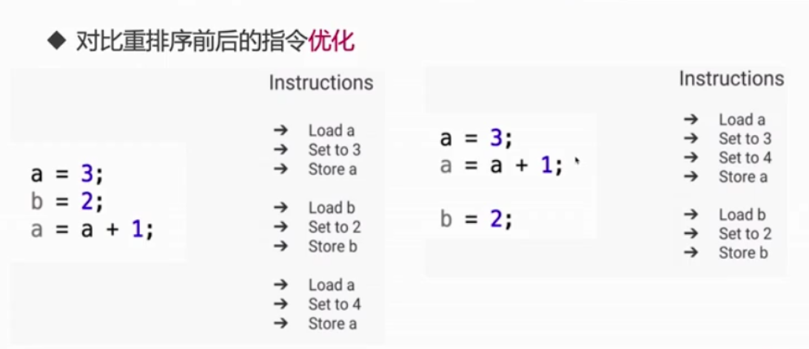

9行语句现在只需7行，如果程序中大量使用重排序那么指令的减少将是非常可观的

**哪里会发生重排序**

> 编译器优化：包括JVM，JIT编译器等
>
> CPU指令重排：就算编译器不发生重排序，CPU也可能对指令进行重排序
>
> 内存的 "重排序"：线程A对于内存的修改线程B看不到。

#### 解决重排序

当语句包含被volatile关键字修饰的变量，那么将不会进行重排序

## 可见性

```java
package jmm;

public class FieldVisibility {

    private int a = 1;
    private int b = 2;

    private void change(){
        a = 3;
        b = a;
    }

    private void print(){
        System.out.println("b=" + b + "," + "a=" + a);
    }

    public static void main(String[] args) {
        while (true){
            FieldVisibility test = new FieldVisibility();
            new Thread(()->{
                test.change();
            }).start();

            new Thread(()->{
                test.print();
            }).start();
        }
    }
}
//输出
.........
b=3,a=3
b=3,a=3
b=2,a=1
b=3,a=3
b=3,a=3
b=2,a=1
b=3,a=1
.........
```

**可以看到竟然输出了`b=3,a=1`。这说明线程一修改了a和b，但是线程二只看到了被修改后的b并没有看到修改后的a**

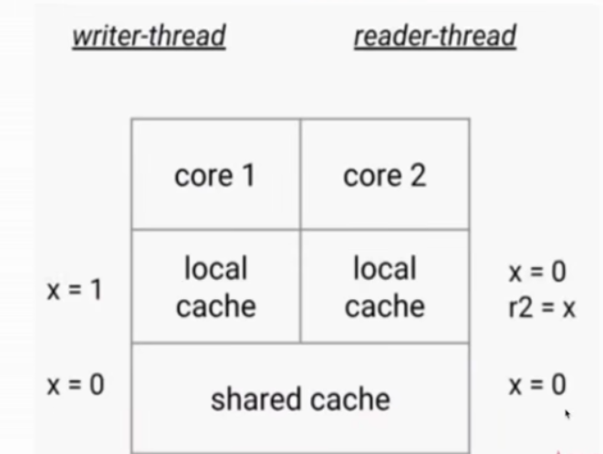

写线程拿到值后在自己的local cache中修改，线程二并看不到写线程修改的值，还是拿着旧的值来读。读线程感jio自己被蒙在鼓里

##### 用volatile来解决该问题

强制每一次读取的都是最新的值：

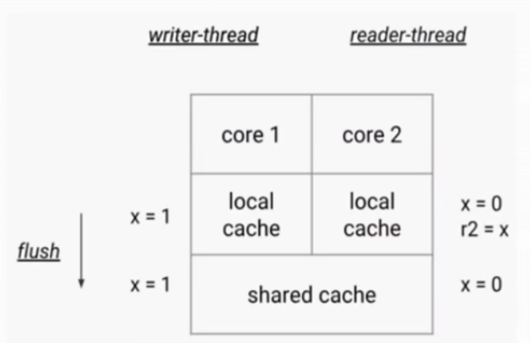

一旦写线程修改了被volatile标记的值那么就会立即刷新到共享内存中，所以每次读的都是最新的值

##### 为什么会有可见性问题

为了解决CPU与RAM速度非常不匹配的问题就出现了多级缓存

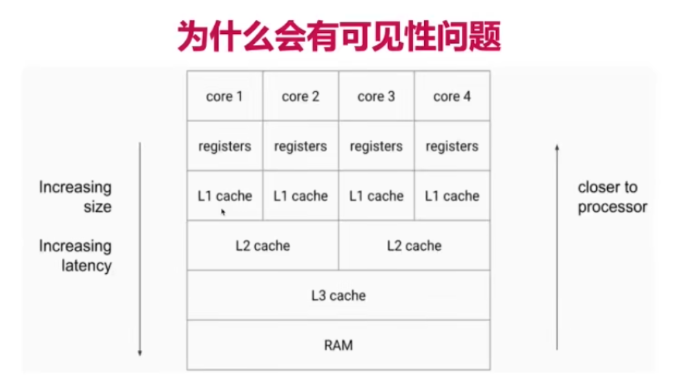

如果core4修改了L1的内容并同步到了右边的L2，但是左边的L2是从L3拿的值所以得不到最新的值。虽然他们都共享L3，但是L2层有可能就会出现分歧，导致core1和core4同一时刻处理同一个变量但是值都不同

- 如果所有核心都只用一个缓存，那么也就不存在内存可见性的问题
- 每个核心都会将自己需要的数据读到独占的缓存中，数据修改后也是写入到缓存中，然后等待输入到主存中。所以会导致有些核心读取的值是一个过期的值。

**所以出现了JMM来解决这一蛋疼的问题**

## 原子性

**原子性：**一些列的操作要么全部成功，要么全部不成功，就像原子一样不可分割

如ATM取钱：扣账户余额 -》 输出现金 -》 扣ATM余额。这一系列操作不可分割

i++就不是原子性的，它可以分为三步，这三部可能会随意乱序

用`synchronized`包裹的代码块可以实现原子操作

#### Java中的原子操作有

- 除long、Double之外的基本类型的赋值操作：`int a = 1`
- 所有引用reference的赋值操作：`Cat a = Cat()`。**创建对象不是原子性的，一定只是赋值引用**
- `java.concurrent.Atomic.*`包中所有类的原子操作

#### long和double的原子性（32位JVM）

出于Java编程语言存储器模型的目的，对非易失性long或double值的单个写入被视为两次单独的写入。每个32位写一个，这可能导致线程从一次写入看到64位值的前32位是新的值而后32位是旧的值，这就有可能导致值混乱。

所以在**32**位JVM上`long`和`double`是线程不安全的。而在现在的**64**位JVM上却是原子的。

`volatile long/double values`的写入和读取始终是原子的

实际开发中不用额外考虑，现在的虚拟机已经对long和double进行自动原子化了

## JMM内存模型的抽象

##### 什么是主内存和本地内存（工作内存）

- Java作为高级语言，屏蔽了这些底层细节，用JMM定义了一套读写内存数据的规范，虽然我们不再需要关心一级缓存和二级缓存的问题，但是JMM抽象了主内存和本地内存的概念
- 本地内存：独有的那一小块；  主内存：共享的那一大块
- 这里说的本地内存并不是真的是一块给每个线程分配的内存，而是JMM的一个抽象，是对于寄存器、一级缓存、二级缓存等的抽象。使我们表面上只看到它是一块本地内存而不用关心其他。
- 也不能只抽象为一种包含所有模块（缓存、主存）的内存，那么就浪费了CPU的缓存机制

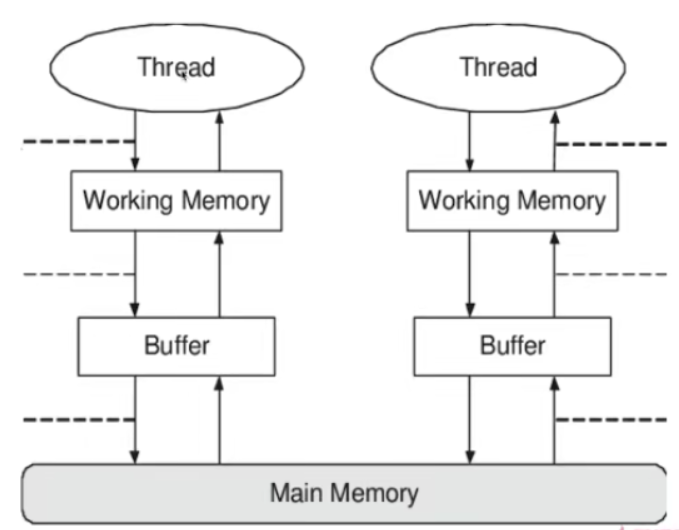

由于JMM的存在，我们就只需要关心主内存和本地内存之间的矛盾。

##### JMM有以下规定

- 所有的变量都存储在主内存中，同时每个线程也有自己独立的工作内存，工作内存中的变量内容是主内存中的拷贝
- 线程不能直接读写主内存中的变量，而是只能操作自己工作内存中的变量，然后再同步到主内存中
- 主内存是多个线程所共享的，但线程间不共享工作内存，如果线程间需要通信那么必须借助主内存中转来完成
- **JMM的 "缺陷"：**所有的共享变量存在于主内存中，每个线程都有自己的本地内存，而且线程读写共享数据也是通过本地内存交换的，所以才导致了可见性问题（写线程修改自己的变量副本还没写入到主内存读线程就读取了主内存中写线程还没来得及写回的"旧"变量）。

## Happens-Before

#### 什么是Happens-Before

- 第一种解释：Happes-Before规则是用来解决可见性问题的：在时间上，动作A发生在动作B之前，B保证能看见A，这就是Happens-Before
- 第二种解释：两个操作可以用Happens-Before来确定他们的执行顺序：如果一个操作Happens-Before于另一个操作，那么我们说第一个操作对于第二个操作是可见的
- 在上面的可见性标题下，就发生了可见性的问题。线程二可能获取不到线程一修改的内容或只能获取到部分内容。那么这个程序就不满足Happens-Before原则。后面的看不到前面修改的内容这还得了。。。
- 一旦加了volatile关键字就会具备Happens-Before原则了

#### Happends-Before规则

下面是Java中设计好的先行发生关系，不需要我们再关注是否同步，直接码代码就行~

##### 1. 单线程规则

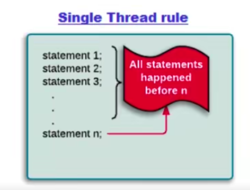

**保证：**

语句n一定能看到前面所有语句做了什么。也就是顺序执行。

多线程情况下也是一样，B线程一定能看到A线程已经执行的语句结果

发生重排序了，那么按照重排序后的顺序顺序执行

##### 2.锁操作

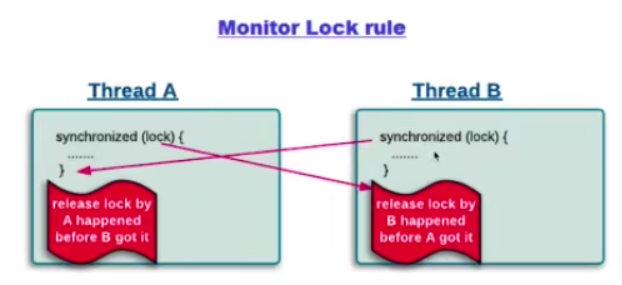

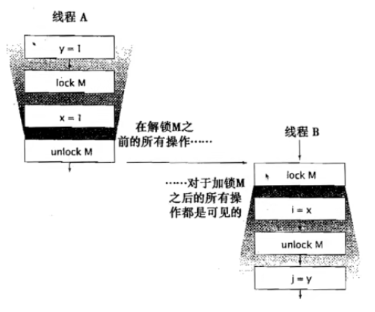

线程B可以看到线程A加锁后做的所有操作（如修改的变量）。

##### 3.volatile变量

写入的内容一定能被另一个线程读取到最新的值。写线程中的变量不论何时都是对读线程是可见的。

修改上面的可见性代码：

```java
   //使用volatile只修饰b
   //只要读到b是3了一定读的a也是3 。被volatile所修饰的变量之前的所有操作其他线程都是可见的
    private int a = 1;
    private volatile int b = 2;

    private void change(){
        a = 3;
        b = a;
    }

    private void print(){
        System.out.println("b=" + b + "," + "a=" + a);
    }
```

**近朱者赤：**给b加了volatile，不仅b被影响，也可以实现轻量级同步。只要线程B读到volatile修饰的变量，那么这个变量之前的所有操作结果线程B都可以读到。

> b之前的写入 (b = a)对于读取b之后的代码 (print b)都可见，所以在写线程里对a的赋值一定会对读线程可见。
>
> **所以这里的a即使不加volatile，只要b读到是3，就可以由Happens-Before原则保证了对于`b = a`以前的操作都是可见的。所以不可能再出现读到a的值是1的情况**

##### 4.线程启动

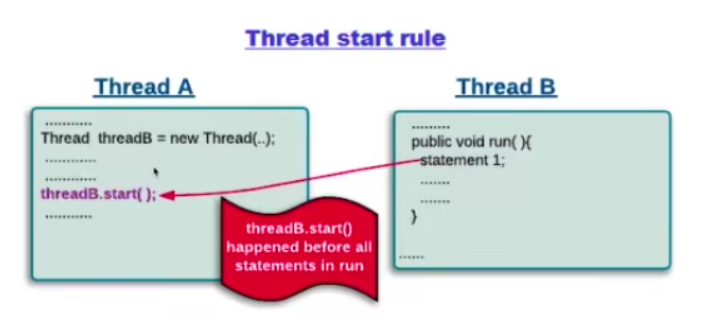

子线程启动后能够看到主线程的任何操作。一般不需要我们注意

##### 5.线程join

join：等我这个线程运行完再向下执行

join后面的语句都能够看到join的线程执行的所有操作

##### 6.传递性

从上至下每行代码都有顺序关系，后面的代码一定能看到前面的代码

##### 7.中断

一个线程被其他线程interrupt时，那么检测中断（isInterrupted）或者抛出InterruptedException一定能看到

##### 8.构造方法

对象构造方法的最后一行指令Happends-Before于`finalize()`方法的第一行指令

也就是`finalize()`方法能够完整的看到构造方法所有操作

##### 9.工具类的Happens-Before原则

> - 线程安全的容器get一定能看到在此之前put等存入动作
> - CountDownLatch
> - Semaphore：控制线程同步、互斥
> - Future
> - 线程池：提交的每个任务都可以看到这个任务之前的所有操作
> - CyclicBarrier