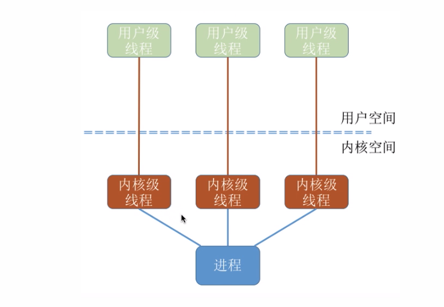

HotSpot虚拟机采用了1：1的用户线程与内核线程模型。



也就是一个用户线程就对应一个内核线程。

优点：当一个线程被阻塞后，别的线程还可以继续执行。并发能力强。多线程可以在多核处理机上并行执行

缺点：一个用户进程会占用多个内核级线程，线程的切换必须有操作系统完成，所以需要切换到内核态。因此线程管理的成本高，开销大

## 实现多线程的方式

一共有两种：

> 一种是继承Thread的子类并重写run方法
>
> 一种是实现Runnable接口的类并实现run方法（更好）
>
> > 通过Thread传入一个Runnable参数来启动线程，Thread中调用Runnable的run方法
> >
> > **Runnable为什么更好**
> >
> > > Thread类的角色应该是用来创建线程等线程的管理，而任务的执行我们需要通过Runnbale解耦，不能都绑到Thread类中
> > >
> > > 如果用Thread那么每执行一种任务就需要启动一个继承了Thread类并重写了run方法的thread。而如果用Runnable就可以使用一个Thread来启动不同的Runnable。线程池正式这样做的。
> > >
> > > Java不支持双继承
> > >
> > > Runnable可以实现多个相同的程序共享一个资源，而Thread也能够共享的原因是内部也是转型成了Runnable

**思考题**

> ```java
> public class BothRunnableThread{
>  public static void main(String[] args){
>      new Thread(new Runnable(){
>          public void run(){  //实现Runnable接口的run方法
>              System.out.println("come from Runnable");
>          }
>      }) {
>          @Override
>          public void run(){
>              System.out.println("come from Thread");
>          }
>      }.start(); //重写Thread的run方法
>  }
> }
> 
> //结果是执行了Thread的run方法：come from Thread
> ```
>
> 首先，如下面的代码，在Thread类中是调用Thread的run来执行任务的，最终
>
> 这里同时实现了Runnable的run和复写了Thread的run。
>
> 之所以只会输出 come from Thread 是因为在Thread类中的run方法为:
>
> ```java
> @Override
> public voidd run(){
>  if (target != null){ //target为传入Thread构造方法的Runnable参数
>      target.run();   //如果不为空则执行
>  }
> }
> ```
>
> 这里我们是传入了Runnable的所以最后调用的是Runnabel的run方法，target也被赋值了。但是我们**重写了Thread的run方法**，它的run已经不是这个判断语句了而是成了一个输出语句。。所以只输出了 come from Thread

#### 典型的错误观点分析

1. **线程池创建线程也算是一种新建线程的方式** ❌

> 线程池内用ThreadFactory通过他的`newThread(Runnable r)`方法来创建线程，所以本质上也是使用的Runnbale方法来创建线程

2. **通过Callable和FuterTask创建线程，也算是一种新建线程的方式** ❌

> 
>
> 不管怎样都离不开Runnanble和Thread

3. **无返回值是实现Runnbale接口，有返回值是实现callable接口，所以callable是新的实现线程的方式** ❌

## 启动线程的正确姿势

##### `start()`和`run()`方法的比较

```java
public class StartAndRunMethod{
    public static void main(String[] args){
        Runnable runnable = () ->{  //run方法启动
            System.out.pringln(Thread.currentThread().getName());
    };
        runnable.run();
        
        new Thread(runnable).start();  //start方法启动
}

//输出
main
Thread-0
```

**可以看到run()方法输出的是main，用的是主线程。而strart输出的是Thread-0**

**通过start方法调用run方法则最终会通过start0方法创建线程，然后该线程经过一个完整的生命周期。而直接调用run方法只不过是调用了个实现类的普通方法。**

#### start方法的含义

**启动新线程：**请求JVM运行该线程，由JVM调度线程。

**准备工作：**做完准备工作后线程的TCB被调度到就绪队列

**不能重复执行start()：**`Thread t = new ...; t.start(); t.start()`会抛异常

> ```java
> //每一个初始的线程状态都是0，表示还未开始。
> if (threadStatus != 0)
>     throw new IllegalThreadStateException();
> //如果线程状态为0则抛出异常，所以start两次就会抛异常
> ```

#### start源码解析

最终的启动方法为`start0`，但是`private native void start0()` native标志这是一个由C语言实现的函数

#### run方法原理分析

```java
@Override
public voidd run(){
    if (target != null){ //target为传入Thread构造方法的Runnable参数
        target.run();   //如果不为空则执行
    }
}
```

不能直接调用run方法，需要通过start来调用run

**通过start方法调用run方法则最终会通过start0方法创建线程，然后该线程经过一个完整的生命周期。而直接调用run方法只不过是调用了个实现类的普通方法。**

## 如果正确停止线程

**原理介绍：**使用interrupt来通知，而不是强制（非抢占式）

##### 通常线程会在什么情况下停止

> 方法执行完毕
>
> 出现异常并且没有捕获

#### 正确停止方法：interrupt

**没有任何特殊情况下的写法**

> ```java
> //run方法内没有sleep或wait方法时，停止线程
> public class StopThreadWithoutSleep implements Runnable{
>     @Override
>     public void run(){
>         int num = 0;
>         //如果收到interrupt请求那么退出循环。
>         //如果没有!Thread.currentThread().isInterrupted()这个条件那么就算有interrupt请求也不管用。。。所以由此可知是否中断是线程自身决定的
>         while (!Thread.currentThread().isInterrupted() && num <= Integer.MAX_VALUE / 2){
>             if (num % 10000 = 0){
>                 System.out.pringln(num + "是10000的倍数")；
>             }
>             num++;
>         }
>         System.out.println("任务运行结束");
>     }
>     
>     public static void main(Stirng[] args){
>         Thread thread = new Thread(new StopThreadWithoutSleep());
>         thread.start();
>         thread.sellp(1000);
>         thread.interrupt(); //发送interrupt请求，只是请求，需要运行中的线程主动中断
>     }
> }
> ```
>
> **带有sleep的中断线程的写法**
>
> > ```java
> > public class InterruptWithSleep{
> >     public static void main(String[] args) throws InterruptedException {
> >         Runnable runnable = ()->{
> >             int num = 0;
> >             try {
> >                 while (num < 200 && !Thread.currentThread().isInterrupted()) {
> >                     if (num % 100 == 0) {
> >                         System.out.println(num + "是100的倍数");
> >                     }
> >                     num++;
> >                 }
> >                 Thread.sleep(1000);
> >             }catch (InterruptedException e){
> >                 System.out.println("捕获中断");
> >             }
> >         };
> >         Thread thread = new Thread(runnable);
> >         thread.start();
> >         Thread.sleep(500); //等待子线程执行到Thread.sleep(1000);然后请求中断
> >         thread.interrupt();  //请求中断会被try catch捕获
> >     }
> > }
> > //输出
> > 0是100的倍数
> > 100是100的倍数
> > 捕获中断
> > ```
> >
> > 可以看到`Thread.sleep`为什么要抛出中断异常，就是为了方便处理中断。这里我们捕获了中断并输出文字。
>
> **线程在每次迭代后都阻塞**
>
> > ```java
> > //每次循环后都会sleep阻塞
> > public class StopThreadWithSLeepEveryLoop {
> >     public static void main(String[] args) throws InterruptedException {
> >         Runnable runnable = ()->{
> >             int num = 0;
> >             try {
> >                 while (num < 9999) {
> >                     if (num % 100 == 0) {
> >                         System.out.println(num + "是100的倍数");
> >                     }
> >                     num++;
> >                     Thread.sleep(10);
> >                 }
> >             }catch (InterruptedException e){
> >                 System.out.println("捕获中断");
> >             }
> >         };
> >         Thread thread = new Thread(runnable);
> >         thread.start();
> >         Thread.sleep(5000); //等待子线程执行到Thread.sleep(1000);然后请求中断
> >         thread.interrupt();  //请求中断会被try catch捕获
> >     }
> > }
> > 
> > ```
> >
> > 可以看到在while循环中并没有判断中断语句，因为每次循环都会有sleep，只要有sleep就会响应中断并抛出异常

## 最佳实践

1. ##### 优先选择：传递中断

```java
/**
 * 最佳实践：catch了InterruptedException之后优先选择在方法签名中抛出异常
 * 那么在run()中就会强制需要try catch异常
 */
public class StopThreadInProduct implements Runnable{

    @Override
    public void run() { //在Runnable的run方法中无法向外抛异常，只能自己处理
        try {
            while (true) {
                System.out.println("Go");
                throwInMethod();
            }
        }catch (InterruptedException e){
            System.out.println("捕获中断");
        }
    }

    /**
     * 在方法签名中抛出异常
     * 如果不抛出而是try catch了，那么在run方法中就无法对中断做任何事
     * run中的while循环会一直执行，因为异常已经被throwInMethod()处理了所以这个
     * 异常对于run来说是透明的，本来是对于run的中断却被里面的方法给处理了。所以必须要抛出异常
     * 所以，如果不明确是否该自己处理该异常那么最好抛出。不要自己吞了
     */
    private void throwInMethod() throws InterruptedException {
        Thread.sleep(1000);
    }

    public static void main(String[] args) throws InterruptedException {
        Thread thread = new Thread(new StopThreadInProduct());
        thread.start();
        Thread.sleep(500);
        thread.interrupt();
    }
}
```

2. ##### 不想或无法传递：恢复中断（捕获后抛出）

```java

public class StopThreadInProduct implements Runnable{

    @Override
    public void run() { 
            while (true) {
                if (Thread.currentThread().isInterrupted()){ //检查该线程是否已被中断
                    System.out.println("中断，程序结束");
                    break;
                }
                System.out.println("Go");
                reInMethod();
            }
    }

    /**
     * 在catch后掉调用Thread.currentThread().interrupt()来传递中断状态
     */
    private void reInMethod(){
        try {
            Thread.sleep(1000);
        } catch (InterruptedException e) {
            Thread.currentThread().interrupt();
        }
    }

    public static void main(String[] args) throws InterruptedException {
        Thread thread = new Thread(new StopThreadInProduct());
        thread.start();
        Thread.sleep(500);
        thread.interrupt();
    }
}
```

#### 停止线程的错误方法

1. 被**弃用**的stop, suspend和resume方法

   > **stop**
   >
   > > 用stop来停止线程会导致线程运行一半突然停止，没办法完成一个基本单位的操作，如银行完成一笔同时向5个账户转账的操作，一旦调用stop，如果转账停在了第三个人，那么后两个人的钱就飞了。。这一个庞大的系统中如果到处是这种情况那将会是灾难性的。应该等转账这个线程执行完毕后再响应stop。

2. 用volatile设置boolean标记位

   > **看上去可行**
   >
   > > 生产者设置`private boolean cancled=false`标志位，`while(!calcled)`循环生产物品。通过阻塞队列BlockingQueue实现。
   > >
   > > 消费者消费物品。并且消费者有主动终止消费的功能，并且将cancled置为true使生产者停止生产
   > >
   > > 一旦消费者的消费速率小于生产者的生产速率，消费者置calcled为true时其实并不能使生产者停止，此时的程序还是处于运行状态
   > >
   > > ```java
   > > //生产者部分代码
   > > while (!canceled){
   > >     storage.put(xxx); 
   > > }
   > > //如果生产者生产速率远大于消费者消费速率，那么阻塞队列很可能满。
   > > //那么生产者就会被阻塞在 storage.put(xxx) 这一行
   > > //都阻塞在这里了，while还怎么判断canceled的值。。。
   > > //因为消费者此时已经声明不消费了，此时生产者就会一直阻塞在这里
   > > ```
   > >
   >
   > **所以推荐使用`Thread.interrupt()`。使用中断信号**
   >
   > > ```java
   > > //使用中断的生产者部分代码
   > > try{
   > >     while (!Thread.currentThread.isInterrupted()){
   > >     storage.put(xxx);
   > > 	}
   > > }catch (InterruptException e){
   > >     Sytem.out.println("捕获中断");
   > > }
   > > ```
   > >
   > > 这时在消费者代码中添加：`Thread.interrupt()`。生产者就会响应中断

##### 如何分析native方法

Interrupt方法实际上调用的是`private native interrupt0()`，native标识了这是一个c编写的函数

进入github搜索`openjdk-morror`，点击搜索文件搜索对应的c文件

##### 判断是否已被中断的相关方法

> `static boolean interrupted()`  ：会清除中断状态
>
> `boolean isInterrupted()`  ：不会清除中断状态
>
> `Thread.interrupted()`
>
> `interrupted()`方法返回的都是当前执行的线程的中断状态，并且会清除中断状态
>
> `isInterrupted()`方法返回的都是调用它的那个线程的中断状态，不会清除状态
>
> 因此，为了简洁。尽量用`Thread.interrupted()`判断主线程的状态，用`boolean isInterrupted()` 判断调用该方法的线程的运行状态

#### 面试常见问题

1. **如何停止线程**

   > 用interrupt来请求中断
   >
   > 想要停止中断，要求请求方发出请求中断，被请求方要检查并处理中断信号
   >
   > 被请求方调用一个子方法时，子方法要优先抛出中断异常，以便被请求方能够正确的处理中断
   >
   > 不要用volatile的boolean方法，无法处理长时间阻塞的情况

2. **如何处理不可中断的阻塞**

   > 没有万能药。。。尽可能做到让他能响应中断

