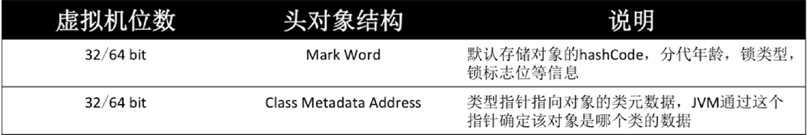
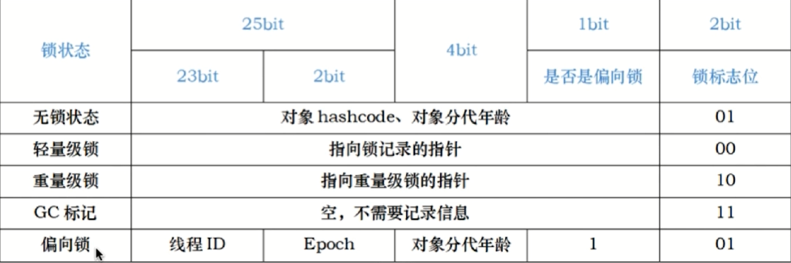

`sychronized`是一种块结构（BLock Structured）的同步语法。

Java对象在内存中的存储格式是：对象头=实例数据=对齐填充

**对象头的结构：**

**Mark Word中存储着锁相关信息：**

`synchronized`关键字经过Javac编译之后，会在同步块的前后分别形成`monitorenter`和`monitorexit`这两个字节码指令。

这两个字节码指令都需要一个reference类型的参数来指明要锁定和解锁的对象。

如果Java源码中的`synchronized`明确指定了对象参数，那就以这个对象的引用作为`reference`；如果没有明确指定，那将根据`synchronized`修饰的方法类型（如实例方法或类方法），来决定是取代码所在的对象实例还是取类型对应的Class对象来作为线程要持有的锁。

在执行`monitorenter`指令时，首先要去尝试获取对象的锁。如果这个对象没被锁定，或者当前线程已经持有了那个对象的锁，就把锁的计数器的值增加一，而在执行`monitorexit`指令时会将锁计数器的值减一。一旦计数器的值为零，锁随即就被释放了。如果获取对象锁失败，那当前线程就应当被阻塞等待，直到请求锁定的对象被持有它的线程释放为止。

- 被`synchronized`修饰的同步块对同一条线程来说是可重入的。这意味着同一线程反复进入同步块也不会出现自己把自己锁死的情况。
- 被`synchronized`修饰的同步块在持有锁的线程执行完毕并释放锁之前，会无条件地阻塞后面其他线程的进入。这意味着无法像处理某些数据库中的锁那样，强制已获取锁的线程释放锁；也无法强制正在等待锁的线程中断等待或超时退出。

# 自旋锁

**原因：**由于很多情况下，共享数据的锁定状态较短，切换线程不值得。所以为了防止这种频繁的切换线程，需要一种方法使得一个线程在暂时拿不到锁时并不放弃处理机。

所以有了**自旋锁**，当线程得不到资源时并不会放弃处理机，而是忙等。。。

缺点也很明显，忙等的时间太长会明显降低CPU吞吐率。

# 自适应自旋锁

- 由于无法判断资源的锁定状态到底是多短，所以引出了一个动态的自适应自旋锁

- 此时自选的次数不再固定

- 由前一次在同一个锁上的自选时间及锁的拥有者的状态来决定

# 锁消除

JIT编译时，对运行上下文进行扫描，去除不可能存在竞争的锁

# 锁粗化

锁的粒度越细性能越低

扩大锁的范围以防止频繁的加锁和解锁

# 偏向锁

如果在大多数情况下，锁都不存在多线程竞争，总是由同一线程获得，那么就需要一种**偏向锁**以减少同一线程获取锁的代价

**核心思想：**如果一个线程获得了锁，那么锁就进入偏向模式，此时Mark Word的结构也变为偏向锁结构，当该线程再次请求锁时，无需在做任何同步操作，即获取锁的过程只需要检查Mark Word的锁标记位为偏向锁以及档期那线程ID等于Mark Word的Thread ID即可，这样就省去了大量有关锁申请的操作。

不适用于锁竞争比较激烈的多线程场合

**CAS（Compare And Swap）**

# 轻量级锁

轻量级锁是由偏向锁升级来的，偏向锁运行在一个线程进入同步块的情况下，当第二个线程加入锁争用的时候，偏向锁就会升级为轻量级锁。

使用场景：线程**交替执行**同步块

若存在同一时间访问同一锁的情况，就会膨胀为重量级锁