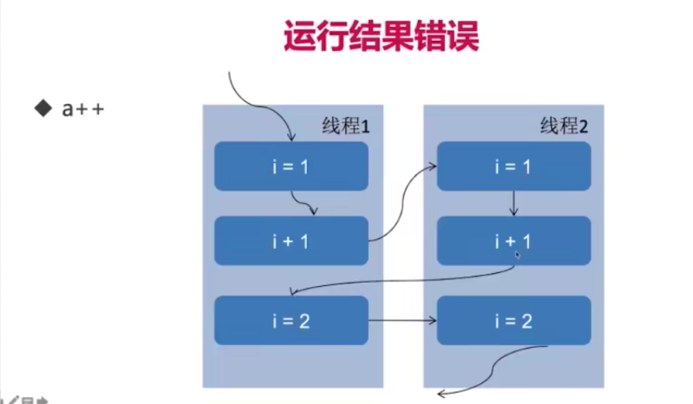

## 线程安全

当多个线程访问一个对象时，如果不用考虑这些线程在运行时环境下的调度和交替执行，也不需要进行额外的同步，或者在调用方进行任何其他的协调操作，调用这个对象的行为都可以获得正确的结果，那么这个线程就是安全的。

#### 什么情况下会出现线程安全问题

##### 多个线程a++

```java
public class Test implements Runnable{

    private int index = 0;
    static Test instance = new Test();

    @Override
    public void run() {
        for (int i = 0; i < 10000; i++){
            index++;
        }
    }

    public static void main(String[] args) throws InterruptedException {
        Thread thread1 = new Thread(instance);
        Thread thread2 = new Thread(instance);
        thread1.start();
        thread2.start();
        //thread.join后主线程要等待这个thread执行完后才能向下执行
        thread1.join();
        thread2.join();
        //两个子线程执行完后才能向下执行
        System.out.println(instance.index);
    }
}
//输出
13458
```

可以看到并没有预期的20000 。



由于a++并不是一气呵成的，由箭头的顺序执行就会发生错误

**使用`AtomicInteger`，原子类能保证操作一气呵成。**

##### 死锁

```java
public class Test implements Runnable {

    int flag;
    static Object o1 = new Object();
    static Object o2 = new Object();

    @Override
    public void run() {
        System.out.println("flag = " + flag);
        if (flag == 1){
            synchronized (o1){
                try {
                    Thread.sleep(500);
                } catch (InterruptedException e) {
                    e.printStackTrace();
                }

                synchronized (o2){
                    System.out.println("1");
                }
            }
        }

        if (flag == 0){
            synchronized (o2){
                try {
                    Thread.sleep(500);
                } catch (InterruptedException e) {
                    e.printStackTrace();
                }

                synchronized (o1){
                    System.out.println("0");
                }
            }
        }
    }

    public static void main(String[] args) throws InterruptedException {
        Test r1 = new Test();
        Test r2 = new Test();
        r1.flag = 1;
        r2.flag = 0;
        new Thread(r1).start();
        new Thread(r2).start();
    }
}
```

线程一获取到o1的锁并且想要获取o2的锁

由于获取第一个锁后会有一个线程休眠，所以有足够的机会让线程二获取到o2的锁

线程二获取到o2的锁并且想要获取o1的锁

那么，发生了死锁

##### 对象发布和初始化的时候的安全问题

**发布：**让对象暴漏出去让其他对象可用，如public就是发布

**逸出：**发布到了不该发布的地方

> 1. 方法返回了一个private对象，虽然private本意是不想被看到
>
>    > ```java
>    > private Map<String, String> map = new HashMap<>();
>    > 
>    > public Map<String, String> getMap(){ //返回private类型的变量
>    >     return map;
>    > }
>    > //如果private修饰的是一个Map或List那么外面拿到后就可能会修改他的内容
>    > //但是又不能没有这个方法，调用者需要看到map的内容。我们只是希望它不能被修改。所以可以返回一个副本
>    > //修改
>    > public Map<String, String> getMap(){ //不返回引用而返回map的副本
>    >     return new HashMap<>(map); //对map的copy
>    > }
>    > ```
>
> 2. 还未完成初始化（构造函数还没完全执行完毕）就把对象提供给外界
>
>    > 可以通过工厂模式来解决
>
> 3. 在构造函数中未初始化完毕就this赋值
>
> 4. 隐式逸出：注册监听事件
>
> 5. 构造函数中运行线程

## 为什么线程会带来性能问题

##### 调度：上下文切换

在线程调度时，需要保存当前线程的TCB (Thread Control Block)，然后切换到另一个线程再加载另一个线程的TCB

另外如果调度的是内核级线程，那么还会有内核态到用户态的切换

当发生频繁的竞争锁或者IO读写等时就会发生频繁的上下文切换

##### 协作：内存同步

内存同步问题会带来开销，防止不同的线程访问同一块内存时造成一些问题