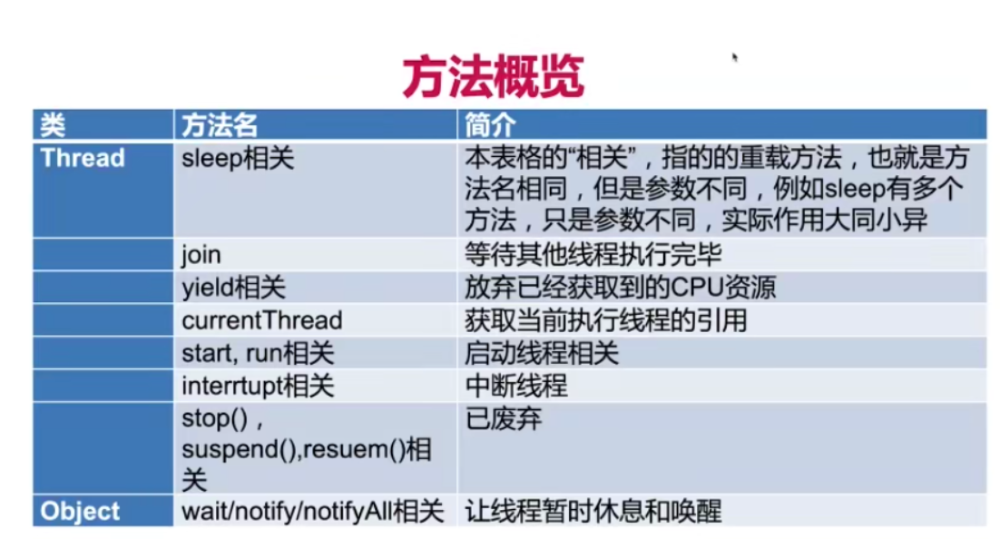
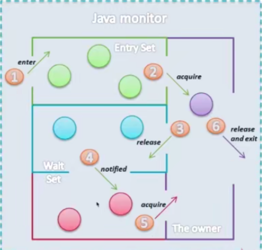

#### wait、notify、notifyAll的作用、用法

**wait和notify都需要在synchronized关键字修饰的方法或代码块中调用。**


**调用wait进入阻塞阶段**

> - 另一个线程调用这个对象的`notify()`方法且刚好唤醒的是本线程
>
> - 另一个线程调用了这个对象的`notifyAll()`方法
> - 过了`wait(long timeout)`规定的超时时间，如果传入0就是永久等待
> - 线程自身调用了`interrupt()`

**唤醒阶段**

> `notidy()`会任意选取一个正在等待中的线程唤醒，唤醒的线程会进入就绪队列等待调度 
>
> `notidyAll()`会唤醒所有线程

##### wait与notify

wait会释放锁，让给其他线程。

notify只是提醒wait着的线程该醒醒了，等我执行完就会释放锁给你用

如果没有notify那么wait着的线程就会傻等，要不然就需要一个循环反复的判断是否可以得到锁

```java
package threadcoremethod;

public class wait {
    private static Object object = new Object();

    static class Thread1 extends Thread{
        @Override
        public void run() {
            synchronized (object){
                try {
                    System.out.println(Thread.currentThread().getName() + "拿到了object锁");
                    System.out.println("Thread-0调用wait释放锁");
                    object.wait();
                } catch (InterruptedException e) {
                    e.printStackTrace();
                }
                System.out.println(Thread.currentThread().getName() + "重新获取object锁");
            }
        }
    }

    static class Thread2 extends Thread{
        @Override
        public void run() {
            synchronized (object){
                System.out.println(Thread.currentThread().getName() + "拿到了锁");
                //这里的notify并不是释放锁，而是通知wait的线程可以醒醒了，等我执行完就把锁给你
                //所以可以看到结果中notify完执行了sysout输出后才该wait的线程执行
                object.notify();
                System.out.println(Thread.currentThread().getName() + "调用了notify");
            }
        }
    }

    public static void main(String[] args) throws InterruptedException {
        Thread1 thread1 = new Thread1();
        Thread2 thread2 = new Thread2();
        thread1.start();
        Thread.sleep(200);
        thread2.start();
    }
}
```

##### notify与notifyAll

```java
package threadcoremethod;

/**
 * 有三个线程，线程1和2被阻塞。线程三来唤醒这两个被阻塞的线程
 * 线程1会执行到wait然后释放锁，然后线程二拿到锁执行到wait也释放锁
 * 然后线程三会唤醒他们。notify随机唤醒一个，notifyAll唤醒全部
 */
public class WaitNotifyAll implements Runnable{

    private static final Object resourceA = new Object();

    @Override
    public void run() {
        synchronized (resourceA){
            System.out.println(Thread.currentThread().getName() + "got the resourceA lock");
            try {
                System.out.println(Thread.currentThread().getName() + "wait to restart");
                resourceA.wait();
                System.out.println(Thread.currentThread().getName() + " was awakened");
            } catch (InterruptedException e) {
                e.printStackTrace();
            }
        }
    }

    public static void main(String[] args) throws InterruptedException {
        Runnable runnable = new WaitNotifyAll();
        Thread thread1 = new Thread(runnable, "Thread one ");
        Thread thread2 = new Thread(runnable, "Thread two ");
        
        thread1.start();
        thread2.start();
        Thread.sleep(200);  //保证wait一定发生在notify之前
        
        new Thread(()->{
            synchronized (resourceA){
                System.out.println(Thread.currentThread().getName() + " call notify() to wake up the waiting thread");
                resourceA.notify();
            }
        }).start();
    }
}

//结果
//Thread-0为线程三，用来唤醒
Thread one got the resourceA lock
Thread one wait to restart   //线程1释放给锁
Thread two got the resourceA lock
Thread two wait to restart  //线程二释放锁
Thread-0 call notify() to wake up the waiting thread //唤醒
Thread one  was awakened
//可以看到因为使用notify只会唤醒一个线程，所以只有一号线程被唤醒了
//！！！此时程序还在运行中，二号线程还在等待被唤醒。。。
    
//使用notifyAll
Thread one got the resourceA lock
Thread one wait to start
Thread two got the resourceA lock
Thread two wait to start
Thread-0 call notifyAll() to wake up all the waiting thread
Thread one was awakened
Thread two was awakened
//程序正常运行结束
```

这里使用sleep来保证wait在notify之前，也就是并不能保证先start的线程就一定先执行。这是因为JVM的用户级线程的调度并不是一定的FCFS。关于内核级的进程调度：[处理机调度](..\OpreatingSystem\处理机调度)



**Entry Set：**这个集合中绿色的圆圈代表等待获得锁的线程

**The owner：**

> 拥有锁的线程，只有这里的线程释放锁 Entery Set中的小绿才能拿到锁
>
> 可以看到小紫有两条路，一个是左边的③ wait释放锁。另一个是⑥完成任务后正常释放锁

**Wait Set：**

> 一旦小紫调用wait释放锁，就进入了Wait Set区域，这个区域分为两种。
>
> 一个是小蓝：小蓝是在呆呆的等，并没有获取锁的意愿
>
> 小蓝一旦发生异常那么直接就会跳到Ternimal的状态。
>
> 一个是小粉：小粉是被其他线程notify了，所以它知道我可以等待获取锁了。这时小粉是有获取锁的意愿的。此时的小粉和小绿是一样的都是等待锁被释放
>
> 小粉是已经notify后的，所以当他拿不到锁时的状态已经不是**waiting**了，而是**Blocked**阻塞的状态
>
> 小粉获取到锁后重新进入到 The owner成为小紫

##### 为什么wait需要在同步代码块中使用而sleep不需要

为了通信的可靠性，同时也是为了避免死锁或饥饿的现象。

##### 为什么wait()、notify()、notifyAll()被定义在Object类里，而sleep定义在Thread类里

因为这些方法是对于某个对象的，而不是某个线程。所以某个线程可以持有多个对象的锁。而sleep只是用于线程休眠。

##### notifyAll之后所有的线程都会再次抢夺锁，如果某线程抢夺失败怎么办

抢夺失败无非是重新回到了等待状态，这个状态下是一直处于抢锁的状态的。而不是wait后只有等notify了他才开始抢锁。

##### JavaSE，JavaEE，JavaME分别是什么

SE为标准版，EE为企业版，ME为移动版（迷你版）。但是在线一概是SE版

##### JRE和JDK和JVM是什么关系

JRE是JAVA的运行环境。JDK是Java开发工具包，包含各种库。JDK包含JRE

JRE包含JVM，JVM是运行Java程序的Java虚拟机

##### Java 8 和 Java 1.8 和JDK 8是什么关系

以前的Java版本每一个小数点后的都是一个大版本，如1.2到1.3就是一个大版本

但是后来1.5的时候觉得不够霸气，一个大版本一直1.x 1.xx的太low，不如改成Java 5。

所以Java 1.8等于 Java 8。也是Java SE 8，也是 JDK 8