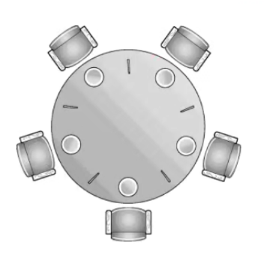

## 什么是死锁

- 发生在并发中
- 互不相让：当两个或多个线程互相持有对方所需要的资源又不主动释放时，就会无限的互相等待
- 多个线程之间的依赖关系形成环形，那么这多个线程就会同时发生死锁

## 死锁的影响

系统的健壮性决定了处理死锁的能力，如数据库中：检测并放弃事务

JVM中无法自动处理死锁。因为处理死锁的方法并不是固定的，不同的情况会有不同的最优解，所以JVM将选择权交给我们。

## 发生死锁的例子

#### 最简单的必然死锁例子

```java
package deadlock;
//由flag来判断哪个线程需要执行哪一段代码
//线程一先拿到o1等待拿到o2
//线程二先拿到o2等待o1
//发生死锁
public class MustDeadLock implements Runnable{
    int flag;

    static Object o1 = new Object();
    static Object o2 = new Object();

    @Override
    public void run() {
        System.out.println("flag = " + flag);

        if (flag == 1){
            synchronized (o1){
                try {
                    System.out.println("r1拿到o1锁");
                    Thread.sleep(500);   //等待r2拿到o2
                } catch (InterruptedException e) {
                    e.printStackTrace();
                }
                synchronized (o2){
                    System.out.println("r1拿到o2锁");
                }
            }
        }

        if (flag == 0){
            synchronized (o2){
                try {
                    System.out.println("r2拿到o2锁");
                    Thread.sleep(200);
                } catch (InterruptedException e) {
                    e.printStackTrace();
                }
                synchronized (o1){
                    System.out.println("r2拿到o1锁");
                }
            }
        }
    }

    public static void main(String[] args) {
        MustDeadLock r1 = new MustDeadLock();
        MustDeadLock r2 = new MustDeadLock();
        r1.flag = 1;
        r2.flag = 0;

        new Thread(r1).start();
        new Thread(r2).start();
    }
}
//输出
flag = 1
r1拿到o1锁
flag = 0
r2拿到o2锁
//此时程序并没有结束，发生了死锁
//强行停止
Process finished with exit code -1
```

#### 实际生产中的例子：转账、转金币

转账中需要同时给发起人和接收人都加锁，保证安全性

> 如A和B同时向C转账10万元。如果转账操作不具有原子性，A在向C转账时，读取了C的余额为20万，然后加上转账的10万，计算出此时应该有30万，但还未来及将30万写回C的账户，此时B的转账请求过来了，B发现C的余额为20万，然后将其加10万并写回。然后A的转账操作继续——将30万写回C的余额。这种情况下C的最终余额为30万，而非预期的40万。

锁住后，则扣除转出人、增加收款人的余额整个是一个原子操作

如果锁获取的顺序是相反的那么就会产生死锁，如线程一先后获取a,b锁而线程二先后获取b,a锁

```java
package deadlock;

public class TransferMoney implements Runnable{

    int flag;
    static Account a = new Account(500, "a");
    static Account b = new Account(500, "b");

    @Override
    public void run() {
        if (flag == 1){
            transferMoney(a, b, 200);
        }

        if (flag == 0){
            transferMoney(b, a, 200);
        }
    }

    public static void transferMoney(Account from, Account to, int amount){
        synchronized (from){  //在两个线程中，from一个是a一个是b，所以再往下执行就会导致死锁
            try {
                Thread.sleep(500); //sleep，确保两个线程同时拿到from的锁。不加这个sleep那么出现死锁的概率会很低，但是肯定还是会发生
            } catch (InterruptedException e) {
                e.printStackTrace();
            }
            synchronized (to){
                if (from.balance - amount < 0){
                    System.out.println("余额不足，转账失败");
                    return;
                }
                from.balance -= amount;
                to.balance += amount;
                System.out.println("success, " + from.name + " to " + to.name + " " + amount + " rmb");
            }
        }
    }

    static class Account{

        int balance;
        String name;

        public Account(int balance, String name) {
            this.balance = balance;
            this.name = name;
        }
    }

    public static void main(String[] args) throws InterruptedException {
        TransferMoney r1 = new TransferMoney();
        TransferMoney r2 = new TransferMoney();
        r1.flag = 1;
        r2.flag = 0;

        Thread t1 = new Thread(r1);
        Thread t2 = new Thread(r2);

        t1.start();
        t2.start();
        t1.join();
        t2.join();

        System.out.println("a's balance is " + a.balance);
        System.out.println("b's balance is " + b.balance);

    }
}
```

#### 多人随机转账

```java
package deadlock;

import java.util.Random;

public class MutilTransfer {

    private static final int NUM_ACCOUNTS = 500; //账户数量
    private static final int NUM_MONEY = 1000; //账户初始金额
    private static final int NUM_THREADS = 20;  //线程数
    private static final int NUM_AMOUNT = 20;  //转账金额
    private static final int NUM_ITERITOR = 100000; //转账次数

    public static void main(String[] args) {
        Random random = new Random();
        TransferMoney.Account[] accounts = new TransferMoney.Account[NUM_ACCOUNTS];

        for (int i = 0; i < accounts.length; i++){
            accounts[i] = new TransferMoney.Account(NUM_MONEY);
        }

        class Transfer extends Thread{
            @Override
            public void run() {
                for (int i = 0; i < NUM_ITERITOR; i++){
                    int fromAcct = random.nextInt(NUM_ACCOUNTS);
                    int toAcct = random.nextInt(NUM_ACCOUNTS);
                    int amount = random.nextInt(NUM_MONEY);
                    //transferMoney()方法中已经将sleep去除
                    TransferMoney.transferMoney(accounts[fromAcct], accounts[toAcct], NUM_AMOUNT);
                }
            }
        }

        for (int i = 0; i < NUM_THREADS; i++){ //模拟20个账户随机转账
            new Transfer().start();
        }
    }
}
//输出
..........
..........
转账金额：20
转账金额：20
//强制结束
Process finished with exit code -1
```

虽然我们启动了20个线程模拟500个人随机转账，但是这20个线程最终还是一个不剩的都阻塞了。。。

可能是发生了环形死锁。所以，不经俩个人互相转会发生死锁，多人转账也是一定会在某个时刻发生死锁的。（墨菲定律）

## 死锁的四个必要条件

1. 资源需要互斥访问
2. 请求与保持条件：请求第二把锁的同时保持不放手里的锁
3. 不剥夺条件：手里的锁不会被强制剥夺
4. 循环等待条件：头尾相接互相等待

**破坏任何一个条件都可以破解死锁**

## 如何定位死锁

- jstack
- ThreadMXBean

## 修复死锁的策略

保存现场并重启服务器

常见的修复策略

> ##### 避免策略：哲学家就餐的换手方案
>
> > 如在转账案例中，我们可以避免相反的获取顺序。在这里其实获取锁的顺序我们并不关心，哪个锁先获得都对结果毫无影响。
> >
> > ```java
> > //在transfer转账函数中修改
> > int fromHash  = System.identityHashCode(from);
> > int toHash  = System.identityHashCode(to);
> > //相同的两个对象，不论哪个对象做from哪个做to最终获取锁的顺序都是一样的
> > //（设a的Hash大于b的Hash）
> > //tansfer(a, b) 就会先锁a再锁b（执行第一个if）
> > //tansfer(b, a) 还会先锁a再锁b（执行第二个if）
> > if (fromHash > toHash){
> >     synchronized (from){
> >         synchronized(to){
> >             .....
> >         }
> >     }
> > }
> > 
> > if (fromHash < toHash){
> >     synchronized (to){
> >         synchronized(from){
> >             .....
> >         }
> >     }
> > }
> > ```
> >
> > 这这里如果是a向b转帐（如果a的Hash值大于b的），那么就会先锁a再锁b。如果是b向a转账，由于可以判断Hash值来决定锁的顺序，所以这里还是先锁a再锁b
> >
> > 如果Hash值一样那么还可以在外层加一层锁
> >
> > 有主键就不需要考虑Hash值一样的问题了
>
> ##### 检测与恢复策略
>
> > 一段时间检测是否有死锁，如果有就剥夺某一个资源，来打开死锁
>
> ##### 鸵鸟策略
>
> > 鸵鸟一旦发现危险就会把头埋在土里，这样他就看不到危险了。。。也就是说如果死锁有可能发生那我们可以直接忽略它，直到死锁发生时再人工修复

## 哲学家就餐问题



**流程**

- 先拿起左手的筷子
- 再拿起右手的筷子
- 有两只筷子后才能吃饭

死锁：如果每个人同时拿起左手的筷子，那么都会在等待右手的

```java
package deadlock;

public class DiningPhilosophers {
    public static class Philosopher implements Runnable{

        private Object leftChopstick;
        private Object rightChopstick;

        public Philosopher(Object leftChopstick, Object rightChopstick) {
            this.leftChopstick = leftChopstick;
            this.rightChopstick = rightChopstick;
        }

        @Override
        public void run() {
            while (true){
                doAction("Thinking");
                synchronized (leftChopstick){
                    doAction("pick up left chopstick");
                    synchronized (rightChopstick){
                        doAction("pick up right chopstick -> eating");
                        doAction("Put down right chopstick");
                    }
                    doAction("Put down left chopstick");
                }
            }
        }
        //对于一些重复的代码一定要单独写一个函数，主逻辑中没了一些无用的代码方便逻辑的梳理
        private void doAction(String action) {
            System.out.println(Thread.currentThread().getName() + " " + action);
            try {
                Thread.sleep((long)Math.random() * 10); //做事需要一点时间...
            } catch (InterruptedException e) {
                e.printStackTrace();
            }
        }
    }

    public static void main(String[] args) {
        Philosopher[] philosophers = new Philosopher[5]; //5个哲学家
        Object[] chopsticks = new Object[philosophers.length]; //5根筷子
        for (int i = 0; i < chopsticks.length; i++){
            chopsticks[i] = new Object(); //初始化筷子
        }
        for (int i = 0; i < philosophers.length; i++){
            Object leftChopstick = chopsticks[i]; //左筷子
            Object rightChopstick = chopsticks[(i+1) % chopsticks.length]; //右筷子。类似循环队列，最大容量为5，最后一根右筷子就是第一根左筷子
            philosophers[i] = new Philosopher(leftChopstick, rightChopstick);
            new Thread(philosophers[i], i+1 + "号" + "哲学家").start();
        }
    }
}
//输出
............
............
3号哲学家 pick up left chopstick *
4号哲学家 pick up left chopstick *
1号哲学家 Put down left chopstick
2号哲学家 pick up left chopstick *
1号哲学家 Thinking
5号哲学家 pick up right chopstick -> eating
5号哲学家 Put down right chopstick
5号哲学家 Put down left chopstick
1号哲学家 pick up left chopstick *
5号哲学家 Thinking
5号哲学家 pick up left chopstick *
..........
//发生死锁，强行停止
Process finished with exit code -1
//根据*号可以发现最后发生死锁时每个哲学家都拿起了左边筷子
```

### 解决方案

#### 服务员检查（避免策略）

当一个哲学家想要拿左手筷子时会检查会不会发生死锁

#### 改变一个哲学家拿筷子的顺序（避免策略）

其中的一个哲学家先拿右手的筷子即可

```java
if (i == philosophers.length - 1){ //让最后一位哲学家拿筷子的顺序颠倒
                philosophers[i] = new Philosopher(rightChopstick, leftChopstick);
            }else {
                philosophers[i] = new Philosopher(leftChopstick, rightChopstick);
            }
```

#### 领导调节（检测与恢复策略）

发生死锁后强行释放一个哲学家的资源

## 活锁

线程并没有阻塞还是在运行，但是是在一直做没有意义的工作得不到进展

**死锁：**每个哲学家都拿着左手的餐叉，永远都在等右边的餐叉

**活锁：**哲学家同时拿起左边的餐叉，等待五分钟后都没有右手的餐叉就都放下左手的餐叉，然后又同时拿起左手的餐叉，又等。。。。

**所以，对于死锁的处理不够到位那么就会产生活锁**

## 面试常见问题

1. 写出必然死锁的例子：两个顺序不同的锁
2. 发生死锁不需要满足的四个条件（互斥、请求与保持、资源不会被剥夺、循环等待）
3. 如何定位死锁：jstack、ThreadMXBean
4. 有哪些解决死锁问题的策略：破坏四个必要条件中的任一个