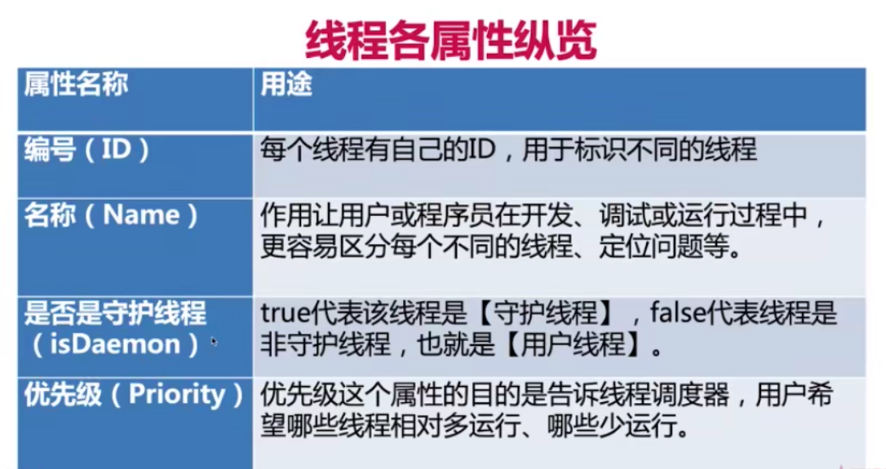

**线程ID：** ID从1开始，因为Thread内部是++threadNum先++再返回。所以main是1号。自己创建的第一个线程会远大于0，因为运行时JVM会创建很多线程。

**线程名字：**默认线程名：`"Thread - " + ++threadNum`

**守护线程：**用于给**用户线程**提供服务。比如垃圾处理器

> **三个特性**
>
> > 线程类型默认继承自父线程
> >
> > 被谁启动：通常都是由JVM自动启动的。main函数是非守护线程
> >
> > 不影响JVM退出：JVM只会关心用户线程是否运行完毕
>
> 守护线程与普通线程整体并没有区别，唯一的区别就是JVM不会关心守护线程，只会关心用户线程是否运行完毕。如果守护线程没有运行完毕，JVM是不管的，会直接关闭JVM

**线程优先级：**1 - 10 是个优先级，默认为5 。但是程序设计不应该依赖于优先级，不同操作系统的优先级都不一样。所以最好用默认

