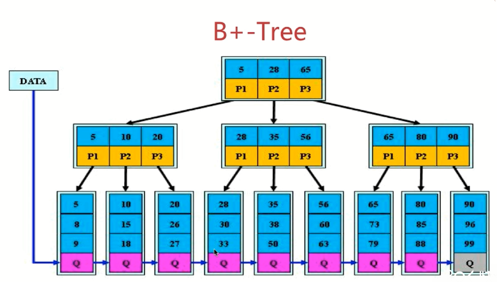
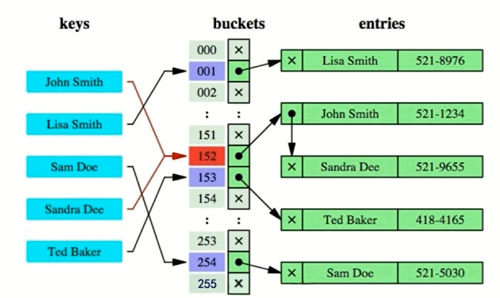
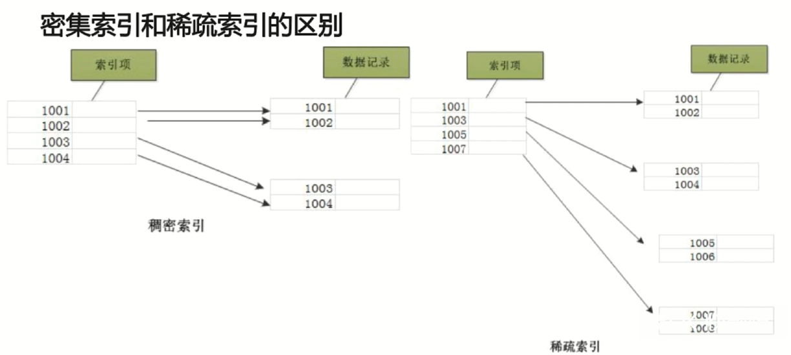
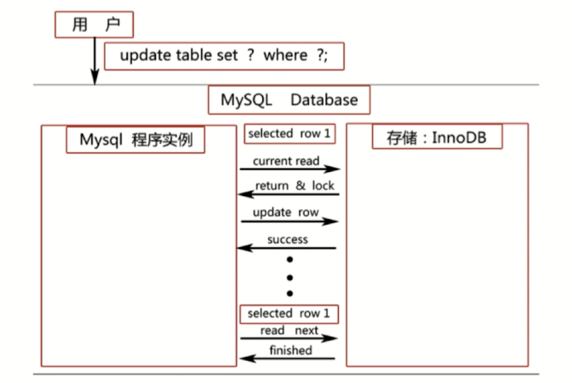
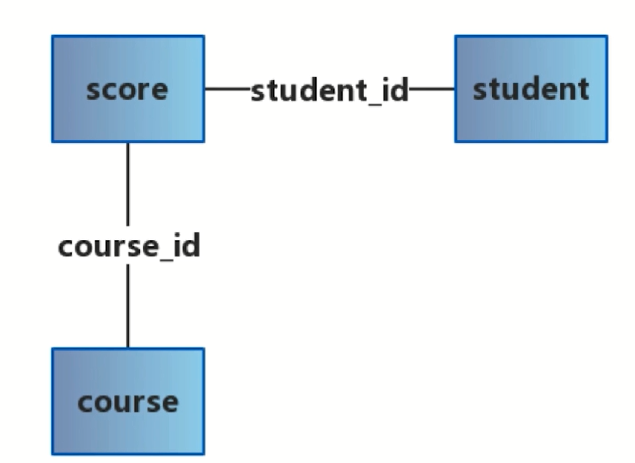

# 为什么要使用索引

索引能够避免全表扫描

主键、唯一键都能当作索引

## 索引分为两大类

前提采取的是InnoDB的默认B+树数据结构存储数据

**聚集索引（Clustered Index）：**

- 叶子节点存储行记录，因此必须要有一个聚集索引，且只有一个
- 如果定义了PK(Primary Key)，那么PK就是聚集索引
- 如果没有定义PK，那么第一个not null unique列是聚集索引
- 否则，InnoDB会创建一个隐藏的row-id作为聚集索引

**普通索引（secondary Index）：**

- 只能有一个聚集索引存储行记录，其他的都是普通索引
- 只存储主键值，如果所有的普通索引也包含行记录那数据库就爆炸了
- 所以通过普通索引查询需要先查到主键值再**回表**查询行记录
- 避免方式就是实现索引覆盖

**索引覆盖（Covering Index）：**

- 使索引覆盖查询条件，这样就不需回表了
- 如`select a from table where b=xxx`，b是普通索引。此时肯定是有回表操作的，但是如果创建了联合索引`(a, b)`，此时根据索引b立即就能在索引种知道a的值。

# 回表

**有了上面索引分类的知识就知道回表怎么回事了**

比如除了主键为ID的索引外还创建了一个name字段的索引，当我们查询：

`select * from table_name where name=杨优秀`时，执行流程为：

- 先查询到name索引上的杨优秀，然后找到他的ID为3，然后去主键索引找ID为3的值
- 回到主键索引树搜索的过程就是回表
- 使用覆盖索引可以避免回表操作

**例子：**

- 降序分页查询：`SELECT id, title, content FROM article ORDER BY created DESC LIMIT 10000, 10;`  

- 使用如下语句运行速度可以快好几倍：

  ```mysql
  SELECT id, title, content FROM article
  INNER JOIN (
      SELECT id FROM article ORDER BY created DESC LIMIT 10000, 10
  ) AS page USING(id)
  ```

- 首先全表扫描，然后根据create二级索引可以直接查出主键id而不用回表，两者相join就可以得到最终结果。少了一次回表的操作

## mysql为什么要用B+树结构存放索引

首先如果用二叉查找树，一般的查找的时间复杂度是二分查找的复杂度，为O(logn)。当插入的数据一次有序时二叉查找树就退化成了链表，此时的时间复杂度就会使O(n)。

为了防止退化成链表，可以使用平衡二叉查找树。这也是个好办法，但是二叉树的最根本的头疼之处是每个节点只能有两个孩子。。。所以即使是平衡二叉树，他的树高也是无法干预的。**树的高度就是磁盘IO的次数。所以树高决定性能。**

所以想到了可不可以一个节点有多个孩子，那么就引出了**B树**的概念

## B树

**B树也叫做多路平衡查找树**，B树中所有节点的孩子节点数的最大值就是该树的阶。

信息都存在**非叶节点**中，查找过程类似于二叉查找树

一个m阶B树：

- 每个节点最多m个孩子，即最多m - 1个关键字（因为判断的是关键字的大小所以子树比关键字数多一）
- 根节点至少两个孩子，即关键字最少是一个
- 非根节点最少[m/2，上界]个孩子
- 各节点内的关键字按序排列
- 所有叶节点都在最下面一层，并不带信息

但是由于B树的每个节点都有数据，无疑每个节点的体积就会过大。由于磁盘的一次IO读的数据量都是固定了，如果单个节点体积过大那么读一次IO读到的节点数（索引）就会减少。

如果要做遍历，B树只能一次次的从根节点开始搜索，一次搜一个。

那么就引出了非叶节点根本不存储值，所有数据都存储在互相连接的叶节点中的**B+树**

## B+树

**一个m阶B+树：**

- 非叶节点的孩子个数与关键字个数相同
- 节点中关键字有序
- 每个分支节点最多m课子树
- 非叶节点只是用来做索引，数据都保存在叶节点中。所以每一次检索都是自顶向下的一次完整路径，所以时间复杂度一定是O(logn)
- 所有叶节点都互相链接，方便遍历数据
- B+树的也是一种多路查找树，所以很容易得到叶节点的数据一定有序



当做范围查询时，如：查询15到30的数据。如果使用了B+树就可以先进行一次查找找到15的位置然后进行叶节点遍历。

### B+树的优点

- B+树的磁盘读写代价更低：每个节点更多关键词更多子树，降低树高。
- B+树的查询效率更加稳定：每次查找都需要自顶向下遍历一遍。
- B+树更有利于对数据库的扫描：叶节点存储信息并且每个叶节点连在一起。

### B+树每个节点的大小

- MySQL的基本存储结构就是页，与内存的分页不同，但一页都是对应的磁盘的一个块
- B+树中一个节点为一页或页的倍数最合适

- 因为如果节点大小是1.2页，那么就需要读取两页
- 页中保存有多条行记录，每条记录通过单向链表链接
- 页之间通过双向链表链接
- 每个数据页都会为存储在它里边儿的记录生成一个**页目录**，在通过**主键**查找某条记录的时候可以在页目录中使用**二分法快速定位**到对应的槽，然后再遍历该槽对应分组中的记录即可快速找到指定的记录

**所以在没有进行索引优化的查询操作中，默认MySQL会这样做：**

- 定位到记录所在的页，遍历双向链表找到这个页
- 如果不是根据主键查询，那么就只能遍历单链表查找对应的记录

## Hash索引



使用Hash索引时不发生Hash冲突时只需一次查找即可找到对应的数据项。

如查找Sandra Dee，直接定位到152，由于使用了链表法解决冲突，只需再查找一次链表即可找到该key对应的数据项

**但是也有很多不足：**

- 只能满足"="、"IN"，不能使用范围查询
- 无法被用来避免数据的排序操作
- 不能利用组合索引中的部分索引键查询
- 不能避免表扫描
- Hash冲突严重时性能严重下降，复杂度退化成链表扫描

## 密集索引和稀疏索引



Myism均采用稀疏索引

InnoDB均采用密集索引

- 若一个主键被定义，则该主键作为密集索引
- 若没有主键被定义，该表的第一个唯一非空索引作为密集索引
- 若不满足以上条件，InnoDB内部会生成一个隐藏主键（密集索引）
- 非主键索引存储相关键位和对应的主键值，包含两次查找

# Explain分析SQL语句

extra中出现以下两项意味着MYSQL根本不能使用索引，效率会收到影响

- Using filesort：表示MYSQL会对结果使用一个外部索引排序，而不是从表里按索引次序读到相关内容。可能在内存或磁盘上进行排序。MYSQL中无法利用索引完成的排序操作成为：文件排序
- Using temporary：使用了临时表，一般是排序语句

# 联合索引的最左匹配原则

## [为什么要使用联合索引](https://juejin.im/post/5da53e04e51d45782f663c04)

- **减少开销**。建一个联合索引(col1,col2,col3)，实际相当于建了(col1),(col1,col2),(col1,col2,col3)三个索引。每多一个索引，都会增加写操作的开销和磁盘空间的开销。对于大量数据的表，使用联合索引会大大的减少开销！
- **覆盖索引**。对联合索引(col1,col2,col3)，如果有如下的sql: `select col1,col2,col3 from test where col1=1 and col2=2`。那么MySQL可以直接通过遍历索引取得数据，而无需回表，这减少了很多的随机io操作。减少io操作，特别的随机io其实是dba主要的优化策略。所以，在真正的实际应用中，覆盖索引是主要的提升性能的优化手段之一。
- **效率高**。索引列越多，通过索引筛选出的数据越少。有1000W条数据的表，有如下sql:`select *from table where col1=1 and col2=2 and col3=3`,假设每个条件可以筛选出10%的数据，如果只有单值索引，那么通过该索引能筛选出1000W*10%=100w条数据，然后再回表从100w条数据中找到符合col2=2 and col3= 3的数据，然后再排序，再分页；如果是联合索引，通过索引筛选出1000w*10%* 10% *10%=1w，效率提升可想而知！

## 两个原则

1. **最左匹配原则：**mysql会一直向右匹配直到遇到范围查询（>, <, between, like）就停止匹配，比如`a=3 and b=3 and c>5 and d=9`如果建立（a,b,c,d）顺序的索引，匹配到c时就会停止，就不会走（a,b,c,d）联合索引了。如果建立（a,b,d,c）形式的索引则都可以用到，a,b,d的顺序可以任意调整。
2. `=`和`in`可以乱序，比如`a=1 and b=2 and c=3`建立（a,b,c）索引可以任意顺序，mysql的查询优化会帮你优化成索引可以识别的形式。

如使用`KEY 'index_a_b' ('a','b')`来设立一个联合索引

当我们`select * from table where a='xxx' and b='xxx'`时是使用到这个联合索引的，联合索引是从左开始筛选出的数据一次进入到下一个索引中筛选

并：`select * from table where a='xxx'`也会用到

但是：`select * from table where b='xxx'`就用不到联合索引了

使用b来做条件判断时由于（a,b）先匹配的是a，所以没有用到联合索引

可以用到联合索引的条件为：（a）、（a,b）

**这是因为mysql创建索引的规则是首先会对联合索引的最左边的索引的数据进行排序、筛选，然后根据上一次索引筛选出的数据筛选右边索引的数据，也就是在第一个排序的基础上才会排序第二个**

# 锁

## MyISAM

MyISAM默认用的是表级锁，不支持行级锁，也不支持事务。

表级锁会锁住整张表

在对数据进行**读**的时候会加一个表级别的**读锁**，在进行**增删改**的时候会加一个表级别的**写锁**

- 读锁也叫**共享锁**，即俩个不同的会话可以同时对一个表加读锁

- 写锁也叫**排他锁**，即两个不同的会话不能同时对一个表上写锁
- 同时可以有多个共享锁，同时只能有一个排他锁。也就是读的时候可以多个读但不能写，只要想上排他锁那整个表就只能存在一个锁（排他锁）。

同一个表上写锁后不能再上读锁，会被阻塞

同一个表上读锁后不能再上写锁，会被阻塞

如果想要对一个查询操作加排他锁可以加`for update`：`select * from table where id=1 for update`，此时的读操作也会有排他锁

## InnoDB

InnoDB默认用的是行级锁，也支持表级锁，支持事务。

行级锁不同的行之间不会互相被影响。

InnoDB会对同一事务里的操作同时进行加锁，然后再到commit时再统一解锁，默认自动提交

所以在未被commit的事务里执行的所有代码都是自动加锁的，等到commit后all of lock都会被释放

**InnoDB一般的select语句不会加读锁（共享锁）：**

- 首先关闭自动提交：`set autocommit = 0`
- 如事务A：`select * from table where id=1;`（这条语句执行完后先不commit）
- 事务B：`update table set name='a' where id=1;`这条语句是加排他锁的，但它是不会被阻塞的
- 所以InnoDB的读默认并没有加共享锁（读锁）
- 想要为select添加共享锁就需要显式的加：`select * from table where id=1 lock in share mode;`此时就加上了读锁
- 此时事务B再加排他锁就会被阻塞，直到事务A执行了`commit`释放读锁。

**当语句的操作走索引时加的是行级锁，不走索引时就会加表锁。**

**锁的粒度越小，开销越大。**

MyISAM在读操作特别频繁但不经常写时性能较高（因为写会锁整张表）

InnoDB适合写操作特别频繁的状况

# 事务的四大特性

## ACID

原子性（Atomic）：要么都成功要么都回滚

一致性（Consistency）：两个账户相互转账，不论怎么操作最后两个账户总金额不会变

隔离性（Isolation）：一个事务的执行不应该影响另一个事务

持久性（Durability）：一个事务的提交对于数据库的修改应该是永久性的，当系统宕机时数据还能被恢复。Redis的持久化就完美遵循了持久性原则~

# 隔离级别

**`read uncommitted`：**未提交读。一个事务可以读另一个没有提交的事务修改的值。如A事务修改`account`从100到90但并没有提交事务，事务B此时可以读到修改后的90，事务B将`account`加20也就是`90+20=110`。但是如果事务A选择了回滚事务那么事务B操作的`account`的初始值就是错误的。这就是脏读。`read uncommitted`隔离级别以上的都可以避免脏读。

**`read committed`：**提交读。相对于上一个未提交读，这个解决了上面的问题。事务B只可以读到事务A提交后的数据。也就是不同的会话在未提交事务时都是相互隔离的。如事务A读到`account`为100并加20为120然后不进行提交，此时事务B也读到`account`为100并想进行减10为90。此时事务A提交了，事务B再次进行`select`的值成了120，也就是在一个事务中，两次读到的值是不一样的。这就违反了隔离性（事务A的操作影响到事务B了）。我们需要一种隔离级别实现：在同一个事务中第一次读到的数据就不会再变了。

**`repeatable read`：**解决了`read committed`的问题。一个会话开始时它所读到的(select)数据都是固定不变的，但当修改数据(update、insert)时还会从数据库读到最新的已提交数据然后进行操作。 可重复读相对于提交读主要是改进了对数据读的操作，这也就是可重复读名字的由来。`repeatable read`新的问题就是第一次读到的数据就不会再变了，再往后再读可能是过期的数据。所以需要一种更高级别的隔离级别。

`serializable`：解决了`repeatable read`的问题。

**幻读：**如事务A需要更新现有的一共三条信息的`account`为100，此时事务B插入了一条数据并设置了`account`为999并提交了。此时事务A才执行更新，那么一共受到影响的行数就是4行了。。。刚插入的那一条数据的`account`也成了100 。本来事务A只想更新三条，现在莫名的更新了4条。。。这就是幻读。通过设置隔离级别为`serializable`就可以避免幻读，新增数据时就会被阻塞等待读事务提交后才能插入数据。`repeatable read`好像也可以避免幻读。

隔离级别越高，并发性能越低。

# 当前读和快照读

## 当前读

- `select...lock in share mode, select..for update`，也就是加了共享锁的读属于当前读

- `update, delete, insert`，加排他锁的操作属于当前读

- 既然当前读都会加锁，那么就意味着所有当前读操作的行都不能被修改，也就是这些行都不能再加排他锁

当前读就是指能读到数据库中**最新**的数据，如图：



这张图中有一个`update`操作，所以属于**当前读**。从图中可以看到`update`开始时要先从数据库读出最新的数据然后InnoDB返回一个数据和排他锁，然后再进行更新操作直至结束。所以这里可能会出现幻读：第一次select的数据可能与后面的update当前读读出的数据不同。

## 快照读

**不加锁的非阻塞读，select都属于快照读。除了serilizable隔离级别其他的级别默认都不加锁**

快照读的出现是为了并发的性能

快照可能是数据的历史版本

`read committed`隔离级别下当前读和快照读效果是一样的

`repeatable read`隔离级别下快照读读的是第一次`select`的数据，也就是说快照的生成时间就是第一次`select`时。所以说创建快照的时机决定了读到的数据的版本。

# 语法部分

## GROUP BY

GROUP BY子句与SELECT语句结合在一块使用可以将相同的数据分成一组。

GROUP BY子句放在WHERE之后

主要作用就是将数据分组，如果有重复值那么就合并为一个组

有如下三张表：



student表：`student_id`、`name`、`age`、`sex`、`primary key('student_id')`

course表：`course_id`、`name`、`primary key('course_id')`

score表：`student_id`、`course_id`、`score`

**题一：查询所有同学的学号、选课数、总成绩**

```mysql
#由所有同学可以想到这个题目可以按学号分组，一个学号对应多门课多个成绩：group by student_id;
#查询选课数和总成绩，可以知道一定是查询成绩表，因为成绩表包含所有的信息：select count(course_id), sum(score) from score;
#组合：
select student_id, count(course_id), sum(score) 
from score 
group by student_id
```

在一张表中，如果要使用group by，那么在select语句中就必须只有group by后的列或者sum min等函数，如果再出现单独的列就一定是**另一个表中**的，如题二。

如`select student_id, count(course_id), sum(score), course_id from score group by student_id`这个语句就会报错，因为多了一个**非聚合函数且同一个表**的course_id列。

**题二：查询所有同学的学号、姓名、选课数、总成绩**

```mysql
#多了一个name列，所以就要用到两个表了:student和score
#还是按照score表的student_id来分组
#将两个表记录对应就需要用到where student.student_id=score.student_id
select s.student_id, count(s.course_id), sum(s.score), stu.name
from score s, student stu
where stu.student_id=s.student_id #where must write before group by
group by s.student_id;
```


## HAVING

通常与GROUP BY子句一块使用

WHERE过滤行，HAVING过滤组

出现在语句中的顺序：WHERE -> GROUP BY -> HAVING

**题一：查询平均成绩大于60分的同学的学号和平均成绩**

```mysql
#一定是在score表中进行分组查询：GROUP BY
#对分组后的数据进行筛选：HAVING
select student_id, avg(score)
from score
group by student_id
having avg(score) > 60;
```


**题二：查询没有学完所有课的同学的学号、姓名**

```mysql
#首先查询：select student_id, name;
#由于有成绩才能说明该学生学了该课程，并需要name列，所以需要用到score和student这两张表：from student stu, score s;
#对应结果集：where stu.student_id=s.student_id;
#按student_id分组，然后查询每个分组下的课程个数：group by student_id having count(*)
#条件是小于所有课程数：< (select count(*) from course);
select s.student_id, stu.name
from student stu, score s
group by s.student_id
having count(*) < (select count(*) from course);
```

