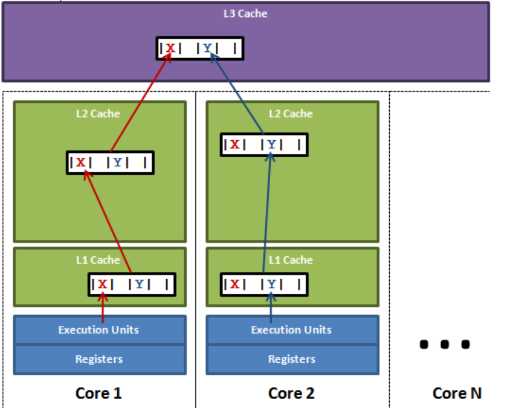
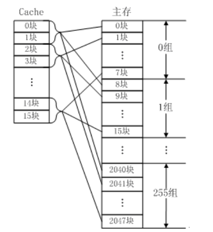
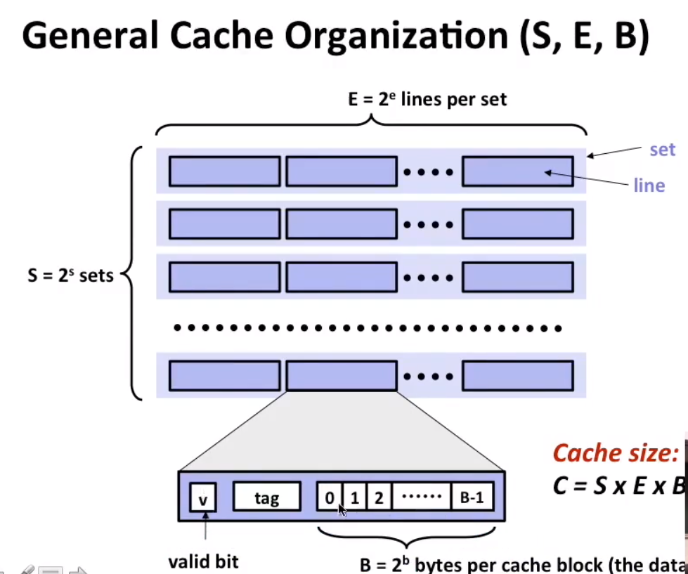
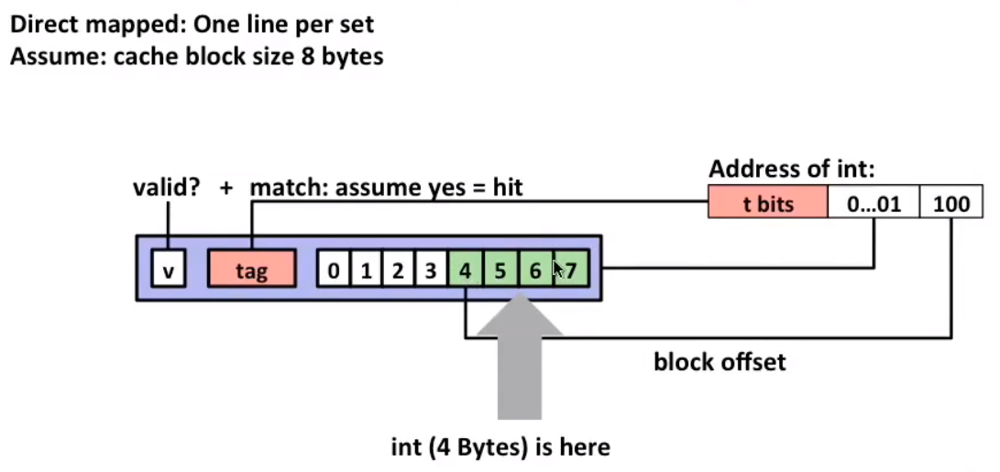
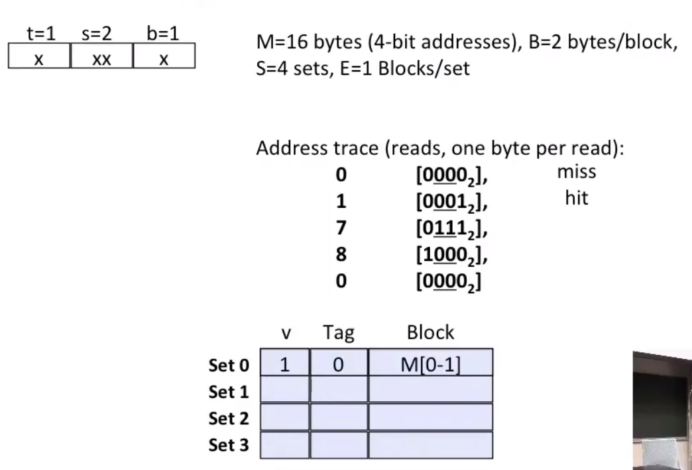
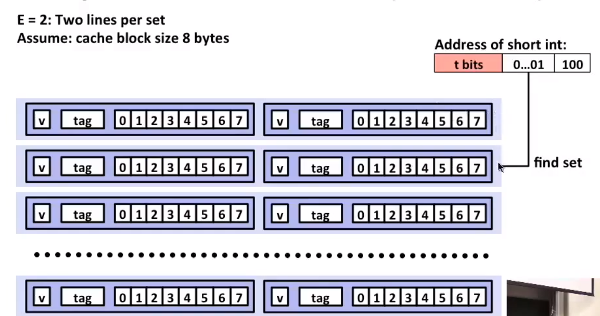
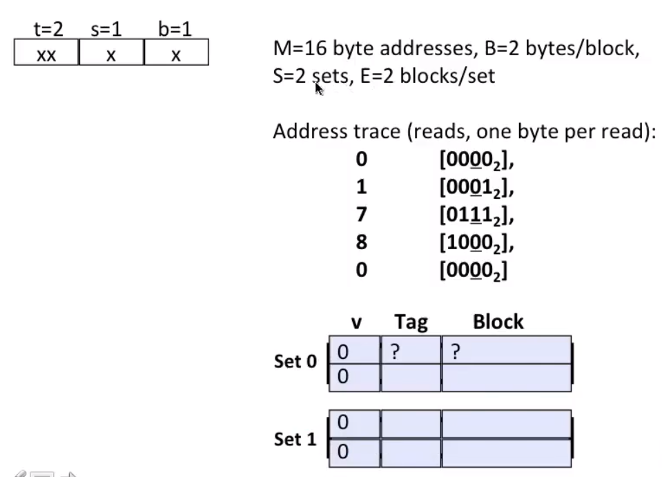
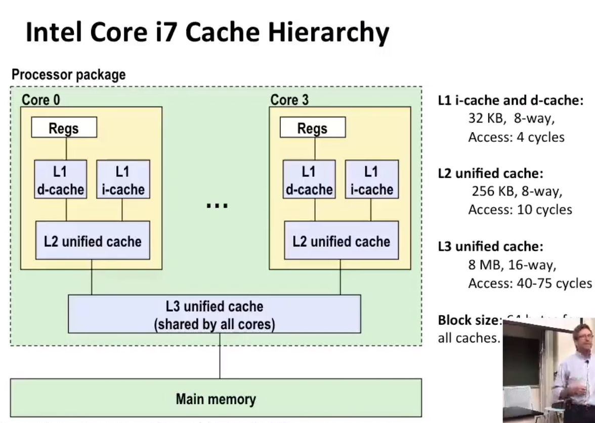

# 局部性

举个栗子（二维数组求和）：

```c
int sum_array_rows(int a[M][N]){
    int i, j, sum = 0;
    
    for (i = 0; i < M; i++){
        for (j = 0; j < N; J++){
            sum += a[i][j];
        }
    }
```

- 由于二维数组在内存中是以行优先的形式存储的，所以一行一行读取可以保证空间局部性（在内存中是连续的）。
- 反过来`sum = a[j][i]`就会慢很多（跳着读）
- sum一个变量反复使用，满足时间局部性

# Cache line

- 缓存系统中是以缓存行（Cache line）为单位存储的，lineSize通常是64字节，从主存向Cache复制数据都是以lineSize为单位传输的。并且它有效地引用主内存中的一块地址（一般是多组相联）
- 一个Java的Long类型是8字节，因此在一个缓存行中可以存放8个long类型的变量（lineSize为64Byte）。所以，如果你访问一个long数组，当数组中的一个值被加载到缓存中，它会额外加载另外 7 个，以致你能非常快地遍历这个数组。事实上，你可以非常快速的遍历在连续的内存块中分配的任意数据结构。而如果你在数据结构中的项在内存中不是彼此相邻的（如链表），你将得不到免费缓存加载所带来的优势，并且在这些数据结构中的每一个项都可能会出现缓存未命中。
- 正是由于空间局部性原理带给我们对于更高性能的思考，我们可以通过一次获取多个字节，来分摊获取该数据的成本，相对来说是有益于性能提升的。所以才会有以一块数据为单位读取的方式。

# MESI缓存一致性协议

当一个核心去读取另一个核心的数据时，需要通过一种状态判断该cache line是否是脏行--`M`状态

**[MESI动画](https://www.scss.tcd.ie/Jeremy.Jones/VivioJS/caches/MESI.htm)**

**MESI四个状态，对于数据的访问是以缓存行为单位的：**

- M（修改，Modified）：本地处理器已经修改缓存行，即是脏行，它的内容与内存中的内容不一样，并且此 cache 只有本地一个拷贝(专有)
- E（专有，Exclusive）：缓存行内容和内存中的一样，而且其它处理器都没有这行数据或者无效
- S（共享，Shared）：缓存行内容和内存中的一样, 有可能其它处理器也存在此缓存行的拷贝
- I（无效，Invalid）：缓存行失效, 不能使用

**状态转换过程（处理器C1、C2）：**

- 初始时，由于没有加载任何数据所有缓存行都为 `I`

- **Local Write：**`C2`核心没加载该缓存行，那么如果`C1`写数据至处于`I`状态的缓存行，则缓存行的状态变为`M`。此时该行的内容只在`C1`更改，并不会更新到内存，即脏行。

- **Local Read：**如果`C1`读处于`M`状态的缓存行，那么直接读就好；

  如果`c1`读处于`I`状态的缓存行，分两种情况：

  - `c2`此行也为`I`，也就是没该行数据，那么`c1`直接从内存读并将该行标记为`E`，表示独有该行
  - `c2`此时为`E`，那么将两个处理器该行都标记为`S`。特别的如果`c2`是`M`那么也会将数据更新到内存，此操作对应于Remote Read。

- **Remote Read：**对应于Local Read的`c2`为`M`的情况，懒得重复写了。特别的将数据更新回内存后`c1`再从内存读数据太慢了。所以有了MOESI协议~，可以允许CPU cache间直接同步数据。

- **Remote Write：**

  - `c1`读取的缓存行在`c2`中是非`I`状态，也就是`c2`已经拥有该行
  - 此时`c1`将发出一个RFO（Request For Owner）请求，请求后`c1`将独占该行 (`E`)，此时`c2`中的该行状态为`I`。
  - 这保证了数据的安全，同时处理 RFO 请求以及设置I的过程将给写操作带来很大的性能消耗。

**程序运行时发送RFO请求的情况：**

- 线程的工作从一个处理器移到另一个处理器，此时另一个处理器操作这些缓存行都会触发RFO请求将该处理器的缓存行都置为`I`
- 两个不同的处理器都需要操作相同的缓存行

# False Sharing

**伪共享的非标准定义为：缓存系统中是以缓存行（cache line）为单位存储的，当多线程修改互相独立的变量时，如果这些变量共享同一个缓存行，就会无意中影响彼此的性能，这就是伪共享。**



Core1想要操作X，Core2想要操作Y，但是这两个操作的变量都在同一个cache line中。两个线程改一次变量的值就会发送一次RFO，占用此缓存行的拥有权。

表面上 X 和 Y 都是被独立线程操作的，而且两操作之间也没有任何关系。只不过它们共享了一个缓存行，但所有竞争冲突都是来源于共享。

# 主存与Cache的映射方案

Cache块 != Cache line，下面是为了容易看懂把Cache line说成了Cache块。**其实块是一个固定大小的数据块，而行是缓存中的一个容器，包含了块和标志位**。实际上很多人都习惯将行说成块，只要理解行和块之间的区别，它不会造成任何误会。

## 直接映射

- 主存的一个块只能映射到Cache的某一个特定行。如：映射函数为`c = m % 6`
- 那么第0块和第6块都只能映射到Cache中的第0块上
- 此时如果一个程序需要反复用到主存的第0块和第6块，那么这两个块就会在Cache中反复被对方覆盖，尽管Cache中其他地方仍是空着的。大大降低了缓存命中率
- 其实直接映射也叫：1-way set associative
- 解决方法就是 N-way set associative，映射的不是一块，而是一组（多块），此时第0块和第6块一块映射到cache的第0组，但第6块可以放到这一组的其他空块上而不是覆盖。

## 全相联映射

- 主存中任意一块都可以映射到Cache中的任何一块位置上
- Cache利用率高、块冲突率低，只要淘汰Cache中某一块就能调入内存中的任一块
- 但于Cache比较电路的设计和实现比较困难，这种方式只适合于**小容量**Cache采用
- 当寻找一个地址是否已经被cache时，需要遍历每一个cache line来寻找，代价很高
- DRAM(内存)是实现了全相联的高速缓存，磁盘的块可以存储到缓存的任何一个地方

## 组相联映射

- 主存和Cache都分组
- 相对于**直接映射方式**的主存各块与Cache的块直接映射。**组相联方式**为主存中的各块与Cache的组号之间直接映射，但可以自由映射到Cache组中的任意一块。
- 为了使主存中每组内的块数与Cache的组数相对应，如采用2路组相联：
  - 假如主存容量为1MB，每块大小是2^9B，被分为了2048块。Cache容量是8KB，每块容量也是2^9B，被分为了16块
  - 2路组相联意味着Cache每组有2块，也就是被分为了8组
  - 那么主存的每组内的块数就是8块，每个组内的8块都单独直接映射到了cache的8组上
  - 那么主存被分为了2048/8=256组
  - 
  - 此时如主存中的第0组的第0块和第1组的第8块都会被直接映射到Cache中的第0组

# 定位目标缓存行

当CPU请求一个内存地址，它会将地址发送到高速缓存，如果有这个数据的副本那么直接返回给CPU；如果找不到就到下一层找。那么怎么高效的知道缓存是否保存着这个地址内数据的副本呢？这就引出了如E-way set associative映射方式和cache line，cache line中包含有标识位用来对照识别。

缓存不命中时：如果第K层没有缓存数据对象d，那么第K层缓存从第K+1层缓存取出包含d的那个块。这里的第K层可以是L3，也可以是内存。

**Cache memories are managed completely in hardware，Just like the MMU**

So, How to look for blocks in the cache and determine whether or not a particculai block is contained there

So this is all cache memories are organized in the following way：



- Cache size：一共S组，每组有E个cache line，每个cache line有B个字节
- 每组内有两行那么就是2-way set associative，只有一个那么就是全相联
- valid bit：标识该行是否在cache中，为0时表示需要从内存加载
- tag：用来比对逻辑地址中的tag是否与cache line的tag相等，相等则命中

## Direct-Mapping方式案例

**What is the Direct-mapping：**



- line size = 8 byte，查找一个4 byte的int类型的值
- 假定逻辑地址中的tag位与cache line中的tag相等。**注：**
  - 由于一组只有一行，那么如果tag为不匹配意味着需要从内存中读取指定块覆盖该行
  - 如果是多组相连，有其他空行时就可以从内存中读取数据然后放到空行中而无需覆盖
- 然后根据逻辑地址的偏移量找到4字节的位置
- 由于int是4byte，正好就是4567号字节
- 如果line sieze为7，那么还差一个字节，此时就需要再读进一行
- 最后缓存将数据发送给CPU，并将给它放到register中

**DIrect-Mapped Cache Simulation**：



- 这是一个1-way set associative(直接映射)模拟
- 内存为16字节，地址为4位，一块/一行是2字节，cache共四组，每组一行
- read 0：索引位为0=》第0组，valid bit位为0。根据偏移量0和地址0，直接从内存读取一块（2byte）M[0-1]到cache，并置tag为0。然后提交给CPU。【miss】
- read 1：index为0，valid bit为1，且tag相同，直接读取偏移量为1的字节提交到CPU。【hit】
- read 7：index为3，Set3的valid bit为0，直接从内存中读取到cache。由于块是2byte，所以每次读取一个块都是从偶数开始，所以是M[6-7]。其实根据偏移量为1也能得出：一块2byte，偏移量为1找到地址7，那么就是M[6-7]。
- read 8：index为0，valid bit为1，tag不相等，从内存读取M[8-9]覆盖第0组
- read 0：index为0，valid bit为1，tag不相等，从内存读取M[0-1]覆盖第0组

**可以看到来来回回覆盖了好多次，这就是直接映射的缺点。如果是二路组相连，那么会减缓一次被覆盖的机会。**

## 2-Way Set Associative方式案例

**What is the 2-way set associative：**



- 每组两行，每块8字节
- 根据索引位找到一组，根据tag为找到对应的行
- 偏移量为4，短整型长度为2byte，所以读取45号数据

**2-Way Set Associative Cache Simulation：**



- 每组两行，一块2byte，通过比较tag位确定组内哪一行
- read 0：index为0 =》第0组，valid bit都为0 =》从内存加载M[0-1]到cache并置tag为00。【miss】
- read 1：index为0 =》 第0组，tag为00并且valid为1 =》 直接读取1。【hit】
- read 7：index为1 =》第1组，从内存加载并置tag为01、置valid bit为1
- read 8：index为0 =》第0组，tag为10，从内存加载。**由于第0组还有一个空行，此时无需覆盖旧行。**

# What about writes?

## Write-Hit

- Write-through：write immediately to memory
  - 直接写入内存，这意味着就算修改一块中的一个字节也要将整个快都刷新回内存
- Write-back：after write to memory until replacement of line
  - 修改后将写操作推迟到缓存覆盖该数据之前
  - 需要在行内有一个修改位标识该行是否已经被修改，当需要被覆盖的行被修改过时就write back，否则直接覆盖就好

## Write-Miss

- Write-allocate：load into cache, update line in cache
  - 缓存未命中时读取内存块到缓存，下一次读时就是write-hit的两种情况了
- No-write-allocate：writes straight to memory, does not load into cache
  - 直接将数据写到内存中，不经过缓存

## Typical

两种常见策略

- Write-through + No-write-allocate
  - 命中时直接刷新回内存 + 未命中时直接写回内存
- Write-back + Write-allocate
  - 命中时只修改缓存，延迟刷新到内存 + 未命中时加载内存块到缓存
  - 显然这种方式性能更高

# Cache Performance



在寄存器下方就是核心私有的L1和L2，在向下就是核心共享的L3

- 寄存器中保存着从L1中取出的子；L1中保存着从L2中取出的行。。。

看到这里感觉内存好慢- -

## Cache性能指数

除了人为编程造成糟糕的空间/时间局部性，一下都是基于现代的CPU性能估算

- Miss Rate
  - 未命中的概率在L1中大概是 3-10%，在L2中就会小于1%
- Hit Time
  - 命中的时间包括了查找数据是否在缓存中的时间和读取数据的时间
  - 如果数据在L1中，那么大概需要4个时钟周期
  - 如果数据在L2中，那么大概需要10个时钟周期
- Miss Penalty
  - 未命中的后果就是需要大量的时间从内存读取数据
  - 从内存读取到缓存大概是50-200个时钟周期
  - 命中和未命中的时间相差可能是100倍以上
- The 99% hits is twice as good as 97%
  - 系统的性能对于缓存的命中率特别特别敏感，所以2%的差距会有2倍的性能差距
  - 假如读取数据时：缓存命中：1个时钟周期；未命中：100个时钟周期
  - 平均访问时间（命中的时间+未命中的时间）：
    - 97% hits：1 cycle + 0.03 * 100 cycles = 4 cycles
    - 99% hits：1 cycle + 0.01 * 100 cycles = 2 cycles
    - 多2%的命中率就会多两倍的性能提升

## Writing Cache Friendly Code

由于缓存的管理是一个硬件机构，一切的逻辑都是这个硬件在操纵。所以不可能人为的控制缓存管理。所以只能在知晓缓存工作方式的前提下，通过优化程序代码的方式去 “干预” 它的命中率。

- Make the common case go fast
  - 更加关注那些频繁运作的函数中的循环，这些频繁运作的循环往往更需要良好的空间局部性
- Minimize the misses in the inner loops
  - 重复的引用一个（存放在栈中的）局部变量是有益的，编译器可能会将你声明的局部变量放到寄存器中。但全局变量就不会了，所以重复引用一个变量时尽量写成局部变量
  - 由于块的存在，以步长为1的方式访问一个数组是有益的。
    - 如果以步长为1访问第一个元素，第一次是Miss，但以后的line size(一次加载line size大小的块)大小的数据都是直接命中的
  - 如果步长为2那么命中率只有步长为1的一半

