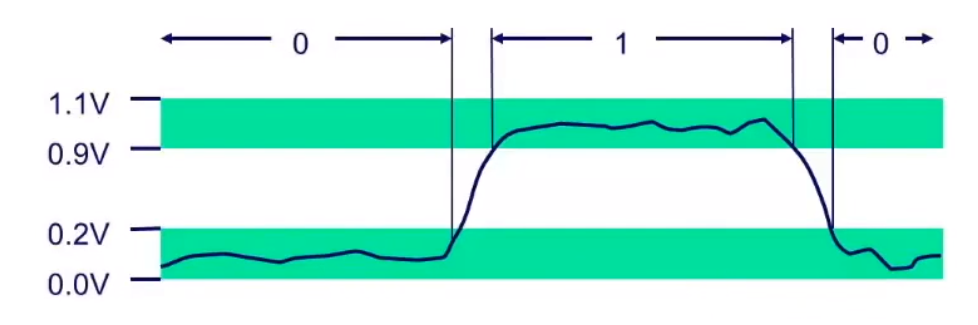
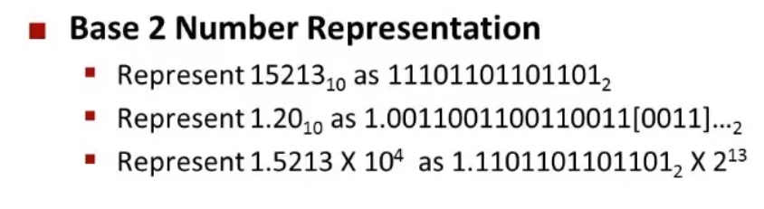
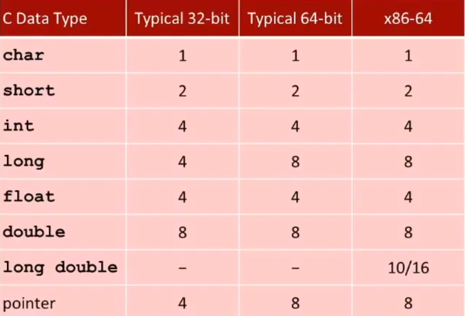
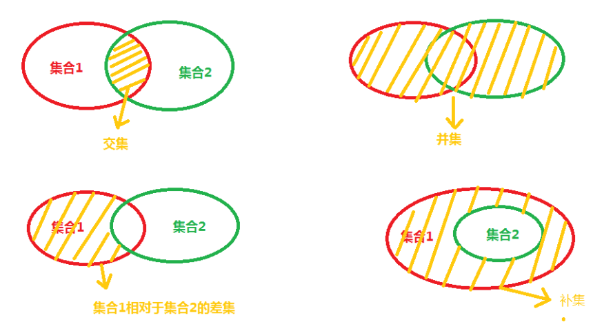
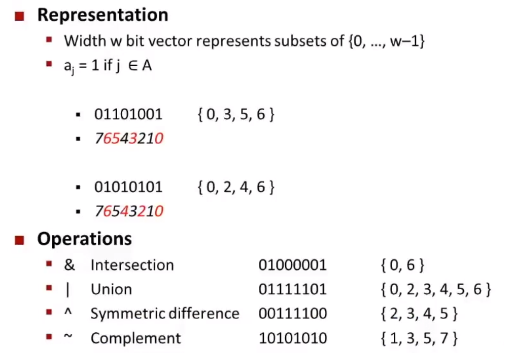

# Binary

为什么每个字节都是0和1，并选用这种方式存储数据？

- 易于用电子管的开和关表示
- 在不稳定的条件下也可以比较可靠的传输，如图：

**10进制到2进制的几种表示方法：**

- 整数最低位为2^0，小数点最高位开始以此为2^-1、2^-2。这也是用二进制表示浮点数的方法
- 太长的二进制难免看的难受，所以有了16进制，每4位二进制形成一位16进制

# Byte

- 1 Byte = 8 Bits
- 所以一个字节表示的二进制为 00000000 ~ 11111111；十进制为0 ~ 255；十六进制为 00 ~ FF
- 以下是在C中每个类型的值占多少Byte，Java中除了char占2byte，其他的都和下表的x86-64相同

# General Boolean Algebras

- And &：都为1时为1。交集
- Or |：有1则为1。并集
- 异或 ^：相同为0，不同为1。差集
- 非 ~：A =1 when A = 0。补集
- 
- 上图中的差集一般是对称差集，也就是交集取反
- 下图演示了各种操作，对于一串数字，在集合中的数字则为1，不在则为0
- 
- 上面的这些都是进行位操作，但我们总是与下面的判断真假的符号弄混
- &&、||、！：这些符号都是用来判断真假

# Shift Operations

Left Shift：X << y（X左移y位）01100010 << 2

- 左移的话不分逻辑左移还是算数左移，都一样
- 左移3位就舍去左边3位并在右边添3个0：100010**00**

Right Shift：X >> y（X右移y位）10100010 >> 2

- 右移要区分逻辑右移和算数右移
- 逻辑右移很简单，在左边填0右边舍去就行：**00**101000
- 算数右移由于二进制需要最高位表示正负号所以当最高位为1表示负数时，就需要在左边填充与符号位相同的数：**11**101000
- 如果是 01100010 >> 2，那么算数右移为：**00**0110000