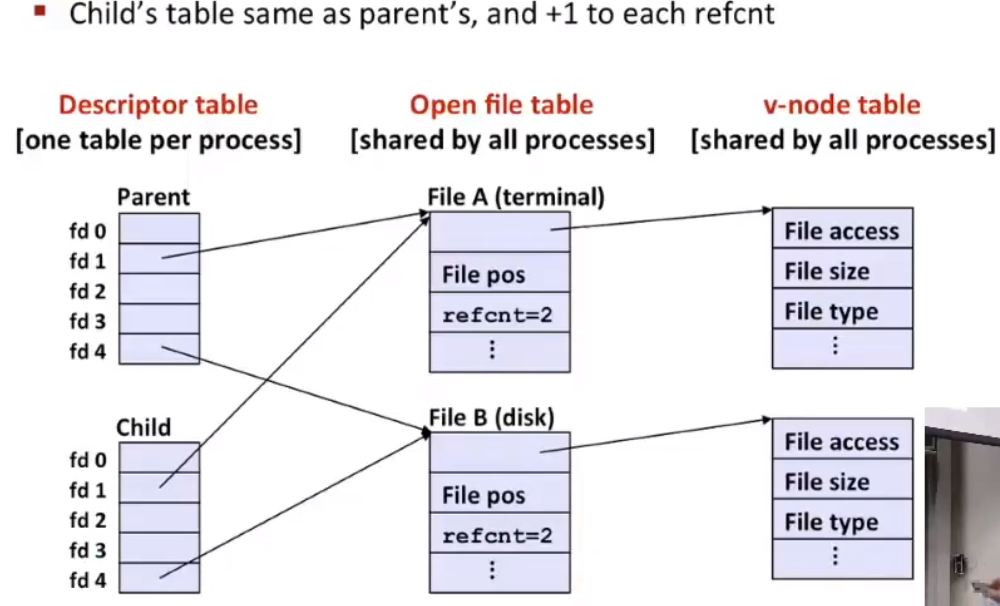

# Unix I//O Overvicw

- 对于Linux来说，文件只是一组字节序列，并不是什么特殊的东西
- 所有的I/O设备都被看做是文件
  - disk：/dev/sda2
  - terminal：/dev/tty2
- 内核也是一个文件
  - Kernel image：/boot/vmlinuz-3.13.0-55-generic
  - Kernel data struct：/proc
- 网络连接也是文件：socket

**Unix系统调用接口：**

- open()、close()、read()、write()、seek()
- 命令行或者socket这类无法用seek，因为根据偏移量定位未来输出的值

**EOF：**end of file。unix和window的换行符不同，发生EOF说明执行到文件结尾或网络连接已经关闭等。读到EOF会返回0。

**避免一次读/写一字节：**频繁的系统调用会使操作系统频繁的在内核态和用户态切换，所以尽量一次读/写多个字节

## Short Counts（不足值）

**short read：**当读入的字节数小于指定的最大值时，被称为short read

**以下情况会出现不足值：**

- 遇到EOF时，可能缓冲区为100字节，但读到10字节就遇到EOF，此时直接返回这10个字节不再向后读
- 从命令行读取一行
- 读或写socket时

**以下情况不会出现不足值：**

- 从硬盘读取文件（除了EOF的情况）
- 写文件到硬盘

# The RIO Package

RIO：robust I/O，对底层的系统调用进行了封装，尽可能的达到最高性能。解决了不足值的问题，如调用RIO包中的readn函数并指定字节数，在读完该字节数之前不会返回

**RIO提供了两种不同的读/写方法：**

- 二进制数据的直接读写
  - rio_readn和rio_writen
- 带缓冲区的读写
  - rio_readlineb和rio_readnb
  - 这种IO对于同一文件描述符是线程安全的，可以任意访问
  - 读或写都保存在了一块小的缓冲区中，可以是已读但未提交到程序的或者是已写但还未发送到网络上的

# Descriptor

**文件描述符：**是一个比较小的整数，标识当前程序正在操作的某个打开文件，按顺序从3开始编号，open()返回-1则打开文件出错。描述符数量是有限的，所以同时打开的文件数量是有限的。

**固定的几个文件描述符：**

- 标准输入：0
- 标准输出：1
- 标准错误：2
- 这也是为什么普通的文件描述符从3开始的原因

## How the Unix Kernel Represents Open Files

- 每个进程有一个Descriptor table，指向一个所有进程共享的打开文件表
- 每当一个进程执行open()时，都会在Descriptor table中增加一个条目，并指向Open file table中的对应条目（实际文件），Open file table中的每个条目还包含有文件元信息
- Open file table中的每个条目还保存有一个引用计数count，当count为0时表示该文件不再被使用，系统将回收分配给该文件的内存空间等资源。
- 回收时若文件被修改过，则将文件写回外存。这也是write-back思想，将修改推迟到文件不再被引用时。

**两次打开同一个一个文件时：**

操作系统允许你两次打开同一个文件，只是位置可能同，可以看到文件的元信息是同一份。当对一个文件同时读和写时也会发生这样的事情。

**当调用Fork时，子进程会继承父进程的文件描述符表：**

也就是说父子进程有相同的文件描述符表项

此时是文件级别的共享，意味着如果父进程读取一个文件到4字节，子进程再读取这个文件就是从4字节开始读的

这时候文件引用计数也会加1，所以只有当父子进程都调用close()关闭文件后，在操作系统层面才算是真正关闭了