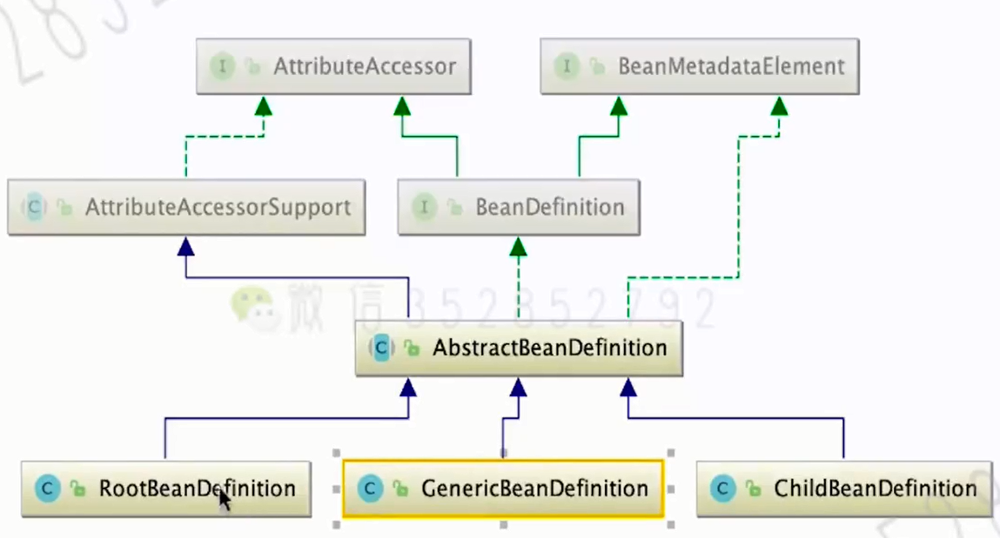
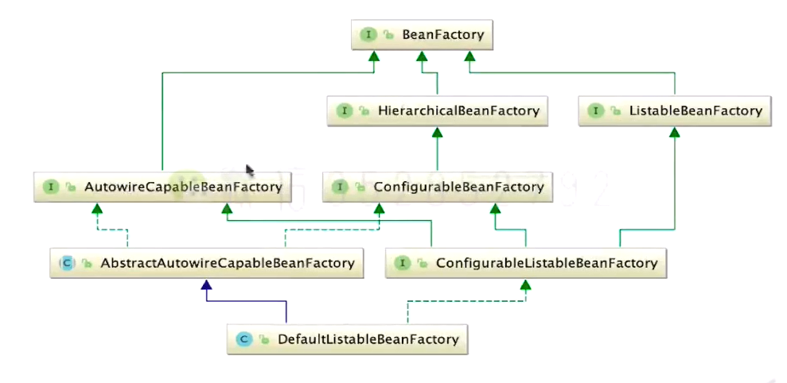
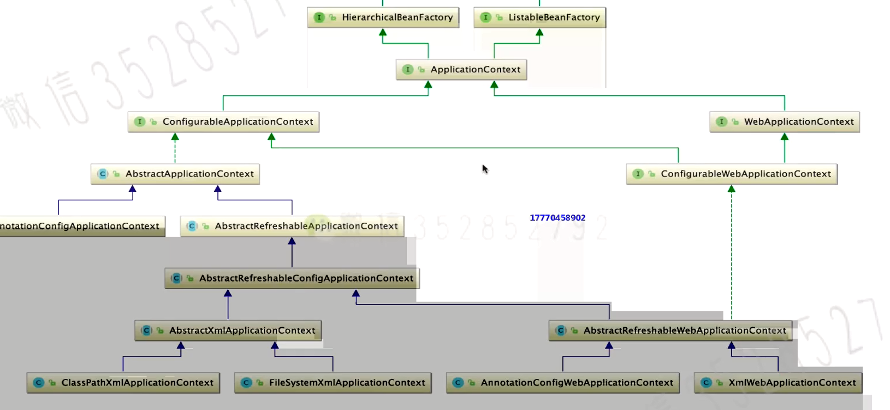
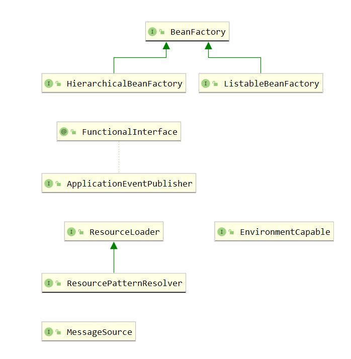

# BeanDefinition

在Java类的管理上，使用Class对象来描述一个类

**在Bean的管理上，使用了BeanDefinition来描述一个bean，如：**

- bean的作用范围：单例、原型等
- 是否延迟加载
- @primary：如果一个接口类型有多个实现bean，那么@primary为true的bean会被优先注入
- ..............

然后根据BeanDefinition的信息将bean注册到容器中

- AbstractBeanDefinition作为一个抽象类，实现了大部分的共用功能

- bean之间的继承关系通过setParent方法实现，而不是extends或Implaments
- RootBeanDefinition不可以有parent
- GenericBeanDefinition可以动态的设置父类BeanDefinition实例

# BeanFactory

**BeanFactory是Spring的IOC容器的根接口，定义了bean工厂的最基本的功能，如：**

- getBean(String name); getBean(Class<T> requiredType);.......等
- containsBean(String beanName)
- isSingleton(String beanName)
- isPrototype(String beanName)
- .........so on

# FactoryBean

**这只是一个使用工厂模式的工厂类，与上面的BeanFactory完全不一样**

FactoryBean也属于`Bean`。它的作用就是返回用户想要返回的对象实例User

在该接口中有：getObject方法，实现该方法返回想要返回的User bean即可

调用`getBean(myFactoryBean)`即可返回User实例而不是`myFactoryBean`

特别的，加上一个`&`前缀即可返回真正的FactoryBean对象：`getBean(&myFactoryBean)`

# 简单容器

以BeanFactory为根接口的简单容器实现

- [Interface] ListbleBeanFactory：能够列出BeanDefinition信息

  > - getBeanDefinitionCount(): int
  > - getBeanDefinitionNames(): String[]
  > - getBeanNamesForAnnotation(Class ? extends Annotaion) name): String[]
  > - .....so on

- [Interface] AutoWiredCapableBeanFactory：实现自动装配

  > - creatBean
  >
  > - autoWiredBean
  >
  > - applyBeanPostProcessor
  >
  > - resolveDependency
  >
  > - .......so on

- [Class] DefaultListableBeanFactory implements BeanDefinitonRegistry....：

  > - 实现的接口中，BeanDefinitonRegistry就是实现注册beanDefinition的主要接口
  > - `Map<String, BeanDefinition> beanDefinitionMap = new ConcurrentHashMap<>();` ，该map保存了所有已注册的beanDefinitiono

# 高级容器

高级容器可以说就是ApplicationContext

可以看到ApplicationContext接口继承自简单容器的第二层两个接口

ApplicationContext面向开发者

这是ApplicationContext接口继承的所有接口：

**ApplicationContext常用实现容器：**

- AnnotationConfigServletWebServerApplicationContext
- AnnotationConfigReactiveWebServerApplicationContext
- AnnotationConfigApplicationContext

**所有容器的共性：`refresh()`：**

- 容器的初始化、配置的解析
- BeanFactoryPostProcessor和BeanPostProcessor的注册和激活
- 国际化的配置
- 。。。

## ConfigurableApplicationContext

该接口直接继承自ApplicationContext，ApplicationContext接口只是定义了一些getXXX的只读方法，该接口扩充了容器的核心方法`refresh()`和一些set方法

- setId
- setParent
- addBeanFactoryPostProcessor
- refrsh
- ....

## AbstractApplicationContext

该类实现了上面的ConfigurableApplicationContext并继承自DefaultResourceLoader。基本上实现了容器的所有方法，未实现的方法定义为了抽象方法供子类实现。     也就是模板模式

该类是ApplicationContext最重要的抽象基类，有以下实现方法

- refresh：容器的刷新（重要），该方法的大致流程

  > prepareRefresh：模板方法，已经实现了
  >
  > obtainFreshBeanFactory：
  >
  > > refreshBeanFactory、getBeanFactory：抽象方法，子类必须根据自己的行为来进行实现
  >
  > postProcessBeanFactory：普通的钩子方法，子类可以选择性的实现它已扩展功能

- registerLiseners：监听器的注册

- getBean

- .....

# 容器初始化的主要脉络

读取配置文件  =》 封装成Resource对象  =》  解析文件内容注册为BeanDefinition =》 执行依赖注入

## Resource

将资源抽象成一个Resource对象。定义有如下方法：

- exists(): boolean
- getURL(): URL
- is Readable: boolean
- lastModified: long
- .....so on