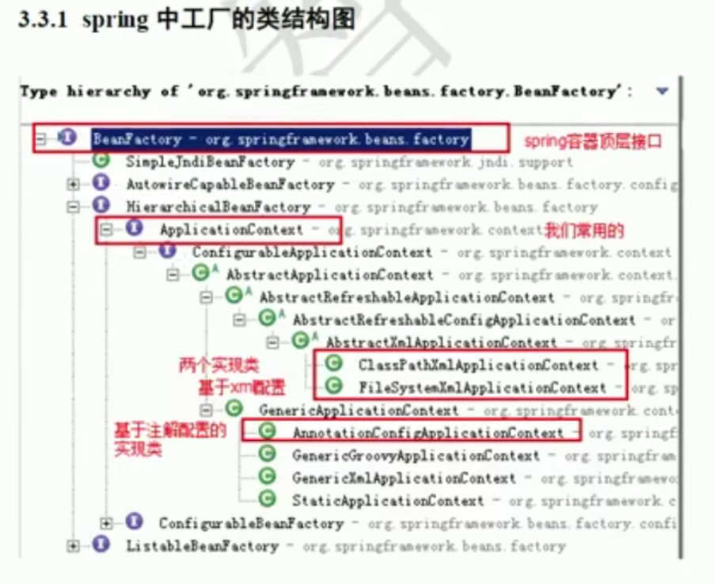

## 

**接口类与操作类：**

```java
package cn.yang;
public interface Account {
    void save();
}

package cn.yang;
public class ui implements Account {
    int i = 0;
    @Override
    public void save() {
        System.out.println("请点击存储" + i);
        i++;
        Ado a = (Ado)Bean.getBean("Ado"); //获取Ado持久层实例,需要将Object向下转型为Ado
        a.save();  //保存数据
    }
}

package cn.yang;
//持久层
public class Ado implements Account {
    @Override
    public void save() {
        System.out.println("存储完成");
    }
}
```

**工具类：**

```java
package cn.yang;

import java.io.IOException;
import java.io.InputStream;
import java.util.Enumeration;
import java.util.HashMap;
import java.util.Map;
import java.util.Properties;

public class Bean{
        public static Properties pro = new Properties();
        private static Map<String, Object> map = new HashMap<>(); //map是一个接口，需要用他的子类hashmap来实例化它
        static { //静态成员会在加载类时（第一次使用类时）就加载
            try {
                InputStream in = (Bean.class.getClassLoader().getResourceAsStream("info.properties"));
                pro.load(in);
                Enumeration keys = pro.keys();//返回一个枚举对象
                while (keys.hasMoreElements()) {
                    String key = keys.nextElement().toString();
                    String path = pro.getProperty(key);
                    Object value = Class.forName(path).getDeclaredConstructor().newInstance(); //forName获取到Class类型对象
                    map.put(key, value);
                }
            }catch (Exception e){
                System.out.println("初始化失败");
                e.printStackTrace();
            }
        }
        public static Object getBean(String name){
            return map.get(name);
        }
}
```

**客户端类：**

```java
package cn.yang;
//客户端需要调用ui层，ui层调用持久层
public class Client {
    public static void main(String[] args) {
        for (int x=0; x < 5; x++) {
            ui i = (ui) Bean.getBean("ui");
            i.save();
        }
    }
}
//输出
请点击存储0
存储完成
请点击存储1
存储完成
请点击存储2
存储完成
请点击存储3
存储完成
请点击存储4
存储完成
```

可以看到操作的多是同一个ui对象，通过容器我们也可以实现单例模式。

**上面我们通过反射与属性文件实现了对象的无new构造，**

**在Spring中实现这种操作会很简单，都会帮我们做好反射**

## Spring




```java
//Person类
public class Person {
    private static String name;
    private static Integer age;
    private static Date date;
    public Person(String name, Integer age, Date date){
        this.name = name;
        this.age = age;
        this.date = date;

    }

    public void p(){
        System.out.println(this.name + " " + this.age + " " + this.date.toString());
    }
}


//启动类
public class C {
    public static void main(String[] args) {
        //获取核心容器类，在实例化ClassPathXmlApplicationContext后我们在a.xml文件中所创建的bean实例就已经在Spring上下文中了。
        ApplicationContext ac = new ClassPathXmlApplicationContext("a.xml");
        Person p = (Person)ac.getBean("person"); //根据id获取bean对象
        p.p();
        ac.close(); //手动关闭容器
    }
}
```

```xml
//xml配置文件
<?xml version="1.0" encoding="UTF-8"?>
<beans xmlns="http://www.springframework.org/schema/beans"
       xmlns:xsi="http://www.w3.org/2001/XMLSchema-instance"
       xsi:schemaLocation="http://www.springframework.org/schema/beans http://www.springframework.org/schema/beans/spring-beans.xsd">
<!--name用来指定参数名称，value设值。最后有一个ref是引用的意思。因为value只能赋值一些基础类型，当需要工具类如Date时就需要再写一个bean然后引用它的id-->
<bean id="person" class="cn.yang.Person">
    <constructor-arg name="name" value="杨"></constructor-arg>
    <constructor-arg name="age" value="11"></constructor-arg>
    <constructor-arg name="date" ref="now"></constructor-arg>
</bean>
    <!--新建一个bean来获取Date对象。这条语句Spring已经帮我们根据这个类名反射创造好了对象然后存入Spring容器中，通过id可以将对象取出。在Spring容器中是这样存储的：{id:Object}-->
    <bean id="now" class="java.util.Date"></bean>
</beans>


<!--在注入时还可以选择set方法注入：假设我们现在有一个cn.yang.Person_1这个类
name指的是setName去掉set然后将Name第一个字母变为小写的值，并不是属性值，而是根据方法名指定的-->
<bean id="person_1" class="cn.yang.Person_1">
    <property name="name" value="杨"></property>
    <property name="age" value="11"></property>
    <property name="date" ref="now"></property>
</bean>
```

**使用set注入方式注入容器类型：**

```java
package cn.yang;
//demom操作类，定义容器
import java.lang.reflect.Array;
import java.util.*;

public class Setdemo {
    private String[] strs;
    private List<String> list;
    private Map<String, String> map;
    private Properties pro;
    private Set<String> set;

    public void setStrs(String[] strs) {
        this.strs = strs;
    }

    public void setList(List<String> list) {
        this.list = list;
    }

    public void setMap(Map<String, String> map) {
        this.map = map;
    }

    public void setPro(Properties pro) {
        this.pro = pro;
    }

    public void setSet(Set<String> set) {
        this.set = set;
    }
    public void print(){
        System.out.println(Arrays.toString(strs));
        System.out.println(map);
        System.out.println(set);
        System.out.println(list);
        System.out.println(pro);
    }
}
```

```xml
<!--在property下级标签下定义有容器标签，这里提供了各种容器标签，但是一共就分为两类，一类是list一类是map，我们只用这两种标签也是可以的 语法上map和props不同，但是可以统一成map都用map标签的语法-->
	<bean id="Setdemo" class="cn.yang.Setdemo">
        <property name="list">
            <list>
                <value>AAA</value>
                <value>EEE</value>
            </list>
        </property>
        <property name="strs">
            <array>
                <value>STRS</value>
                <value>WWW</value>
            </array>
        </property>
        <property name="map">
            <map>
                <entry key="II" value="YOUYOU"></entry>
            </map>
        </property>
        <property name="pro">
            <props>
                <prop key="OO">Prooror</prop>
            </props>
        </property>
        <property name="set">
            <set>
                <value>SET</value>
                <value>MMM</value>
            </set>
        </property>
    </bean>
```

```java
public class C {
    public static void main(String[] args) {
        //获取核心容器类，在实例化ClassPathXmlApplicationContext后我们在a.xml文件中所创建的bean实例就已经在Spring上下文中了。
        ApplicationContext ac = new ClassPathXmlApplicationContext("a.xml");
        Setdemo s = (Setdemo) ac.getBean("Setdemo");
        s.print();
    }
}
//输出
[STRS, WWW]
{II=YOUYOU}
[SET, MMM]
[AAA, EEE]
{OO=Prooror}
```

**Spring有三种方式获取核心容器：**

1. ClassPathhtmlApplicaitonContext：可以加载类路径下的配置文件，要求配置文件必须在类路径下，不存在则无法读取
2. FilesystemxmlApplicationContext：它可以加载任意路径下的配置文件（必须有访问权限）
3. AnnotationConfigApplicaitonContext：它通过注解获取容器