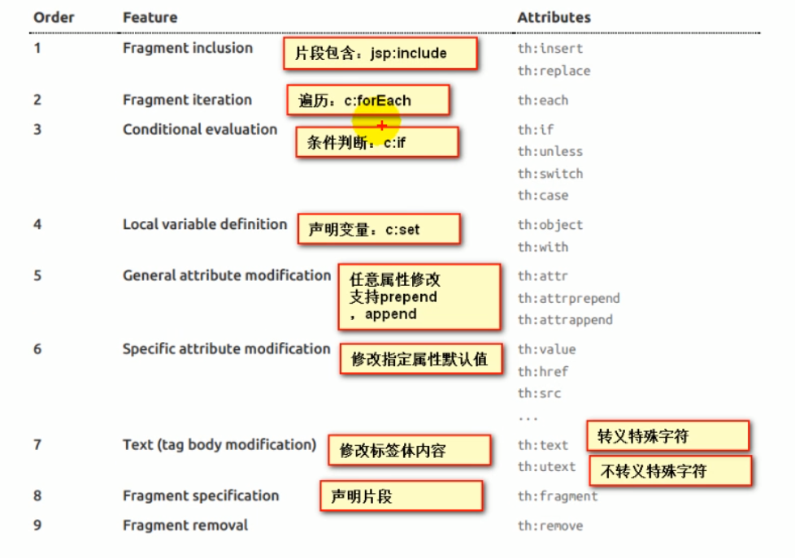

引入静态文件：直接导入webjar依赖就能用前端框架

resources目录下的public/resources/static都是静态文件夹，任一个下面添加一个index.html都会自动当作欢迎页

所有的**/favicon.ico（网站图标）都是在静态资源文件夹下找

## 模板引擎

jsp / Velocty / Thymeleaf

**SpringBoot推荐使用Thtmeleaf**

#### 使用

1. 引入Thymeleaf
2. 只要我们把HTML放在classpath:/templates/下thymeleaf就能帮我们自动渲染

```java
@RequestMapping("/success")
    public String in(){
        //返回success.html
        return "success";
    }
```

3. 导入thymeleaf名称空间：`xmlns:th="http://www.thymeleaf.org`

简单使用：

```java
@RequestMapping("/success")
    public String in(Map<String, String> map){
        map.put("hello","hahaha");
        return "success";
    }
```

```html
<!DOCTYPE html>
<html lang="en" xmlns:th="http://www.thymeleaf.org">
<head>
    <meta charset="UTF-8">
    <title>Title</title>
</head>
<body>
<h1>SUCCESS</h1>
<!--将map中的hello对应的值取出-->
<div th:text="${hello}"></div>
</body>
</html>
```

#### 语法规则：

1. <th:text：改变当前元素里面的内容，可以用在任何标签内并且可以替换任意原生属性的值

   > `<div th:text=${hello} th:id=${iiid} th:class=${classs}/>`
   >
   > id与class相当于在html中指定的一样



2. **表达式**

`1. ${...}`：获取变量值

> > 获取对象的属性、调用方法
> >
> > 使用内置的基本对象：如${session.foo}
> >
> > 内置一些工具对象：如：`${String.toStirng(Obj)}`调用对象的toString方法

2. `*{}：和${}功能一样。有一点增强，配合th:object使用调用对象的属性可以更方便
3. `#{}`：获取国际化内容
4. `@{}`：超链接使用
5. `~{}`：片段，引用表达式

