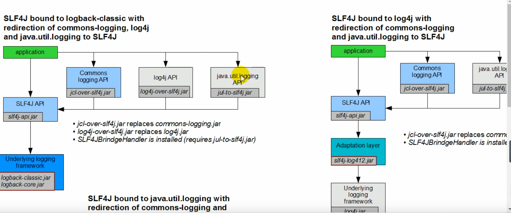
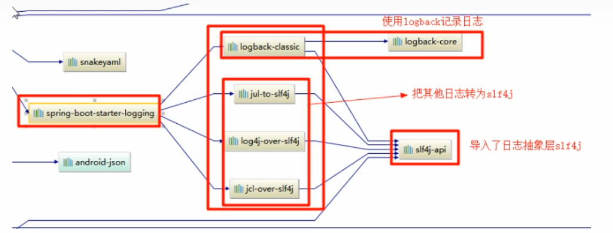

**日志系统为了统一方法、标准产生了很多抽象的接口，其中最为突出的一个就是SLF4j.**

**那么SpringBoot采用的就是SLF4j，并且采用了他的一个实现类logback**

#### SLF4j使用

##### 1.如何在系统中使用SLF4j

以后再开发的时候，日志记录方法的调用，不应该来直接调用日志的实现类，而是应该调用抽象层的方法。

**首先导入SLF4j的jar包和logback的实现jar**

```java
import org.slf4j.Logger;
import org.slf4j.LoggerFactory;

public class HelloWorld {
  public static void main(String[] args) {
    Logger logger = LoggerFactory.getLogger(HelloWorld.class);
    logger.info("Hello World");
  }
}
```


每一个日志的实现框架都有自己的配置文件。配置文件使用slf4j以后，配置文件还是做成日志实现框架的日志实现。也就是用哪个实现slf4j就用哪个框架的配置文件。

**但是**

在我们项目开发的时候，难免会用到其他的框架(Mybatis, Hibernate, spring)这些框架有用Commons-logging的有用log4j的等等，但是我们用的是logback。

这时候就需要一个东西能够将所有框架的日志记录都换成logback的jar包，但是这些框架都在调用他们默认的日志记录的api一换日志框架肯定会报错。这时候SLF4j提供了一个通用的解决方案



也就是将其他框架上的日志框架都换成logback，更换的jar包支持原来框架的api并且能够兼容logback。这么一来就完美了~

**这些替换SpringBoot都自动替我们做了**



SpringBoot底层就用了slf4j+logback的方式

SpringBoot也将其他的日志都替换成了slf4j

如果我们要引入其他框架，一定要将它的日志jar包移除。然后SpringBoot会帮我们适配他的日志框架

## 使用日志