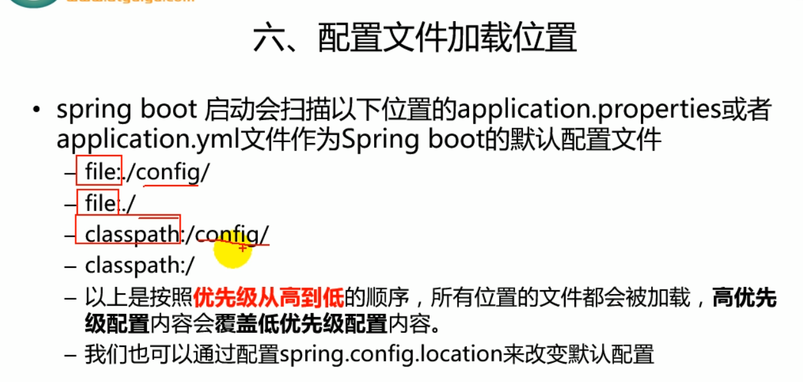

## 配置文件

**SpringBoot使用一个全局的配置文件，文件名是固定的**

**application.properties      application.yml**

yml是以数据为中心的配置文件类型。比xml和json都更优秀

YAML：

```yml
servcer:
	posr:8080
```

XML:

```xml
<server>
	<port>8080</port>
</server>
```

properties:

```properties
server=8080
```

#### YAML的语法（每个：后记得添加空格）

##### 1.基本语法

k:(空格)v ：表示一对键值对（空格必须有）

以空格的缩进来控制层级关系，缩进相同的数据都是同一层级的

##### 2.值的写法

**字面量：普通得值（数字、字符串、布尔）**

> > k:v：字面直接写。字符串默认不用加上引号
> >
> > 双引号：不会转义字符串里得特殊字符，特殊字符会作为本身得意思
> >
> > > "aaa /n bbb" = aaa换行bbb
> >
> > 单引号：会转义特殊字符，特殊字符最终只是一个普通字符串
> >
> > > 'aaa/nbbb' = aaa/nbbb

**对象（属性和值）（键值对）**

> > k: v ：对象还是k:(空格)v的方式，下一行写对象的属性和值
> >
> > > ```yml
> > > friends:
> > > 	name: aaa
> > > 	age: 33
> > > ```
> > >
> > > 

**数组（List、Set）**

> > 用-(空格)值表示数组中的一个元素
> >
> > ```yml
> > pets:
> > - cat
> > - dog
> > - pig
> > ```
> >
> > 行内写法
> >
> > ```yml
> > pets:[cat,dog,pig]
> > ```
> >
> > 

## 利用配置文件注入内容

首先创建实体类：Person和Dog

```java
/**
 * 将配置文件中每一个属性的值映射到这个组件中
 * ConfigurationProperties：告诉SpringBoot将本类中所有的属性和配置文件中相关的配置进行绑定
 * prefix：配置文件中哪一个下面的属性进行一一映射
 * 要记得将本类添加到容器中称为bean对象，才能帮我们自动配置属性
 */
@Component
@ConfigurationProperties(prefix = "person")
public class Person {
    private String name;
    private Integer age;
    private List<Object> hoby;
    private Map<String, Object> map;
    private Dog dog;
```

Dog类含有name和age属性

导入`@ConfigurationProperties`依赖

```
annotationProcessor "org.springframework.boot:spring-boot-configuration-processor"
```


下面配置配置文件：

```yml
server:
  port: 8081

yml按缩进分级，server和person属于两个不同的块
person:
  name: yang
  age: 22
  hoby:
    - computer
    - gym
  map: {k1: v1,k2: v2}
  dog:
    name: pet
    age: 12
```

Test

```java
//RunWith注解指定用Spring提供的测试类，那么就可以在测试中使用AutoWired注入
@RunWith(SpringRunner.class)
@SpringBootTest
class DemoApplicationTests {
    //容器中已经有了经过配置文件配置过的person
    @Autowired
    Person person;

    @Test
    void contextLoads() {
        System.out.println(person);
    }
}
```

如果是在`.properties`文件中配置

```properties
person.name=yang
person.hoby=computer,a,v,c
person.aage=22
person.dog.name=pet
person.dog.age=12
person.map.k1=v1
person.map.k2=v2
```

**如果是在类中单一的一个值需要用到配置文件的内容那么用@Value会更方便**

```java
@Value("${person.name}") //会自动读取全局配置文件中的内容
private String name;
```

我们现在为止都是用的全局配置文件，所以不用担心加载不到配置。

**如果有一个配置文件：**person.properties需要加载，那么就需要用到@PropertySource注解

```java
@PropertySource(value = "{"classpath:person.properties"}")
public class Person(){}
//value的值是一个数组，所以我们可以传入多个配置文件的值，
```

#### 自定义配置类：

```java
//@Configuration指定当前是一个配置类
@Configuration
public class MyAppConfig{
    //将方法的返回值添加到容器中，bean id默认为方法名（第一个字母小写）
    @Bean()
    public HelloService helloservice(){
        return new HelloService();
    }
}
```

测试：

```java
@AutoWired
ApplicationContext ioc;
@Test
public void testConfig(){
    boolean boo = ioc.containsBean("helloService");
    System.out.println(boo);
}
//输出
true
```

**在开发中可能有多个Profile文件(开发环境、生产环境)，这时可能需要指定不同的配置文件，那么就可以将其他的配置文件写成：application-xxx.properties/yml**

默认是application.properties/yml，但当我们在application.properties/yml中写一行：

`spring.profiles.active=dev`那么就会默认使用application-dev.properties/yml

**当我们以yml作为主配置文件会简单点，不会有多个配置文件**

```yml
server:
  port: 8081
spring:
  profiles:
    active: dev
---
server:
  port: 8083
spring:
  profiles: dev
---
server:
  port: 8084
spring:
  profiles: product
```

yml以三横线---为分割，将文档分为不同的块。相当于不同的yml文件

我们在第一个块中指定了激活的环境配置为dev，此时的端口就是8083

**如果将项目打成了jar包，那么可以在命令行运行jar包时指定环境**

```
java -jar -xxx.jar --spring.profiles.active-dev
```



虽然高优先级会覆盖低优先级，但是不代表就不能有多个配置文件了。我们可以在不同优先级的配置文件中配置不同的配置（互补配置）

## 自动配置原理

SpringBoot启动时加载主配置类，并开启自动配置功能@EnableAutoConfiguration

**@EnableAutoConfig的作用:**

> 利用EnableAutoConfigurationImportSelect给容器中导入一些组件