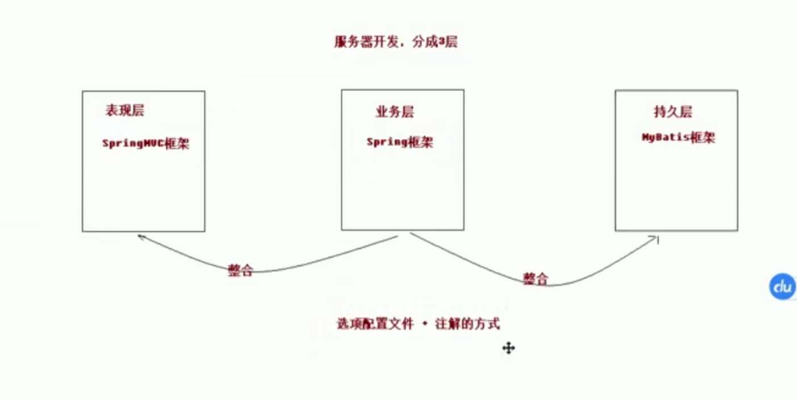
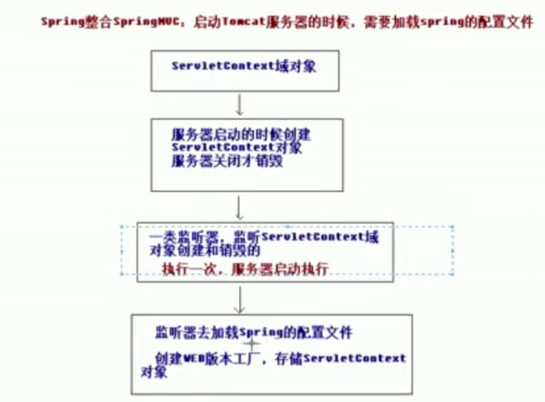

**ServletContext对象：**

- WEB容器在启动时，它会为每个Web应用程序都创建一个对应的ServletContext，它代表当前Web应用。并且它被所有客户端共享。
- ServletContext对象可以通过`ServletConfig.getServletContext()`方法获得对ServletContext对象的引用，也可以通过`this.getServletContext()`方法获得其对象的引用。
- 由于一个WEB应用中的所有Servlet共享同一个ServletContext对象，因此Servlet对象之间可以通过ServletContext对象来实现通讯。ServletContext对象通常也被称之为context域对象。公共聊天室就会用到它。
- 当web应用关闭、Tomcat关闭或者Web应用reload的时候，ServletContext对象会被销毁



在`spring`中有一个`ContextLoaderListener`

```xml
<!--配置监听器,默认加载WEB-INF目录下的applicationContext.xml文件。
  配置监听器后就可以在servlet启动时加载spring配置文件并将bean对象放入spring的容器中以便表现层Conotroller自动注入-->
  <listener>
    <listener-class>org.springframework.web.context.ContextLoaderListener</listener-class>
  </listener>
  <!--设置配置文件路径,使监听器加载类路径下的applicationContext.xml配置文件-->
  <context-param>
    <param-name>contextConfigLocation</param-name>
    <param-value>classpath:applicationContext.xml</param-value>
  </context-param>
```

