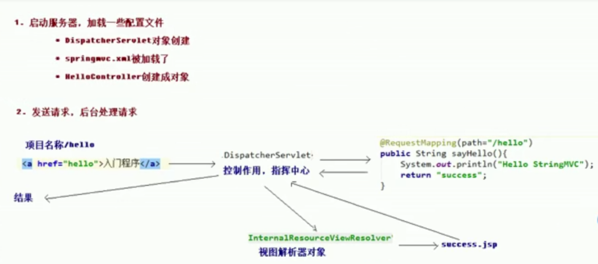
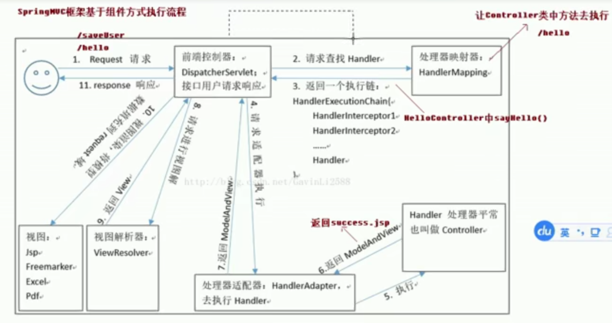

## [SpringMVC是怎么工作的](https://stackify.com/spring-mvc/)

新建一个maven工程，选择 web-app 骨架

在最后一步时添加一个键值对：archetypeCatalog : internal。添加后初始化框架会快一点。

配置pom.xml导入依赖

```xml
<?xml version="1.0" encoding="UTF-8"?>

<project xmlns="http://maven.apache.org/POM/4.0.0" xmlns:xsi="http://www.w3.org/2001/XMLSchema-instance"
  xsi:schemaLocation="http://maven.apache.org/POM/4.0.0 http://maven.apache.org/xsd/maven-4.0.0.xsd">
  <modelVersion>4.0.0</modelVersion>

  <groupId>cn.yang</groupId>
  <artifactId>mvcDemo</artifactId>
  <version>1.0-SNAPSHOT</version>
  <packaging>war</packaging>

  <name>mvcDemo Maven Webapp</name>
  <!-- FIXME change it to the project's website -->
  <url>http://www.example.com</url>

  <properties>
    <project.build.sourceEncoding>UTF-8</project.build.sourceEncoding>
    <maven.compiler.source>1.7</maven.compiler.source>
    <maven.compiler.target>1.7</maven.compiler.target>
    <spring.version>5.0.4.RELEASE</spring.version>
  </properties>

  <dependencies>
    <dependency>
      <groupId>junit</groupId>
      <artifactId>junit</artifactId>
      <version>4.11</version>
      <scope>test</scope>
    </dependency>
    <dependency>
      <groupId>org.springframework</groupId>
      <artifactId>spring-context</artifactId>
      <version>${spring.version}</version>
    </dependency>
    <dependency>
      <groupId>org.springframework</groupId>
      <artifactId>spring-web</artifactId>
      <version>${spring.version}</version>
    </dependency>
    <dependency>
      <groupId>org.springframework</groupId>
      <artifactId>spring-webmvc</artifactId>
      <version>${spring.version}</version>
    </dependency>
    <dependency>
      <groupId>javax.servlet</groupId>
      <artifactId>javax.servlet-api</artifactId>
      <version>3.0.1</version>
      <scope>provided</scope>
    </dependency>
    <dependency>
      <groupId>javax.servlet.jsp</groupId>
      <artifactId>jsp-api</artifactId>
      <version>2.1</version>
      <scope>provided</scope>
    </dependency>
  </dependencies>


```

配置前端控制器：web.xml文件

```xml
<!DOCTYPE web-app PUBLIC
 "-//Sun Microsystems, Inc.//DTD Web Application 2.3//EN"
 "http://java.sun.com/dtd/web-app_2_3.dtd" >

<web-app>
  <display-name>Archetype Created Web Application</display-name>
  <servlet>

    <!--servlet内部名称，如果自己写的servlet那么是自定义，但这里springMVC提供servlet的就是这个名字。不能更改-->
    <servlet-name>dispatcherServlet</servlet-name>
    <!--servlet的类全名：包名+简单类名。springMVC给我们提供了一个全能servlet类-->
    <servlet-class>org.springframework.web.servlet.DispatcherServlet</servlet-class>

    <!-- 配置初始化参数，如：spring配置文件。-->
    <init-param>
      <param-name>contextConfigLocation</param-name>
      <param-value>classpath:springMvc.xml</param-value>
    </init-param>

    <!--设置启动时加载。不设置的话servlet类只会在第一次请求时加载-->
    <load-on-startup>1</load-on-startup>

  </servlet>

  <!--配置上面的servlet类的映射路径，这里一般是 /，表示拦截所有的请求交给DispatcherServlet处理-->
  <servlet-mapping>
    <servlet-name>dispatcherServlet</servlet-name>
    <url-pattern>/</url-pattern>
  </servlet-mapping>
</web-app>
```

**在resource文件夹下创建spring配置文件：springMvc.xml**

添加注解扫描标签

```xml
<?xml version="1.0" encoding="UTF-8"?>
<beans xmlns="http://www.springframework.org/schema/beans"
       xmlns:mvc="http://www.springframework.org/schema/mvc"
       xmlns:xsi="http://www.w3.org/2001/XMLSchema-instance"
       xmlns:context="http://www.springframework.org/schema/context"
       xsi:schemaLocation="http://www.springframework.org/schema/beans
        https://www.springframework.org/schema/beans/spring-beans.xsd
        http://www.springframework.org/schema/mvc
        https://www.springframework.org/schema/context/spring-mvc.xsd
        http://www.springframework.org/schema/context
        https://www.springframework.org/schema/context/spring-context.xsd">

    <!--开启注解扫描-->
    <context:component-scan base-package="cn.yang"></context:component-scan>

    <!--视图解析器对象,也就是配置jsp文件路径。控制器返回的.jsp视图将由这个bean对象处理-->
    <bean id="internalResourceView" class="org.springframework.web.servlet.view.InternalResourceViewResolver">
        <!--配置文件所在文件夹-->
        <property name="prefix" value="/WEB-INF/pages/"></property>
        <!--配置该文件夹的文件后缀名-->
        <property name="suffix" value=".jsp"></property>
    </bean>

</beans>

```

控制器：hello.java

```java
//控制器类
@Controller
public class Hello {
    @RequestMapping(path = "/hello")
    public String sayHello(){
        System.out.println("Hellooooooooooooooo");
        //return 返回success.jsp文件。显示给浏览器
        return "success";
    }
}

```



