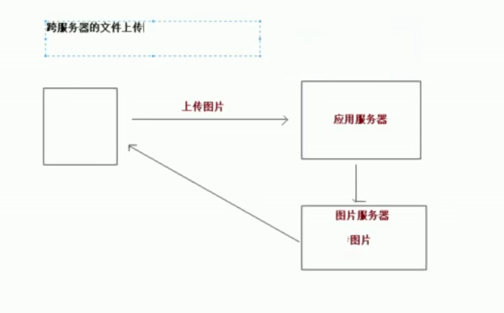

文件上传的必要前提：

> 1. form表单的enctype取值必须是：`mutipart/form-data`
>
>    > 默认值是：`application/x-www-form-urlencoded`
>    >
>    > `enctype`：表单请求正文的类型
>
> 2. method属性取值必须是post
>
> 3. 提供一个文件选择域：`<input type="file"/>`


**传统的上传文件方式：**

```java
@RequestMapping("/fileupload")
public String fileUpload(HttpServletRequest request) throws Exception {
    //使用fileupload组件完成上传
    //上传的位置
    String path = request.getSession().getServletContext().getRealPath("/uploads/");
    File file = new File(path);
    //如果路径不存在则创建路径
    if(!file.exists()){
        file.mkdirs();
    }
    //解析request对象，获取上传文件项
    DiskFileItemFactory factory = new DiskFileItemFactory();
    ServletFileUpload upload = new ServletFileUpload(factory);
    //解析request
    List<FileItem> items = upload.parseRequest(request);
    //便利
    for (FileItem item:items){
        //进行判断，判断item对象是否是上传文件项
        if (item.isFormField()){
            //普通表单项
        }else {
            //上传文件项
            //获取上传的文件名
            String filename = item.getName();
            //保存文件
            item.write(new File(path, filename));
            //删除临时文件
            item.delete();
        }
    }
    return "success";
}
```

**SpringMVC方式上传文件**

```java
@RequestMapping("/fileupload")
//需要一个MultipartFile类型参数，参数名和jsp中form中的input标签的name一样
public String fileUpload(HttpServletRequest request, MultipartFile upload) throws Exception {
    //使用fileupload组件完成上传
    //上传的位置
    String path = request.getSession().getServletContext().getRealPath("/uploads/");
    File file = new File(path);
    //如果路径不存在则创建路径
    if(!file.exists()){
        file.mkdirs();
    }
    String filename = upload.getOriginalFilename();
    upload.transferTo(new File("e:" + File.separator + "firefox", filename));
    return "success";
}
```

**配置文件解析器，id固定**

```xml
    <bean class="org.springframework.web.multipart.commons.CommonsMultipartResolver" id="multipartResolver">
        <property name="maxUploadSize" value="100000000000"></property>
    </bean>
```

## 跨服务器上传文件

