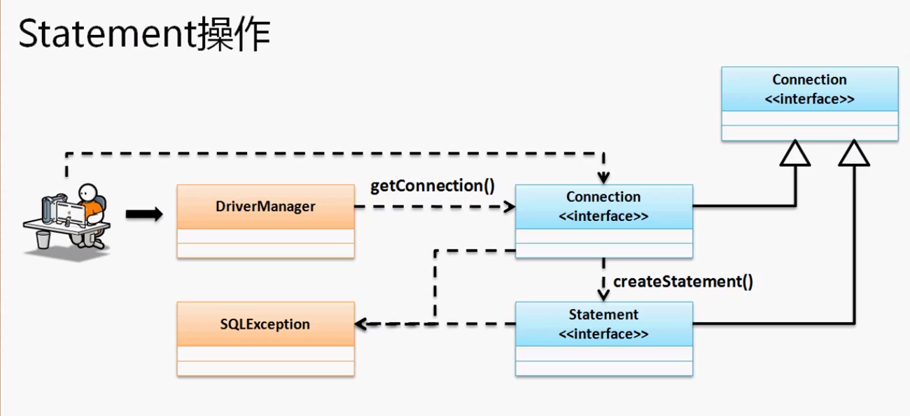

在Jav中对于数据库的操作提供了一个标准---JDBC。或者说JDBC就是一项服务

JDBC是一个专门的针对于关系型数据库的开发服务。


JDBC是操作数据库的一个接口，想要操作数据库就必须要数据库厂商提供驱动程序。

也就是针对于不同的数据库有不同的数据库驱动的配置。针对JADBC的操作主要有以下三类：

1. JDBC-ODBC：利用微软的ODBC技术进行数据库的连接，而后程序通过JDBC进行ODBC的处理访问，这种访问的支持是由windows版JDK默认提供的。不需要任何的数据库驱动配置。

   > 流程：程序  -> JDBC -> ODBC -> 数据库。JDBC和ODBC都是数据库的操作标准，所以此类操作的性能是最差的，因为ODBC能干的活JDBC也能干。

2. JDBC连接：直接利用数据库厂商提供的驱动，性能最好

   > 流程：程序 -> JDBC -> 数据库

3. JDBC网络连接：在真实的开发或是项目中，数据库一般是存在于单个（集群）上，我们要通过具体的网络协议进行连接数据库。

**JDBC所有的操作都在java.sql包中定义了：**

**类：**DriverManager类

**接口：**Connection、Statement、PreparedStatement、ResultSet

**如果要想进行数据库的连接。在JDBC中使用java.sql.Connection接口描述的是每一个数据库的连接信息。也就是说如果一个用户操作时只要过的了Connection的接口对象就可以操作了。**

**要想获得Connection对象就需要使用java.sql.DriverManager程序类。**

在DriverManager类中有如下方法返回Connection对象：

```java
public static Connection getConnection(String url,
                                       String user,
                                       String password)
                                throws SQLException
```

如果要进行数据库的操作那么需要以下四个信息：

1. 数据库的驱动程序："com.mysql.jdbc.Driver"

2. 链接地址：不同的数据库有不同的连接地址格式

   > `"jdbc:mysql://localhost:3306/Blog?useUnicode=true&characterEncoding=UTF-8"`

3. 用户名

4. 密码

**JDBC具体的操作步骤：**

> 向容器中今昔你个数据库驱动的加载：`Class.forName("com.mysql.jdbc.Driver")`
>
> 通过DriverManager取得一个连接对象：`DriverManager.getConnection()`
>
> 通过连接对象创建所有的数据库操作对象，CRUD
>
> 数据库数以资源操作，必须要记得关闭数据库


由于工厂设计模式的优势，我们不论连接什么数据库都只需调用工厂类就可以自动为我们做完一切繁琐的事。

```java
package cn.yang.demo;

import java.sql.Connection;
import java.sql.DriverManager;

public class TestDemo {
	public static final String DBDRIVER = "com.mysql.cj.jdbc.Driver";
	public static final String URL = "jdbc:mysql://localhost:3306/Blog";
	public static final String DBUSER= "yang";
	public static final String PASSWORD = "123456";
	public static void main(String[] args) throws Exception {
		Class.forName(DBDRIVER);
		Connection con = DriverManager.getConnection(URL, DBUSER, PASSWORD);
		System.out.println(con);
		con.close();
	}
}
//输出：com.mysql.cj.jdbc.ConnectionImpl@57e1b0c
```

当取得了数据库连接后所需要进行的就是数据库的操作。在java.sql包中数据库操作最基础的接口就是：Statement接口

通过Connection对象的一个方法可以获取Statement接口对象：`public Statement creatStatement() throws Exception`

想要用Statement进行数据库的操作那么主要依靠两个方法：

1. 查询：返回一个ResultSet接口对象。

   ```java
   public ResultSet executeQuery(String sql)
                   throws SQLException
   ```

2. 更新：返回更新行数

   ```java
   public int executeUpdate(String sql)
              throws SQLException
   ```

