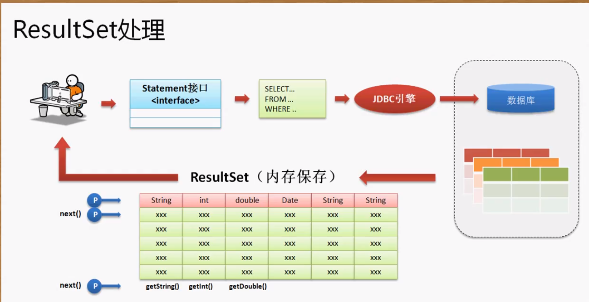
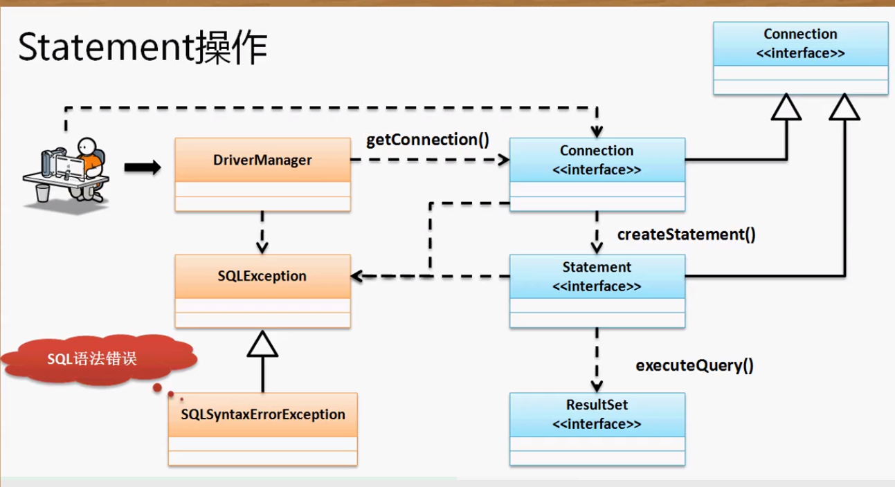

**首先创建数据表：**

```mysql
CREATE TABLE IF NOT EXISTS member(
        mid     INT  AUTO_INCREMENT,
        name    VARCHAR(50) NOT NULL,
        age     INT,
        birthday DATE,
        note    BLOB,
        PRIMARY KEY(mid)
)ENGINE=InnoDB DEFAULT CHARSET=utf8;
```

#### 使用Statement进行更新操作：

1. INSERT:`inset into table(字段，...)values(值.....)`

   ```java
   public class TestDemo {
   	public static final String DBDRIVER = "com.mysql.cj.jdbc.Driver";
   	public static final String URL = "jdbc:mysql://localhost:3306/douban";
   	public static final String DBUSER= "yang";
   	public static final String PASSWORD = "123456";
   	public static void main(String[] args) throws Exception {
   		Class.forName(DBDRIVER);
   		Connection con = DriverManager.getConnection(URL, DBUSER, PASSWORD);
   		Statement state = con.createStatement();
   		String sql = "insert into member(name, age, birthday, note)values('杨不优秀', 20, '1997-11-16', '草')";
   		int len = state.executeUpdate(sql);
   		System.out.println("数据库更新行数：" + len);
   		con.close();
   	}
   ```

   2. 修改数据：`update table set 字段=值..... where id=...`

      ```java
      //只需修改sql语句
      String sql = "update member set age=23 where name='杨优秀'";
      ```
   3.删除数据：`delete from member where mid=1` 删除一行数据

下面是关于查询的处理，对于查询返回的数据可能是非常繁琐庞大的，所以需要一个对象去处理解析各种数据。关系型数据库返回的查询都是表结构的数据结构。





**ResultSet对象的next()方法返回布尔值表示是否有值，同时它还会将指针向下移动一行**

```java
		String sql = "select mid,name,age,birthday,note from member order by mid";
		ResultSet rs = state.executeQuery(sql);
		while(rs.next()) {
			int mid = rs.getInt("mid");
			String name = rs.getString("name");
			int age = rs.getInt("age");
			Date date = rs.getDate("birthday");
			String note = rs.getString("note");
			System.out.println(mid +"  " + name + "  " + age +"  " +date + "  " + note);
		}
//输出
1  杨优秀  23  1997-11-16  哈哈哈哈
2  杨不优秀  20  1997-11-16  草
    
//但是一般我们取得字段值的时候会选择使用序号来获得，只不过这样需要记住表中字段的顺序
	int mid = rs.getInt(1);
	String name = rs.getString(2);
	int age = rs.getInt(3);
	Date date = rs.getDate(4);
	String note = rs.getString(5);
```