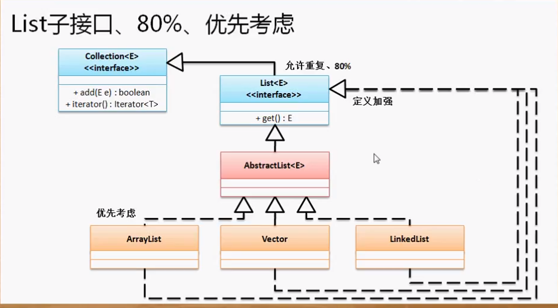
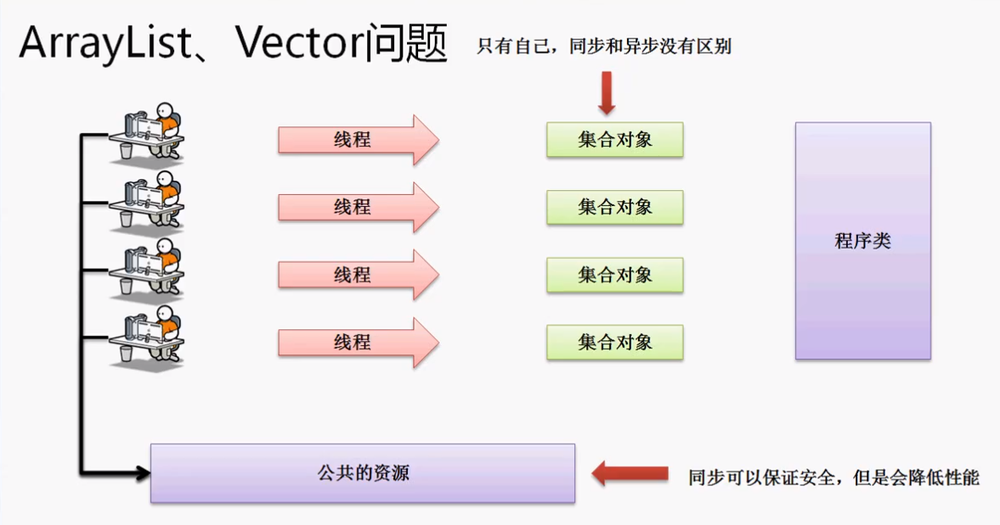

## `Interface List<E>`

在List接口中有两个重要的扩充方法：

1. 根据索引取得数据：`E get(int index)`

2.根据索引修改数据：

```java
E set(int index,
      E element)
```

List比Collection方法多了一个对于列表最重要的方法-->根据索引取得值

**List作为一个接口它只是一个协议，我们需要有子类去implement它。所以基础库中有三个List的子类：ArrayList、Vector、LinkedList**



## `ArrayList`

ArrayList是一个针对于List接口的数组操作实现。

范例：可以选择子类实例化父类

```java
List<String> all = new ArrayList<String>();
all.add("Hello");
all.add("Hello"); //重复数据
all.add("杨优秀");
System.out.println(all);
//输出
[Hello, Hello, 杨优秀]
```

List是可以重复数据的。并且可以通过索引取出数据：`System.out.println(all.get(0));`

**因为get是List独有的，所以用子类ArrayList实例化父赋类Collection时就不能用get； ，因为Collection接口中并没有get方法（花弧的引用指向花木兰对象那么不能使用花木兰独有的方法）。**

```java
Collection<String> all = new ArrayList<String>();
all.add("Hello");
all.add("Hello"); //重复数据
all.add("杨优秀");
System.out.println(all.get(0)); //错误
System.out.println(all); //输出：[Hello, Hello, 杨优秀]
```

**所以不到万不得已不要跳级用Collection。**

## ArrayList与简单Java类

```java
List<Person> all = new ArrayList<>(); //后面的泛型编译时会根据前面的Person获得
all.add(new Person("杨优秀", 22));
all.add(new Person("杨不优秀", 12));
for(Person p : all) {
	System.out.println(p);
}
//输出
Person [name=杨优秀, age=22]
Person [name=杨不优秀, age=12]
```

我们创建了一个Person类，该类包含有name和age两个属性。

当我们使用contains()方法时会返回false：

```java
System.out.println(all.contains(new Person("杨优秀", 22))); 
//输出：false
//contains会调用泛型对象的equals方法
```

这时因为Person类中的equals()方法继承了Object类中的，而Object类中的equals方法定义如下：

> ```java
>     public boolean equals(Object obj) {
>         return (this == obj);
>     }
> ```
>
> 它是根据对象在内存中的地址来判断的

**我们只要更改equals方法，使姓名和年龄相同的话就认为是同一个人。**

> ```java
> @Override
> public boolean equals(Object obj) {
> 	Person per = (Person)obj;   //向下转型，因为要用到Person类属性（花木兰在军营中只能使用花弧的性别属性）
> 	if(obj == null) {
> 		return false;
> 	}
> 	if (this == obj) {
> 		return true;
> 	}
> 	if (!(obj instanceof Person)) {
> 		return false;
> 		}
> 	return this.name.equals(per.name) && this.age.equals(per.age) ;
> }
> ```
>
> **这样的话上面的contains方法就会返回true~**

## Vector

Vector这个类在JDK1.0就提出了，所以不大用了。为了那些老开发员才保留下来。

```java
List<String> all = new Vector<>(); //后面的泛型编译时会根据前面的Person获得
all.add("hello");
all.add("Hello");
System.out.println(all);
//输出
[hello, Hello]
```

Vector与ArrayList操作差不多。他们的区别为：

1. Vector出现较早
2. Vector的get方法有一个同步关键字，所以ArrayList可以异步而Vector不可以。但是同步意味着线程安全，异步意味着线程不安全。

**优先考虑ArrayList，并且为了性能，在初始化ArrayList时尽量要初始化大小**



## LinkedList

List接口下还有一个LinkedList子类，这个子类在使用上转型什么的与其他子类没有任何区别。

LinkedLise是一个纯粹的链表实现。