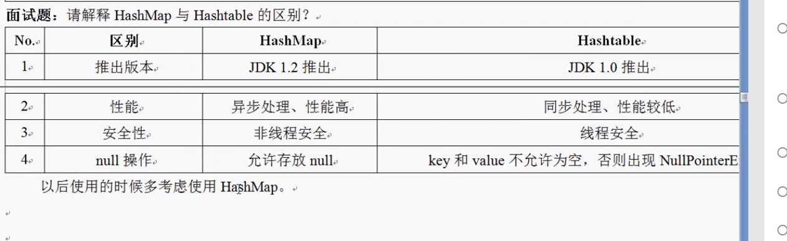
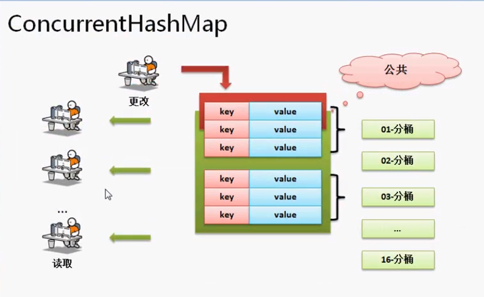
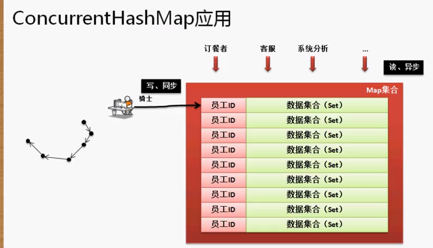
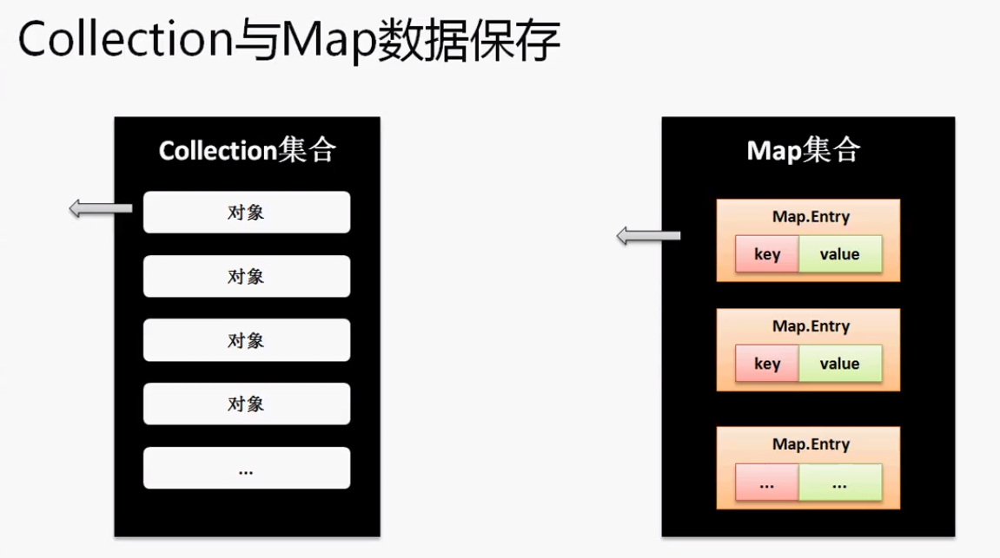
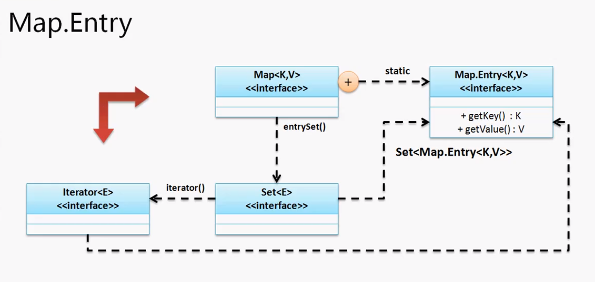

`key = value`

接口定义：`public interface Map<K, v>`

**主要方法：**

1. 向集合中追加键值对：`public V put(K key, V value)`
2. 根据键得到值：`public V get(Object key)` 如果没有key对应的值则返回空
3. 得到所有key的信息：`public Set<K> keySet()`  返回一个集合，所以key不能重复
4. 得到所有的value：`public Collection<V> values()`   返回值标志不关注内容是否重复
5. 将Map集合变为Set集合：`public Set<Map.Entry<K, V>> entrySet()`

因为Map是一个接口，要使用Map必须要通过他的子类来实例化它，他的子类就包括：HashMap、HashTable、ConcurrentHashMap、TreeMap四个常用的子类。

## HashMap

HashMap是Map最常用的子类。

```java
public class TestDemo {
	public static void main(String[] args) throws Exception {
		Map<String, String> map = new HashMap<String, String>();
		map.put("name", "杨优秀");
		map.put("年龄", "22");
		System.out.println(map);
		System.out.println(map.get("name"));
		System.out.println("----------------------");
        //keySet返回一个集合
		Set<String> set = map.keySet();
        //集合中的元素需要迭代器依次迭代出来
		Iterator<String> itr = set.iterator();
		while(itr.hasNext()) {
			String key = itr.next(); //获取当前key并用get方法获取value
			System.out.println(key + "=" + map.get(key));
		}
	}
}
//输出
杨优秀
----------------------
name=杨优秀
年龄=22
```

在数据量小的时候，HashMap是按照链表存储的。当数据量变大时会将链表变为红黑树（平衡二叉树），用Hash码作为数据的定位来进行保存。

## Hashtable

```java
public class TestDemo {
	public static void main(String[] args) throws Exception {
		Map<String, String> map = new Hashtable<String, String>();
		map.put("name", "杨优秀");
		map.put("年龄", "22");
		System.out.println(map);
	}
}
```



## ConcurrentHashMap

ConcurrentHashMap是在java.util.concurrent包中的。

ConcurrentHashMap的特点 = Hashtable的线程安全性 + HashMap的高性能。即能保证多个线程更新数据的同步，又可以保证很高效的查询速度。

```java
public class ConcurrentHashMap<K,V>
extends AbstractMap<K,V>
implements ConcurrentMap<K,V>, Serializable
```

**范例：**因为继承了Map接口，所以基本操作都是一样的。

```java
public class TestDemo {
	public static void main(String[] args) throws Exception {
		Map<String, String> map = new ConcurrentHashMap<String, String>();
		map.put("name", "杨优秀");
		map.put("年龄", "22");
		System.out.println(map);
	}
}
```

在ConcurrentHashMap中有一个分桶的操作，通过分桶可以将数据分到不同的块中，先查找块再到具体的块中查找值会快很多。

普通分桶：

```java
public class TestDemo {
	public static void main(String[] args) throws Exception {
		Random rand = new Random();
		for (int i = 0; i < 10; i++) {
			int temp = rand.nextInt(3121);
			int result = temp % 3;
			switch (result) {
			case 0:
				System.out.println("第【0】桶：" + temp);
				break;
			case 1:
				System.out.println("第【1】桶：" + temp);
				break;
			case 2:
				System.out.println("第【2】桶：" + temp);
				break;
			}
		}
	}
}
//输出
第【0】桶：2355
第【1】桶：58
第【2】桶：2621
第【0】桶：1560
第【2】桶：1196
第【0】桶：2583
```

因为取余3，所以可以将不同的数据分到三个桶中。

**在ConcurrentHashMap中通过HashCode的值来分桶，它分了16个桶**



ConcurrentHashMap不同于Hashtable直接锁整个表，它只是锁单条数据。



**记录骑手的路线**

## Map使用Iterator输出

在开发中，如果存储的数据是为了输出。那么优先考虑到的就是Collection。Map只是用来存储和查找的。



在Collection中存的是一系列的对象节点，可以直接使用Iterator迭代输出。而在Map中存的是一个Map.Entry接口对象。put一个键值对在进行一系列判断后会新建一个节点，而这个节点就是继承的Map.Entry接口。所以说在Map集合中存储的都是Map.Entry对象节点，在get时也是调用的getNode方法。`static class Node<K,V> implements Map.Entry<K,V>`



在Map类中定义有Map.Entry内部接口，

```java
public Set<Map.Entry<K,V>> entrySet() {
    Set<Map.Entry<K,V>> es;
    return (es = entrySet) == null ? (entrySet = new EntrySet()) : es;
}
```
想要对Map进行迭代输出就需要将Map转换为Collection对象，这个方法就是：`public Set<Map.Entry<K, V>> entrySet()`，而这个方法返回一个包含着Map.Entey接口对象类型的集合，这么做我们就将装着Map.Entry节点的Map集合换城了装着Map.Entry节点的Set集合，而Set是Collection的子类，所以就能够使用迭代器了。

**范例：通过Iterator输出Map集合**

```java
public class TestDemo {
	public static void main(String[] args) throws Exception {
		Map<Integer, String> map = new HashMap<>();
		map.put(1, "yyy");
		map.put(2, "zzz");
		Set<Map.Entry<Integer, String>> set = map.entrySet(); //将Map转换为Set
		Iterator<Map.Entry<Integer, String>> iter = set.iterator(); //实例化Iterator接口
		while(iter.hasNext()) {
			Map.Entry<Integer, String> m = iter.next(); //获取Map.Entry对象
			System.out.println(m.getKey() + " = " + m.getValue()); //输出key和value
		}
	}
}
```

## 自定义Map中的key

Map中不仅能用primitive类型数据作为key，还能够使用用户自定义的类来作为key。凡是一定要覆写Object类中的hashCode和equals方法。

```java
package cn.yang.demo;

import java.util.HashMap;
import java.util.Map;

class Person{
	private String name;

	@Override
	public String toString() {
		return "Person [name=" + name + "]";
	}

	@Override
	public int hashCode() {
		final int prime = 31;
		int result = 1;
		result = prime * result + ((name == null) ? 0 : name.hashCode());
		return result;
	}

	@Override
	public boolean equals(Object obj) {
		if (this == obj)
			return true;
		if (obj == null)
			return false;
		if (getClass() != obj.getClass())
			return false;
		Person other = (Person) obj;
		if (name == null) {
			if (other.name != null)
				return false;
		} else if (!name.equals(other.name))
			return false;
		return true;
	}

	public Person(String name) {
		super();
		this.name = name;
	}
	
}

public class TestDemo {
	public static void main(String[] args) throws Exception {
		Map<Person, String> map = new HashMap<Person, String>();
		map.put(new Person("yang"), "杨");
		System.out.println(map.get(new Person("yang")));
	}
}
```

## TreeMap子类

TreeMap是一个可以根据key排序的Map子类。依靠的是Comparable接口来实现的。