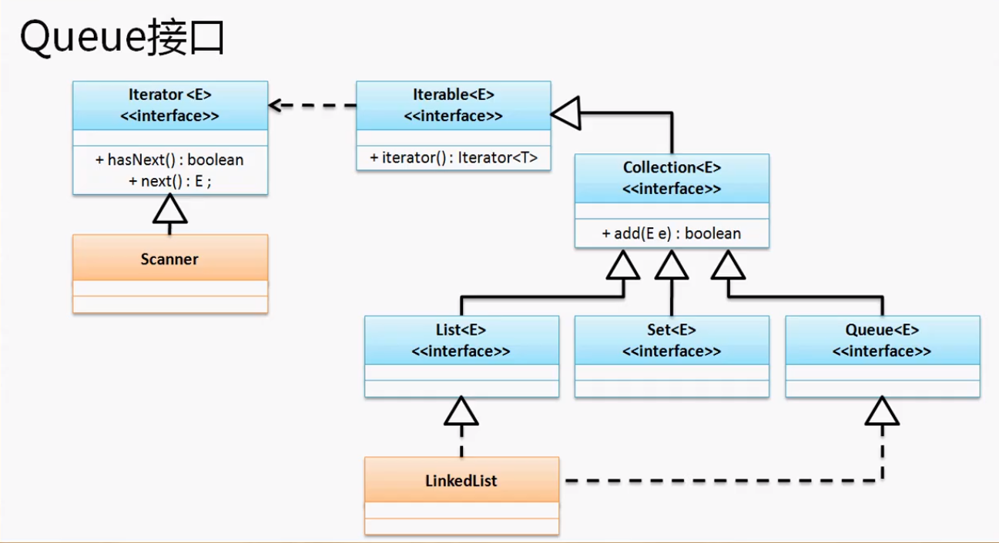

## Stack

Stack是Vector的子类。但是使用这个类时并不是使用的Vector之中的方法，所以千万不要向上转型。我们要使用的方法是Stack独有的。

入栈：`public E push()`

出栈：`public E pop()`

```java
Stack<String> s = new Stack<>();
s.push("a");
s.pop();
```

## Queue

用于一些缓冲区的实现。Queue接口在java.util包中。需要用到他的子类LinkedList来实例化Queue.



```java
Queue<String> q = new LinkedList<>();
q.add("A");
q.add("B");
System.out.println(q.poll());
System.out.println(q.poll());
```

