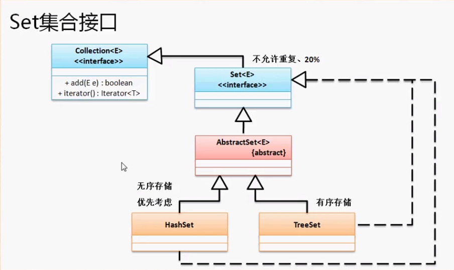
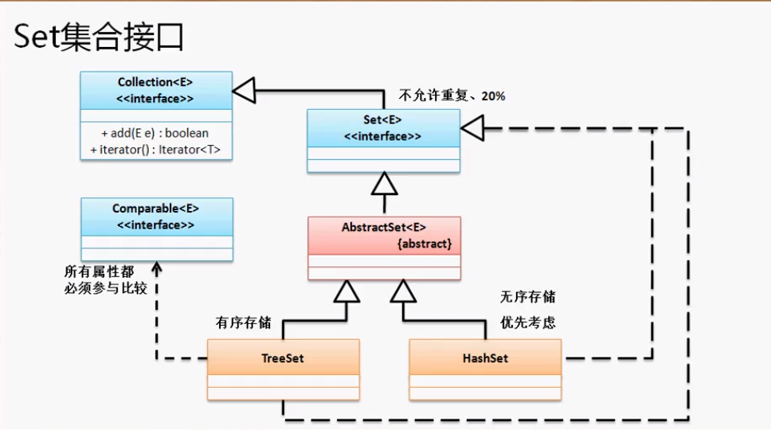

Set作为集合是不允许有重复元素的。与List不同的是Set并没有对Collection的接口方法进行扩充。所以Set中也没有get方法。

`public interface Set<E> extends Collection<E>`

在Set子类接口里面有两个常用的子类：HashSet、TreeSet



```java
Set<String> all = new HashSet<>(); //后面的泛型编译时会根据前面的Person获得
all.add("hello");
all.add("Hello");
all.add("Hello");
all.add("aaa");
System.out.println(all);
//输出[aaa, Hello, hello]     无序
```

TreeSet与HashSet操作一样，不过是将数据默认使用升序排列。

#### TreeSet排序分析：

既然TreeSet子类可以进行排序，所以我们可以编写一个类，用TreeSet来完成数据的排序。

创建一个Person类，想要进行比较必须要实现Comparable接口然后覆写他的compareTo方法。

```java
package cn.yang.demo;

import java.util.Set;
import java.util.TreeSet;

class Person implements Comparable<Person> {
	private String name;
	private int age;
	public Person(String name, int age) {
		this.name = name;
		this.age = age;
	}
	@Override
	public String toString() {
		return "name = " + this.name + "  age = " + this.age;
	}
	@Override
	public int compareTo(Person o) {  //需要比较所有属性
		if (this.age > o.age) {
			return 1;
		}else if (this.age < o.age) {
			return 0;
		}else {
			return this.name.compareTo(o.name);
		}
	}
}

public class TestDemo {
	public static void main(String[] args) throws Exception {
		Set<Person> all = new TreeSet<Person>(); 
		all.add(new Person("yan", 22));
		all.add(new Person("liu", 23));
		all.add(new Person("hh", 19));
		all.add(new Person("急急急", 19));
		System.out.println(all);
	}
}
```

因为要比较所有的属性，所以TreeSet不太好用。如果属性特别多那就gg了。一般用HashSet比较好，性能还高。



在使用TreeSet进行数据保存时，重复元素的判断依据的是Comparable接口，但在HashSet中并不是这样。

**HashSet主要依靠Object类中两个方法：**

1. hash码：`public int hashCode();
2. 对象比较：`public boolean euals(Object obj)`