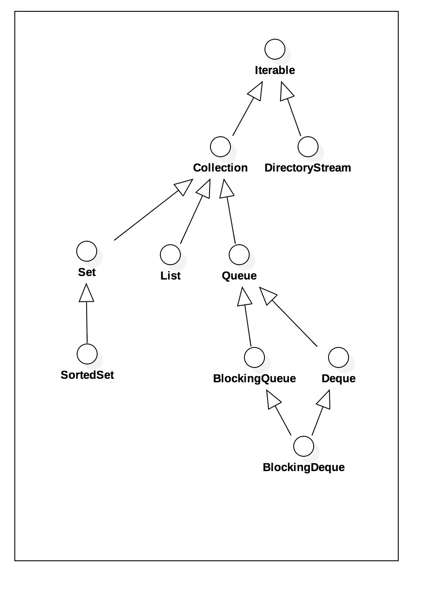

类集实际上就属于动态的对象数组，在实际开发中数组的使用出现频率并不高，99%情况下的数组使用的都是一维数组，并且99%的操作都只是进行简单的for循环处理。

但是数组本身有一个巨大的缺陷：数组的长度是固定的，因为这个缺陷我们开发出了链表。

从JDK1.2开始，专门的提供了动态的对象数组实现框架---Java类集框架。这个框架就是Java对于数据结构的一种实现。而在数据结构中，最为基础的数据结构就是链表~

## [Collection集合接口](https://www.zhihu.com/question/48503724)

在Java的类集(java.util)中，提供有两个最为核心的接口：Collection、Map。对于Collection，我们每次操作都只能对单个对象进行处理。

**所以Collection是单个集合保存的最大父接口。Collection接口定义如下：**

`public interface Collection<E> extends Iterable<E>` 

值得注意的是这上面添加有泛型，所以这里面的所有数据的类型都应那该是相同的。Collection继承了Iterable接口所以子接口有父接口所有的方法。而Iterable接口最重要的方法就是iterator。

**并且在Collection接口中还定义了一些[default](https://blog.csdn.net/wf13265/article/details/79363522)方法，这意味着他的子类可以直接拿去用不需要实现。**

通过接口继承，将颗粒细分为了一个个具体的功能接口。



#### Collection类方法：

1. ```java
   boolean add(E e) //向集合中添加数据
   ```

2. ```java
   boolean addAll(Collection<? extends E> c) //向集合中添加一组数据
   ```

3. ```java
   void clear() //清空集合数据
   ```

4. ```java
   boolean contains(Object o)  //判断数据是否存在，需要equals()方法
   ```

5. ```java
   boolean remove(Object o) //删除数据，需要equals()方法
   ```

6. ```java
   int size() //取得集合长度
   ```

7. ```java
   Object[] toArray() //将集合变为对象数组返回
   ```

8. ```java
   Iterator<E> iterator() //取得Iterator接口对象
   ```

在开发之中add与iterator这两个方法使用频率最多。