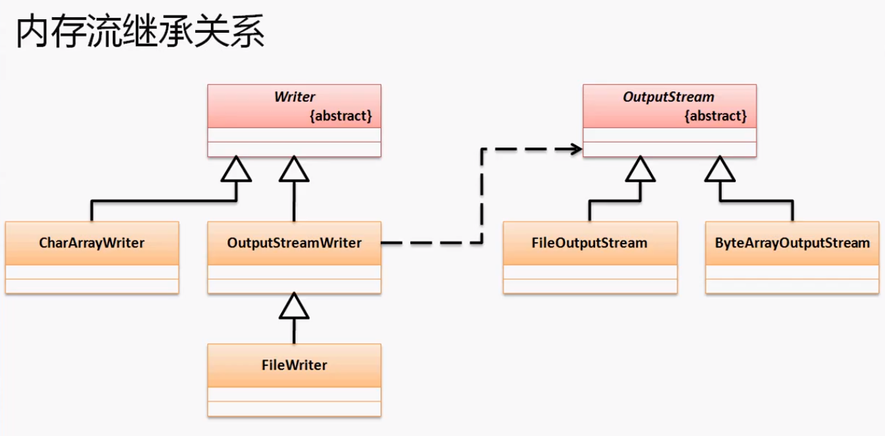
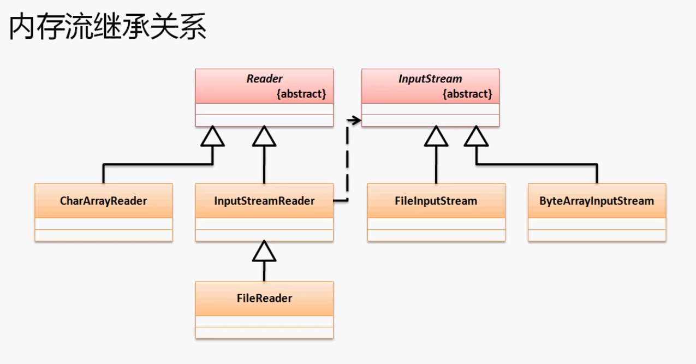
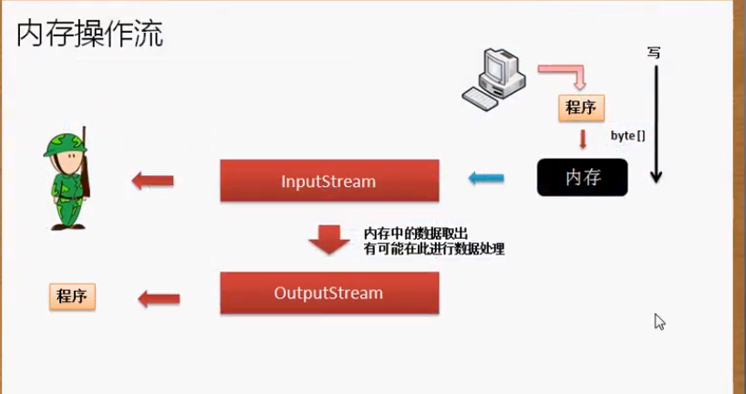
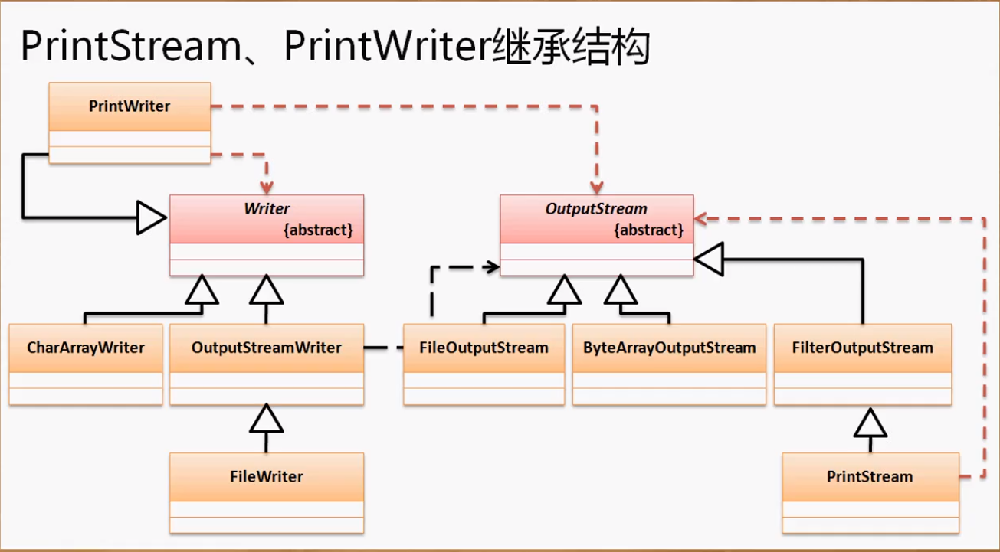

IO操作可以针对文件也可以针对内存。

**输入流：读入数据； 输出流：读出数据**

在文件流中，我们用`OutputStream`向文件中输出数据，用`InputStream`向程序中读数据。我们在文件流操作中一定会产生一个文件数据（，不存在文件JVM会自动创建，不论最后保存与否）。如果我们在IO操作中不希望有文件数据产生，那么就可以使用内存作为IO操作终端。

Java中有两类流：

1. 字节内存流：ByteArrayInputStream、ByteArrayOutputStream
2. 字符内存流：CharArrayReader、CharArrayWriter

**内存流的继承关系：**







```java
package cn.yang.demo;

import java.io.ByteArrayInputStream;
import java.io.ByteArrayOutputStream;
import java.io.InputStream;
import java.io.OutputStream;

public class TestDemo {
	public static void main(String[] args) throws Exception {
		String msg = "Hello world";
		//实例化InputStream类对象，实例化的时候需要一个数据来初始化缓冲数组
		InputStream input = new ByteArrayInputStream(msg.getBytes());
		OutputStream output = new ByteArrayOutputStream();
		int temp = 0;
		while ((temp = input.read()) != -1) { //每次从缓冲数组中读一个数据到内存
			output.write(Character.toUpperCase(temp));//将数据写到output缓冲数组中
		} //此时所有的数据都在OutputStream类中的缓冲数组中了
		System.out.println(output); //toString方法输出的是缓冲数组的内容
		input.close();
		output.close();
	}
}
```

在ByteArrayOutputStream类中创建了一个buf缓冲数组，将从内存中流出的数据保存在该数组中。该类的toStirng方法输出的就是这个数组的内容。可以将buf数组看作一个文件那么内存流与文件流操作就一样了。在ByteArrayInputStream构造方法中也有一个缓冲数组buf，在进行read时也是从buf中读取的。 总之 内存流将缓冲数组当作了文件。

**内存操作流可以实现两个文件的合并处理：**

当我用fileinputstream流读取文件的时候，然后用fileinputstream.read()方法读取文件的时候，当我查看API的时候，发现read()是读取每个字节，然后返回一个int类型，有没有很纳闷，读取的字节，为什么返回一个int呢？
FileInputStream.read()读取一个byte却返回一个int的原因如下：

FileInputStream.read()返回一个unsigned byte [0 - 255],而java里面没有这个类型，所以用int接收。byte的范围是[-128,127]，所以如果read()返回的数在[128,255]的范围内时，则表示负数，即
(byte)128=-128
(byte)129=-127
(byte)255=-1
所以如果read()返回的是byte的话，那就会有负数。而"返回-1意味着结束"，这个信息量用byte是无法表达的，所以必须用int。

```java
package cn.yang.demo;

import java.io.ByteArrayOutputStream;
import java.io.File;
import java.io.FileInputStream;
import java.io.FileOutputStream;
import java.io.InputStream;
import java.io.OutputStream;

public class TestDemo {
	public static void main(String[] args) throws Exception {
		File file[] = new File[] {
				new File("e:" + File.separator + "a.txt"),
				new File("e:" + File.separator + "b.txt")
		};
		String data[] = new String [2];
		for (int x = 0; x < file.length; x++) {
			data[x] = readFile(file[x]);
		}
        
		StringBuffer buf = new StringBuffer();
		String contentA [] = data[0].split(" ");
		String contentB [] = data[1].split(" ");
        
		for (int x = 0; x < contentA.length; x++) {
			buf.append(contentA[x]).append("(").append(contentB[x]).append(")");
		}
        
		OutputStream out = new FileOutputStream(new File("e:" + File.separator + "c.txt"));
		out.write(buf.toString().getBytes());
		}
    
    
	public static String readFile(File file) throws Exception{
		if(file.exists()) {
			InputStream input = new FileInputStream(file);
			//这里需要用到ByteArrayOutputStream特有的方法toByteArray。不能用OutputStream向上转型。
            //将文件数据保存到内存流bos中
			ByteArrayOutputStream bos = new ByteArrayOutputStream();
			byte data [] = new byte[10];
			int temp = 0;
			while ((temp = input.read(data)) != -1) { //read(data)返回数据长度
				bos.write(data, 0, temp); //写到内存流缓存数组中
			}
			bos.close();
			input.close();
			return new String(bos.toByteArray());//返回bos中缓存数组的内容
		}
		return null; //文件不存在则返回空
	}
	}

```

不过这类的操作随着轮子越来越多已经老了。。

## 简易打印流模型

```java
package cn.yang.demo;

import java.io.File;
import java.io.FileOutputStream;
import java.io.IOException;
import java.io.OutputStream;

class PrintUtil {
	private OutputStream output;
	public PrintUtil(OutputStream output) {  //由外部定义输出的位置
		this.output = output;
	}
	public void print(String str) {  //核心功能只有一个
		try {
			this.output.write(str.getBytes());
		} catch (IOException e) {
			e.printStackTrace();
		}
	}
	public void println(String str) {
		this.print(str + "\r\n");
	}
	public void print(int data) {
		this.print(String.valueOf(data));
	}
	public void println(int data) {
		this.println(String.valueOf(data));
	}
	public void print(double data) {
		this.print(String.valueOf(data));
	}
	public void println(double data) {
		this.println(String.valueOf(data));
	}
	public void close(){
		try {
			this.output.close();
		} catch (IOException e) {
			e.printStackTrace();
		}
	}
}

public class TestDemo {
	public static void main(String[] args) throws Exception {
		PrintUtil pu = new PrintUtil(new FileOutputStream(new File("e:" + File.separator + "a.txt")));
		pu.print("杨优秀");
		pu.print(61);
		pu.println(2.15);
		pu.print("杨不优秀");
	}
	}
```

经过简单的处理，使OutputStream类的功能更强大了（不只能输出字节了）。但是这样的类Java提供这样的打印流类。printStream与PrintWriter

## 打印流

字节打印流：`PrintStream`

- [java.lang.Object](https://docs.oracle.com/javase/8/docs/api/java/lang/Object.html)

- - [java.io.OutputStream](https://docs.oracle.com/javase/8/docs/api/java/io/OutputStream.html)

  - - [java.io.FilterOutputStream](https://docs.oracle.com/javase/8/docs/api/java/io/FilterOutputStream.html)

    - - java.io.PrintStream

        构造方法：**[PrintStream](https://docs.oracle.com/javase/8/docs/api/java/io/PrintStream.html#PrintStream-java.io.OutputStream-)**([OutputStream](https://docs.oracle.com/javase/8/docs/api/java/io/OutputStream.html) out)

字符打印流：`PrintWriter`

- [java.lang.Object](https://docs.oracle.com/javase/8/docs/api/java/lang/Object.html)

- - [java.io.Writer](https://docs.oracle.com/javase/8/docs/api/java/io/Writer.html)

  - - java.io.PrintWriter

      构造方法：**[PrintWriter](https://docs.oracle.com/javase/8/docs/api/java/io/PrintWriter.html#PrintWriter-java.io.OutputStream-)**([OutputStream](https://docs.oracle.com/javase/8/docs/api/java/io/OutputStream.html) out)； **[PrintWriter](https://docs.oracle.com/javase/8/docs/api/java/io/PrintWriter.html#PrintWriter-java.io.Writer-)**([Writer](https://docs.oracle.com/javase/8/docs/api/java/io/Writer.html) out)



**打印流的设计属于装饰设计模式，其核心还是那个东西，只是能力更强了一点**

**使用打印流：**

```java
public class TestDemo {
	public static void main(String[] args) throws Exception {
		PrintWriter pu = new PrintWriter(new FileOutputStream(new File("e:" + File.separator + "a.txt")));
		pu.print("杨优秀");
		pu.print(61);
		pu.println(2.15);
		pu.print("杨不优秀");
		pu.close();
	}
}
```

## 格式化输出

```java
	public static void main(String[] args) throws Exception {
		PrintWriter pu = new PrintWriter(new FileOutputStream(new File("e:" + File.separator + "a.txt")));
		String name = "杨优秀";
		int age = 22;
		double salary = 999999999.54663;
		pu.printf("姓名：%s，年龄：%d，工资：%8.2f", name, age, salary);
		pu.close();
	}
//a.txt文件内容：
//姓名：杨优秀，年龄：22，工资：999999999.55
```

同时在String类中也有一个格式化字符串的方法：`public static String format(String format, Object... args)`