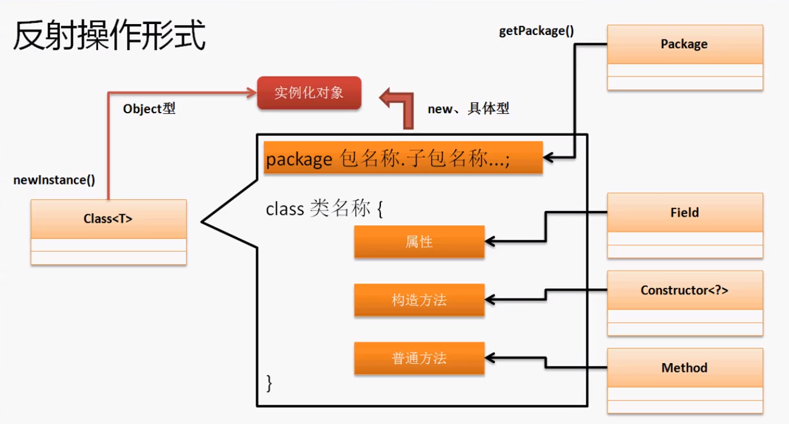
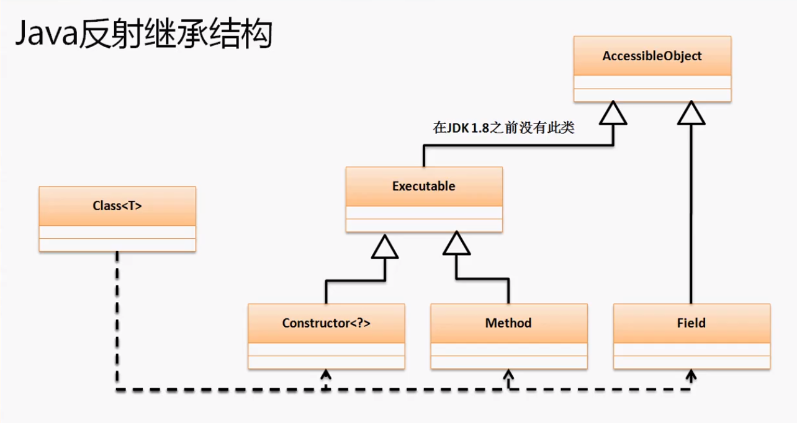

## [java.lang.reflect](https://juejin.im/post/5d4450fbe51d4561ce5a1be1)

类加载的完整过程如下：
（1）在编译时，Java 编译器编译好 .java 文件之后，在磁盘中产生 .class 文件。.class 文件是二进制文件，内容是只有 JVM 能够识别的机器码。
（2）JVM 中的类加载器读取字节码文件，取出二进制数据，加载到内存中，解析.class 文件内的信息。类加载器会根据类的全限定名来获取此类的二进制字节流；然后，将字节流所代表的静态存储结构转化为方法区的运行时数据结构；接着，在内存中生成代表这个类的 **java.lang.Class** 对象。
（3）加载结束后，JVM 开始进行连接阶段（包含验证、准备、解析）。经过这一系列操作，类的变量会被初始化。


**要想使用反射，首先需要获得待操作的类所对应的 Class 对象。Java 中，无论生成某个类的多少个对象，这些对象都会对应于同一个 Class 对象。这个 Class 对象是由 JVM 生成的，通过它能够获悉整个类的结构。所以，java.lang.Class 可以视为所有反射 API 的入口点。**
**反射的本质就是：在运行时，把 Java 类中的各种成分映射成一个个的 Java 对象。**


反射是指对象进行反向处理的操作。首先来观察一下正的操作。在默认情况下，必须要先导入一个包才能进行操作。

反向：通过对象来取得对象的来源信息。反 的操作核心的处理在于Object的一个方法：getClass()：`public final Class<?> getClass()`该方法返回的是一个Class对象。

```java
Date date = new Date();
System.out.println(date.getClass());
//输出
class java.util.Date
```

通过对象取得了对象的来源，这就是 反 的本质。

在反射的世界里它所看重的不再是一个对象，而是对象背后的组成（类、构造方法、普通方法、等）

**Class类时描述整个类的概念，所以也是整个反射的核心。我们研究的也是Class类的对象。而这个对象的产生模式一共有三种（java.lang.Class）：**

1. 任何实例都可以调用Object类的getClass来获得Class对象

   ```java
   public static void main(String[] args) throws Exception {
   		Class<?> cls = new Date().getClass();
   		System.out.println(cls.getName());
   	}
   //getName()方法取得类包名：java.util.Date
   ```

   

2. 类.class   直接根据某个具体的类来取得class的实例化对象

```java
Class<?> cls = Date.class; //不需要实例化Date了
System.out.println(cls.getName());
//输出：java.util.Date
```

3. 使用class类提供的方法：`public static Class<?> forName(String className) throws CLassNotFoundException`

```java
Class<?> cls = Class.forName("java.util.Date"); //不需要再导入Date包
System.out.println(cls.getName());
//输出：java.util.Date
```

**在class类中有一个方法可以创建实例对象：**`public T newInstance() throws InstantiationException, IllegalAccessException` **泛型可以理解为Object**

```java
Class<?> cls = Class.forName("java.util.Date");
Object obj = cls.getDeclaredConstructor().newInstance();//java9中用这种方法.带Declared的方法不会返回父类成员。参数为构造函数的参数类型类对象。
System.out.println(obj);
//输出（调用toString方法）：Thu Mar 05 16:21:56 CST 2020
```

## [反射与工厂设计模式](../设计模式/反射与工厂设计模式)

## 反射调用构造方法

取得构造方法可以使用class类提供的两个方法：

1. 取得指定参数类型的构造：

   ```java
   public Constructor<T> getConstructor(Class<?>... parameterTypes)
                                 throws NoSuchMethodException,
                                        SecurityException
   ```

2. 取得类中的所有构造：

   ```java
   public Constructor<?>[] getConstructors() throws SecurityException
   ```

   以上两个方法返回的类型都是 java.lang.reflect.Constructor类型的实例化对象。

实例化对象：

```java
public T newInstance(Object... initargs)
              throws InstantiationException,
                     IllegalAccessException,
                     IllegalArgumentException,
                     InvocationTargetException
```

**取得类中的所有构造方法信息：**

```java
package cn.yang.demo;

import java.lang.reflect.Constructor;

class Person{
	public Person() {}
	public Person(String name) {}
	public Person(int age) {}
}

public class TestDemo {
	public static void main(String[] args) throws Exception {
		Class<?> cls = Person.class;
		Constructor<?> itf[] = cls.getConstructors();
		for (int x = 0; x < itf.length; x++) {
			System.out.println(itf[x]);
		}
	}
}

//输出。利用了Constructor类中的toString方法取得了构造方法的完整信息
public cn.yang.demo.Person()
public cn.yang.demo.Person(java.lang.String)
public cn.yang.demo.Person(int)
```

**在定义java简单类的时候，尽量要定义一个无参的构造函数**

**观察Class实例化对象的问题：**

```java
package cn.yang.demo;

import java.lang.reflect.Constructor;

class Person{
	private String name;
	private int age;
	public Person(String name, int age) {
		this.name = name;
		this.age = age;
	}
	@Override
	public String toString() {
		return "Person [name=" + name + ", age=" + age + "]";
	}
}

public class TestDemo {
	public static void main(String[] args) throws Exception {
		Class<?> cls = Person.class;
		System.out.println(cls.getDeclaredConstructor().newInstance());
	}
}
//输出
//Exception in thread "main" java.lang.NoSuchMethodException: cn.yang.demo.Person.<init>()  没有合适的方法
```

Class类用反射实例化对象时只能够调用无参的构造函数，如果类中没有无参构造那么只能使用明确的构造调用执行实例化处理。

**通过Constructor类实例化对象：**

```java
public class TestDemo {
	public static void main(String[] args) throws Exception {
		Class<?> cls = Person.class;
		//现在明确表示取得指定参数类型的构造方法对象
		Constructor<?> cont = cls.getConstructor(String.class, int.class);
		//Constructor类也有一个newInstance()方法
		System.out.println(cont.newInstance("杨优秀", 22));
	}
}
```

如果有无参构造，那么就不用Constructor类来指定有参构造了。

## 反射调用普通方法

**在Class类中定义有以下两个类来取得普通方法：**

1. 取得全部方法：`public Method[] getMethods() throws SecurityException`

2. 取得指定方法：

   ```java
   public Method getMethod(String name,
                           Class<?>... parameterTypes)
                    throws NoSuchMethodException,
                           SecurityException
   ```

以上两个方法都是Method类的对象。

- [java.lang.Object](https://docs.oracle.com/javase/8/docs/api/java/lang/Object.html)
- - [java.lang.reflect.AccessibleObject](https://docs.oracle.com/javase/8/docs/api/java/lang/reflect/AccessibleObject.html)
  - - [java.lang.reflect.Executable](https://docs.oracle.com/javase/8/docs/api/java/lang/reflect/Executable.html)
    - - java.lang.reflect.Method

```java
public final class Method extends Executable
```

Method中有一个名为调用的方法：

```java
public Object invoke(Object obj,
                     Object... args)
              throws IllegalAccessException,
                     IllegalArgumentException,
                     InvocationTargetException
```

**取得一个类中的全部方法：**

```java
public static void main(String[] args) throws Exception {
		Class<?> c = Person.class;
		Method m[] = c.getMethods();
		for(int i = 0;i < m.length;i++) {
			System.out.println(m[i].invoke(Person, ));
		}
```

有了反射机制后，我们可以没有明确的Person类型的对象（仍然是需要实例化的，不然就没有具体的对象了），可以通过Object描述。

**通过反射调用setter和getter：**

```java
package cn.yang.demo;

import java.lang.reflect.Constructor;
import java.lang.reflect.Method;

class Person{
	private String name;
	public String getName() {
		return name;
	}
	public void setName(String name) {
		this.name = name;
	}
	@Override
	public String toString() {
		return "Person [name=" + name + "]";
	}
}

public class TestDemo {
	public static void main(String[] args) throws Exception {
		String attribute = "name";
		String value = "杨优秀";
		Class<?> c = Class.forName("cn.yang.demo.Person");
		//任何情况下调用类的普通方法都需要有该类的实例
		Object obj = c.getDeclaredConstructor().newInstance();
		//取得setName这个方法的实例化对象，设置方法名称和参数类型
		//第一个参数是方法名，第二个参数是该方法的参数类型对象
		Method m= c.getMethod("set" + initcap(attribute), String.class);
		//通过Method类对象调用指定方法，需要传入实例对象和参数
		m.invoke(obj, value); //相当于obj.setName(value);
		Method m1= c.getMethod("get" + initcap(attribute));
		System.out.println(m1.invoke(obj));
		}
	public static String initcap(String str) {
		return str.substring(0, 1).toUpperCase() + str.substring(1);
	}
}


```

此类操作的好处是不再局限于某一具体类型的对象，而是可以通过Object类型进行多种方法的调用。

## 调用类成员

- [java.lang.Object](https://docs.oracle.com/javase/8/docs/api/java/lang/Object.html)

- - [java.lang.reflect.AccessibleObject](https://docs.oracle.com/javase/8/docs/api/java/lang/reflect/AccessibleObject.html)

  - - java.lang.reflect.Field

      return：a string describing this `Field`, including its generic type

因为类成员只有在类实例化后才会和类对象一起出现在堆上，所以我们要先进行类的实例化。

在Class类中提供有两组取得属性的操作方法：

>取得父类属性：
>
>> 取得类中的全部属性：
>>
>> ```java
>> public Field[] getFields()
>>                   throws SecurityException
>> ```
>>
>> 取得类中指定名称的属性：
>>
>> ```java
>> public Field getField(String name)
>>                throws NoSuchFieldException,
>>                       SecurityException
>> ```

> 取得子类属性：
>
> > 取得类中的全部属性：
> >
> > ```java
> > public Field[] getDeclaredFields()
> >                           throws SecurityException
> > ```
> >
> > 取得类中指定名称的属性：
> >
> > ```java
> > public Field getDeclaredField(String name)
> >                        throws NoSuchFieldException,
> >                               SecurityException
> > ```

```java
package cn.yang.demo;

import java.lang.reflect.Field;

class Person{
	public String name;
}

class Student extends Person{
	private String school;
}

public class TestDemo {
	public static void main(String[] args) throws Exception {
		Class<?> cls = Class.forName("cn.yang.demo.Student");
		Object obj= cls.getDeclaredConstructor().newInstance();
		Field field[] = cls.getFields();
		for (int i = 0; i< field.length; i++) {
			System.out.println(field[i]);
		}
		System.out.println("=================");
		Field field1[] = cls.getDeclaredFields();
		for (int i = 0; i< field1.length; i++) {
			System.out.println(field1[i]);
		}
	}
}
//输出
public java.lang.String cn.yang.demo.Person.name //当父类属性为private则没有输出
=================
private java.lang.String cn.yang.demo.Student.school
```

一般的，因为封装的概念，父类的属性一般都是私有的获取不到的。所以获取子类属性才是最重要的。

**属性的核心描述类：`java.lang.reflect`**

**Filed操作：**

> 取得属性内容：
>
> ```java
> public Object get(Object obj) //参数为确定的对象，如果是静态字段则不用传入
>            throws IllegalArgumentException,
>                   IllegalAccessException
> ```
>
> 设置属性内容：
>
> ```java
> public void set(Object obj,
>                 Object value)
>          throws IllegalArgumentException,
>                 IllegalAccessException
> ```





作为最大的父类，在AccessibleObject中有的方法在他的子类中也一定有，如：

动态设置封装：

```java
public void setAccessible(boolean flag)
                   throws SecurityException
//在他的子类中使用：setAccessible(true)就会取消封装，就可以调用父类的私有方法
```

```java
package cn.yang.demo;

import java.lang.reflect.Field;

class Person{
	private String name;
}

public class TestDemo {
	public static void main(String[] args) throws Exception {
		Class<?> cls = Class.forName("cn.yang.demo.Person");
		Object obj= cls.getDeclaredConstructor().newInstance();
		Field field =cls.getDeclaredField("name");
		field.setAccessible(true);  //取消封装
		field.set(obj, "杨优秀"); //等于 obj.name = "杨优秀"
		System.out.println(field.get(obj));
	}
}
//输出：杨优秀
```

但是一般是操作类会提供getter和setter方法。

在Field类中，有一个方法是取得类的属性类型：`public Class<?> getType()`

```java
Field field =cls.getDeclaredField("name");
field.setAccessible(true);  //取消封装
System.out.println(field.getType().getName()); //包.类
System.out.println(field.getType().getSimpleName()); //只有类名称
```

将Field取得属性类型方法与Method类中的invoke()结合在一起，就可以编写非常灵活的程序了。

```java
	public static void main(String[] args) throws Exception {
		Class<?> cls = Class.forName("cn.yang.demo.Person");
		Object obj= cls.getDeclaredConstructor().newInstance();
		Field field =cls.getDeclaredField("name");
		field.setAccessible(true);  //取消封装
		Method m = cls.getMethod("setName", field.getType());
		m.invoke(obj, "杨优秀a");
		System.out.println(field.get(obj));
	}
```

