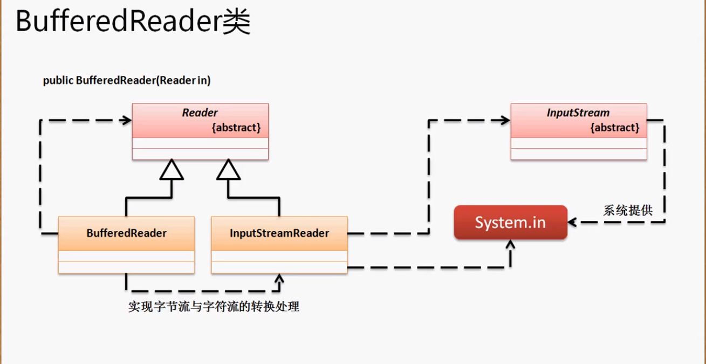

字节缓冲流（BufferedInputStream）、字符缓冲流（BufferedReader)

在BuferedReader类中有一个readLine方法，这个方法可以直接读取一行数据。

`public class BufferedReader extends Reader`

构造方法：`public BufferedReader(Reader in)`



BufferedReader是Reader的子类，但它的构造方法接收Reader对象，对Reader进行装饰。System.in属于InputStream，而Reader有一个子类InputStreamReader子类可以将InputStream转换为Reader类型从而给BufferedRedaer的构造函数。这样就连起来了。

**在不适用字符缓冲流时我们实现读取键盘输入的代码是这样的：**

```java
public class TestDemo {
	public static void main(String[] args) throws Exception {
		InputStream input = System.in; //为父类实例化
		byte data [] = new byte [10];
		ByteArrayOutputStream out = new ByteArrayOutputStream();
		System.out.print("请输入信息：");
		int temp = 0;
		while((temp=input.read(data)) != -1) { //数据读取到字节数组中
			if (temp < data.length) { //判断是否是换行
				break;
			}
			out.write(data, 0, temp); //将data中0-temp的数据保存到内存输出流
		}
		System.out.println("【echo】输入内容为："+ new String(out.toByteArray()));
	}
	}
```


**使用BufferedReader来实现键盘输入：**

```java
public class TestDemo {
	public static void main(String[] args) throws Exception {
		InputStream input = System.in; //为父类实例化
		BufferedReader b = new BufferedReader(new InputStreamReader(input));
		System.out.print("请输入信息：");
		String out = b.readLine(); //接收输入信息，默认使用回车换行。但回车换行是它最大的缺点，因为这个缺点现在已经不使用它了。
		System.out.println("【echo】输入内容为："+ out);
	}
}
```

**BufferedReader现在已经被Scanner所取代了。。**

# Scanner

打印流解决的是OutputStream的缺陷，BufferedReader解决的是InputStream的缺陷。java.util.Sanner解决的是BufferedRedaer的缺陷（替换了BufferedReaedr)。

Scanner是一个专门的进行数据输入流的处理类。主要有以下几个方法：

判断是否有指定类型的数据：`public boolean hasNextxxx()` ; xxx为double.String.....

取得指定类型的数据：`public 数据 nextxxx()`

定义分隔符：`public Scanner useDelimiter(String pattern)`

构造方法：其中一个：`public Scanner(InputStream input)`

**使用Scanner实现数据的输入：**

```java
public class TestDemo {
	public static void main(String[] args) throws Exception {
		Scanner scan = new Scanner(System.in);
		System.out.println(scan.next());
		scan.close();
	}
}
```

使用Scanner的输入还可以接收各种数据类型，并且帮助用户减少转型的设计。

**接收其他类型：**

```java
public class TestDemo {
	public static void main(String[] args) throws Exception {
		Scanner scan = new Scanner(System.in);
		System.out.println("请输入年龄：");
		if(scan.hasNextInt()) {
			int age = scan.nextInt(); //直接用nextInt接收int，在nextInt方法中已经帮我们写了Integer.parseInt
			System.out.println(age);
		}else{
            System.out.print("输入的不是数字");
        }
		scan.close();
	}
}
```

**最为重要的是它可以对接收的数据类型使用正则表达式进行判断：**

```java
public class TestDemo {
	public static void main(String[] args) throws Exception {
		Scanner scan = new Scanner(System.in);
		System.out.println("请输入生日,-分隔：");
		if(scan.hasNext("\\d{4}-\\d{2}-\\d{2}")) {
			System.out.println(scan.next());
		}else {
			System.out.println("输入的生日不合法");
		}
		scan.close();
	}
}
```

以上的操作不会在开发中出现。。 不会让用户在命令行操作。

**因为Scanner接收的是一个InputStream对象，那么就意味着它可以接收任意一个输入流。比如FileInputStream：**

```java
public class TestDemo {
	public static void main(String[] args) throws Exception {
		Scanner scan = new Scanner(new FileInputStream(new File("e:" + File.separator + "a.txt")));
        scan.useDelimiter("\n"); //自定义分隔符，否则空格也算一个next()
		while(scan.hasNext()) {
			System.out.println(scan.next());
		}
		scan.close();
	}
}
```

Scanner更好的实现了InputStream的操作。除了二进制的文件拷贝，其他的信息输出（从内存输出到硬盘或网络）都使用打印流；所有的信息输入（从磁盘或网络输入到内存）都使用Scanner。