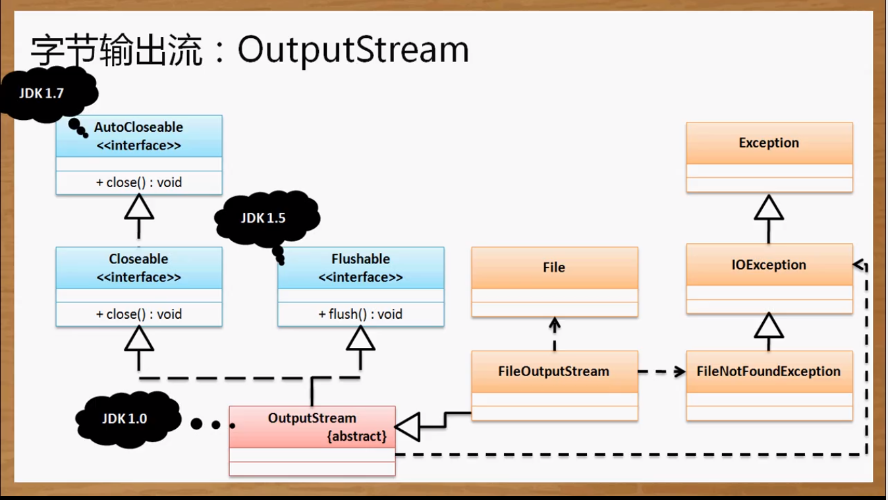
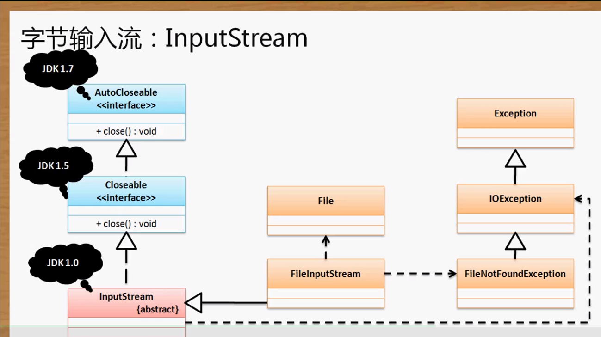
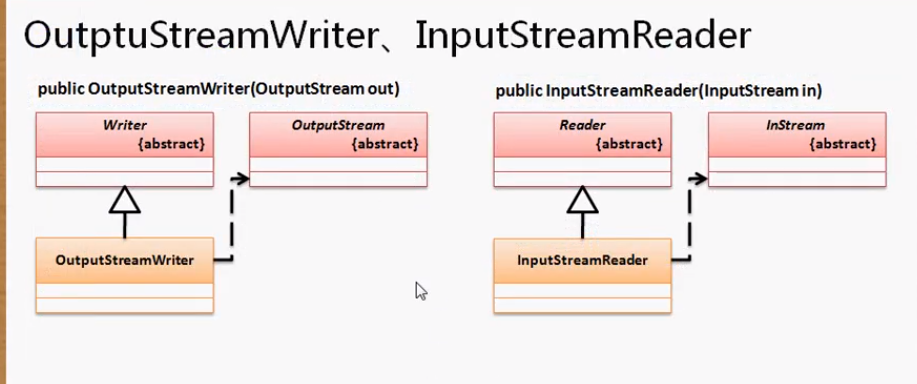
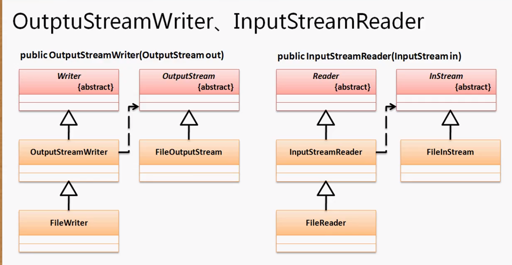

想要学好IO，必须要明白抽象类，重点掌握两个代码模型。整个IO的核心组成就是五个类（File、outpuStream、inputStream、Writer、Reader）和一个接口(Serializerble)

**File类的基本使用：**

`java.io.File` 。直接产生实例化对象即可。

有两个构造方法：

1. `public File(String pathname);`
2. `public File(File parent, File child);` 设置父路径和子文件

创建新文件：`public boolean creatNewFile() throws IOException`

```java
//由不同操作系统的JVM来决定separator是什么
File f = new File("d:" + File.separator + "a.py");
if (f.exists()){
    f.delete(); //删除文件
}else{
    f.creatNewFile(); //会创建一个a.py空文件
}
```

但是。。因为有UNIX系统和类UNIX(mac和linux)和window系统三类系统，我们在文件路径处理时会很蛋疼。window下路径是 `\`。而在UNUX下是 `/`。所以在使用路径分隔符时都会用File类中的一个常量来描述：`public static final String separator`。注意到这里的常量是小写的，我们在开发中的final常量一般都是大写的，这里是特殊。

## 目录创建

如果将上面的代码改一下，改成在已知没有的目录中创建文件，它不会像文件那样给我们判断存不存在的机会，也不会帮我们创建。将会报错：

`File f = new File("d:" + File.separator +"aaa"+ File.separator + "a.py");`/ /Error

因为就没有aaa这个父路径，所以会提示无法找到路径。当然如果有这个路径就会执行。

得到父路径：`public File getParentFile()`

创建目录：`public boolean mkdir()`，`public boolean mkdirs()`创建多个目录

改成如下：

```java
File f = new File("d:" + File.separator +"aaa"+ File.separator + "a.py");
if (!f.getParentFile().exits()) { //如果不存在该目录则创建
    f.getParentFile().mkdir();
}
if (f.exists()){
    f.delete(); //删除文件
}else{
    f.creatNewFile(); //会创建一个a.py空文件
}
```

## 取得文件信息

判断路径是否是文件：`public boolean isFile()`

判断路径是否是目录：`public boolean isDirectory()`

取得文件大小：`public long length()`  单位为字节

最后一次修改时间：`public long lastModified()`

**输出文件大小，单位转换为了M**

```java
package cn.yang.demo;

import java.io.File;

class MyMath{
	public static double round(double d, int b) { //b用来设置要保存小数点后几位
        //小数先乘10的b次方round后再除10的b次方则可以完成任务
		return Math.round(d * Math.pow(10, b)) / Math.pow(10, b);
	}
}

public class TestDemo {
	public static void main(String[] args) throws Exception{
		File f = new File("e:" + File.separator + "CloudMusic" + File.separator +"a.py");
		if (f.exists()&&f.isFile()){
		    System.out.println("文件大小为：" + MyMath.round(((f.length()) / (double)1024 / 1024), 3) + "M"); //保留三位小数
             System.out.println(new SimpleDateFormat("yyyy-MM-dd hh:mm:ss.sss").format(new Date(f.lastModified()))); //new Date()返回的格式看的头疼，只需用SimpleDateFormat来格式化即可
		}
	}
}
//输出：
文件大小为：0.172M
2020-03-02 04:32:00.000
```

获得目录下所有内容：`public File[] listFiles()`

```java
package cn.yang.demo;

import java.io.File;

public class TestDemo {
	public static void main(String[] args) throws Exception{
			File file = new File("e:" + File.separator);
			listDir(file);
			System.out.println("杨优秀");
		}
	public static void listDir(File file) {
		if (file.isDirectory()) {
			File result [] = file.listFiles();
			if (result != null) { //如果目录不允许访问那么会返回空
			for (int x = 0; x < result.length; x ++) {
				listDir(result[x]);
			}
		}}
		System.out.println(file.getName());
	}
}
//输出
....
zip.exe
zlib1.dll
KeyGen.exe
秘钥.txt
秘钥
虚拟机

杨优秀
```

因为所有的代码都是在主线程中完成的，所以在列出文件名时由于IO操作过慢，主线程就会出现阻塞，最后一句的 杨优秀 只有等待IO完成才输出。如果不想让这种阻塞产生，我们就需要一个新的线程来处理。

```java
public class TestDemo {
	public static void main(String[] args) throws Exception{
		new Thread(() ->  {
			File file = new File("e:" + File.separator);
			listDir(file);
		}).start();

			System.out.println("杨优秀");
		}
```

## File类不能操作文件内容，需要用到流处理

在java.io包中有两种流：字节流（原生）与字符流（处理后）

在进行网络数据传输或磁盘保存的数据只有字节。

磁盘的内容加载到内存，在内存中会帮我们将字节转换为字符。字符更加适合用来处理中文。

**字节流：InputStream、OutputStream**

**字符流：Reader、Writer**

**操作方法：**

1. 要根据文件的路径创建File类对象
2. 根据字节流或字符流的子类实例化父类对象
3. 进行数据的读取、写入操作
4. 关闭流：close()

**对于IO操作属于资源处理，所有的资源处理最后一定要关闭让出资源。**

**流的流向分为输入流和输出流，输入流就是从硬盘或网络流向内存，输出流就是从内存流向硬盘或网络。所以input和output是相对于内存来说的。**

**输入流：从硬盘或网络读入到内存数据；输出流：从内存写出数据到硬盘或网络**

## 字节输出流：OutputStream

`public abstract class OutputStream extends Object implements Closeable, Flushable`    ：将字节输出到流（文件、网络报文）

显然抽象类不能被实例化，需要用到它的子类实例化它

它实现了`Closeable`与`Flushable`接口

Closeable：public void close() throws IOException;

Flushable：public void flush() throws IOException;

**在OutPutStream类里我们还定义有其他方法：**

1. 将给定的字符数组全部输出到流：`public void write(byte[] b) throws IOException;`
2. 将部分字节内容输出到流`public void write(byte[] b, int off, int len) throws IOException；`
3. 输出单个字节：`public abstract void write(int b) throws IOException`

**因为这是个抽象类，所以需要用到它的子类实例化它，因为方法名称都已经被父类定义好了，所以我们所关注的只是子类的构造方法。如果要进行文件的操作，可以使用FileOutPutStream类来处理**

FileOutPutStream的构造方法：`public FileOutPutStream(File file) throws FileNotFoundException`    接收File类。

`public FileOutPutStream(File file, boolean append) throws FileNotFoundException` append为true则表示为追加



**实现输入文件内容：**

```java
package cn.yang.demo;

import java.io.File;
import java.io.FileOutputStream;
import java.io.OutputStream;

public class TestDemo {
	public static void main(String[] args) throws Exception {
		File file = new File("e:" + File.separator + "a.txt");
		if (!file.getParentFile().exists()) { //必须保证父目录存在
			file.getParentFile().mkdir();   //不存在则创建父目录
		}
		//OutputStream是一个抽象类，只能由他的子类来实例化。这里来处理一个文件对象就用到了FileOutputStream
		OutputStream out = new FileOutputStream(file);
		String msg = "Yang you xiu /r/n"; // /r/n表示换行
		out.write(msg.getBytes()); //在输入信息时无需考虑文件是否存在，如果不存在会帮我们自动创建。write参数为字节
		out.close();
	}
}
//程序重复执行不会出现追加的情况。如果改为new FileOutputStream(file，true)那么就会追加而不是覆盖。
```

## AutoCloseable

自动关闭处理。

想使用这种自动处理，必须要使用try-catch语句。

## 字节输入流：InputStream

`public int read(byte[] b) throws IOException`：读取数据到字节数组之中，返回读取个数

> 当数组长度大于读取的数据长度那么返回的就是数据长度
>
> 当数组长度小于读取的数据的长度那么返回的就是数组长度
>
> 如果没有数据了还要读，那么返回 -1

`public int read(byte[] b, int off, int len) throws IOException`：读取部分到字节数组之中

> 每次只读取数组的部分内容，如果读取满了则返回数组长度，没满就是数据长度。如果读到最后没有数据了那么返回 -1

`public abstract int read() throws IOException`：读取单个字节

> 每次只读取一个字节的内容，没有数据了返回 -1

InputStream是一个抽象类，想要对文件进行处理要用它的子类FileInputStream完成。



```java
package cn.yang.demo;

import java.io.File;
import java.io.FileInputStream;
import java.io.InputStream;

public class TestDemo {
	public static void main(String[] args) throws Exception {
		File file = new File("e:" + File.separator + "a.txt");
		if (file.exists()) { //必须保证文件存在
		//InputStream是一个抽象类，只能由他的子类来实例化。这里来处理一个文件对象就用到了FileOutputStream
		InputStream in = new FileInputStream(file);
		byte data[] = new byte[1024];
		int len = in.read(data); 
		System.out.println(new String(data, 0, len));//new String()构造方法可以将字节转换为字符串。
		in.close();
		}
	}
}
```

必须要设置一个有限大小的数组，数据不可能一股脑一下子涌出来。这也是为什么IO满的原因。

## 字符输出流：Writer

字符的输出在Writer类中

`public abstract class Writer extends Object implements Appendable, Closeable, Flushable`   多了一个Appendable接口，该接口下有append方法。

Writer类中也有Write方法，接收的是char型的，不过还有一个输出字符串的方法。

> 1.char表示字符，定义时用单引号，只能存储一个字符，如char c=’x’;
> 而String表示字符串，定义时用双引号，可以存储一个或多个字符，如String name=”tom”;

> 2.char是基本数据类型，而String 是一个类，具有面向对象的特征，可以调用方法，如name.length()获取字符串的长度。
>

**Writer是一个抽象类，想要操作文件需要用到`FileWriter`子类。**

```java
package cn.yang.demo;

import java.io.File;
import java.io.FileWriter;
import java.io.Writer;

public class TestDemo {
	public static void main(String[] args) throws Exception {
		File file = new File("e:" + File.separator + "a.txt");
		if (file.getParentFile().exists()) { 
		Writer out = new FileWriter(file);
		String msg = "杨优秀haha";
		out.write(msg);  //可以直接接收字符串
		out.close();
		}
	}
}
```

## 字符输入流：Reader

同样的，Reader也是一个抽象类。想要获得Reader实例需要使用`FileReader`子类。

在Reader类中没有方法可以直接输出为字符串。

```java
package cn.yang.demo;

import java.io.File;
import java.io.FileReader;
import java.io.Reader;

public class TestDemo {
	public static void main(String[] args) throws Exception {
		File file = new File("e:" + File.separator + "a.txt");
		if (file.getParentFile().exists()) { 
		Reader out = new FileReader(file);
		char msg[] = new char[1024];
		int len = out.read(msg); //read返回数据长度
		System.out.println(new String(msg, 0, len));
		out.close();
		}
	}
}

```

字符流在进行读取中文的时候进行单个数据的读取的时候要比字节流更加方便。

字符流处理中文更方便~

## 字节流与字符流的区别

从实际使用来看，字节流一定是优先考虑的。只有在处理中文时才有可能会用到字符流。

读写数据都需要缓存的处理。如果在使用字符流的时候内容没有刷新，那么数据就会在缓存中。所以必须强制刷新才能得到完整的数据。关闭时就会清空缓冲区。

## 转换流

`OutputStreamWriter`：将字节输出流转换为字符输出流

构造方法：`public OutputStreamWriter(OutputStream out)`

`InputStreamReader`：将字节输入流变为字符输入流

构造方法：`public InputStreamReader(InputStream out)`





# [文件拷贝案例](../文件拷贝案例.md)