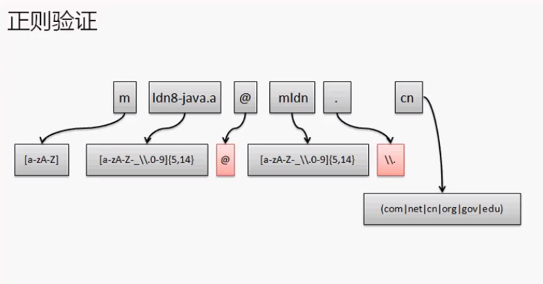

## 正则

## 正则符号：

[首先要了解转义字符：斜杠](https://yanbin.blog/understand-java-regex-backslash/)

带有\的正则都需要再加一个\表示将后面的\转义为\。否则如\d这一个斜杠就会将d转义而没有了正则的意义。

1. 描述某一个字符：x：标识由x组成。`"a".matchs("a")` 返回true
2. `\\`匹配一个斜杠。`\\\\`四个杠匹配两个杠，一个\转义一个\。
3. \t：描述制表符
4. \n：表示匹配换行
5. 描述一个范围：`[abc]`表示可能是abc中的任意一个
6. [^abc]：表示不是abc中的任一个
7. [0-9]：`"1".matchs("[0-9]"`)   返回true
8. [a-zA-Z]：大小写通吃
9. "." ：表示匹配任意的一位字符 。`\\.`加上转义字符则只匹配点。第一个\转义第二个\，第二个\转义点，使它只匹配点。
10. \d ：等价于 "[0-9]"表示任意一位数字。  写正则时要用：`\\d`，第一个杠会转义第二个，正则表达式接收到的就是一个杠
11. \D :等价于`[^0-9]` 表示任意的非数字
12. \s ：表示是一位空格，可能是\t、\n
13. \S：表示不是一位空格
14. \w ：等价于`[a-zA-z0-9_]`表示字母、数字、下划线
15. \W：等价于`[^a-zA-Z0-9_]`

**数量表达式：需要符号重复出现N次就需要数量表达式**

1. ？：出现一次或零次
2. +：表示该匹配出现一次或多次
3. *：表示该匹配出现零次一次或多次
4. {n}：表示该匹配出现正好n次  如邮政编码："\\d{6}"
5. {n,}：表示该匹配出现n次或以上
6. {n，m}：表示出现n到m次

**逻辑匹配：**

1. 正则A正则B：就表示与的关系：表示匹配第一个后立即匹配第二个
2. 正则A|正则B：表示A或B正则出现一次
3. (正则)：分组，按照一组正则进行处理

## String类对正则的支持

String有几个直接支持正则的操作方法

`public boolean matches(String regex)` 进行字符串验证，匹配某个正则

`public String replaceAll(String regex, String replacement)`根据正则的描述替换

```java
String str = "sad#@%354asAFALN";
String regex = "[a-zA-Z]";
System.out.println(str.replaceAll(regex, "^"));
//输出
^^^#@%354^^^^^^^
```


`public String replaceFirst(Stirng regex, String replacement)`根据正则替换第一个

`public String[] split(String regex)`根据正则拆分

```java
package cn.yang.demo;


public class TestDemo {
	public static void main(String[] args) {
		String str = "sa22d#@%35AL3N";
		String regex = "\\d+";
		String result[] = str.split(regex);
		for (int i = 0; i < result.length; i++) {
			System.out.println(result[i]);
		}
	}
}
//输出
d#@%
AL
N
```


`public Stirng[] split(Stirng regex, int limit)`根据正则拆分

**验证一个字符串是否是数字（可能是整数或小数），是则将它变为Double型。**

```java
package cn.yang.demo;


public class TestDemo {
	public static void main(String[] args) {
		String str = "256.3256";
		String regex = "\\d+(\\.\\d+)?"; //括号可以将一个括号里的内容当作一个正则来使用 问好代表一次或多次
		if (str.matches(regex)) {
			double data = Double.parseDouble(str);
			System.out.println(data);
		}
	}
}
```

**判断date，当有时分秒时也能处理：**

```java
package cn.yang.demo;


import java.text.SimpleDateFormat;

public class TestDemo {
	public static void main(String[] args) throws Exception{
		String str = "2020-03-02 10:54:30";
		String regex = "\\d{4}-\\d{2}-\\d{2}";
		if (str.matches(regex)) {
			System.out.println(new SimpleDateFormat("yyyy-MM-dd").parse(str));
		}else if (str.matches("\\d{4}-\\d{2}-\\d{2} \\d{2}:\\d{2}:\\d{2}"));{
			System.out.println(new SimpleDateFormat("yyyy-MM-dd hh-mm-ss").parse(str));
		}
	}
}

```

**判断电话格式是否correct：**

一般的电话有三个格式：

1.  51283346，`【\\d{7,8}】`

2.   0105123346，`【(\\\d{3,4})?\\d{7,8}】`
3. （010）-51283346    `((\\(\\d{3,4}\\)-)|(\\d{3,4}))?\\d{7,8}` 

```java
package cn.yang.demo;

public class TestDemo {
	public static void main(String[] args) throws Exception{
		String str = "(010)-51283346";
		String regex = "((\\(\\d{3,4}\\)-)|(\\d{3,4}))?\\d{7,8}";
		System.out.println(str.matches(regex));
	}
}

```

**验证email地址**

必须由字母开头并组成可以由字母数字下划线和点所组成。用户名的长度必须在6-15位之间。域名可以是.com、.net、.cn...



```java
package cn.yang.demo;

public class TestDemo {
	public static void main(String[] args) throws Exception{
		String str = "ayangyouxiu66@yyy.com";
		String regex = "[a-zA-z][a-zA-Z_0-9]{5,14}@[a-zA-Z_0-9]+\\.(cn|com|org)";
		System.out.println(str.matches(regex));
	}
}

```

## java.util.regex

regex包包含有Pattern和Matcher两个类

在Pattern类中并没有构造方法。但有一个方法可以得到它的实例化对象：`public static Pattern compile(String regex)`

拆分字符串：`public String[] split(CharSequence input)`

得到Matcher类对象：`public Matcher(CharSequence input)`

**字符串拆分：**

```java
package cn.yang.demo;

import java.util.regex.Pattern;

public class TestDemo {
	public static void main(String[] args) throws Exception{
		String str = "a4eeee5e4g5xc2";
		String regex = "[0-9]";
		Pattern p =  Pattern.compile(regex);
		String result[] = p.split(str);
		for (int i = 0;i<result.length;i++) {
			System.out.println(result[i]);
		}
	}
}
```

**Matcher:**

1. 字符串匹配：`public boolean mathces()`
2. 替换：`public String replaceAll(String replacement)`
3. 替换第一个：`public String replaceFirst(String replacement)`

```java
package cn.yang.demo;

import java.util.regex.Matcher;
import java.util.regex.Pattern;

public class TestDemo {
	public static void main(String[] args) throws Exception{
		String str = "4543324231";
		String regex = "[0-9]*";
		Pattern p =  Pattern.compile(regex);
		Matcher m = p.matcher(str);
		System.out.println(m.matches());
	}
}

```

Matcher类里的分组的概念是String类没有的