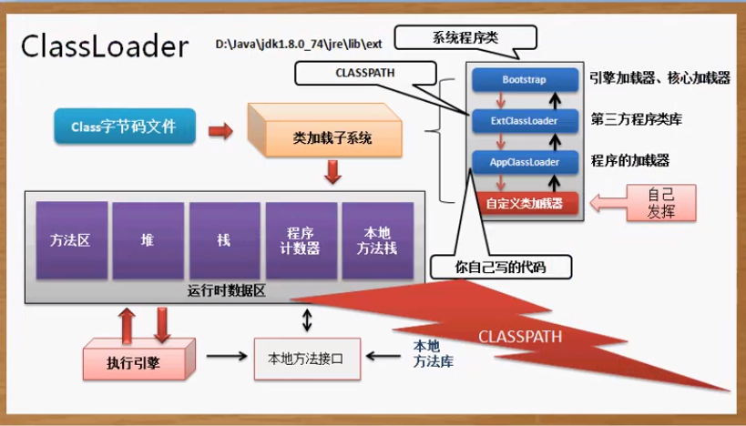

Java虚拟机设计团队有意的把类加载阶段中的 “通过一个类的全限定类名来获取描述该类的二进制字节流” 这个动作放到 JVM 外部去实现，以便让应用程序自己决定如何去获取所需的类。实现这个动作的代码被称作：类加载器。

对于任意一个类，都必须由加载它的类加载器和这个类本身一起共同确立其在Java虚拟机中的唯一性，也就是两个类相等的条件是以由同一个类加载器加载为前提的。否则，即使这两个类来源于同一个Class文件，被同一个JVM加载，只要他们的类加载器不同那么这两个类就一定不相等。

上面说的相等，包括代表类的Class对象的`equals()`方法、`isAssignableFrom()`方法、`isInstance()`方法的返回结果。

**双亲委派模型源码：**

```java
protected synchronized Class<?> loadClass(String name, boolean resolve) throws ClassNotFoundException {    
    // 首先，检查请求的类是否已经被加载过了    
    Class c = findLoadedClass(name);    
    if (c == null) {       
        try {        
            if (parent != null) {            
                c = parent.loadClass(name, false);        
            } else {            
                c = findBootstrapClassOrNull(name);        
            }        
        } catch (ClassNotFoundException e) {            
            // 如果父类加载器抛出ClassNotFoundException            
            // 说明父类加载器无法完成加载请求        
        }     
        
        if (c == null) {            
            // 在父类加载器无法加载时            
            // 再调用本身的findClass方法来进行类加载            
            c = findClass(name);        
        }    
    }    
    
    if (resolve) {        
        resolveClass(c);    
    }
    
    return c; 
}

```


**双亲委派模型的特点：**

- BootStrap加载器：负责加载存放在`<JAVA_HOME>\lib`目录下的Java类库
- Extension Class Loader：负责加载存放在`<JAVA_HOME>\lib\ext`下的Java扩展类库
- Application Class Loder：负责加载ClassPath下的所有类库。是程序的默认加载器
- 只能由子类委托父类加载，当父类返回`null`时就调用启动类加载器
- 当启动类加载器也无法完成加载时就抛出`ClassNotFoundException`异常
- 此时就轮到本身的类加载器了

**双亲委派缺点：**

- 当基础类型需要调用classPath下的类时就尴尬了。启动类加载器显然无法向下委托应用程序加载器。
- 不太优雅的设计：`Thread Context ClassLoader`。可以通过`Thread.setContextClassLoder()`来设置线程上下文类加载器。如果没有设置那么继承父线程的，如果都木有设置那么默认是`Application Class Loader`
- 这种方式实际上是打破了双亲委派的向上委派规则，此时父类加载器可以通过线程上下文请求子类加载器加载类。


在Class类中，可以使用forName方法加载类。但是如果想要加载的类是在网络、文件、数据库上时就需要用到类加载器了。ClassLoader类

在Class类中有这样一个方法：`public ClassLoader getClassLoader()`



在ClassLoader中有一个加载类的方法：

`public Class<?> loadClass(Stirng name) throws ClassNotFoundError`

## 自定义类加载器

首先创建一个Member.java文件，写一个简单类，包名为cn.yang.vo。编译为Member.calss文件

现在希望通过自定义的类加载器

```java
public class TestDemo {
	public static void main(String[] args) throws Exception {
        //加载e盘中的Member类
		Class<?> cls = new myLoad().loadData("cn.yang.vo.Member");
		System.out.println(cls.newInstance());
	}
}

class myLoad extends ClassLoader{
	public Class<?> loadData(String className) throws Exception{
		byte classData [] = this.loadClassData();
		return super.defineClass(className, classData, 0, classData.length);
	}
	private byte[] loadClassData() throws Exception{
		InputStream input = new FileInputStream("e:" + File.separator + "Member.class");
		ByteArrayOutputStream bos = new ByteArrayOutputStream(); //	内存字节流-取得所有的字节内容
		byte data [] = new byte [24]; //读缓冲区
		int temp = 0;
		while((temp = input.read(data)) != -1) {
			bos.write(data, 0, temp);  //向内存流类中的缓冲区写如data中0到temp位置的数据
		}
		byte ret [] = bos.toByteArray();
		input.close();
		bos.close();
		return ret;
	}
}
```

