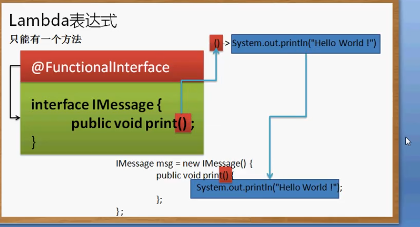

## lambda表达式http://blog.oneapm.com/apm-tech/226.html

在java中可以自己写出一个匿名类（省掉了再建一个实现接口的类的麻烦）

```java
package cn.yang.demo;

interface IMessage {
	void print(); //接口子类必须重写
}


public class TestDemo {
	public static void main(String[] args) {
        IMessage msg = new IMessage() {  //匿名类，直接重写print方法
        	public void print() {
        		System.out.print("杨优秀");
        	}
        };  //语句结束。分号
        msg.print();
	}
}
//少定义一个类，节约一个文件。
```

此时java有了更加简约的lambda匿名表达式：

```java
package cn.yang.demo;
@FunctionInterface  //FunctionInterface关键字声名这个接口是一个函数式编程接口，只允许一个方法
interface IMessage {
	void print(); //使用lambda表达式时接口类只能有一个方法，否则表达式找不到应该把内容填充到哪个方法
}

interface IMath {
    void add(int x, int y);
}

public class TestDemo {
	public static void main(String[] args) {
        //接口声明。编译时就会知道要把lambda表达式给哪个接口
        IMessage msg = () -> {System.out.print("杨优秀");
                              System.out.print("杨优秀")}; //lambda表达式。自动把内容填充到接口内唯一的方法。
        msg.print();
        IMath ma = (a,b) -> a + b; //不用return
        System.out.println(ma.add(10, 20));
	}
}
//当不指明接口时编译器会根据Thread的构造函数public Thread(Runnable r) {}推出这个lambda是要给Runnable接口的
public class TestDemo {
    public static void main(String[] args){
        new Thread( () -> System.out.print("Hello")).start();
    }
}
```

`@FunctionInterface`注解：声明一个函数式编程接口(只允许有一个方法)



`()`中如果有参数还需要加上参数：`(a,b) -> ...`。多行内容要加上大括号{}

**示例：**

```java
package cn.yang.test;

@FunctionalInterface
interface Worker {
    
   public void doSomeWork();
    
}


public class InterfaceTest {

	public static void execute(Worker w) {
   	 	w.doSomeWork();
    }


	public static void main(String [] args) {

		//使用匿名类的方法覆写接口方法
		execute(new Worker() {
			@Override
			public void doSomeWork() {
				System.out.println("Worker invoked using Anonymous class");
            }
        }
        );

		//根据execute会接收一个WorkerInterface接口自动将lambda表达式的内容赋给接口内唯一的一个方法。这时传入execute的参数就是一个有内容的Worker类型的对象。等于用lambda覆写了接口的方法。
        //简单点说就是lambda自动帮我们完成了定义匿名类然后覆写方法的操作
		execute( () -> System.out.println("Worker invoked using Lambda expression") );
	}
}

//输出
//Worker invoked using Anonymous class 
//Worker invoked using Lambda expression
```


**由lambda表达式引申出来了方法引用这个概念。lambda必须依附于函数时接口存在，如Runnable就是函数式接口（只有一个方法）**

## lambda进阶：方法引用

变量声名直接用接口名加泛型，后面的引用相对于普通方式省掉了创建一个实现接口的类然后覆写接口方法的麻烦。

引用静态方法：类名称 ::static 方法名称

引用某个对象的方法：实例化对象 :: 普通方法

引用某个特定类的方法：类名称 :: 普通方法

引用构造方法： 类名称 :: new

**引用方法都应该用函数式接口完成**

**静态方法引用：**

```java
package cn.yang.demo;

interface IUtil<R, P>{
	R conver(P p);
}

public class TestDemo {
	public static void main(String[] args) {
        IUtil<String, Integer> iu = String :: valueOf; //为conver方法引用String的valueOf方法
        System.out.println(iu.conver(1)); //iu.conver(1)等于String.valueOf(1)
	}
}

```


输出 "1000"这个字符串的长度。让iu具备Stirng的valueof方法，和lambda表达式一样将String的valueof方法填充到zhuanhuan方法中。Integer为valueof的参数，String为返回值。

**引用某个对象中的方法：**

```java
package cn.yang.demo;
@FunctionalInterface //注解为函数式接口，只允许有一个方法
interface IUtil<R> {
	public R conver(); //只有返回泛型 R
}


public class TestDemo {
	public static void main(String[] args) {
        //进行方法引用，后面类似lambda。将不用我们创建匿名类再覆盖方法。这里将"hello".toUpperCase这行语句自动填充到了IUtil类的conver函数下。
        IUtil<String> iu = "hello" :: toUpperCase; 
        System.out.print(iu.conver()); //转换的就是这个hello
	}
}
//输出 Hello
```

`"hello" :: toUpperCase`的作用就是将hello执行toUpperCase方法这个内容填充到conver函数中，类似于匿名函数。此时的iu对象的conver方法就已经有内容了。这一句用lambda写就是：`() ->"hello".toUpperCase()`

**引用类中的普通方法：**

```java
package cn.yang.demo;
@FunctionalInterface //注解为函数式接口，只允许有一个方法
interface IUtil<R,p> {
	public R compare(p p1,p p2); 
}


public class TestDemo {
	public static void main(String[] args) {
         //引用String的compare方法，将compare方法内容填充到了IUtil下的compare方法中。
        IUtil<Integer,String> iu = String :: compareTo;
        System.out.print(iu.compare("a", "b")); 
	}
}
//输出：-1
```

**引用构造方法：**

```java
package cn.yang.demo;

class Person {
	private String name;
	private int age;
	public Person(String name, int age) { //构造方法
		this.name = name;
		this.age = age;
	}
	@Override
	public String toString() {
		return "Person [name=" + name + ", age=" + age + "]";
	}
}

@FunctionalInterface //注解为函数式接口，只允许有一个方法
interface IUtil<R,SP,FP> {
	public R creat(SP p1,FP p2); 
}


public class TestDemo {
	public static void main(String[] args) {
        IUtil<Person,String, Integer> iu = Person :: new; //构造方法的返回值是Person
        System.out.print(iu.creat("杨优秀",20)); //iu对象的creat方法引用了Person类的构造方法
	}
}

```

