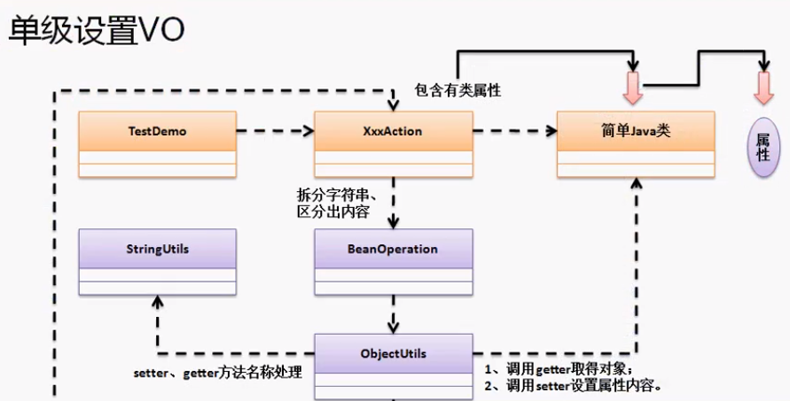

## 反射与单级类操作

如果有一个简单的java类，那么类中的属性就一定要通过getter和setter来调用。

```java
class Person{
	private String name;
	private String job;
	public String getName() {
		return name;
	}
	public void setName(String name) {
		this.name = name;
	}
	public String getJob() {
		return job;
	}
	public void setJob(String job) {
		this.job = job;
	}
}
```

现在我们想实例化对象然后对各个属性进行赋值。如果有上千个属性，那么就需要写上千个setter()，这也太头疼了。现在希望有一种办法能够将这样一段字符串解析成属性值："属性名称:属性值|属性名称:属性值|属性名称:属性值"。



**现在只需修改TestDemo和XxxAction就可以操作另一个不同的简单Java类。**

主程序TestDemo调用EmpAction交给它来设置Emp的值，EmpAction调用BeanOperation实现具体操作。在BeanOperation中会将字符串进行分割，然后调用ObjectUtil的方法传入EmpAction参数返回Emp实例，再调用ObjectUtil的setObjectValue方法设置对象的具体属性。

**cn.yang.Demo.Emp** ：要操作的Java类

```java
package cn.yang.Demo;

public class Emp {
	private String name;
	private String job;
	public String getName() {
		return name;
	}
	public void setName(String name) {
		this.name = name;
	}
	public String getJob() {
		return job;
	}
	public void setJob(String job) {
		this.job = job;
	}
	@Override
	public String toString() {
		return "Emp [name=" + name + ", job=" + job + "]";
	}
}
```


**cn.yang.demo.TestDemo**：启动程序

```java
package cn.yang.demo;

import cn.yang.util.EmpAction;

public class TestDemo {
	public static void main(String[] args) throws Exception {
		String value = "emp.name:杨优秀|emp.job:Excutor";
		EmpAction action = new EmpAction();
		action.setValue(value);
		System.out.println(action.getEmp());
	}
}
```

**cn.yang.demo.EmpAction**：产生Emp实例对象

```java
package cn.yang.demo;

//EmpAction类的主要作用是定位操作属性的类型。同时该程序应该符合所有的简单Java类的开发。这就需要一个单独的类来管理：BeanOperation。

public class EmpAction {
	private Emp emp = new Emp();
	public void setValue(String val) {
		//之所以要传递一个this,主要是将EmpAction的类对象传递到方法里
		//因为给定的标记：emp.name:杨优秀，而emp对应的应该是getEmp方法
		try {
			BeanOperation.setBeanValue(this, val);
		}catch (Exception e) {
			e.printStackTrace();
		}
	}
	public Emp getEmp(){   //获取emp对象
		return this.emp;
	}
}
```

**cn.yang.utils.BeanOperation**：对Emp对象进行set和get，需要用到ObjectUtil和StringUtil类辅助

```java
package cn.yang.util;

/**由于这个类中要操作的对象需要在其他地方重复用到，我们再创建两个类，一个是StringUtils负责字符串的操作，一个是对象操作ObjectUtil
 *  本类主要是用来是实现自动的VO操作，本身不需要实例化对象，所以将构造方法私有化
 * @author vvv
 *
 */
public class BeanOperation {
	private BeanOperation() {}
	/**
	 * 负责设置类中的属性操作
	 * @param obj  表示当前发出设置请求的程序类的当前对象
	 * @param val所有的属性的具体内容（emp.name:yang）
	 * @throws Exception 
	 *///val = "emp.name:杨优秀|emp.job:Excutor"
	public static void setBeanValue(Object obj, String val) throws Exception { //obj为EmpAction，val为需要赋值的属性
		String result[] = val.split("\\|");
		for(int i = 0; i < result.length; i++) {
			String temp[] = result[i].split(":");
			String attribute = temp[0]; //属性名称
			String value = temp[1]; //具体属性内容
			String fields[] = attribute.split("\\."); 
			Object currentObject = ObjectUtil.getObject(obj, fields[0]); //obj=EmpAction, fields[0]=emp
			ObjectUtil.setObjectValue(currentObject, value, fields[1]);
		}
	}
}
```

**cn.yang.utils.ObjectUtil**

```java
package cn.yang.util;

import java.lang.reflect.Field;
import java.lang.reflect.Method;
/**
 * 本类的主要功能是根据属性名称调用相应类中的getter和settrt方法
 * @author vvv
 *
 */
public class ObjectUtil {
	private ObjectUtil() {}
	/**
	 * 负责返回要操作的类对象
	 * @param wrapObject 表示要调用的对象
	 * @param attribute 表示属性名称
	 * @return 调用对象的结果
	 */
	public static Object getObject(Object wrapObject, String attribute) throws Exception {
		String methodName = "get" + StringUtil.initcap(attribute); 
		Field field = wrapObject.getClass().getDeclaredField(attribute);// 判断要操作的属性是否存在
		if (field == null) { //如果为空则尝试获取父类属性
			field = wrapObject.getClass().getField(attribute);
		}
		if (field == null) {
			return null;  //如果都为空那么说明子类父类都没有这个属性。。
		}
		Method method = wrapObject.getClass().getMethod(methodName); 
		return method.invoke(wrapObject);
	}
    
    
	public static void setObjectValue(Object wrapObject, String value, String attribute) throws Exception {
		Field field = wrapObject.getClass().getDeclaredField(attribute);// 判断属性是否存在
		if (field == null) { //如果为空则尝试获取父类属性
			field = wrapObject.getClass().getField(attribute);
		}
		if (field == null) {
			return;  //如果都为空那么说明子类父类都没有这个属性。。
		}
		String MethodName = "set" + StringUtil.initcap(attribute);
		Method method = wrapObject.getClass().getDeclaredMethod(MethodName, field.getType());
		method.invoke(wrapObject, value);
	}
}
```

**cn.yang.util.StringUtil**：返回正确的setter或getter方法名

```java
package cn.yang.util;

public class StringUtil {
	private StringUtil() {}
    
	public static String initcap(String str) {
		return str.substring(0, 1).toUpperCase() + str.substring(1);
	}
}
```

## 多级VO自动设置

假设现在有一个雇员(Emp)，上面还有部门(Department)，还有公司(Company)。

我们现在想要从Emp中获取到Dept然后从Dept中获取到Company。当然Emp是在EmpAction中获取的。

**添加Dept与Company，其中Dept中需要一个方法getCompany来获取Company实例对象：**

```java
package cn.yang.vo;

public class Dept {
	private String dname;
	private String loc;
	private Company company = new Company();
	public String getDname() {
		return dname;
	}
	public void setDname(String dname) {
		this.dname = dname;
	}
	public Company getCompany() {
		return company;
	}
	public void setCompany(Company company) {
		this.company = company;
	}
	public String getLoc() {
		return loc;
	}
	public void setLoc(String loc) {
		this.loc = loc;
	}
	@Override
	public String toString() {
		return "Dept [dname=" + dname + ", loc=" + loc + this.company + "]";
	}
}
```

```java
package cn.yang.vo;

public class Company {
	public String name;
	public String adress;
	public String getName() {
		return name;
	}
	public void setName(String name) {
		this.name = name;
	}
	public String getAdress() {
		return adress;
	}
	public void setAdress(String adress) {
		this.adress = adress;
	}
	@Override
	public String toString() {
		return "Company [name=" + name + ", adress=" + adress + "]";
	}
}
```

**在Emp中添加一个getDept方法来获取Dept实例对象**

**最后只需要修改BeanOperation中的内容：**

```java
package cn.yang.util;

/**由于这个类中要操作的对象需要在其他地方重复用到，我们再创建两个类，一个是StringUtils负责字符串的操作，一个是对象操作ObjectUtil
 *  本类主要是用来是实现自动的VO操作，本身不需要实例化对象，所以将构造方法私有化
 * @author vvv
 *
 */
public class BeanOperation {
	private BeanOperation() {}
	/**
	 * 负责设置类中的属性操作
	 * @param obj  表示当前发出设置请求的程序类的房前对象
	 * @param val所有的属性的具体内容（emp.name:yang）
	 * @throws Exception 
	 */// "emp.name:杨优秀|emp.job:Excutor|emp.dept.dname:阿西吧|emp.dept.company.name:aliyun";
	public static void setBeanValue(Object obj, String val) throws Exception { //obj为EmpAction，val为需要赋值的属性
		String result[] = val.split("\\|");
		for(int i = 0; i < result.length; i++) {
			String temp[] = result[i].split(":");
			String attribute = temp[0]; //属性名称
			String value = temp[1]; //具体属性内容
			String fields[] = attribute.split("\\."); 
			//这里需要区分多级与单级
			if (fields.length > 2) {
				Object currentObject = obj;
                  //反复取到要操作的多级对象
				for (int y = 0; y < fields.length - 1; y++) {
					currentObject = ObjectUtil.getObject(currentObject, fields[y]);
				}
                  //取到目标对象后设置值
				ObjectUtil.setObjectValue(currentObject, value, fields[fields.length - 1]);
			}else {
			Object currentObject = ObjectUtil.getObject(obj, fields[0]); 
			ObjectUtil.setObjectValue(currentObject, value, fields[1]);
			}
		}
	}
	
}
```

## 自动设置数据类型

目前为止我们设置的值都是String，当有一个int值或Double值需要设置时显然就需要修改代码了。

我们可以修改ObjectUtil中的setValue方法的val参数而不会出错，值可以是任意类型的。但是在BeanOperation中我们分割的字符串全当作了String赋值给了setValue函数，此时我们就需要再创建一个工具类来负责数据的转型，并且所有的返回结果都按照Object处理：ObjectValueUtil

**cn.yang.util.ObjectValueUtil：**

```java
package cn.yang.util;

import java.lang.reflect.Field;
import java.text.ParseException;
import java.text.SimpleDateFormat;

public class ObjectValueUtil {
	private ObjectValueUtil() {}
	public static Object getValue(Object wrapObject, String attribute, String val) throws Exception{
		Field field = ObjectUtil.getObjectField(wrapObject, attribute);
		if (field == null) {
			return null;
		}
		return stringToType(field.getType().getSimpleName(), val);
	}
	public static Object stringToType(String type, String value) {
		if ("int".equals(type) || "Integer".equals(type)) {
			if(isInt(value)) {
				return Integer.parseInt(value);
			}
		}else if("String".equals(type)) {
			if(isNotEmpty(value)) {
				return value;
			}else {
				return null;
			}
		}else if ("double".equals(type) || "Double".equals(type)) {
			if(isDouble(value)) {
				return Double.parseDouble(value);
			}
		}else if ("long".equals(type) || "Iong".equals(type)) {
			if(isInt(value)) {
				return Long.parseLong(value);
			}
		}else if("Date".equals(type)) {
			String pattern = null;
			if (isDate(value)) {
				pattern = "yyyy-MM-dd";
			}else if(isDateTime(value)) {
				pattern = "yyyy-MM-dd hh:mm:ss";
			}
			if (pattern != null) {
				try {
					return new SimpleDateFormat(pattern).parse(value);
				} catch (ParseException e) {
					// TODO Auto-generated catch block
					e.printStackTrace();
				}
			}else {
				return null;
			}
		}
		return null;
	}
		
	
	private static boolean isDouble(String str) {
		if(isNotEmpty(str)) {
			return str.matches("\\d+(\\.\\d+)?");
		}
		return false;
	}
	
	private static boolean isInt(String str) {
		if(isNotEmpty(str)) {
			return str.matches("\\d+");
		}
		return false;
	}
	
	private static boolean isNotEmpty(String str) {
		return !(str == null || str.isEmpty() || "".equals(str));
	}
	
	private static boolean isDate(String str) {
		if (isNotEmpty(str)) {
			if(str.matches("\\d{4}-\\d{2}-\\d{2}")) {
				return true;
			}
		}
		return false;
	}
	
	private static boolean isDateTime(String str) {
		if(isNotEmpty(str)) {
			if(str.matches("\\d{4}-\\d{2}-\\d{2} \\d{2}:\\d{2}:\\d{2}")) {
				return true;
			}
		}
		System.out.println("adsmasdmas");
		return false;
	}
}
```

ObjectUtil类没有变化，优化了一个方法：

```java
package cn.yang.util;

import java.lang.reflect.Field;
import java.lang.reflect.Method;

/**
 * 本类的主要功能是根据属性名称调用相应类中的getter和settrt方法
 * @author vvv
 *
 */
public class ObjectUtil {
	private ObjectUtil() {}
	/**
	 * 获取field需要在多处用到，所以单独写了一个方法
	 * @param wrapObject
	 * @param attribute
	 * @return
	 * @throws Exception
	 */
	public static Field getObjectField(Object wrapObject, String attribute) throws Exception {
		Field field = wrapObject.getClass().getDeclaredField(attribute);// 判断属性是否存在
		if (field == null) { //如果为空则尝试获取父类属性
			field = wrapObject.getClass().getField(attribute);
		}
		if (field == null) {
			return null;  //如果都为空那么说明子类父类都没有这个属性。。
		}
		return field;
	}
	/**
	 * 负责指定类中的getter方法
	 * @param wrapObject 表示要调用的方法
	 * @param attribute 表示属性名称
	 * @return 调用对象的结果
	 */
	public static Object getObject(Object wrapObject, String attribute) throws Exception {
		String methodName = "get" + StringUtil.initcap(attribute); //定义getter方法名称，如getEmp
		Method method = wrapObject.getClass().getMethod(methodName); //获取Emp.getEmp方法
		return method.invoke(wrapObject);  //调用getEmp方法返回emp实例
	}
	public static void setObjectValue(Object wrapObject,Object value, String attribute) throws Exception {
		Field field = getObjectField(wrapObject, attribute);
		String MethodName = "set" + StringUtil.initcap(attribute);
		Method method = wrapObject.getClass().getDeclaredMethod(MethodName, field.getType());
		method.invoke(wrapObject, value);
	}

}
```

BeanOperation类多了一个转型参数类型功能：

```java
package cn.yang.util;

public class BeanOperation {
	private BeanOperation() {}

	public static void setBeanValue(Object wrapObject, String val) throws Exception { //obj为EmpAction，val为需要赋值的属性
		String result[] = val.split("\\|");
		for(int i = 0; i < result.length; i++) {
			String temp[] = result[i].split(":", 2); //考虑到时间20:20会有冒号会影响拆分，这里设置为截取两段。
			String attribute = temp[0]; //属性名称
			String fields[] = attribute.split("\\."); 
			
			if (fields.length > 2) {
				Object currentObject = wrapObject;
				for (int y = 0; y < fields.length - 1; y++) {
					currentObject = ObjectUtil.getObject(currentObject, fields[y]); //依次向内获得目标实例
				}
				Object value =ObjectValueUtil.getValue(currentObject, fields[fields.length-1], temp[1]);  //获取转型为正确类型的值
				ObjectUtil.setObjectValue(currentObject, value, fields[fields.length - 1]);
			}else {
			Object currentObject = ObjectUtil.getObject(wrapObject, fields[0]);   //向内获取目标实例对象
			Object value =ObjectValueUtil.getValue(currentObject, fields[1], temp[1]); //获取转型为正确类型的值，fields[1]为属性名，temp[1]为值
			ObjectUtil.setObjectValue(currentObject, value, fields[1]);
			}
		}
	}
}
```

测试类TestDemo：

```java
package cn.yang.demo;

import cn.yang.util.EmpAction;

public class TestDemo {
	public static void main(String[] args) throws Exception {
		String value = "emp.name:杨优秀|emp.job:Excutor|emp.dept.dname:阿西吧|emp.dept.loc:安阳|emp.salary:6516.132|"
				+ "emp.dept.company.name:aliyun|emp.dept.company.adress:杭州"
						+ "emp.dept.count:3243|emp.hireDate:2020-03-02 10:54:30";
		EmpAction action = new EmpAction();
		action.setValue(value);
		System.out.println(action.getEmp());
	}
}
```

以上就实现了不同类型的值的设定。

## 最后一个功能是：自动实例化关联对象~。

**目前的程序当在dept或Company类中没有Dept dept = new dept或Company时是运行不了的。**

修改ObjectUtil类实现自动实例化：

```java
package cn.yang.util;

import java.lang.reflect.Field;
import java.lang.reflect.Method;

/**
 * 本类的主要功能是根据属性名称调用相应类中的getter和settrt方法
 * @author vvv
 *
 */
public class ObjectUtil {
	private ObjectUtil() {}
	/**
	 * 获取field需要在多处用到，所以单独写了一个方法
	 * @param wrapObject
	 * @param attribute
	 * @return
	 * @throws Exception
	 */
	public static Field getObjectField(Object wrapObject, String attribute) throws Exception {
		Field field = wrapObject.getClass().getDeclaredField(attribute);// 判断属性是否存在
		if (field == null) { //如果为空则尝试获取父类属性
			field = wrapObject.getClass().getField(attribute);
		}
		if (field == null) {
			return null;  //如果都为空那么说明子类父类都没有这个属性。。
		}
		return field;
	}
	/**
	 * 负责指定类中的getter方法
	 * @param wrapObject 表示要调用的方法
	 * @param attribute 表示属性名称
	 * @return 调用对象的结果
	 */
	public static Object getObject(Object wrapObject, String attribute) throws Exception {
		String methodName = "get" + StringUtil.initcap(attribute); //定义getter方法名称，如getEmp
		Field field = getObjectField(wrapObject, attribute);
		Method method = wrapObject.getClass().getMethod(methodName); //获取Emp.getEmp方法
		Object obj = method.invoke(wrapObject);  //调用getEmp方法返回emp实例
		if (obj == null) {
            //field.getType返回的是属性的类对象，如Dept返回 class cn.yang.vo.Dept
			obj = field.getType().getDeclaredConstructor().newInstance();
            //设置该属性的值为他的实例。相当于 Dept dept = new Dept()
            //obj就是要赋值的值，attribute为属性名 如dept
			setObjectValue(wrapObject, obj, attribute);
		}
		return obj;
	}
	public static void setObjectValue(Object wrapObject,Object value, String attribute) throws Exception {
		Field field = getObjectField(wrapObject, attribute);
		String MethodName = "set" + StringUtil.initcap(attribute);
		Method method = wrapObject.getClass().getDeclaredMethod(MethodName, field.getType());
		method.invoke(wrapObject, value);
	}
}
```

在具体类Emp或Dept中可以不需要Dept dept = new Dept()了。但是需要一个setDept方法来让setObjectValue方法设置属性值。