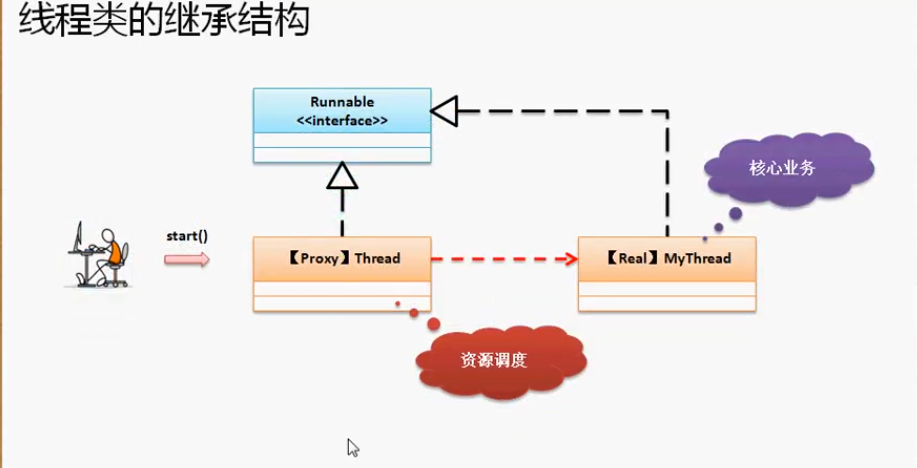
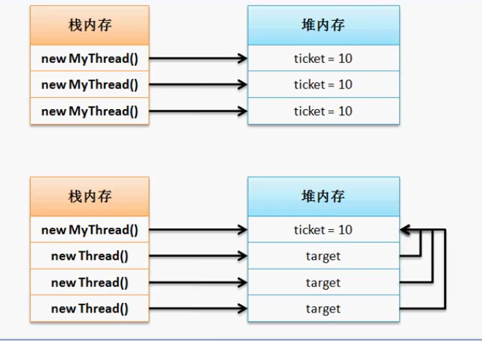
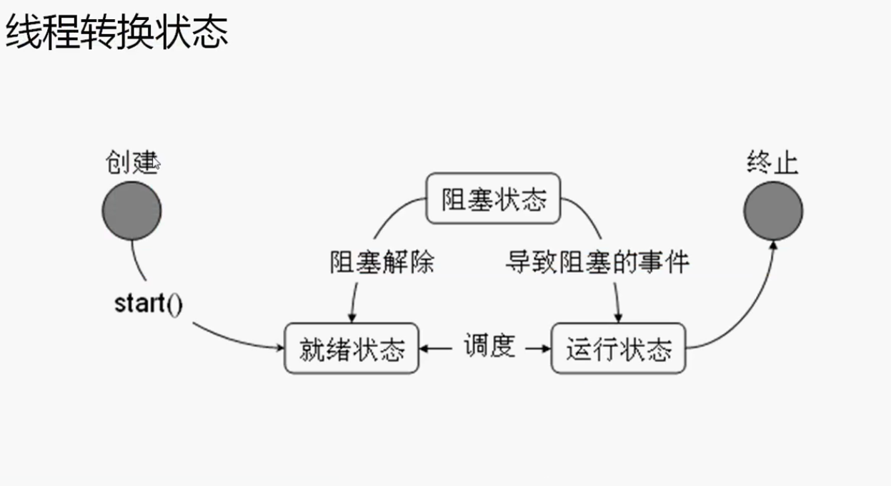
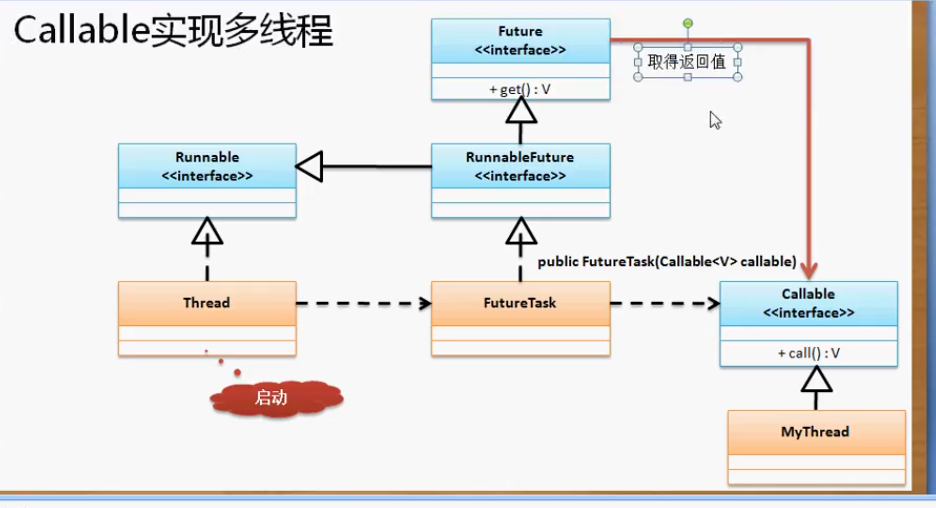

## 多线程的实现

程序的主类：含有main方法的类

多线程的主类：main方法调用的类

实现多线程必须要有一个多线程的执行主类。实现多线程的主类有两种方法

1. 写一个类继承自Thread类，重写run方法，用start方法start线程
2. 写一个类实现Runnable接口，实现run方法。用new Thread(Runnable t).start来start线程


多线程原理：相当于玩游戏，只有一台电脑(CPU)，可是有很多人都要玩。于是start方法是开始排队，将线程放入等待队列中等CPU轮到你，你就执行run方法，当你的时间片用完时就不能再占用CPU了就要回到队列等下一次轮到你，知道你的任务结束。

调用start()后，线程会被放到等待队列，等待CPU调度，并不一定要马上执行。然后通过JVM线程对象Thread会调用run()方法执行线程体。为什么要通过Start来调用run呢？

1. start()方法来start线程能够真正的实现多线程运行。这时无需等待run方法体代码都执行完毕，可以换到下一个线程直接继续执行下一个线程的代码，通过调用Thread类的start()方法来start一个线程，这时线程就处于就绪态，再通过run()方法使它运行。这里的run()方法就称为线程体，它包含了要执行的这个线程的内容。在CPU分配的时间片内run方法运行结束时此线程终止，然后CPU再调度下一个线程。
2. 直接对对象执行run()方法：程序还是要顺序执行，要等待run方法体执行完毕后才能执行下一段代码。此时程序中只有一个主线程。
3. 多线程就是分时利用CPU，宏观上所有线程一块执行，也叫并发。

##### 继承Thread类实现多线程

`java.lang.Thread`是一个线程操作的核心类。定义一个多线程的主类可以直接继承Thread类然后覆写`run()`方法。

多线程启动只有一个方法：Thread.start()  。调用此方法会间接调用Thread.run()

```java
package cn.yang.demo;

class MyThread extends Thread { //多线程的主类
	private String title;
	public MyThread(String title) {
		this.title = title;
	}
	@Override
	public void run() { //所有线程从此处开始执行
		for (int x = 0; x < 3; x++) {
			System.out.println(this.title + ", x = " + x);
		}
	}
}

public class TestDemo {
	public static void main(String[] args) {
        MyThread t1 = new MyThread("线程A");
        MyThread t2 = new MyThread("线程B");
        MyThread t3 = new MyThread("线程C");
        t1.start(); //此处想实现多线程就不能用run
        t2.start();
        t3.start();
	}
}
//输出
线程A, x = 0
线程B, x = 0
线程B, x = 1
线程C, x = 0
线程B, x = 2
线程A, x = 1
线程C, x = 1
线程C, x = 2
线程A, x = 2
```

**Thread.start方法会执行系统调用来分配多线程资源。而run不会。**

##### 使用Runnable接口实现多线程

Thread类的核心功能是进行线程的start，但继承这个类实现多线程的局限就是只能单继承。所以JAVA提供了一个Runnable接口来实现多线程。

```java
@FunctionalInterface //函数式编程接口，意味着该接口只能有一个方法
public interface Runnable {
    public void run()；
}
```

和Thread一样Runnable也有一个run方法

此时可以直接 `class MyThread implements Runnable`

但是我们没有了Thread的start方法来i动线程。此时就需要Thread的构造方法

构造方法：`public Thread(Runnable target)`。可以接收Runnable接口对象。

```java
package cn.yang.demo;

class MyThread implements Runnable { //实现Runnable接口
	private String title;
	public MyThread(String title) {
		this.title = title;
	}
	@Override
	public void run() { //所有线程从此处开始执行
		for (int x = 0; x < 3; x++) {
			System.out.println(this.title + ", x = " + x);
		}
	}
}

public class TestDemo {
	public static void main(String[] args) {
        MyThread t1 = new MyThread("线程A");
        MyThread t2 = new MyThread("线程B");
        MyThread t3 = new MyThread("线程C");
        new Thread(t1).start();  //使用匿名对象的方式直接运行
        new Thread(t2).start();
        new Thread(t3).start();
	}
}

```

多线程的启动永远是Thread类的start()方法。

使用匿名内部类的方法

```java
package cn.yang.demo;

public class TestDemo {
	public static void main(String[] args) {
        new Thread(new Runnable() {
        	@Override
        	public void run() {
        		System.out.print("Hello World");
        	}
        }).start();
	}
}

```

或使用lambda的方式

```java
public class TestDemo {
    public static void main(String[] args){
        new Thread( () -> System.out.print("Hello")).start();
    }
}
```

在实际开发中，Runnable子类定义的形式很少出现，主要以匿名内部类为主。

**在上面代码中我们使用lambda表达式时并没有指明用的是Runnable这个函数式接口，因为编译时会自动推断：根据线程类的构造函数`public Thread(Runnable r) {}`，编译时就会将该lambda表达式赋给Runnable接口。**

##### Thread 与Runnable的不同

首先使用Runnable实现多线程会更好，但是Thread与Runnable之间也存在着联系。

在Thread类的定义中：`public class Thread extends Object implements Runnable`

可以发现Thread是Runnable的子类，那么Thread就会覆写Runnable的run方法。

**Thread类的构造方法：**

```java
 public Thread(Runnable target) {
        this(null, target, "Thread-" + nextThreadNum(), 0);
    }
```

**Thread的run方法：**

```java
	@Override //覆盖Runnable的run方法
    public void run() {
        if (target != null) {  //target是构造方法接收的Runnable对象
            target.run();
        }
    }
private Runnable target; //Thread类中定义的target对象
```



**使用Runnable还可以更好的描述出数据共享的概念，利用Thread也行但没有Runnable丰富。我们希望多个线程对同一个数据进行操作**

```java
package cn.yang.demo;

class MyThread extends Thread {
	private int ticket = 10;
	@Override
	public void run() {
		for (int i=0; i < 20; i++) {
			if(ticket > 0) {
				ticket--;
				System.out.println(" 仅剩" + ticket + "张票 ");
			}
		}
	}
	
}

public class TestDemo {
	public static void main(String[] args) {
        new MyThread().start();
        new MyThread().start();
        new MyThread().start();
	}
}
//输出 
 仅剩9张票 
 仅剩9张票 
 仅剩9张票 
 仅剩8张票 
 仅剩8张票 
 仅剩7张票 
 仅剩6张票 
 仅剩5张票 
 .....
```

可以看到三个线程各管各的10张票，我们需要他们同时都对一份10张票进行操作

我们可以创建一个MyThread对象，然后将这个对象传给Thread的构造函数再执行多线程



```java
MyThread m = new MyThread();
new Thread(m).start();
new Thread(m).start();
new Thread(m).start();
//此时就是三个线程对一组数据操作
```

但是因为MyThread继承自Thread本身就有start方法还要再用Thread的start就显得臃肿

所以可以通过实现Runnable接口来实现

```java
//只需修改第一行继承关系
public class MyThread implements Runnable{ void run(...) }
...
//再通过Thread来调用start。  Thread构造函数接收一个Runnable对象
new Thread(new MyThread()).start(); //匿名执行
new Thread(new MyThread()).start();
new Thread(new MyThread()).start();
```

##### 线程的运行状态



当多线程调用了start()方法之后并不是立刻执行而是进入就绪状态，等待进行调度后执行，需要将资源分配给就绪线程后才可以执行多线程中的代码（run()中的代码）。当执行一段时间后（时间片到）需要让出资源让另一个就绪线程执行然后再进入就绪态等待执行。当运行态线程任务完成后就会进入终止态。

##### 使用Callable实现多线程

`java.util.concurrent`：这个开发包主要是进行高性能变成使用的。在这个开发包里面会提供一些高并发会使用到的类。

Runnable中的run方法虽然是线程的主方法，但他没有返回值。但我们需要一些返回值，来返回结果。所以有了Callable。

##### 使用Callable设计线程主体类

任何多线程i动都需要Thread类的start()方法，但Callable并没有继承Thread，并Thread也不接收Callable类型的参数。

有一个类叫做FutureTask：`public FutureTask(Callable<V> callable)`。FutureTask可以接收Callable对象

这个FutureTask是RunnableFuture的接口实现：`public class FUtureTask<V> extends Object implements RunnableFuture`

而这个RunnableFuture接口定义时继承了Future与Runnable父类：`public interface RunnableFuture<V> extends Runnable, Future<V>`

所以FutureTask是Runnable的子类

而在Future类中有一个get()方法可以得到Callable的返回值



```java
package cn.yang.demo;

import java.util.concurrent.Callable;
import java.util.concurrent.FutureTask;

class MyThread implements Callable<String> {  //相对于Runnable多出一个泛型返回值，实现接口时指定泛型
	private int ticket = 10;
	@Override
	public String call() throws Exception {
		for (int i=0; i < 20; i++) {
			if(ticket > 0) {
				ticket--;
				System.out.println(" 仅剩" + ticket + "张票 ");
			}
		}
		return "sold out";
	}
	
}

public class TestDemo {
	public static void main(String[] args) throws Exception {
        FutureTask<String> task = new FutureTask(new MyThread());//FutureTask接收Callable对象
        new Thread(task).start(); //FutureTask是Runnable的子类，由于多态Thread可以接收Runnable对象。
        System.out.print(task.get());
	}
}

```

线程池带来的唯一的好处是可以将线程安组的方式来执行作业，在大规模开发中能够得到更自由的资源分配。