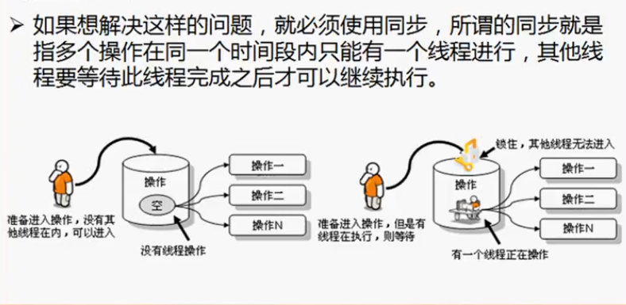

##### 线程的命名和得到

线程的运行状态是不可预知的，所以对于多线程的操作必须有一个可以标识出线程对象的一个信息（name）。在Thread类中有如下名称操作方法

1. Thread类的构造方法：`public Thread (Runnable target, String name)` 创建线程对象时设置好名字

2. `public final void setName(String name)` 对线程对象设置名字。final用于方法中标识该方法不可被覆写。对应`getName()`

   

如果想要的到线程对象可以用Thread类中的currentThread方法

```java
package cn.yang.demo;

class MyThread implements Runnable { 
	@Override
	public void run() {
		for(int i = 0; i < 10; i++) {
			System.out.println(Thread.currentThread().getName());}
		}
	}

public class TestDemo {
	public static void main(String[] args) throws Exception {
        MyThread t = new MyThread();
        t.run();
        new Thread(t).start();
        new Thread(t, "haha").start(); //设置线程名称
	}
}
//输出
main
main
main
main
main
main
main
main
main
main
Thread-0
Thread-0
Thread-0
haha
haha
haha
haha
haha
haha
haha
haha
haha
haha
Thread-0
Thread-0
Thread-0
Thread-0
Thread-0
Thread-0
Thread-0
```

**由t.run()返回main得出：由对象直接调用run方法就等于在主线程上执行run方法体内容直到运行完毕。而下两个线程则构成了多线程并发执行，主方法就是一个线程。所有线程都是通过主线程创建并运行的。**

##### 线程休眠

让线程暂缓执行，到预计时间时再恢复执行。

方法：`public static void sleep(long millis) throws InterruptedException` 因为有很多参数类型，如毫秒、秒、分秒。所以这个方法有很多重载方法

用法：`Thread.sleep(1000)`

所有的run方法是依次执行的，一个线程休眠另一个线程立刻执行它的run方法也进入休眠。。整体我们会感觉所有线程同时休眠。是并发执行，不是并行。

##### 线程的优先级

线程的优先级指线程的优先级越高就越有可能先执行（不是一定）

设置优先级：`public final void setPriority(int newPriority)`

get优先级：`public final int getPriority()`

**Thread类中的几个优先级常量(constant)**

最高优先级：`public static final int MAX_PRIORITY` 默认为10

中等优先级：`public static final int NORM_PRIORITY` 默认为5

最低优先级：`public static final int MIN_PRIORITY `默认为1

``` java
MyThread mt = new MyThread();
Thread t = new Thread(mt, "MyThread~");
t.setPriority(Thread.MAX_PRIORITY);   //设置最高优先级，这个线程就有更大的可能获得CPU运行机会
//在main中执行 Thread.currentThread().getpriority() 得到5。所以主线程(主方法)是一个中等优先级
```

## 线程的同步与死锁

**同步问题的引出**

现在希望做一个简单的程序：一个多线程卖票的程序

```java
package cn.yang.demo;

class MyThread implements Runnable { 
	private int ticket = 10;
	@Override
	public void run() {
		for(int i = 0; i < 10; i++) {
			if (this.ticket > 0) {
				try {
					Thread.sleep(200); //模拟延迟
				} catch (InterruptedException e) {
					// TODO Auto-generated catch block
					e.printStackTrace();
				}
			System.out.println(Thread.currentThread().getName() + " " + this.ticket--);}
		}}
	}

public class TestDemo {
	public static void main(String[] args) throws Exception {
        MyThread t = new MyThread();
        new Thread(t,"一号").start();
        new Thread(t, "二号").start(); 
	}
}

//输出
一号 10
二号 10
二号 9
二号 8
二号 6
二号 5
二号 4
二号 3
一号 7
一号 1
二号 2
一号 0
二号 -1
```

因为判断输出的if是this.ticket>0。但还是出现了0票

模拟延迟让问题付出了水面

当第一个线程进入延迟，此时的ticket为1，该线程休眠。另一个线程进入方法体到 if 时ticket为1，此时它能通过if，然后进入休眠。此时两个线程都通过了if判断，但ticket为1。所以就会出现-1的票数。     这就是不同步的线程。

不同步的唯一好处就是速度快（多个线程并发执行）

##### 同步处理

所有线程不是一并进入方法中执行，而是一个一个的进入



如果想采用这种锁的功能，可以采用synchronized关键字来处理。分为同步代码块，同步方法。synchronized关键字处理的代码块或方法的操作时具有原子性的~

1. **使用同步代码块：必须要设置一个要锁定的对象：一般锁定当前对象 : this**

```java
package cn.yang.demo;

class MyThread implements Runnable { 
	private int ticket = 10;
	@Override
	public void run() {
		for(int i = 0; i < 10; i++) {
            //同一时刻只允许一个线程使用
			synchronized (this) { //为代码块上锁，锁定当前对象。同一时刻只允许一个线程进入操作，其他线程需要等待
			if (this.ticket > 0) {
				try {
					Thread.sleep(200);
				} catch (InterruptedException e) {
					e.printStackTrace();
				}
			System.out.println(Thread.currentThread().getName() + " " + this.ticket--);}
		}}}
	}

public class TestDemo {
	public static void main(String[] args) throws Exception {
        MyThread t = new MyThread();
        new Thread(t,"一号").start();
        new Thread(t, "二号").start(); 
	}
}

```

这种方式是在方法里的代码块上锁的，同时进入到方法里的线程依然会有很多个

2. **同步方法**

   ```java
   package cn.yang.demo;
   
   class MyThread implements Runnable { 
   	private int ticket = 10;
   	@Override
   	public void run() {
   		for(int i = 0; i < 10; i++) {
   			this.sale(); //执行sale方法时就会上锁
   		}
   	}
   
   	public synchronized void sale() { //定义方法时使用synchronized关键字
   		if (this.ticket > 0) {
   		try {
   			Thread.sleep(200);
   		} catch (InterruptedException e) {
   			// TODO Auto-generated catch block
   			e.printStackTrace();
   		}
   		System.out.println(Thread.currentThread().getName() + " " + this.ticket--);}
   }
   }
   
   public class TestDemo {
   	public static void main(String[] args) throws Exception {
           MyThread t = new MyThread();
           new Thread(t,"一号").start();
           new Thread(t, "二号").start(); 
   	}
   }
   
   ```

   

**同步可以保证线程安uan，但是执行会很慢。**


##### 死锁

同步：一个线程等待另一个线程执行完毕后才能执行，但是如果几个线程彼此之间互相等待，谁也不释放对方的锁，那么就会产生死锁。

## 线程池

线程池：一个任务由多个捆绑在一块的线程完成

线程池内可以有：单个线程、不可预见的无限多个线程、限定个数的线程

JDK1.5后出现了一个支持高并发的一个包：`java.util.concurrent`对于线程池的操作的核心类和核心接口都定义在此包中。

**这里面有两个核心的接口：**

1. 普通执行线程池的定义接口：`java.util.concurrent.ExecutorService`
2. 调度线程池：`java.util.concurrent.ScheduledExecutorService`

如果要进行线程池的创建，一般可以使用`java.util.concurrent.Executors`类完成，有如下几个方法：

1. 创建无限大小的线程池用到的类：`public static ExecutorService newCachedThreadPool()`
2. 创建固定大小的线程池：`public static ExecutorService newFixedThreadPool(int nThreads)`
3. 创建只能有一个线程的线程池(单线程池)：`public static ScheduledExecutorService newSingleThreadScheduledExecutor()`
4. 创建定时调度池：`public static ScheduledExecutorService newScheduledThreadPool(int corePoolSize)`

#### 创建各种线程池

1.创建无限大小的线程池：

```java
package cn.yang.demo;

import java.util.concurrent.ExecutorService;
import java.util.concurrent.Executors;

public class TestDemo {
	public static void main(String[] args) throws Exception{
		ExecutorService executorService = Executors.newCachedThreadPool();//newCacheThreadPool是静态方法，直接通过方法名调用
		for (int i = 0; i < 10; i++) {
			int x = i;
			executorService.submit(() -> System.out.println(Thread.currentThread().getName() + "  x = " + x));
		}
		executorService.shutdown();
	}
}
//输出
pool-1-thread-1  x = 0
pool-1-thread-3  x = 2
pool-1-thread-7  x = 6
pool-1-thread-5  x = 4
.....
//如果在int x = i;上添加一个Thread.sleep(300)让线程等待以下那么输出为
pool-1-thread-1  x = 0
pool-1-thread-1  x = 1
pool-1-thread-1  x = 2
pool-1-thread-1  x = 3
pool-1-thread-1  x = 4
....
会发现只有一个线程了
```

上面的例子我们可以看出`newCachedThreadPool`所创造的无限线程线程池的特点是：一个任务所有空余的线程都会争先的做它，我们可以看到不加sleep的话已经有了7号线程。当加了sleep第一个线程执行到sleep会等一会儿再执行下面的代码，这时第一个线程被认为是空闲的，休眠结束后系统还会让他执行下面的代码。

将`newCachedThreadPool`换成`newSingleThreadScheduledExecutor()`时只会有一个线程在线程池中运行。

将`newCachedThreadPool`换成`newFixedThreadPool(3)`就可以指定3个线程在线程池中执行。

**定时调度池**

```java
package cn.yang.demo;

import java.util.concurrent.Executors;
import java.util.concurrent.ScheduledExecutorService;
import java.util.concurrent.TimeUnit;

public class TestDemo {
	public static void main(String[] args) throws Exception{
		ScheduledExecutorService executorService = Executors.newScheduledThreadPool(3);//newScheduleThreadPool是静态方法，直接通过方法名调用
		for (int i = 0; i < 10; i++) {
			int x = i;
            //scheduleAtFixedRate接收一个Runnable对象所以它知道要把lambda送到哪
            //3代表3秒后执行代码，2代表每2秒执行一次，时间单位设置成了秒
			executorService.scheduleAtFixedRate(() -> System.out.println(Thread.currentThread().getName() + "、x = " + x), 3, 2, TimeUnit.SECONDS);
		}
	}
}
//最后一部分也可以不用lambda，用匿名类的方式
executorService.scheduleAtFixedRate( new Runnable() {
		@Override
		public void run() {
		System.out.println(Thread.currentThread().getName() + "、x = " + x);	
				}
		}, 3, 2, TimeUnit.SECONDS);
```

