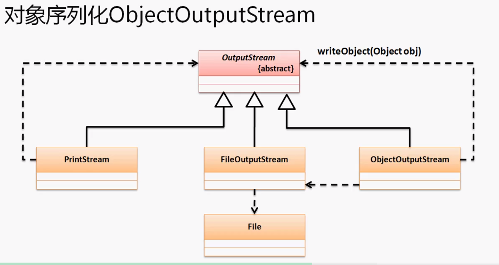
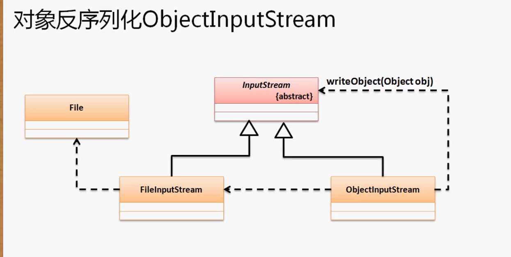

所有的项目开发一定会有序列化的概念存在。

所谓的对象序列化就是将对象变为二进制数据流的形式进行传输或者是将其保存在文本中。

二进制后就意味着可以在网络上传输对象了 -- 

并不是所有的类都可以被序列化，需要序列化的类一般都是需要传输使用，同时这个类必须实现java.io.Serializable接口。但是这个接口只是一个标识接口并没有任何方法。

**定义可以被序列化的对象类：**

```java
@SuppressWarnings("serial")
class Person implements Serializable{
	private String name;
	private int age;
	public Person(String name, int age) {
		super();
		this.name = name;
		this.age = age;
	}
	@Override
	public String toString() {
		return "Person [name=" + name + ", age=" + age + "]";
	}
}
```

序列化对象时所需要保存的就是对象中的属性，所以默认情况下对象的属性将被转换为二进制数据流存在。

## 序列化与反序列化操作

在java.io包中提供有两个处理类：`ObjectOutputStream`; `ObjectInputStream`

`ObjectOutputStream`：

```java
public class ObjectOutputStream
extends OutputStream
implements ObjectOutput, ObjectStreamConstants
   
//构造方法：
    public ObjectInputStream(InputStream in)
                  throws IOException
    
//有一个OutputStream没有的他自己特有的方法：
    public final void writeObject(Object obj)
                       throws IOException
```



ObjectOutputStream需要一个OutputStream实例，因为OutputStream是抽象类，此时我们就应该知道传入的应该是一个具体的对象，如FileOutputStream，而FileOutputStream也是一个抽象类，所以我们用到了File类这个具体的文件对象。

`ObjectInputStream：

```java
public class ObjectInputStream
extends InputStream
implements ObjectInput, ObjectStreamConstants
    
//构造方法：
    public ObjectOutputStream(OutputStream in)
                  throws IOException
```



**ObjectInputStream接收FileInputStream。方法改为readObject(Object obj)**

**实现对象序列化与反序列化：**

```java
public class TestDemo {
	public static final File FILE = new File("e:" + File.separator + "a.txt");
	public static void main(String[] args) throws Exception {
		ser(new Person("杨优秀", 22)); //序列化，将对象转换成二进制信息输出到文件中
		dser(); //反序列化，输出Person [name=杨优秀, age=22]
	}
	public static void ser(Object obj) throws Exception{ //负责序列化对象
		ObjectOutputStream out = new ObjectOutputStream(new FileOutputStream(FILE));
		out.writeObject(obj);
		out.close();
	}
	public static void dser() throws Exception{
		ObjectInputStream input = new ObjectInputStream(new FileInputStream(FILE));
		System.out.println(input.readObject());
	}
}
```

## transient关键字

实际上序列化的处理在java.io包中有两类。Serializable是一种自动化的序列化。还有一种叫做Externalizable接口是需要用户自己动手来实现序列化处理。

但由于默认的Serializable会将对象中的属性都保存，那么使用transient关键字能使它不被序列化保存。

```java
private transient String name;
private int age;
//序列化时不会保存name属性
```

