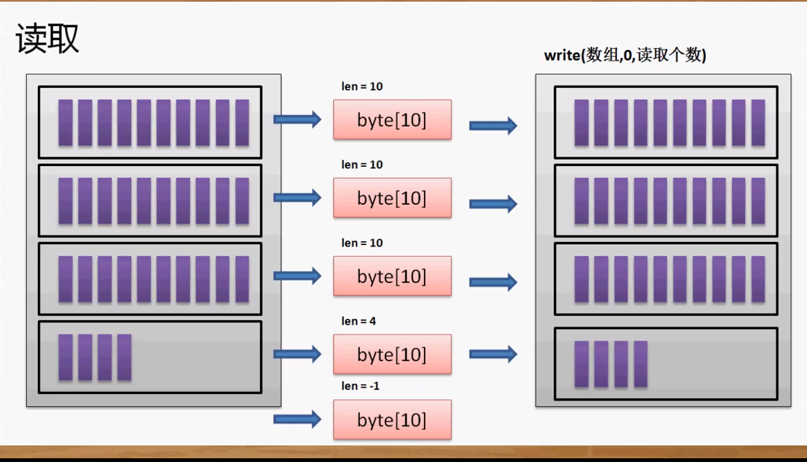

## 文件拷贝

应该采用字节流的操作比较直接、方便。

因为不知道文件到底有多大，应该采用边读边写的模式。

**首先采用读一个写一个的方式：**

```java
package cn.yang.demo;

import java.io.File;
import java.io.FileInputStream;
import java.io.FileNotFoundException;
import java.io.FileOutputStream;
import java.io.IOException;
import java.io.InputStream;
import java.io.OutputStream;

class CopyUtil{
	private CopyUtil() {} //这个类不需要任何的属性，所以可以将构造方法私有化
	/**
	 *判断要拷贝的源文件是否在存在 
	 * @param path 文件路径
	 * @return  存在则返回true，否则返回false
	 */
	public static boolean fileExists(String path) {
		return new File(path).exists();
	}
	public static void creatDir(String path) {
		File file = new File(path);
		if(!file.getParentFile().exists()) {
			file.getParentFile().mkdirs();
		}
	}
	public static boolean copy(String p1, String p2)  {
		boolean flag = false;
		File f1 = new File(p1);
		File f2 = new File(p2);
		InputStream input = null;
		OutputStream output = null;
		try {
			input = new FileInputStream(f1);
			output = new FileOutputStream(f2);
			copyHandle(input, output);
			flag = true;
		}catch(Exception e){
			flag = true;
		} finally {
			try {
				input.close();
				output.close();
			}catch (Exception e) {}	
		}
		return flag;
	}
	/**
	 *   实现具体的文件拷贝操作
	 * @param input  输入流对象
	 * @param output  输出流对象
	 * @throws Exception
	 */
	private static void copyHandle(InputStream input, OutputStream output) throws IOException {
		long start = System.currentTimeMillis();
		// InputStream有一个读取单个字节的方法：int read()
		//OutputStream有一个输出单个字节的方法： void write(int data)
		int temp = 0;
		while ((temp = input.read()) != -1) { //判断读取后的字节(保存在temp中)是否是-1，如果不是则表示有内容
			output.write(temp);
		}
		long end = System.currentTimeMillis();
		System.out.println("拷贝时间：" + (end - start));
	}
}

public class TestDemo {
	public static void main(String[] args) throws Exception {
		if (args.length != 2) {
			System.out.println("错误命令格式，退出");
			System.exit(1);
		}
		if( CopyUtil.fileExists(args[0])) {
			CopyUtil.creatDir(args[1]);
			System.out.println(CopyUtil.copy(args[0], args[1])? "拷贝成功" : "拷贝失败");
			
		}else {
			System.out.println("源文件不存在，无法完成拷贝");
		}
	}
}
//输出
拷贝时间：1233
拷贝成功
```

**单这种方法实在是太慢了太占IO了**

**下面用字节数组来实现：**



```java
package cn.yang.demo;

import java.io.File;
import java.io.FileInputStream;
import java.io.FileNotFoundException;
import java.io.FileOutputStream;
import java.io.IOException;
import java.io.InputStream;
import java.io.OutputStream;

class CopyUtil{
	private CopyUtil() {} //这个类不需要任何的属性，所以可以将构造方法私有化
	/**
	 *判断要拷贝的源文件是否在存在 
	 * @param path 文件路径
	 * @return  存在则返回true，否则返回false
	 */
	public static boolean fileExists(String path) {
		return new File(path).exists();
	}
	public static void creatDir(String path) {
		File file = new File(path);
		if(!file.getParentFile().exists()) {
			file.getParentFile().mkdirs();
		}
	}
	public static boolean copy(String p1, String p2)  {
		boolean flag = false;
		File f1 = new File(p1);
		File f2 = new File(p2);
		InputStream input = null;
		OutputStream output = null;
		try {
			input = new FileInputStream(f1);
			output = new FileOutputStream(f2);
			copyHandle(input, output);
			flag = true;
		}catch(Exception e){
			flag = true;
		} finally {
			try {
				input.close();
				output.close();
			}catch (Exception e) {}	
		}
		return flag;
	}
	/**
	 *   实现具体的文件拷贝操作
	 * @param input  输入流对象
	 * @param output  输出流对象
	 * @throws Exception
	 */
	private static void copyHandle(InputStream input, OutputStream output) throws IOException {
		long start = System.currentTimeMillis();
		byte data[] = new byte [1024];
		int len = 0;
		while ((len = input.read(data)) != -1) { //返回独居的字节个数。判断读取后的字节个数是否是-1，如果不是则表示有内容
			output.write(data, 0, len);
		}
		long end = System.currentTimeMillis();
		System.out.println("拷贝时间：" + (end - start));
	}
}

public class TestDemo {
	public static void main(String[] args) throws Exception {
		if (args.length != 2) {
			System.out.println("错误命令格式，退出");
			System.exit(1);
		}
		if( CopyUtil.fileExists(args[0])) {
			CopyUtil.creatDir(args[1]);
			System.out.println(CopyUtil.copy(args[0], args[1])? "拷贝成功" : "拷贝失败");
			
		}else {
			System.out.println("源文件不存在，无法完成拷贝");
		}
	}
}
//输出
拷贝时间：1
拷贝成功
```

OK，完成~