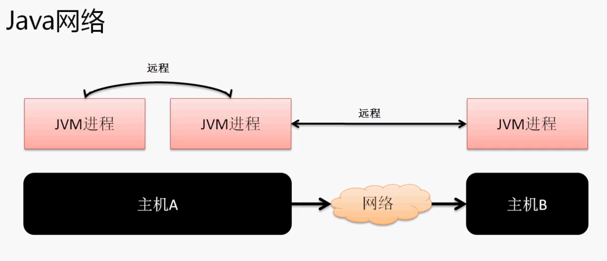

在java中网络单位是以JVM虚拟机来区分的。一台物理机可能同时运行有五台JVM虚拟机。



从网络编程的本质来讲分为两种类型：

1. C/S结构（客户端/服务器端）：需要开发客户端与服务端两套程序。更新时两边都要更新
2. B/S结构（浏览器/服务器）：更新一端即可

**基本CS模型：**

```java
//Server

import java.io.PrintWriter;
import java.net.ServerSocket;
import java.net.Socket;

public class Server {
	public static void main(String[] args) throws Exception {
		ServerSocket server = new ServerSocket(9999);
		System.out.println("wait.....");
		Socket client = server.accept();
		PrintWriter out = new PrintWriter(client.getOutputStream());
		out.println("Hello world");
		out.close();;
		server.close();
	}
}


//Client
import java.net.Socket;
import java.util.Scanner;

public class Client {
	public static void main(String[] args) throws Exception{
		Socket client = new Socket("localhost", 9999);
		Scanner scan = new Scanner(client.getInputStream());
		scan.useDelimiter("\n");
		if (scan.hasNext()) {
			System.out.println(scan.next());
		}
		scan.close();
		client.close();
	}
}

```

这个模型只能够处理一次请求操作。

## ECHO程序

服务端可以一直接收客户端的消息然后添加一个ECHO头部返回给客户端，直到客户端发送一个bye消息。可以接收多个客户端请求。

```java
package cn.yang.demo;
//服务端
import java.io.PrintStream;
import java.net.ServerSocket;
import java.net.Socket;
import java.util.Scanner;

public class TestDemo {
	
    //多线程处理程序
	private static class MyThread implements Runnable {
		private Socket client;
		public MyThread(Socket client) {
			this.client = client;
		}
		@Override
		public void run() {
			try {
			Scanner scan = new Scanner(client.getInputStream());
			scan.useDelimiter("\n");
			PrintStream out = new PrintStream(client.getOutputStream()); //字节打印流
			boolean flag = true;
			while(flag == true) {
				if (scan.hasNext()) {
					String str = scan.next().trim(); //去掉多余空格
					if("bye".equalsIgnoreCase(str)) {
						out.println("bye~");
						flag = false;
						break; //结束连接
					}
					out.println("ECHO:" + str);
				}
			}
			out.close();
			scan.close();
			}catch (Exception e) {
				System.out.println(e);
			}
		}
	}
	
	public static void main(String[] args) throws Exception {
		ServerSocket server = new ServerSocket(9999);
		System.out.println("wait.....");
		boolean flag = true;
		while(flag == true) {
			Socket client = server.accept();
			new Thread(new MyThread(client)).start();
		}
		server.close();
	}
}
```

```java
package cn.yang.demo;
//客户端
import java.io.PrintStream;
import java.net.Socket;
import java.util.Scanner;

public class Client {
	public static void main(String[] args) throws Exception{
		Socket client = new Socket("localhost", 9999);
		PrintStream out = new PrintStream(client.getOutputStream());
		Scanner scan = new Scanner(client.getInputStream());
		scan.useDelimiter("\n");
		@SuppressWarnings("resource")
		Scanner input = new Scanner(System.in);
		input.useDelimiter("\n");
		boolean flag = true;
		while(flag == true) {
			System.out.println("input someting :");
			String str =null;
			if (input.hasNext()) { //如果输入完信息那么判断输入的是否是bye并且接收服务端
				str = input.next().trim();  //必须要去掉空格，不然返回的可能是bye   ，这样就判断equal时就永远不会成功了。
				out.println(str);
				if(scan.hasNext()) {
					System.out.println(scan.next());
				}
				}
			if("bye".equalsIgnoreCase(str)) {
				flag = false;
				break;
			}
			}
		input.close();
		scan.close();
		client.close();
	}

}
```

不过这样的编程时代已经过去了

