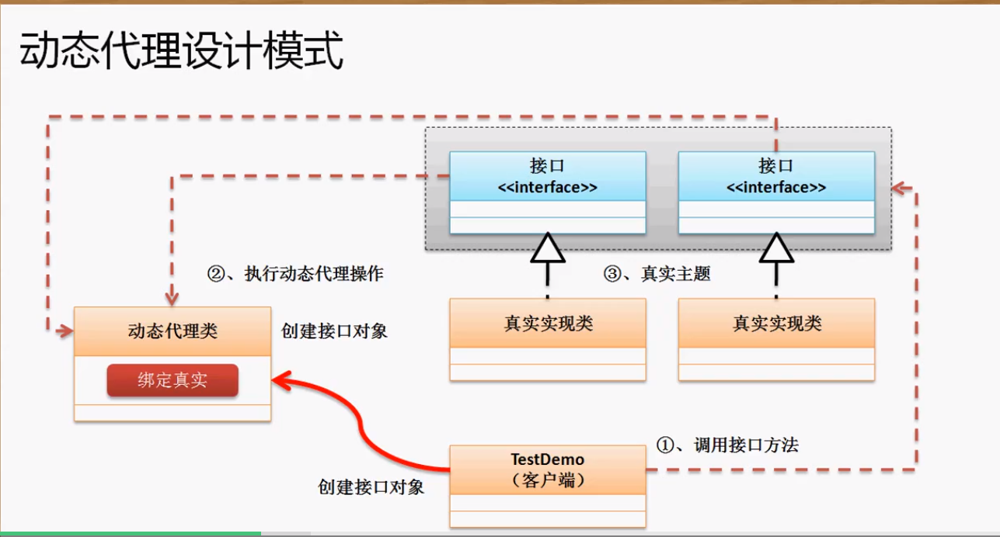

在实际的开发中有两大核心的设计模式：工厂设计模式、代理设计模式

**分析代理设计模式的问题：**

代理模式的核心本质是：一个接口有两个子类。一个负责真实业务，另一个负责与真实业务有关的所有辅助性操作。

下面来看一下工厂模式结合代理模式：

```java
package cn.yang.demo;

interface ISubject{
	public void eat();
}

class Realsubject implements ISubject{
	public void eat() {
		System.out.println("吃饭饭");
	}
}

class ProxySubject implements ISubject{
	private ISubject subject;
	public ProxySubject(ISubject subject) {
		this.subject = subject;
	}
	@Override
	public void eat() {
		this.prepare();
		this.subject.eat();  //核心的吃
		this.clear();
	}
	public void prepare() {
		System.out.println("准备食材");
	}
	public void clear() {
		System.out.println("洗刷碗筷");
	}
}

class Factory{
	private Factory() {}
	@SuppressWarnings("unchecked")
	public static <T> T getInstance(String className) throws Exception {
		T t = null;
		t = (T) Class.forName(className).getDeclaredConstructor().newInstance();
		return t;
	}
	@SuppressWarnings("unchecked")
	public static <T> T getInstance(String proxyClassName, String realClassName) throws Exception {
		T t = null;
		T object = getInstance(realClassName); //取得真实的接口对象-realsubject
		//获取ProxySubject类中指定参数类型的构造方法然后实例化代理类，参数为realSubject
        t =(T)Class.forName(proxyClassName).getDeclaredConstructor(object.getClass().getInterfaces()[0]).newInstance(object);
		return t; //返回代理类
	}
}

public class TestDemo {
	public static void main(String[] args) throws Exception {
		ISubject sub = Factory.getInstance("cn.yang.demo.ProxySubject","cn.yang.demo.Realsubject");
		sub.eat();
	}
}
//输出
准备食材
吃饭饭
洗刷碗筷
```

通过工厂类可以将代理类与真实类联系起来，用户端(TestDemo)只需调用工厂即可返回包装过的代理类。

但是显然这种代理模式并不能满足realSubject继承多个接口的情况，我们需要用到动态代理模式。

# 动态代理模式

**动态代理：一个代理类可以代理所有需要被代理接口的子类对象。**

**核心方法：**`newProxyInstance(ClassLoader loader, Class<?>[] interfaces, InvocationHandler h)`



```java
package cn.yang.demo;

import java.lang.reflect.InvocationHandler;
import java.lang.reflect.Method;
import java.lang.reflect.Proxy;

interface ISubject{
	public void eat(int num, String msg);
}

/**
 *  InvocationHandler接口是proxy代理实例的调用处理程序实现的一个接口，每一个proxy代理实例
 *  都有一个关联的调用处理程序；在代理实例调用方法时，方法调用被编码分派到调用处理程序的invoke方法
 * @author vvv
 *
 */
class ProxySubject implements InvocationHandler{
	/**
	 *每一个代理类的实例都关联到了实现该接口的动态代理类调用处理程序中，当我们通过动态代理对象
	 *调用一个方法的时候，这个方法的调用就会被转发到实现InvocationHandler接口类的Invoke方法来调用
	 * @param proxy表示的是被代理的真实对象
	 * @param method返回的是被调用的方法对象，取得了Method对象后可以使用Method.invoke()
	 * @return方法的返回值
	 */
	private Object target;
	public Object bind(Object target) {
		this.target = target; //保存真实对象
		/**
		 * Proxy类就是用来创建一个代理对象的类，最常用的就是newProxyInstance
		 * @param ClassLoader: 定义了由哪个classloader对象生成的代理类进行加载
		 * @param interfaces: 真实类所实现的接口给代理类，代理类会遍历数组实现所有接口
		 * @param h: 表示的是当动态代理对象调用方法的时候会关联到哪一个InvocationHandler对象上，并最终由其调用
		 */
		return Proxy.newProxyInstance(target.getClass().getClassLoader(), target.getClass().getInterfaces(), this);
	}
	public void prepare() {
		System.out.println("准备食材");
	}
	public void clear() {
		System.out.println("清场");
	}
	
	/**
	 * 当我们通过动态代理对象调用一个方法的时候，这个方法的调用就会被转发到实现InvocationHandler接口类的invoke方法中来调用。
	 * proxy 代理类代理的真实代理对象 com.sun.proxy.$Proxy。这个对象也是在Proxy.newProxyInstance(target.getClass().getClassLoader()这个语句中返回的。
	 * method 我们所要调用某个对象真实的方法的Method对象。由$Proxy0实例赋值
	 * args 指代理对象方法传递的参数。由$Proxy0实例赋值
	 */
	@Override
	public Object invoke(Object proxy, Method method, Object[] args) throws Throwable {
		this.prepare();
		Object ret = method.invoke(this.target, args);
		this.clear();
		return ret;
	}
	
}

class Realsubject implements ISubject{
	public void eat(int num, String msg) {
		System.out.println("我吃了" + num + "碗" + msg);
	}
}

public class TestDemo {
	public static void main(String[] args) throws Exception {
		ISubject subject = (ISubject) new ProxySubject().bind(new Realsubject());
		subject.eat(22, "axiba"); //此处自动调用invoke().eat方法已经被包装过了
	}
}
```

在代理类的bind方法在`Proxy.newProxyInstance..`方法返回的代理对象`$Proxy0`中真实类的方法将被包装：

```java
public final class $Proxy0 extends Proxy  //返回的代理对象
	implements ISubject
{

	private static Method m1;
	private static Method m3;
	private static Method m2;
	private static Method m0;

	public $Proxy0(InvocationHandler invocationhandler)
	{
		super(invocationhandler); //调用Proxy的构造函数传入实现Invocation接口的类
	}
---------------------------------------------------------------------

public final void eat()
	{
		try
		{   //this就是invoke第一个参数proxy。为代理对象$proxy0
			super.h.invoke(this, m3, [22, "axiba"]); //m3是根据传入的接口来获取的Method对象
			return;
		}
		catch (Error ) { }
		catch (Throwable throwable)
		{
			throw new UndeclaredThrowableException(throwable);
		}
	}
    
    -----------------------------------------------------------------------------
	public final boolean equals(Object obj)  //父类Object中的方法
	{
		try
		{    //m1就是Method类型的equals方法
			return ((Boolean)super.h.invoke(this, m1, new Object[] {
				obj
			})).booleanValue();
		}
		catch (Error ) { }
		catch (Throwable throwable)
		{
			throw new UndeclaredThrowableException(throwable);
		}
	}
    .............
static //获取真实类的方法
	{
		try
		{
			m1 = Class.forName("java.lang.Object").getMethod("equals", new Class[] {
				Class.forName("java.lang.Object")
			});
			m3 = Class.forName("cn.yang.demo.TestDemo.ISubject").getMethod("eat",null);
			m2 = Class.forName("java.lang.Object").getMethod("toString", new Class[0]);
			m0 = Class.forName("java.lang.Object").getMethod("hashCode", new Class[0]);
		}
		catch (NoSuchMethodException nosuchmethodexception)
		{
			throw new NoSuchMethodError(nosuchmethodexception.getMessage());
		}
		catch (ClassNotFoundException classnotfoundexception)
		{
			throw new NoClassDefFoundError(classnotfoundexception.getMessage());
		}
	}
}
```

**显然我们在调用代理类时就会自动调用invoke方法`super.h.invoke`。这里我们也知道了invoke的第一个参数Proxy是什么意思，没错就是返回的代理对象`$Proxy0` 。那么这个`h`呢，这里的`super.h`就等于`Proxy.h`，在代理类`$Proxy0`的构造函数中已经将h传给Proxy类的构造函数了：**

```java
	public $Proxy0(InvocationHandler invocationhandler)
	{
		super(invocationhandler);
	}
//Proxy的构造函数接收Invocation对像，并且有一条语句：final InvocationHandler ih = h;
```

**所以在`newProxyInstance`方法中它帮我们做了太多事。将实现Invocation接口的类实例传给Proxy，再将真实类中的方法进行包装使它自动调用invoke(想要对真实对象做的事)。还会使代理类实现真实类继承的所有接口。amazing** 现在我们只需修改invoke方法就可以对所代理的真实对象的所有方法起作用。

但是为什么invoke要接收一个代理对象呢。。也用不到。

## 延申：cglib实现不需要接口参数的动态代理